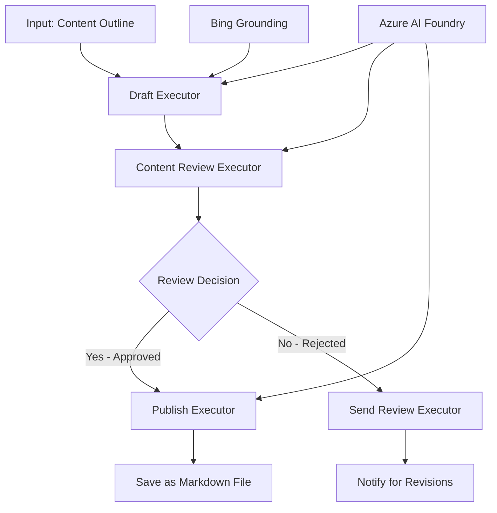

<!--
CO_OP_TRANSLATOR_METADATA:
{
  "original_hash": "8abd335151cee553293b637ee3d80d10",
  "translation_date": "2025-11-11T12:06:23+00:00",
  "source_file": "08-multi-agent/code_samples/workflows-agent-framework/dotNET/04.dotnet-agent-framework-workflow-aifoundry-condition.md",
  "language_code": "tw"
}
-->
# 🔀 使用 Azure AI Foundry (.NET) 的條件式代理工作流程

## 📋 智能決策式工作流程教程

此筆記本展示了使用 Azure AI Foundry 和 Microsoft Agent Framework for .NET 的**條件式工作流程模式**。您將學習如何構建複雜的、基於決策的工作流程，根據 AI 分析、業務規則和動態條件智能地路由處理，以實現企業級自動化。

## 🎯 學習目標

### 🧠 **智能決策架構**
- **條件邏輯實現**：構建具有多個分支點的複雜決策樹
- **AI 驅動的路由**：使用 Azure AI Foundry 模型進行智能路由決策
- **動態工作流程調整**：根據運行時分析和條件修改工作流程行為
- **企業規則整合**：將業務邏輯和合規要求整合到工作流程中

### 🔀 **高級條件模式**
- **多標準決策**：評估多個因素以進行路由決策
- **上下文感知處理**：根據累積的工作流程上下文和歷史進行決策
- **自適應工作流程修改**：根據實時條件動態調整處理路徑
- **規則引擎整合**：在工作流程中實現複雜的業務規則引擎

### 🏢 **企業條件應用**
- **文件分類與路由**：自動分類並將文件路由到適當的工作流程
- **客戶服務分流**：智能路由客戶詢問至專業處理團隊
- **合規與風險處理**：根據風險評估應用不同的驗證和審核流程
- **質量保證工作流程**：根據質量指標將內容路由至適當的審核流程

## ⚙️ 先決條件與設置

### 📦 **所需 NuGet 套件**

用於條件式工作流程處理的高級套件：

```xml
<!-- Core AI Framework -->
<PackageReference Include="Microsoft.Extensions.AI" Version="9.9.0" />

<!-- Azure AI Agents with Persistent State -->
<PackageReference Include="Azure.AI.Agents.Persistent" Version="1.2.0-beta.5" />

<!-- Azure Identity and Utilities -->
<PackageReference Include="Azure.Identity" Version="1.15.0" />
<PackageReference Include="System.Linq.Async" Version="6.0.3" />
<PackageReference Include="DotNetEnv" Version="3.1.1" />

<!-- Local Workflow Framework References -->
<!-- Microsoft.Agents.Workflows.dll - Advanced workflow orchestration -->
<!-- Microsoft.Agents.AI.AzureAI.dll - Azure AI Foundry integration -->
<!-- Microsoft.Agents.AI.dll - Core agent abstractions -->
```

### 🔑 **Azure AI Foundry 配置**

**所需 Azure 資源：**
- 配備條件處理模型的 Azure AI Foundry 工作區
- 擁有適當計算配額和權限的 Azure 訂閱
- 用於決策和內容分析的已部署 AI 模型
- （可選）Bing Search API 連接以提供基礎信息

**環境配置 (.env 文件)：**
```env
# Azure AI Foundry Configuration
AZURE_AI_PROJECT_ENDPOINT=https://your-project.cognitiveservices.azure.com/
BING_CONNECTION_ID=your-bing-connection-id
```

**身份驗證設置：**
```csharp
// Azure CLI or Managed Identity authentication
using Azure.Identity;
var credential = new AzureCliCredential();

// Load environment configuration
DotNetEnv.Env.Load("../../../.env");
```

### 🏗️ **條件式工作流程架構**



**主要組件：**
- **Draft Executor**：AI 代理，根據大綱創建初始內容草稿
- **Content Review Executor**：AI 代理，評估草稿質量和合規性
- **Conditional Routing**：根據審核結果進行路由的決策邏輯
- **Publish/Review Paths**：針對批准與拒絕內容的分別處理路徑
- **State Management**：在整個工作流程中維護內容和審核上下文

## 🎨 **條件式工作流程設計模式**

### 📋 **具有質量門檻的內容生產**
```
Outline → Draft Creation → Quality Review → {Approve: Publish | Reject: Revise}
```

### 🎯 **基於風險的文件處理**
```
Document → Risk Assessment → {Low: Standard | High: Enhanced Review}
```

### 🔍 **智能客戶服務路由**
```
Customer Query → Analysis → {Simple: FAQ Bot | Complex: Human Agent}
```

### 💼 **合規驅動的工作流程**
```
Content → Compliance Check → {Pass: Publish | Fail: Legal Review}
```

## 🏢 **企業條件式效益**

### 🎯 **智能自動化**
- **智能決策**：基於內容分析和上下文的 AI 驅動路由決策
- **自適應處理**：工作流程根據變化的條件自動調整
- **業務規則執行**：自動應用複雜的業務邏輯和政策
- **上下文感知路由**：基於完整的工作流程歷史和累積上下文進行決策

### 📈 **運營卓越**
- **資源分配優化**：將工作路由至最合適的專家和流程
- **減少人工干預**：自動化決策減少人工路由需求
- **更快的解決時間**：直接路由至適當的專業知識和處理能力
- **一致性應用**：統一應用業務規則和決策標準

### 🛡️ **風險管理與合規**
- **自動風險評估**：AI 驅動的內容和情境風險水平評估
- **合規執行**：自動通過所需的監管流程進行路由
- **安全協議應用**：根據風險評估應用增強的安全措施
- **審計追蹤維護**：完整記錄路由決策和理由

### 📊 **分析與持續改進**
- **決策分析**：追蹤路由決策的有效性和準確性
- **模式識別**：隨時間推移識別路由決策中的趨勢和模式
- **性能優化**：持續改進決策標準和路由效率
- **商業智能**：洞察內容特徵和處理需求

### 🔧 **技術卓越**
- **持久狀態管理**：在工作流程執行期間維持複雜狀態
- **可擴展架構**：處理高容量條件式處理需求
- **整合能力**：與現有業務系統和流程無縫整合
- **監控與可觀察性**：全面追蹤工作流程性能和決策

讓我們用 .NET 構建智能、基於決策的企業工作流程吧！🚀

## 💻 運行代碼

完整實現可在 `04.dotnet-agent-framework-workflow-aifoundry-condition.cs` 中找到。此示例展示了**具有質量門檻的內容生產工作流程**：

### 🏗️ **工作流程架構**

```
Content Outline → Draft Creation → Quality Review → Conditional Routing:
                                                      ├─ Approved (>200 words) → Publish
                                                      └─ Rejected (<200 words) → Review Notification
```

**工作流程中的代理：**
1. **Evangelist Agent**：使用 Bing 基礎信息從大綱創建教程草稿
2. **Content Reviewer Agent**：評估草稿質量（字數、完整性）
3. **Publisher Agent**：將批准的內容保存為帶時間戳的 Markdown 文件

**自定義執行器：**
1. **DraftExecutor**：協調草稿創建
2. **ContentReviewExecutor**：執行質量評估
3. **PublishExecutor**：處理批准內容的發布
4. **SendReviewExecutor**：管理拒絕內容的通知

### 🚀 運行示例

**先決條件：**
- 配置好的 Azure AI Foundry 工作區
- Azure CLI 身份驗證 (`az login`)
- （可選）Bing Search 連接以提供基礎信息

```bash
# Make the script executable (Unix/Linux/macOS)
chmod +x 04.dotnet-agent-framework-workflow-aifoundry-condition.cs

# Run the conditional workflow
./04.dotnet-agent-framework-workflow-aifoundry-condition.cs
```

或在 Windows 上：
```powershell
dotnet run 04.dotnet-agent-framework-workflow-aifoundry-condition.cs
```

### 📝 預期輸出

工作流程將：
1. **創建代理**：初始化三個專業的 Azure AI Foundry 代理
2. **生成草稿**：Evangelist 代理根據大綱創建教程草稿
3. **審核內容**：Content Reviewer 評估草稿質量
4. **條件式路由**：
   - **若批准（>200 字）**：PublishExecutor 保存為 Markdown 文件
   - **若拒絕（<200 字）**：SendReviewExecutor 發送審核通知
5. **顯示結果**：展示最終工作流程結果

### 🔧 自定義選項

**修改審核標準：**
```csharp
const string ContentReviewerInstructions = @"
You are a content reviewer...
1. Check if content is more than 500 words (instead of 200)
2. Verify technical accuracy
3. Ensure proper formatting
...";
```

**添加更多條件路徑：**
```csharp
var workflow = new WorkflowBuilder(draftExecutor)
    .AddEdge(draftExecutor, contentReviewerExecutor)
    .AddEdge(contentReviewerExecutor, publishExecutor, condition: GetCondition("Excellent"))
    .AddEdge(contentReviewerExecutor, editExecutor, condition: GetCondition("Good"))
    .AddEdge(contentReviewerExecutor, sendReviewerExecutor, condition: GetCondition("Poor"))
    .Build();
```

**更改內容要求：**
```csharp
string OUTLINE_Content = @"
# Your Custom Topic
## Section 1
https://your-reference-url
## Section 2
...
";
```

### 🎯 實際應用

此條件式工作流程模式非常適合：
- **內容管理系統**：具有質量門檻的自動化編輯工作流程
- **文件處理**：根據分類和合規性路由文件
- **客戶支持**：根據複雜性和緊急程度智能分流工單
- **法律審核**：根據風險評估和價值路由合同
- **人力資源流程**：通過適當的篩選工作流程路由申請

### 🔍 理解條件邏輯

**條件函數：**
```csharp
public Func<object?, bool> GetCondition(string expectedResult) =>
    reviewResult => reviewResult is ReviewResult review && review.Result == expectedResult;
```

此函數創建一個謂詞：
1. 檢查結果是否為 `ReviewResult` 類型
2. 將 `Result` 屬性與預期值進行比較
3. 返回 true/false 以確定路由

**具有條件的工作流程邊緣：**
```csharp
.AddEdge(contentReviewerExecutor, publishExecutor, condition: GetCondition("Yes"))
.AddEdge(contentReviewerExecutor, sendReviewerExecutor, condition: GetCondition("No"))
```

### 📊 高級功能

**JSON Schema 驗證：**
工作流程使用 JSON Schema 確保結構化響應：

```csharp
// Define response structure
public class ReviewResult
{
    [JsonPropertyName("review_result")]
    public string Result { get; set; } = string.Empty;
    
    [JsonPropertyName("reason")]
    public string Reason { get; set; } = string.Empty;
    
    [JsonPropertyName("draft_content")]
    public string DraftContent { get; set; } = string.Empty;
}

// Apply to agent
ResponseFormat = ChatResponseFormat.ForJsonSchema(
    AIJsonUtilities.CreateJsonSchema(typeof(ReviewResult)), 
    "ReviewResult", 
    "Review Result From DraftContent"
)
```

**Bing 基礎信息整合：**
Evangelist 代理使用 Bing 基礎信息訪問實時信息：

```csharp
var bingGroundingConfig = new BingGroundingSearchConfiguration(bing_conn_id);
BingGroundingToolDefinition bingGroundingTool = new(
    new BingGroundingSearchToolParameters([bingGroundingConfig])
);
```

這使代理能夠跟隨大綱中的 URL 並提取最新信息。

### 🛡️ 錯誤處理

工作流程包含針對拒絕內容的強大錯誤處理：
- 審核失敗觸發替代路徑
- 通知提供清晰的拒絕原因
- 保存內容以供修訂

### 🔄 擴展工作流程

**添加修訂循環：**
創建一個反饋循環，自動重新草擬內容：

```csharp
.AddEdge(contentReviewerExecutor, publishExecutor, condition: GetCondition("Yes"))
.AddEdge(contentReviewerExecutor, draftExecutor, condition: GetCondition("No")) // Loop back
```

**實現多級審核：**
添加具有不同標準的多個審核階段：

```csharp
.AddEdge(draftExecutor, technicalReviewer)
.AddEdge(technicalReviewer, editorialReviewer, condition: GetCondition("TechPass"))
.AddEdge(editorialReviewer, publishExecutor, condition: GetCondition("EditPass"))
```

此條件式工作流程模式為構建複雜的、智能的企業自動化系統提供了基礎！🚀

---

<!-- CO-OP TRANSLATOR DISCLAIMER START -->
**免責聲明**：  
本文件已使用 AI 翻譯服務 [Co-op Translator](https://github.com/Azure/co-op-translator) 進行翻譯。儘管我們致力於提供準確的翻譯，請注意自動翻譯可能包含錯誤或不準確之處。原始文件的母語版本應被視為權威來源。對於關鍵資訊，建議使用專業人工翻譯。我們對因使用此翻譯而引起的任何誤解或誤釋不承擔責任。
<!-- CO-OP TRANSLATOR DISCLAIMER END -->