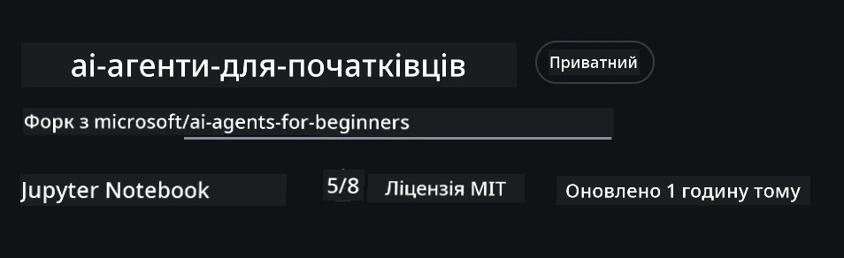
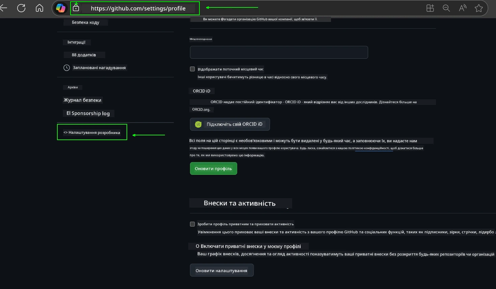
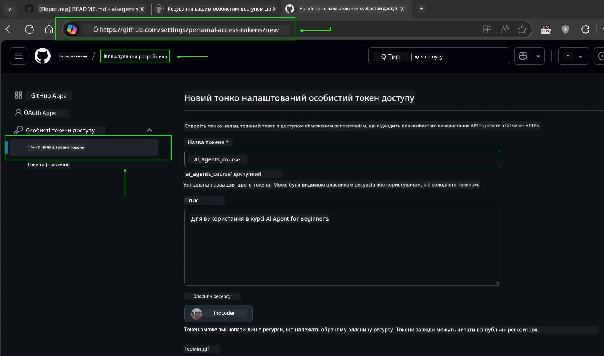
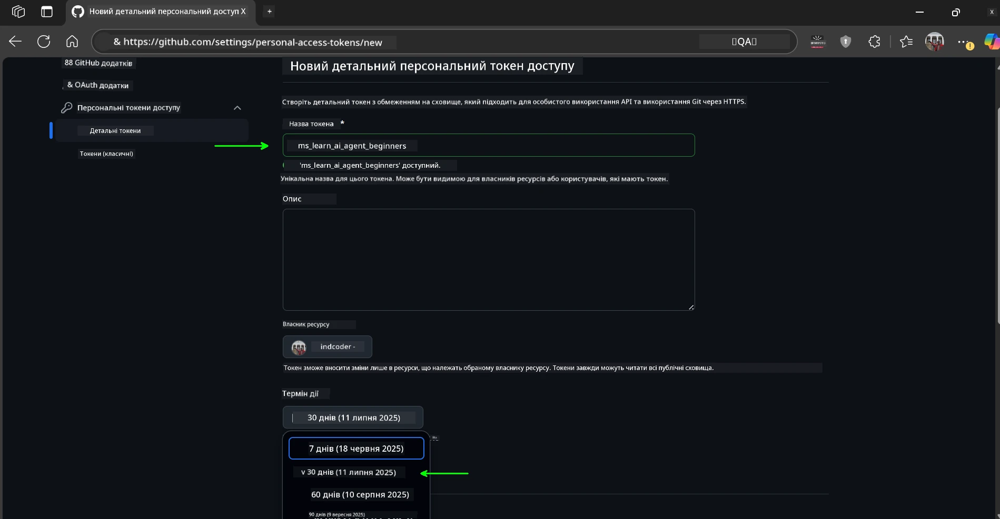
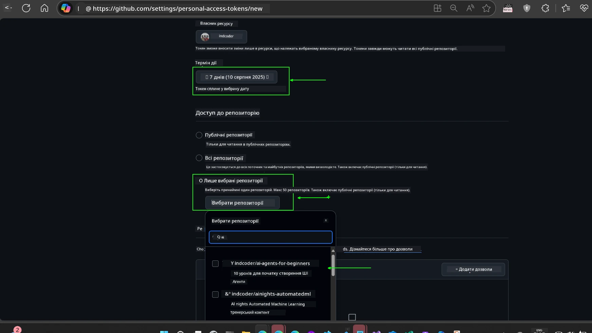
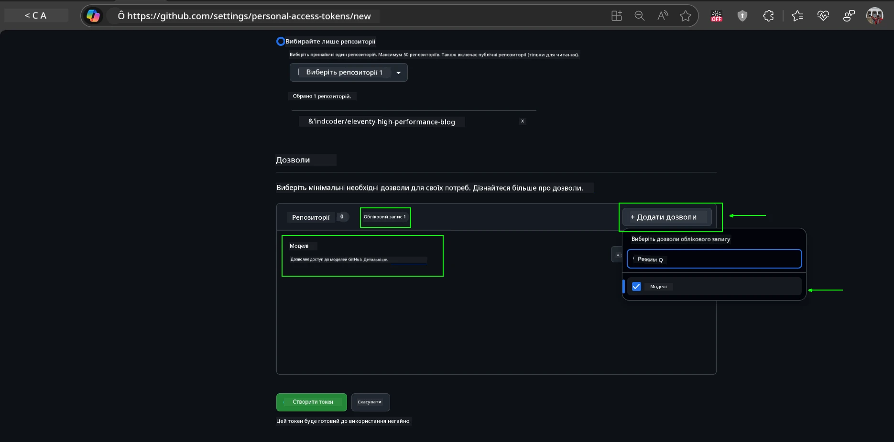
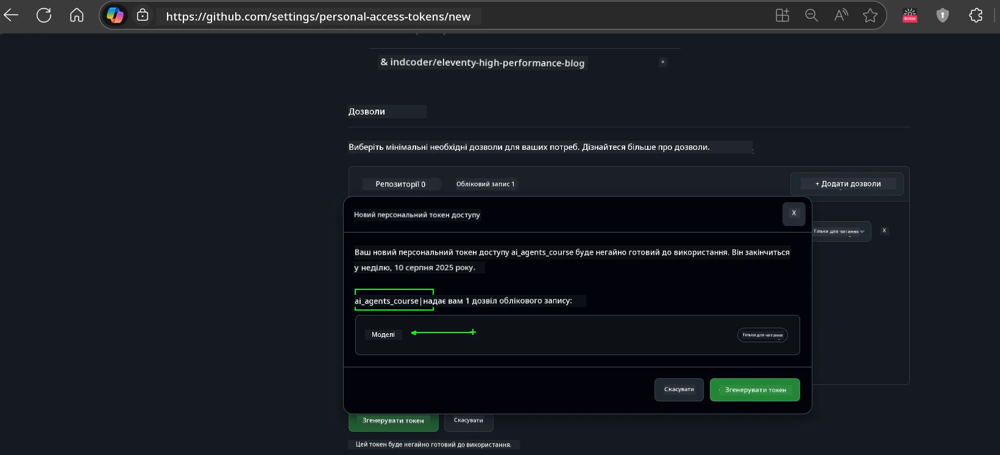
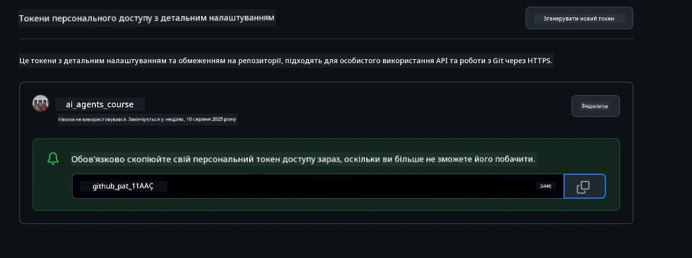

<!--
CO_OP_TRANSLATOR_METADATA:
{
  "original_hash": "63b1a8f6e840df15934935b728e569f0",
  "translation_date": "2025-12-03T15:10:52+00:00",
  "source_file": "00-course-setup/README.md",
  "language_code": "uk"
}
-->
# Налаштування курсу

## Вступ

У цьому уроці ми розглянемо, як запускати приклади коду цього курсу.

## Приєднуйтесь до інших учасників і отримуйте допомогу

Перед тим як почати клонувати репозиторій, приєднайтеся до [Discord-каналу AI Agents For Beginners](https://aka.ms/ai-agents/discord), щоб отримати допомогу з налаштуванням, задати питання щодо курсу або поспілкуватися з іншими учасниками.

## Клонування або форк репозиторію

Для початку, будь ласка, клонуйте або зробіть форк репозиторію GitHub. Це створить вашу власну версію матеріалів курсу, щоб ви могли запускати, тестувати та змінювати код!

Це можна зробити, натиснувши на посилання <a href="https://github.com/microsoft/ai-agents-for-beginners/fork" target="_blank">форк репозиторію</a>.

Тепер у вас має бути власна форкована версія цього курсу за наступним посиланням:



### Поверхневе клонування (рекомендується для воркшопів / Codespaces)

  >Повний репозиторій може бути великим (~3 ГБ), якщо ви завантажуєте всю історію та всі файли. Якщо ви лише відвідуєте воркшоп або вам потрібні лише кілька папок уроків, поверхневе клонування (або вибіркове клонування) дозволяє уникнути більшості цього завантаження, скорочуючи історію та/або пропускаючи блоби.

#### Швидке поверхневе клонування — мінімальна історія, всі файли

Замініть `<your-username>` у командах нижче на URL вашого форку (або URL оригінального репозиторію, якщо ви віддаєте перевагу).

Щоб клонувати лише останню історію комітів (невелике завантаження):

```bash|powershell
git clone --depth 1 https://github.com/<your-username>/ai-agents-for-beginners.git
```

Щоб клонувати конкретну гілку:

```bash|powershell
git clone --depth 1 --branch <branch-name> https://github.com/<your-username>/ai-agents-for-beginners.git
```

#### Часткове (вибіркове) клонування — мінімальні блоби + лише вибрані папки

Це використовує часткове клонування та вибіркове завантаження (вимагає Git 2.25+ і рекомендовану сучасну версію Git з підтримкою часткового клонування):

```bash|powershell
git clone --depth 1 --filter=blob:none --sparse https://github.com/<your-username>/ai-agents-for-beginners.git
```

Перейдіть до папки репозиторію:

```bash|powershell
cd ai-agents-for-beginners
```

Потім вкажіть, які папки вам потрібні (приклад нижче показує дві папки):

```bash|powershell
git sparse-checkout set 00-course-setup 01-intro-to-ai-agents
```

Після клонування та перевірки файлів, якщо вам потрібні лише файли і ви хочете звільнити місце (без історії Git), будь ласка, видаліть метадані репозиторію (💀необоротно — ви втратите всі функції Git: коміти, пулли, пуші або доступ до історії).

```bash
# zsh/bash
rm -rf .git
```

```powershell
# PowerShell
Remove-Item -Recurse -Force .git
```

#### Використання GitHub Codespaces (рекомендується для уникнення великих локальних завантажень)

- Створіть новий Codespace для цього репозиторію через [GitHub UI](https://github.com/codespaces).  

- У терміналі новоствореного Codespace виконайте одну з команд поверхневого/вибіркового клонування, щоб завантажити лише потрібні папки уроків у робочий простір Codespace.
- Опціонально: після клонування в Codespaces видаліть .git, щоб звільнити додаткове місце (див. команди видалення вище).
- Примітка: Якщо ви віддаєте перевагу відкривати репозиторій безпосередньо в Codespaces (без додаткового клонування), майте на увазі, що Codespaces створить середовище devcontainer і може все ще забезпечити більше, ніж вам потрібно. Клонування поверхневої копії у свіжому Codespace дає вам більше контролю над використанням дискового простору.

#### Поради

- Завжди замінюйте URL клонування на ваш форк, якщо ви хочете редагувати/комітити.
- Якщо вам пізніше знадобиться більше історії або файлів, ви можете їх отримати або налаштувати вибіркове завантаження для включення додаткових папок.

## Запуск коду

Цей курс пропонує серію Jupyter Notebook, які ви можете запускати, щоб отримати практичний досвід створення AI-агентів.

Приклади коду використовують:

**Потрібен обліковий запис GitHub - безкоштовно**:

1) Semantic Kernel Agent Framework + GitHub Models Marketplace. Позначено як (semantic-kernel.ipynb)
2) AutoGen Framework + GitHub Models Marketplace. Позначено як (autogen.ipynb)

**Потрібна підписка Azure**:

3) Azure AI Foundry + Azure AI Agent Service. Позначено як (azureaiagent.ipynb)

Ми рекомендуємо вам спробувати всі три типи прикладів, щоб зрозуміти, який з них найкраще підходить для вас.

Який би варіант ви не вибрали, це визначить, які кроки налаштування вам потрібно виконати нижче:

## Вимоги

- Python 3.12+
  - **NOTE**: Якщо у вас не встановлено Python3.12, переконайтеся, що ви його встановили. Потім створіть ваш venv, використовуючи python3.12, щоб забезпечити встановлення правильних версій з файлу requirements.txt.
  
    >Приклад

    Створіть каталог Python venv:

    ```bash|powershell
    python -m venv venv
    ```

    Потім активуйте середовище venv для:

    ```bash
    # zsh/bash
    source venv/bin/activate
    ```
  
    ```dos
    # Command Prompt for Windows
    venv\Scripts\activate
    ```

- .NET 10+: Для прикладів коду, які використовують .NET, переконайтеся, що ви встановили [.NET 10 SDK](https://dotnet.microsoft.com/download/dotnet/10.0) або новішу версію. Потім перевірте встановлену версію SDK .NET:

    ```bash|powershell
    dotnet --list-sdks
    ```

- Обліковий запис GitHub - для доступу до GitHub Models Marketplace
- Підписка Azure - для доступу до Azure AI Foundry
- Обліковий запис Azure AI Foundry - для доступу до Azure AI Agent Service

Ми включили файл `requirements.txt` у кореневий каталог цього репозиторію, який містить усі необхідні пакети Python для запуску прикладів коду.

Ви можете встановити їх, виконавши наступну команду в терміналі в кореневому каталозі репозиторію:

```bash|powershell
pip install -r requirements.txt
```

Ми рекомендуємо створити віртуальне середовище Python, щоб уникнути конфліктів і проблем.

## Налаштування VSCode

Переконайтеся, що ви використовуєте правильну версію Python у VSCode.


## Налаштування для прикладів з використанням GitHub Models 

### Крок 1: Отримайте ваш GitHub Personal Access Token (PAT)

Цей курс використовує GitHub Models Marketplace, надаючи безкоштовний доступ до великих мовних моделей (LLM), які ви будете використовувати для створення AI-агентів.

Щоб використовувати GitHub Models, вам потрібно створити [GitHub Personal Access Token](https://docs.github.com/en/authentication/keeping-your-account-and-data-secure/managing-your-personal-access-tokens).

Це можна зробити, перейшовши до <a href="https://github.com/settings/personal-access-tokens" target="_blank">налаштувань персональних токенів доступу</a> у вашому обліковому записі GitHub.

Будь ласка, дотримуйтесь [Принципу найменших привілеїв](https://docs.github.com/en/get-started/learning-to-code/storing-your-secrets-safely) при створенні вашого токена. Це означає, що ви повинні надати токену лише ті дозволи, які необхідні для запуску прикладів коду цього курсу.

1. Виберіть опцію `Fine-grained tokens` на лівій стороні екрана, перейшовши до **Developer settings**.

   

   Потім виберіть `Generate new token`.

   

2. Введіть описову назву для вашого токена, яка відображає його призначення, щоб його було легко ідентифікувати пізніше.

    🔐 Рекомендація щодо тривалості токена

    Рекомендована тривалість: 30 днів
    Для більш безпечного підходу ви можете вибрати коротший період — наприклад, 7 днів 🛡️
    Це чудовий спосіб встановити особисту мету і завершити курс, поки ваша навчальна мотивація висока 🚀.

    

3. Обмежте область дії токена вашим форком цього репозиторію.

    

4. Обмежте дозволи токена: У розділі **Permissions**, натисніть вкладку **Account** і натисніть кнопку "+ Add permissions". З'явиться випадаюче меню. Будь ласка, знайдіть **Models** і поставте галочку.

    

5. Перевірте необхідні дозволи перед створенням токена. 

6. Перед створенням токена переконайтеся, що ви готові зберегти токен у безпечному місці, наприклад, у сховищі паролів, оскільки він більше не буде показаний після створення. 

Скопіюйте ваш новий токен, який ви щойно створили. Тепер ви додасте його до вашого `.env` файлу, включеного в цей курс.

### Крок 2: Створіть ваш `.env` файл

Щоб створити ваш `.env` файл, виконайте наступну команду в терміналі.

```bash
# zsh/bash
cp .env.example .env
```

```powershell
# PowerShell
Copy-Item .env.example .env
```

Це скопіює приклад файлу і створить `.env` у вашому каталозі, де ви заповните значення для змінних середовища.

Скопіювавши ваш токен, відкрийте `.env` файл у вашому улюбленому текстовому редакторі і вставте ваш токен у поле `GITHUB_TOKEN`.


Тепер ви повинні бути готові запускати приклади коду цього курсу.

## Налаштування для прикладів з використанням Azure AI Foundry та Azure AI Agent Service

### Крок 1: Отримайте ваш Azure Project Endpoint

Виконайте кроки для створення хаба і проекту в Azure AI Foundry, описані тут: [Огляд ресурсів хаба](https://learn.microsoft.com/azure/ai-foundry/concepts/ai-resources)

Після створення проекту вам потрібно буде отримати рядок підключення для вашого проекту.

Це можна зробити, перейшовши на сторінку **Overview** вашого проекту в порталі Azure AI Foundry.


### Крок 2: Створіть ваш `.env` файл

Щоб створити ваш `.env` файл, виконайте наступну команду в терміналі.

```bash
# zsh/bash
cp .env.example .env
```

```powershell
# PowerShell
Copy-Item .env.example .env
```

Це скопіює приклад файлу і створить `.env` у вашому каталозі, де ви заповните значення для змінних середовища.

Скопіювавши ваш токен, відкрийте `.env` файл у вашому улюбленому текстовому редакторі і вставте ваш токен у поле `PROJECT_ENDPOINT`.

### Крок 3: Увійдіть до Azure

Як найкращу практику безпеки, ми будемо використовувати [автентифікацію без ключів](https://learn.microsoft.com/azure/developer/ai/keyless-connections?tabs=csharp%2Cazure-cli?WT.mc_id=academic-105485-koreyst) для автентифікації в Azure OpenAI за допомогою Microsoft Entra ID. 

Далі відкрийте термінал і виконайте `az login --use-device-code`, щоб увійти до вашого облікового запису Azure.

Після входу виберіть вашу підписку в терміналі.

## Додаткові змінні середовища - Azure Search та Azure OpenAI 

Для уроку Agentic RAG - Урок 5 - є приклади, які використовують Azure Search та Azure OpenAI.

Якщо ви хочете запускати ці приклади, вам потрібно буде додати наступні змінні середовища до вашого `.env` файлу:

### Сторінка огляду (Проект)

- `AZURE_SUBSCRIPTION_ID` - Перевірте **Project details** на сторінці **Overview** вашого проекту.

- `AZURE_AI_PROJECT_NAME` - Подивіться у верхній частині сторінки **Overview** вашого проекту.

- `AZURE_OPENAI_SERVICE` - Знайдіть це у вкладці **Included capabilities** для **Azure OpenAI Service** на сторінці **Overview**.

### Центр управління

- `AZURE_OPENAI_RESOURCE_GROUP` - Перейдіть до **Project properties** на сторінці **Overview** у **Management Center**.

- `GLOBAL_LLM_SERVICE` - У розділі **Connected resources**, знайдіть назву підключення **Azure AI Services**. Якщо не зазначено, перевірте **Azure portal** у вашій групі ресурсів для назви ресурсу AI Services.

### Сторінка моделей + кінцевих точок

- `AZURE_OPENAI_EMBEDDING_DEPLOYMENT_NAME` - Виберіть вашу модель для вбудовування (наприклад, `text-embedding-ada-002`) і запишіть **Deployment name** з деталей моделі.

- `AZURE_OPENAI_CHAT_DEPLOYMENT_NAME` - Виберіть вашу модель для чату (наприклад, `gpt-4o-mini`) і запишіть **Deployment name** з деталей моделі.

### Портал Azure

- `AZURE_OPENAI_ENDPOINT` - Знайдіть **Azure AI services**, натисніть на нього, потім перейдіть до **Resource Management**, **Keys and Endpoint**, прокрутіть вниз до "Azure OpenAI endpoints" і скопіюйте той, що зазначений як "Language APIs".

- `AZURE_OPENAI_API_KEY` - З того ж екрану скопіюйте KEY 1 або KEY 2.

- `AZURE_SEARCH_SERVICE_ENDPOINT` - Знайдіть ваш ресурс **Azure AI Search**, натисніть на нього і перегляньте **Overview**.

- `AZURE_SEARCH_API_KEY` - Потім перейдіть до **Settings**, а потім **Keys**, щоб скопіювати первинний або вторинний адміністративний ключ.

### Зовнішня веб-сторінка

- `AZURE_OPENAI_API_VERSION` - Відвідайте сторінку [API version lifecycle](https://learn.microsoft.com/azure/ai-services/openai/api-version-deprecation#latest-ga-api-release) у розділі **Latest GA API release**.

### Налаштування автентифікації без ключів

Замість того, щоб жорстко кодувати ваші облікові дані, ми будемо використовувати підключення без ключів з Azure OpenAI. Для цього ми імпортуємо `DefaultAzureCredential` і пізніше викличемо функцію `DefaultAzureCredential`, щоб отримати облікові дані.

```python
# Пітон
from azure.identity import DefaultAzureCredential, InteractiveBrowserCredential
```

## Застрягли десь?
Якщо у вас виникли проблеми з запуском цього налаштування, приєднуйтесь до нашого <a href="https://discord.gg/kzRShWzttr" target="_blank">Discord спільноти Azure AI</a> або <a href="https://github.com/microsoft/ai-agents-for-beginners/issues?WT.mc_id=academic-105485-koreyst" target="_blank">створіть запит</a>.

## Наступний урок

Тепер ви готові запустити код для цього курсу. Приємного навчання про світ AI агентів!

[Вступ до AI агентів та їх використання](../01-intro-to-ai-agents/README.md)

---

<!-- CO-OP TRANSLATOR DISCLAIMER START -->
**Відмова від відповідальності**:  
Цей документ було перекладено за допомогою сервісу автоматичного перекладу [Co-op Translator](https://github.com/Azure/co-op-translator). Хоча ми прагнемо до точності, звертаємо вашу увагу, що автоматичні переклади можуть містити помилки або неточності. Оригінальний документ на його рідній мові слід вважати авторитетним джерелом. Для критично важливої інформації рекомендується професійний людський переклад. Ми не несемо відповідальності за будь-які непорозуміння або неправильні тлумачення, що виникли внаслідок використання цього перекладу.
<!-- CO-OP TRANSLATOR DISCLAIMER END -->