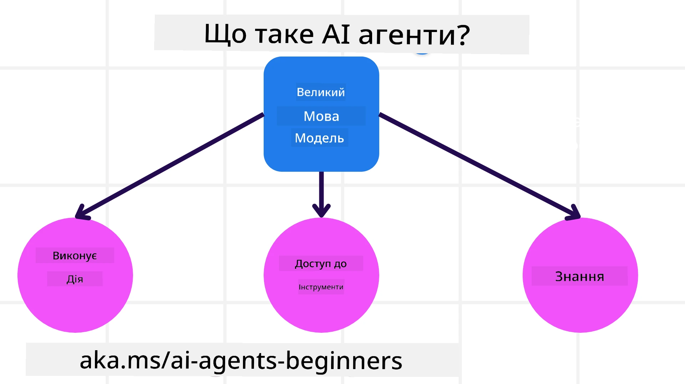
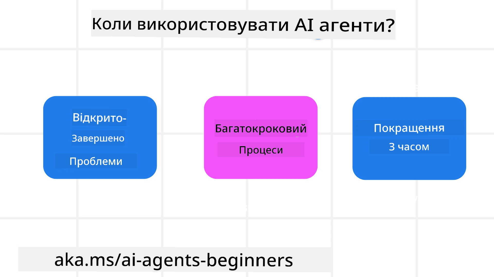

<!--
CO_OP_TRANSLATOR_METADATA:
{
  "original_hash": "cdd28bc00816d2773bb2b5968d782abc",
  "translation_date": "2025-11-11T11:47:04+00:00",
  "source_file": "01-intro-to-ai-agents/README.md",
  "language_code": "uk"
}
-->

> _(Натисніть на зображення вище, щоб переглянути відео цього уроку)_

# Вступ до AI агентів та їх застосування

Ласкаво просимо до курсу "AI агенти для початківців"! Цей курс надає базові знання та практичні приклади для створення AI агентів.

Приєднуйтесь до <a href="https://discord.gg/kzRShWzttr" target="_blank">спільноти Azure AI у Discord</a>, щоб познайомитися з іншими учасниками та розробниками AI агентів, а також поставити будь-які запитання щодо цього курсу.

Щоб розпочати курс, ми спершу розглянемо, що таке AI агенти і як їх можна використовувати у додатках та робочих процесах, які ми створюємо.

## Вступ

Цей урок охоплює:

- Що таке AI агенти і які існують типи агентів?
- Які випадки використання найкраще підходять для AI агентів і як вони можуть нам допомогти?
- Які основні складові при розробці агентних рішень?

## Цілі навчання
Після завершення цього уроку ви зможете:

- Зрозуміти концепцію AI агентів і чим вони відрізняються від інших AI рішень.
- Ефективно застосовувати AI агентів.
- Продуктивно розробляти агентні рішення для користувачів і клієнтів.

## Визначення AI агентів та типів AI агентів

### Що таке AI агенти?

AI агенти — це **системи**, які дозволяють **великим мовним моделям (LLMs)** **виконувати дії**, розширюючи їх можливості шляхом надання доступу до **інструментів** та **знань**.

Розділимо це визначення на менші частини:

- **Система** - Важливо думати про агентів не як про окремий компонент, а як про систему з багатьох компонентів. На базовому рівні компоненти AI агента включають:
  - **Середовище** - Визначений простір, у якому працює AI агент. Наприклад, якщо у нас є агент для бронювання подорожей, середовищем може бути система бронювання, яку агент використовує для виконання завдань.
  - **Сенсори** - Середовища містять інформацію та надають зворотний зв'язок. AI агенти використовують сенсори для збору та інтерпретації цієї інформації про поточний стан середовища. У прикладі агента бронювання подорожей система бронювання може надавати інформацію, таку як доступність готелів або ціни на авіаквитки.
  - **Актуатори** - Після отримання поточного стану середовища агент визначає, яку дію виконати, щоб змінити середовище. У випадку агента бронювання подорожей це може бути бронювання доступного номера для користувача.

**Великі мовні моделі** - Концепція агентів існувала ще до створення LLMs. Перевага створення AI агентів з LLMs полягає у їхній здатності інтерпретувати людську мову та дані. Це дозволяє LLMs інтерпретувати інформацію середовища та визначати план для його зміни.

**Виконання дій** - За межами систем AI агентів LLMs обмежені ситуаціями, де дія полягає у створенні контенту або інформації на основі запиту користувача. У системах AI агентів LLMs можуть виконувати завдання, інтерпретуючи запит користувача та використовуючи доступні інструменти у своєму середовищі.

**Доступ до інструментів** - Які інструменти доступні LLM визначається 1) середовищем, у якому він працює, і 2) розробником AI агента. У нашому прикладі агента бронювання подорожей інструменти агента обмежені операціями, доступними у системі бронювання, або розробник може обмежити доступ агента до інструментів, наприклад, лише до авіарейсів.

**Пам'ять+Знання** - Пам'ять може бути короткостроковою у контексті розмови між користувачем і агентом. Довгостроково, поза інформацією, наданою середовищем, AI агенти також можуть отримувати знання з інших систем, сервісів, інструментів і навіть інших агентів. У прикладі агента бронювання подорожей ці знання можуть включати інформацію про уподобання користувача, що зберігається у базі даних клієнтів.

### Різні типи агентів

Тепер, коли ми маємо загальне визначення AI агентів, давайте розглянемо деякі конкретні типи агентів і як вони можуть бути застосовані до агента бронювання подорожей.

| **Тип агента**                | **Опис**                                                                                                                       | **Приклад**                                                                                                                                                                                                                   |
| ----------------------------- | -------------------------------------------------------------------------------------------------------------------------------- | ----------------------------------------------------------------------------------------------------------------------------------------------------------------------------------------------------------------------------- |
| **Прості рефлексні агенти**      | Виконують негайні дії на основі заздалегідь визначених правил.                                                                 | Агент бронювання інтерпретує контекст електронного листа і пересилає скарги на подорожі до служби підтримки клієнтів.                                                                                                          |
| **Агенти на основі моделі** | Виконують дії на основі моделі світу та змін у цій моделі.                                                              | Агент бронювання пріоритизує маршрути зі значними змінами цін на основі доступу до історичних даних про ціни.                                                                                                             |
| **Агенти на основі цілей**         | Створюють плани для досягнення конкретних цілей, інтерпретуючи мету і визначаючи дії для її досягнення.                                  | Агент бронювання організовує подорож, визначаючи необхідні транспортні засоби (автомобіль, громадський транспорт, авіарейси) від поточного місця до пункту призначення.                                                                                |
| **Агенти на основі корисності**      | Враховують уподобання і зважують компроміси чисельно, щоб визначити, як досягти цілей.                                               | Агент бронювання максимізує корисність, зважуючи зручність проти вартості при бронюванні подорожі.                                                                                                                                          |
| **Навчальні агенти**           | Покращуються з часом, реагуючи на зворотний зв'язок і коригуючи дії відповідно.                                                        | Агент бронювання покращується, використовуючи відгуки клієнтів з опитувань після подорожі для внесення коригувань у майбутні бронювання.                                                                                                               |
| **Ієрархічні агенти**       | Містять кілька агентів у багаторівневій системі, де агенти вищого рівня розбивають завдання на підзавдання для виконання агентами нижчого рівня. | Агент бронювання скасовує подорож, розділяючи завдання на підзавдання (наприклад, скасування конкретних бронювань) і доручаючи їх виконання агентам нижчого рівня, які звітують агенту вищого рівня.                                     |
| **Системи з багатьма агентами (MAS)** | Агенти виконують завдання незалежно, або співпрацюючи, або конкуруючи.                                                           | Співпраця: Кілька агентів бронюють конкретні послуги подорожі, такі як готелі, авіарейси та розваги. Конкуренція: Кілька агентів керують і конкурують за спільний календар бронювання готелю, щоб забронювати клієнтів у готелі. |

## Коли використовувати AI агентів

У попередньому розділі ми використовували приклад агента бронювання подорожей, щоб пояснити, як різні типи агентів можуть бути використані у різних сценаріях бронювання. Ми продовжимо використовувати цей приклад протягом курсу.

Давайте розглянемо типи випадків використання, для яких AI агенти найкраще підходять:

- **Відкриті задачі** - дозволяють LLM визначати необхідні кроки для виконання завдання, оскільки це не завжди можна жорстко закодувати у робочий процес.
- **Багатокрокові процеси** - завдання, які потребують певного рівня складності, де AI агенту потрібно використовувати інструменти або інформацію протягом кількох етапів, а не одноразового отримання.
- **Покращення з часом** - завдання, де агент може покращуватися з часом, отримуючи зворотний зв'язок від свого середовища або користувачів, щоб забезпечити кращу корисність.

Ми розглянемо більше аспектів використання AI агентів у уроці "Створення надійних AI агентів".

## Основи агентних рішень

### Розробка агентів

Першим кроком у розробці системи AI агентів є визначення інструментів, дій та поведінки. У цьому курсі ми зосереджуємося на використанні **Azure AI Agent Service** для визначення наших агентів. Він пропонує такі функції, як:

- Вибір відкритих моделей, таких як OpenAI, Mistral і Llama
- Використання ліцензованих даних через провайдерів, таких як Tripadvisor
- Використання стандартизованих інструментів OpenAPI 3.0

### Агентні шаблони

Спілкування з LLMs здійснюється через підказки. З огляду на напівавтономний характер AI агентів, не завжди можливо або необхідно вручну повторно підказувати LLM після зміни середовища. Ми використовуємо **агентні шаблони**, які дозволяють нам підказувати LLM протягом кількох етапів більш масштабованим способом.

Цей курс розділений на деякі з популярних агентних шаблонів.

### Агентні фреймворки

Агентні фреймворки дозволяють розробникам впроваджувати агентні шаблони через код. Ці фреймворки пропонують шаблони, плагіни та інструменти для кращої співпраці AI агентів. Ці переваги забезпечують можливості для кращої спостережуваності та усунення несправностей у системах AI агентів.

У цьому курсі ми дослідимо науково-орієнтований фреймворк AutoGen і готовий до виробництва фреймворк Agent від Semantic Kernel.

## Приклади коду

- Python: [Фреймворк агентів](./code_samples/01-python-agent-framework.ipynb)
- .NET: [Фреймворк агентів](./code_samples/01-dotnet-agent-framework.md)

## Є ще запитання про AI агентів?

Приєднуйтесь до [Azure AI Foundry Discord](https://aka.ms/ai-agents/discord), щоб зустрітися з іншими учасниками, відвідати години консультацій і отримати відповіді на ваші запитання про AI агентів.

## Попередній урок

[Налаштування курсу](../00-course-setup/README.md)

## Наступний урок

[Дослідження агентних фреймворків](../02-explore-agentic-frameworks/README.md)

---

<!-- CO-OP TRANSLATOR DISCLAIMER START -->
**Відмова від відповідальності**:  
Цей документ був перекладений за допомогою сервісу автоматичного перекладу [Co-op Translator](https://github.com/Azure/co-op-translator). Хоча ми прагнемо до точності, будь ласка, майте на увазі, що автоматичні переклади можуть містити помилки або неточності. Оригінальний документ на його рідній мові слід вважати авторитетним джерелом. Для критичної інформації рекомендується професійний людський переклад. Ми не несемо відповідальності за будь-які непорозуміння або неправильні тлумачення, що виникають внаслідок використання цього перекладу.
<!-- CO-OP TRANSLATOR DISCLAIMER END -->