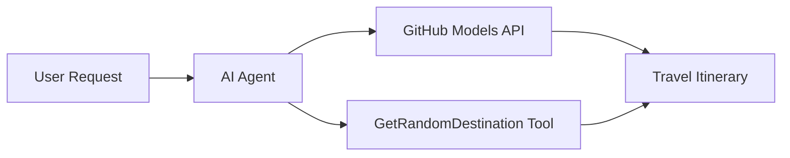

<!--
CO_OP_TRANSLATOR_METADATA:
{
  "original_hash": "5f351412e934f0833c8c821a0a60efaf",
  "translation_date": "2025-11-13T14:40:24+00:00",
  "source_file": "01-intro-to-ai-agents/code_samples/01-dotnet-agent-framework.md",
  "language_code": "uk"
}
-->
# 🌍 AI Туристичний Агент із Microsoft Agent Framework (.NET)

## 📋 Огляд сценарію

Цей приклад демонструє, як створити інтелектуального агента для планування подорожей, використовуючи Microsoft Agent Framework для .NET. Агента можна налаштувати для автоматичного створення персоналізованих маршрутів одноденних подорожей до випадкових місць по всьому світу.

### Основні можливості:

- 🎲 **Випадковий вибір місця призначення**: Використовує спеціальний інструмент для вибору туристичних місць
- 🗺️ **Інтелектуальне планування подорожей**: Створює детальні маршрути на кожен день
- 🔄 **Потокова передача в реальному часі**: Підтримує як миттєві, так і потокові відповіді
- 🛠️ **Інтеграція спеціальних інструментів**: Демонструє, як розширити можливості агента

## 🔧 Технічна архітектура

### Основні технології

- **Microsoft Agent Framework**: Остання реалізація .NET для розробки AI-агентів
- **Інтеграція моделей GitHub**: Використовує сервіс інференції моделей GitHub
- **Сумісність із OpenAI API**: Використовує клієнтські бібліотеки OpenAI із спеціальними кінцевими точками
- **Безпечна конфігурація**: Управління ключами API на основі середовища

### Основні компоненти

1. **AIAgent**: Основний оркестратор агента, який керує потоком розмов
2. **Спеціальні інструменти**: Функція `GetRandomDestination()` доступна агенту
3. **Клієнт чату**: Інтерфейс розмов, підтримуваний моделями GitHub
4. **Підтримка потокової передачі**: Можливості генерації відповідей у реальному часі

### Схема інтеграції



## 🚀 Початок роботи

### Попередні вимоги

- [.NET 10 SDK](https://dotnet.microsoft.com/download/dotnet/10.0) або новіший
- [Токен доступу до API моделей GitHub](https://docs.github.com/github-models/github-models-at-scale/using-your-own-api-keys-in-github-models)

### Необхідні змінні середовища

```bash
# zsh/bash
export GH_TOKEN=<your_github_token>
export GH_ENDPOINT=https://models.github.ai/inference
export GH_MODEL_ID=openai/gpt-5-mini
```

```powershell
# PowerShell
$env:GH_TOKEN = "<your_github_token>"
$env:GH_ENDPOINT = "https://models.github.ai/inference"
$env:GH_MODEL_ID = "openai/gpt-5-mini"
```

### Приклад коду

Щоб запустити приклад коду,

```bash
# zsh/bash
chmod +x ./01-dotnet-agent-framework.cs
./01-dotnet-agent-framework.cs
```

Або використовуючи CLI dotnet:

```bash
dotnet run ./01-dotnet-agent-framework.cs
```

Дивіться [`01-dotnet-agent-framework.cs`](../../../../01-intro-to-ai-agents/code_samples/01-dotnet-agent-framework.cs) для повного коду.

```csharp
#!/usr/bin/dotnet run

#:package Microsoft.Extensions.AI@9.*
#:package Microsoft.Agents.AI.OpenAI@1.*-*

using System.ClientModel;
using System.ComponentModel;

using Microsoft.Agents.AI;
using Microsoft.Extensions.AI;

using OpenAI;

// Tool Function: Random Destination Generator
// This static method will be available to the agent as a callable tool
// The [Description] attribute helps the AI understand when to use this function
// This demonstrates how to create custom tools for AI agents
[Description("Provides a random vacation destination.")]
static string GetRandomDestination()
{
    // List of popular vacation destinations around the world
    // The agent will randomly select from these options
    var destinations = new List<string>
    {
        "Paris, France",
        "Tokyo, Japan",
        "New York City, USA",
        "Sydney, Australia",
        "Rome, Italy",
        "Barcelona, Spain",
        "Cape Town, South Africa",
        "Rio de Janeiro, Brazil",
        "Bangkok, Thailand",
        "Vancouver, Canada"
    };

    // Generate random index and return selected destination
    // Uses System.Random for simple random selection
    var random = new Random();
    int index = random.Next(destinations.Count);
    return destinations[index];
}

// Extract configuration from environment variables
// Retrieve the GitHub Models API endpoint, defaults to https://models.github.ai/inference if not specified
// Retrieve the model ID, defaults to openai/gpt-5-mini if not specified
// Retrieve the GitHub token for authentication, throws exception if not specified
var github_endpoint = Environment.GetEnvironmentVariable("GH_ENDPOINT") ?? "https://models.github.ai/inference";
var github_model_id = Environment.GetEnvironmentVariable("GH_MODEL_ID") ?? "openai/gpt-5-mini";
var github_token = Environment.GetEnvironmentVariable("GH_TOKEN") ?? throw new InvalidOperationException("GH_TOKEN is not set.");

// Configure OpenAI Client Options
// Create configuration options to point to GitHub Models endpoint
// This redirects OpenAI client calls to GitHub's model inference service
var openAIOptions = new OpenAIClientOptions()
{
    Endpoint = new Uri(github_endpoint)
};

// Initialize OpenAI Client with GitHub Models Configuration
// Create OpenAI client using GitHub token for authentication
// Configure it to use GitHub Models endpoint instead of OpenAI directly
var openAIClient = new OpenAIClient(new ApiKeyCredential(github_token), openAIOptions);

// Create AI Agent with Travel Planning Capabilities
// Initialize OpenAI client, get chat client for specified model, and create AI agent
// Configure agent with travel planning instructions and random destination tool
// The agent can now plan trips using the GetRandomDestination function
AIAgent agent = openAIClient
    .GetChatClient(github_model_id)
    .CreateAIAgent(
        instructions: "You are a helpful AI Agent that can help plan vacations for customers at random destinations",
        tools: [AIFunctionFactory.Create(GetRandomDestination)]
    );

// Execute Agent: Plan a Day Trip
// Run the agent with streaming enabled for real-time response display
// Shows the agent's thinking and response as it generates the content
// Provides better user experience with immediate feedback
await foreach (var update in agent.RunStreamingAsync("Plan me a day trip"))
{
    await Task.Delay(10);
    Console.Write(update);
}
```

## 🎓 Основні висновки

1. **Архітектура агента**: Microsoft Agent Framework забезпечує чистий, типобезпечний підхід до створення AI-агентів у .NET
2. **Інтеграція інструментів**: Функції, позначені атрибутами `[Description]`, стають доступними інструментами для агента
3. **Управління конфігурацією**: Змінні середовища та безпечна обробка облікових даних відповідають найкращим практикам .NET
4. **Сумісність із OpenAI**: Інтеграція моделей GitHub працює безперешкодно через API, сумісні з OpenAI

## 🔗 Додаткові ресурси

- [Документація Microsoft Agent Framework](https://learn.microsoft.com/agent-framework)
- [Маркетплейс моделей GitHub](https://github.com/marketplace?type=models)
- [Microsoft.Extensions.AI](https://learn.microsoft.com/dotnet/ai/microsoft-extensions-ai)
- [.NET Single File Apps](https://devblogs.microsoft.com/dotnet/announcing-dotnet-run-app)

---

<!-- CO-OP TRANSLATOR DISCLAIMER START -->
**Відмова від відповідальності**:  
Цей документ був перекладений за допомогою сервісу автоматичного перекладу [Co-op Translator](https://github.com/Azure/co-op-translator). Хоча ми прагнемо до точності, будь ласка, майте на увазі, що автоматичні переклади можуть містити помилки або неточності. Оригінальний документ на його рідній мові слід вважати авторитетним джерелом. Для критичної інформації рекомендується професійний людський переклад. Ми не несемо відповідальності за будь-які непорозуміння або неправильні тлумачення, що виникають внаслідок використання цього перекладу.
<!-- CO-OP TRANSLATOR DISCLAIMER END -->