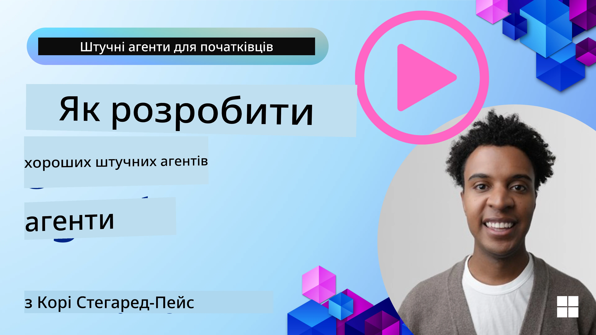
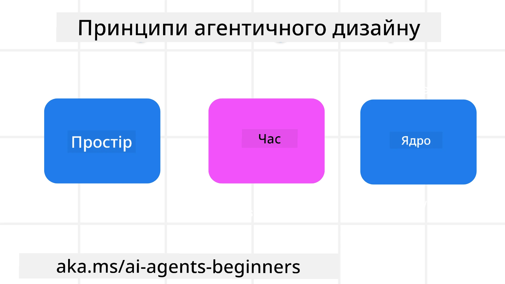

<!--
CO_OP_TRANSLATOR_METADATA:
{
  "original_hash": "d71524fe83a23829ae7a23b4031aaac8",
  "translation_date": "2025-11-13T14:43:28+00:00",
  "source_file": "03-agentic-design-patterns/README.md",
  "language_code": "uk"
}
-->

> _(Натисніть на зображення вище, щоб переглянути відео цього уроку)_
# Принципи дизайну агентів штучного інтелекту

## Вступ

Існує багато способів мислення про створення агентних систем штучного інтелекту. Оскільки неоднозначність є особливістю, а не недоліком у дизайні генеративного ШІ, інженерам іноді важко зрозуміти, з чого почати. Ми створили набір принципів дизайну UX, орієнтованих на людину, щоб допомогти розробникам створювати агентні системи, орієнтовані на клієнта, для вирішення їхніх бізнес-завдань. Ці принципи дизайну не є жорсткою архітектурою, а скоріше відправною точкою для команд, які визначають і створюють досвід взаємодії з агентами.

Загалом, агенти повинні:

- Розширювати та масштабувати людські можливості (генерація ідей, вирішення проблем, автоматизація тощо)
- Заповнювати прогалини в знаннях (допомагати швидко освоювати нові знання, переклад тощо)
- Сприяти та підтримувати співпрацю у спосіб, який відповідає нашим індивідуальним уподобанням у роботі з іншими
- Робити нас кращими версіями самих себе (наприклад, коуч з життя/організатор завдань, допомога у вивченні навичок емоційної регуляції та усвідомленості, розвиток стійкості тощо)

## Цей урок охоплює

- Що таке принципи дизайну агентів
- Які є рекомендації для впровадження цих принципів дизайну
- Приклади використання принципів дизайну

## Цілі навчання

Після завершення цього уроку ви зможете:

1. Пояснити, що таке принципи дизайну агентів
2. Пояснити рекомендації щодо використання принципів дизайну агентів
3. Зрозуміти, як створити агента, використовуючи принципи дизайну агентів

## Принципи дизайну агентів

### Агент (Простір)

Це середовище, в якому працює агент. Ці принципи визначають, як ми проектуємо агентів для взаємодії у фізичних і цифрових світах.

- **З’єднувати, а не руйнувати** – допомагати людям з’єднуватися з іншими людьми, подіями та корисними знаннями для сприяння співпраці та зв’язку.
  - Агенти допомагають з’єднувати події, знання та людей.
  - Агенти зближують людей. Вони не створені для заміни чи приниження людей.
- **Легко доступні, але іноді невидимі** – агент здебільшого працює у фоновому режимі та втручається лише тоді, коли це доречно.
  - Агент легко доступний для авторизованих користувачів на будь-якому пристрої чи платформі.
  - Агент підтримує мультимодальні введення та виведення (звук, голос, текст тощо).
  - Агент може безперешкодно переходити між переднім і фоновим планом; між проактивним і реактивним режимами залежно від потреб користувача.
  - Агент може працювати у невидимій формі, але його фонові процеси та співпраця з іншими агентами є прозорими та контрольованими для користувача.

### Агент (Час)

Це те, як агент працює з часом. Ці принципи визначають, як ми проектуємо агентів для взаємодії з минулим, теперішнім і майбутнім.

- **Минуле**: Рефлексія на основі історії, яка включає як стан, так і контекст.
  - Агент надає більш релевантні результати на основі аналізу багатших історичних даних, а не лише подій, людей чи станів.
  - Агент створює зв’язки з минулими подіями та активно використовує пам’ять для взаємодії з поточними ситуаціями.
- **Теперішнє**: Підштовхування замість сповіщення.
  - Агент використовує комплексний підхід до взаємодії з людьми. Коли відбувається подія, агент виходить за межі статичних сповіщень чи формальностей. Агент може спрощувати процеси або динамічно створювати підказки, щоб привернути увагу користувача в потрібний момент.
  - Агент надає інформацію на основі контекстуального середовища, соціальних і культурних змін, адаптуючи її до намірів користувача.
  - Взаємодія з агентом може бути поступовою, розвиваючись у складності, щоб довгостроково розширювати можливості користувачів.
- **Майбутнє**: Адаптація та еволюція.
  - Агент адаптується до різних пристроїв, платформ і модальностей.
  - Агент адаптується до поведінки користувача, потреб у доступності та є вільно налаштовуваним.
  - Агент формується та еволюціонує через постійну взаємодію з користувачем.

### Агент (Ядро)

Це ключові елементи в основі дизайну агента.

- **Приймати невизначеність, але встановлювати довіру**.
  - Певний рівень невизначеності агента є очікуваним. Невизначеність є ключовим елементом дизайну агента.
  - Довіра та прозорість є фундаментальними шарами дизайну агента.
  - Люди контролюють, коли агент увімкнений/вимкнений, і статус агента завжди чітко видно.

## Рекомендації для впровадження цих принципів

Коли ви використовуєте попередні принципи дизайну, дотримуйтесь наступних рекомендацій:

1. **Прозорість**: Інформуйте користувача про те, що використовується ШІ, як він працює (включаючи минулі дії), як надати зворотний зв’язок і змінити систему.
2. **Контроль**: Дозвольте користувачеві налаштовувати, вказувати уподобання та персоналізувати, а також контролювати систему та її атрибути (включаючи можливість забути).
3. **Послідовність**: Створюйте послідовний, мультимодальний досвід на різних пристроях і кінцевих точках. Використовуйте знайомі елементи UI/UX, де це можливо (наприклад, іконка мікрофона для голосової взаємодії), і зменшуйте когнітивне навантаження користувача (наприклад, прагніть до лаконічних відповідей, візуальних підказок і контенту «Дізнатися більше»).

## Як створити туристичного агента, використовуючи ці принципи та рекомендації

Уявіть, що ви створюєте туристичного агента. Ось як можна використовувати принципи дизайну та рекомендації:

1. **Прозорість** – Повідомте користувача, що туристичний агент є агентом на основі ШІ. Надайте базові інструкції щодо початку роботи (наприклад, повідомлення «Привіт», приклади запитів). Чітко задокументуйте це на сторінці продукту. Показуйте список запитів, які користувач задавав у минулому. Зробіть зрозумілим, як надати зворотний зв’язок (пальці вгору/вниз, кнопка «Надіслати відгук» тощо). Чітко вкажіть, чи є у агента обмеження у використанні або темах.
2. **Контроль** – Переконайтеся, що зрозуміло, як користувач може змінити агента після його створення, наприклад, за допомогою системного запиту. Дозвольте користувачеві вибирати, наскільки детальним буде агент, його стиль написання та будь-які обмеження щодо тем, які агент не повинен обговорювати. Дозвольте користувачеві переглядати та видаляти будь-які пов’язані файли чи дані, запити та минулі розмови.
3. **Послідовність** – Переконайтеся, що іконки для «Поділитися запитом», «Додати файл або фото» та «Позначити когось або щось» є стандартними та впізнаваними. Використовуйте іконку скріпки для позначення завантаження/обміну файлами з агентом, а іконку зображення – для завантаження графіки.

## Приклади коду

- Python: [Agent Framework](./code_samples/03-python-agent-framework.ipynb)
- .NET: [Agent Framework](./code_samples/03-dotnet-agent-framework.md)

## Маєте більше запитань про шаблони дизайну агентів ШІ?

Приєднуйтесь до [Azure AI Foundry Discord](https://aka.ms/ai-agents/discord), щоб зустрітися з іншими учнями, відвідати години консультацій і отримати відповіді на ваші запитання про агентів ШІ.

## Додаткові ресурси

- <a href="https://openai.com" target="_blank">Практики управління агентними системами ШІ | OpenAI</a>
- <a href="https://microsoft.com" target="_blank">Проєкт HAX Toolkit - Microsoft Research</a>
- <a href="https://responsibleaitoolbox.ai" target="_blank">Інструментарій відповідального ШІ</a>

## Попередній урок

[Дослідження агентних фреймворків](../02-explore-agentic-frameworks/README.md)

## Наступний урок

[Шаблон використання інструментів](../04-tool-use/README.md)

---

<!-- CO-OP TRANSLATOR DISCLAIMER START -->
**Відмова від відповідальності**:  
Цей документ був перекладений за допомогою сервісу автоматичного перекладу [Co-op Translator](https://github.com/Azure/co-op-translator). Хоча ми прагнемо до точності, будь ласка, майте на увазі, що автоматичні переклади можуть містити помилки або неточності. Оригінальний документ на його рідній мові слід вважати авторитетним джерелом. Для критичної інформації рекомендується професійний людський переклад. Ми не несемо відповідальності за будь-які непорозуміння або неправильні тлумачення, що виникають внаслідок використання цього перекладу.
<!-- CO-OP TRANSLATOR DISCLAIMER END -->