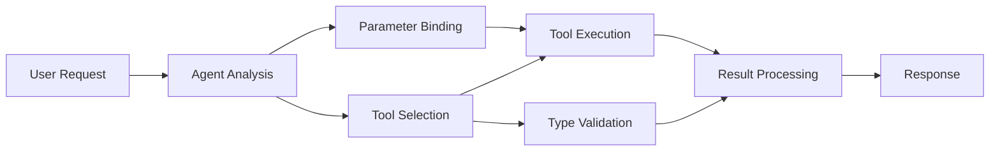

<!--
CO_OP_TRANSLATOR_METADATA:
{
  "original_hash": "91d6061e402489603f2ec8b528cae59b",
  "translation_date": "2025-11-18T18:36:25+00:00",
  "source_file": "04-tool-use/code_samples/04-dotnet-agent-framework.md",
  "language_code": "uk"
}
-->
# 🛠️ Розширене використання інструментів із моделями GitHub (.NET)

## 📋 Цілі навчання

Цей блокнот демонструє інтеграцію інструментів корпоративного рівня за допомогою Microsoft Agent Framework у .NET з моделями GitHub. Ви навчитеся створювати складних агентів із кількома спеціалізованими інструментами, використовуючи сильну типізацію C# та корпоративні функції .NET.

### Розширені можливості інструментів, які ви опануєте

- 🔧 **Архітектура з багатьма інструментами**: Створення агентів із кількома спеціалізованими можливостями
- 🎯 **Безпечне виконання інструментів за типами**: Використання перевірки на етапі компіляції в C#
- 📊 **Корпоративні шаблони інструментів**: Дизайн інструментів, готових до використання у виробництві, та обробка помилок
- 🔗 **Композиція інструментів**: Комбінування інструментів для складних бізнес-процесів

## 🎯 Переваги архітектури інструментів .NET

### Особливості корпоративних інструментів

- **Перевірка на етапі компіляції**: Сильна типізація забезпечує правильність параметрів інструментів
- **Впровадження залежностей**: Інтеграція IoC-контейнера для управління інструментами
- **Шаблони Async/Await**: Неблокуюче виконання інструментів із правильним управлінням ресурсами
- **Структуроване логування**: Вбудована інтеграція логування для моніторингу виконання інструментів

### Шаблони, готові до використання у виробництві

- **Обробка виключень**: Комплексне управління помилками із типізованими виключеннями
- **Управління ресурсами**: Правильні шаблони утилізації та управління пам'яттю
- **Моніторинг продуктивності**: Вбудовані метрики та лічильники продуктивності
- **Управління конфігурацією**: Типізована конфігурація з перевіркою

## 🔧 Технічна архітектура

### Основні компоненти інструментів .NET

- **Microsoft.Extensions.AI**: Уніфікований шар абстракції інструментів
- **Microsoft.Agents.AI**: Оркестрація інструментів корпоративного рівня
- **Інтеграція моделей GitHub**: Високопродуктивний клієнт API із пулінгом з'єднань

### Конвеєр виконання інструментів



## 🛠️ Категорії та шаблони інструментів

### 1. **Інструменти обробки даних**

- **Перевірка введення**: Сильна типізація з анотаціями даних
- **Операції трансформації**: Типізоване перетворення та форматування даних
- **Бізнес-логіка**: Інструменти для доменних розрахунків та аналізу
- **Форматування вихідних даних**: Генерація структурованих відповідей

### 2. **Інтеграційні інструменти**

- **API-конектори**: Інтеграція RESTful сервісів із HttpClient
- **Інструменти баз даних**: Інтеграція Entity Framework для доступу до даних
- **Операції з файлами**: Безпечні операції з файловою системою з перевіркою
- **Зовнішні сервіси**: Шаблони інтеграції сторонніх сервісів

### 3. **Утилітарні інструменти**

- **Обробка тексту**: Утиліти для маніпуляції та форматування рядків
- **Операції з датами/часом**: Культурно-орієнтовані розрахунки дат/часу
- **Математичні інструменти**: Точні розрахунки та статистичні операції
- **Інструменти перевірки**: Перевірка бізнес-правил та верифікація даних

Готові створювати агентів корпоративного рівня з потужними, типізованими можливостями інструментів у .NET? Давайте спроектуємо професійні рішення! 🏢⚡

## 🚀 Початок роботи

### Попередні вимоги

- [.NET 10 SDK](https://dotnet.microsoft.com/download/dotnet/10.0) або новіший
- [Токен доступу до API моделей GitHub](https://docs.github.com/github-models/github-models-at-scale/using-your-own-api-keys-in-github-models)

### Необхідні змінні середовища

```bash
# zsh/bash
export GH_TOKEN=<your_github_token>
export GH_ENDPOINT=https://models.github.ai/inference
export GH_MODEL_ID=openai/gpt-5-mini
```

```powershell
# PowerShell
$env:GH_TOKEN = "<your_github_token>"
$env:GH_ENDPOINT = "https://models.github.ai/inference"
$env:GH_MODEL_ID = "openai/gpt-5-mini"
```

### Приклад коду

Щоб запустити приклад коду,

```bash
# zsh/bash
chmod +x ./04-dotnet-agent-framework.cs
./04-dotnet-agent-framework.cs
```

Або використовуючи CLI dotnet:

```bash
dotnet run ./04-dotnet-agent-framework.cs
```

Дивіться [`04-dotnet-agent-framework.cs`](../../../../04-tool-use/code_samples/04-dotnet-agent-framework.cs) для повного коду.

```csharp
#!/usr/bin/dotnet run

#:package Microsoft.Extensions.AI@10.*
#:package Microsoft.Agents.AI.OpenAI@1.*-*

using System.ClientModel;
using System.ComponentModel;

using Microsoft.Agents.AI;
using Microsoft.Extensions.AI;

using OpenAI;

// Tool Function: Random Destination Generator
// This static method will be available to the agent as a callable tool
// The [Description] attribute helps the AI understand when to use this function
// This demonstrates how to create custom tools for AI agents
[Description("Provides a random vacation destination.")]
static string GetRandomDestination()
{
    // List of popular vacation destinations around the world
    // The agent will randomly select from these options
    var destinations = new List<string>
    {
        "Paris, France",
        "Tokyo, Japan",
        "New York City, USA",
        "Sydney, Australia",
        "Rome, Italy",
        "Barcelona, Spain",
        "Cape Town, South Africa",
        "Rio de Janeiro, Brazil",
        "Bangkok, Thailand",
        "Vancouver, Canada"
    };

    // Generate random index and return selected destination
    // Uses System.Random for simple random selection
    var random = new Random();
    int index = random.Next(destinations.Count);
    return destinations[index];
}

// Extract configuration from environment variables
// Retrieve the GitHub Models API endpoint, defaults to https://models.github.ai/inference if not specified
// Retrieve the model ID, defaults to openai/gpt-5-mini if not specified
// Retrieve the GitHub token for authentication, throws exception if not specified
var github_endpoint = Environment.GetEnvironmentVariable("GH_ENDPOINT") ?? "https://models.github.ai/inference";
var github_model_id = Environment.GetEnvironmentVariable("GH_MODEL_ID") ?? "openai/gpt-5-mini";
var github_token = Environment.GetEnvironmentVariable("GH_TOKEN") ?? throw new InvalidOperationException("GH_TOKEN is not set.");

// Configure OpenAI Client Options
// Create configuration options to point to GitHub Models endpoint
// This redirects OpenAI client calls to GitHub's model inference service
var openAIOptions = new OpenAIClientOptions()
{
    Endpoint = new Uri(github_endpoint)
};

// Initialize OpenAI Client with GitHub Models Configuration
// Create OpenAI client using GitHub token for authentication
// Configure it to use GitHub Models endpoint instead of OpenAI directly
var openAIClient = new OpenAIClient(new ApiKeyCredential(github_token), openAIOptions);

// Define Agent Identity and Comprehensive Instructions
// Agent name for identification and logging purposes
var AGENT_NAME = "TravelAgent";

// Detailed instructions that define the agent's personality, capabilities, and behavior
// This system prompt shapes how the agent responds and interacts with users
var AGENT_INSTRUCTIONS = """
You are a helpful AI Agent that can help plan vacations for customers.

Important: When users specify a destination, always plan for that location. Only suggest random destinations when the user hasn't specified a preference.

When the conversation begins, introduce yourself with this message:
"Hello! I'm your TravelAgent assistant. I can help plan vacations and suggest interesting destinations for you. Here are some things you can ask me:
1. Plan a day trip to a specific location
2. Suggest a random vacation destination
3. Find destinations with specific features (beaches, mountains, historical sites, etc.)
4. Plan an alternative trip if you don't like my first suggestion

What kind of trip would you like me to help you plan today?"

Always prioritize user preferences. If they mention a specific destination like "Bali" or "Paris," focus your planning on that location rather than suggesting alternatives.
""";

// Create AI Agent with Advanced Travel Planning Capabilities
// Initialize complete agent pipeline: OpenAI client → Chat client → AI agent
// Configure agent with name, detailed instructions, and available tools
// This demonstrates the .NET agent creation pattern with full configuration
AIAgent agent = openAIClient
    .GetChatClient(github_model_id)
    .CreateAIAgent(
        name: AGENT_NAME,
        instructions: AGENT_INSTRUCTIONS,
        tools: [AIFunctionFactory.Create(GetRandomDestination)]
    );

// Create New Conversation Thread for Context Management
// Initialize a new conversation thread to maintain context across multiple interactions
// Threads enable the agent to remember previous exchanges and maintain conversational state
// This is essential for multi-turn conversations and contextual understanding
AgentThread thread = agent.GetNewThread();

// Execute Agent: First Travel Planning Request
// Run the agent with an initial request that will likely trigger the random destination tool
// The agent will analyze the request, use the GetRandomDestination tool, and create an itinerary
// Using the thread parameter maintains conversation context for subsequent interactions
await foreach (var update in agent.RunStreamingAsync("Plan me a day trip", thread))
{
    await Task.Delay(10);
    Console.Write(update);
}

Console.WriteLine();

// Execute Agent: Follow-up Request with Context Awareness
// Demonstrate contextual conversation by referencing the previous response
// The agent remembers the previous destination suggestion and will provide an alternative
// This showcases the power of conversation threads and contextual understanding in .NET agents
await foreach (var update in agent.RunStreamingAsync("I don't like that destination. Plan me another vacation.", thread))
{
    await Task.Delay(10);
    Console.Write(update);
}
```

---

<!-- CO-OP TRANSLATOR DISCLAIMER START -->
**Відмова від відповідальності**:  
Цей документ був перекладений за допомогою сервісу автоматичного перекладу [Co-op Translator](https://github.com/Azure/co-op-translator). Хоча ми прагнемо до точності, будь ласка, майте на увазі, що автоматичні переклади можуть містити помилки або неточності. Оригінальний документ на його рідній мові слід вважати авторитетним джерелом. Для критичної інформації рекомендується професійний людський переклад. Ми не несемо відповідальності за будь-які непорозуміння або неправильні тлумачення, що виникають внаслідок використання цього перекладу.
<!-- CO-OP TRANSLATOR DISCLAIMER END -->