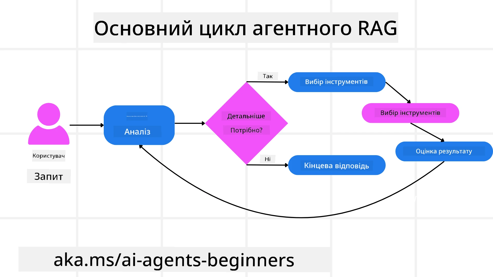
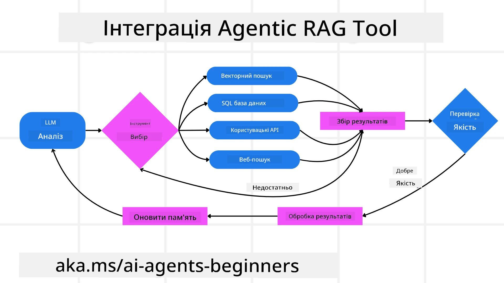
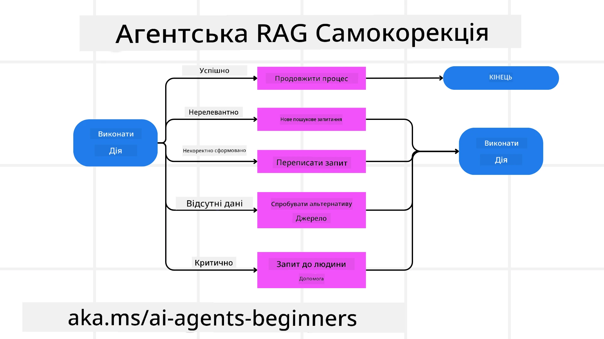

<!--
CO_OP_TRANSLATOR_METADATA:
{
  "original_hash": "0ebf6b2290db55dbf2d10cc49655523b",
  "translation_date": "2025-09-30T07:59:10+00:00",
  "source_file": "05-agentic-rag/README.md",
  "language_code": "uk"
}
-->

> _(Натисніть на зображення вище, щоб переглянути відео цього уроку)_

# Agentic RAG

Цей урок надає всебічний огляд Agentic Retrieval-Augmented Generation (Agentic RAG) — нової парадигми штучного інтелекту, де великі мовні моделі (LLMs) автономно планують свої наступні кроки, отримуючи інформацію з зовнішніх джерел. На відміну від статичних шаблонів "отримати-і-прочитати", Agentic RAG передбачає ітеративні виклики до LLM, які чергуються з викликами інструментів або функцій і структурованими вихідними даними. Система оцінює результати, уточнює запити, викликає додаткові інструменти за потреби і продовжує цей цикл, поки не буде досягнуто задовільного рішення.

## Вступ

Цей урок охоплює:

- **Розуміння Agentic RAG:** Дізнайтеся про нову парадигму в штучному інтелекті, де великі мовні моделі (LLMs) автономно планують свої наступні кроки, отримуючи інформацію з зовнішніх джерел даних.
- **Опанування ітеративного стилю Maker-Checker:** Зрозумійте цикл ітеративних викликів до LLM, які чергуються з викликами інструментів або функцій і структурованими вихідними даними, створеними для покращення точності та обробки некоректних запитів.
- **Дослідження практичних застосувань:** Визначте сценарії, де Agentic RAG демонструє свої переваги, наприклад, у середовищах з пріоритетом точності, складних взаємодіях з базами даних і розширених робочих процесах.

## Цілі навчання

Після завершення цього уроку ви зможете:

- **Розуміти Agentic RAG:** Дізнатися про нову парадигму в штучному інтелекті, де великі мовні моделі (LLMs) автономно планують свої наступні кроки, отримуючи інформацію з зовнішніх джерел даних.
- **Ітеративний стиль Maker-Checker:** Опанувати концепцію циклу ітеративних викликів до LLM, які чергуються з викликами інструментів або функцій і структурованими вихідними даними, створеними для покращення точності та обробки некоректних запитів.
- **Володіння процесом міркування:** Зрозуміти здатність системи самостійно приймати рішення щодо підходу до вирішення проблем без залежності від заздалегідь визначених шляхів.
- **Робочий процес:** Зрозуміти, як агентна модель самостійно вирішує отримати звіти про ринкові тенденції, визначити дані конкурентів, зіставити внутрішні показники продажів, синтезувати висновки та оцінити стратегію.
- **Ітеративні цикли, інтеграція інструментів і пам'ять:** Дізнатися про залежність системи від циклічного шаблону взаємодії, підтримуючи стан і пам'ять між кроками, щоб уникнути повторюваних циклів і приймати обґрунтовані рішення.
- **Обробка режимів відмов і самокорекція:** Дослідити надійні механізми самокорекції системи, включаючи ітерацію та повторний запит, використання діагностичних інструментів і звернення до людського нагляду.
- **Межі агентності:** Зрозуміти обмеження Agentic RAG, зосереджуючись на автономії в межах певної галузі, залежності від інфраструктури та дотриманні обмежень.
- **Практичні випадки використання та цінність:** Визначити сценарії, де Agentic RAG демонструє свої переваги, наприклад, у середовищах з пріоритетом точності, складних взаємодіях з базами даних і розширених робочих процесах.
- **Управління, прозорість і довіра:** Дізнатися про важливість управління та прозорості, включаючи пояснювальне міркування, контроль упередженості та людський нагляд.

## Що таке Agentic RAG?

Agentic Retrieval-Augmented Generation (Agentic RAG) — це нова парадигма штучного інтелекту, де великі мовні моделі (LLMs) автономно планують свої наступні кроки, отримуючи інформацію з зовнішніх джерел. На відміну від статичних шаблонів "отримати-і-прочитати", Agentic RAG передбачає ітеративні виклики до LLM, які чергуються з викликами інструментів або функцій і структурованими вихідними даними. Система оцінює результати, уточнює запити, викликає додаткові інструменти за потреби і продовжує цей цикл, поки не буде досягнуто задовільного рішення. Цей ітеративний стиль "maker-checker" покращує точність, обробляє некоректні запити і забезпечує високоякісні результати.

Система активно володіє процесом міркування, переписуючи невдалі запити, вибираючи різні методи отримання даних і інтегруючи кілька інструментів — таких як пошук векторів у Azure AI Search, SQL-бази даних або власні API — перед тим, як завершити свою відповідь. Відмінною рисою агентної системи є її здатність володіти процесом міркування. Традиційні реалізації RAG покладаються на заздалегідь визначені шляхи, але агентна система автономно визначає послідовність кроків на основі якості знайденої інформації.

## Визначення Agentic Retrieval-Augmented Generation (Agentic RAG)

Agentic Retrieval-Augmented Generation (Agentic RAG) — це нова парадигма в розвитку штучного інтелекту, де LLM не тільки отримують інформацію з зовнішніх джерел даних, але й автономно планують свої наступні кроки. На відміну від статичних шаблонів "отримати-і-прочитати" або ретельно прописаних послідовностей запитів, Agentic RAG передбачає цикл ітеративних викликів до LLM, які чергуються з викликами інструментів або функцій і структурованими вихідними даними. На кожному етапі система оцінює отримані результати, вирішує, чи потрібно уточнити запити, викликає додаткові інструменти за потреби і продовжує цей цикл, поки не досягне задовільного рішення.

Цей ітеративний стиль "maker-checker" створений для покращення точності, обробки некоректних запитів до структурованих баз даних (наприклад, NL2SQL) і забезпечення збалансованих, високоякісних результатів. Замість того, щоб покладатися виключно на ретельно спроектовані ланцюжки запитів, система активно володіє процесом міркування. Вона може переписувати невдалі запити, вибирати різні методи отримання даних і інтегрувати кілька інструментів — таких як пошук векторів у Azure AI Search, SQL-бази даних або власні API — перед тим, як завершити свою відповідь. Це усуває потребу в надмірно складних оркестраційних фреймворках. Натомість відносно простий цикл "виклик LLM → використання інструменту → виклик LLM → ..." може забезпечити складні та добре обґрунтовані результати.

## Володіння процесом міркування

Відмінною рисою, яка робить систему "агентною", є її здатність володіти процесом міркування. Традиційні реалізації RAG часто залежать від того, що люди заздалегідь визначають шлях для моделі: ланцюжок думок, який визначає, що отримати і коли. Але коли система є справді агентною, вона внутрішньо вирішує, як підійти до проблеми. Вона не просто виконує сценарій; вона автономно визначає послідовність кроків на основі якості знайденої інформації.

Наприклад, якщо її попросити створити стратегію запуску продукту, вона не покладається виключно на запит, який описує весь процес дослідження та прийняття рішень. Натомість агентна модель самостійно вирішує:

1. Отримати звіти про поточні ринкові тенденції за допомогою Bing Web Grounding.
2. Визначити відповідні дані конкурентів за допомогою Azure AI Search.
3. Зіставити історичні внутрішні показники продажів за допомогою Azure SQL Database.
4. Синтезувати висновки в узгоджену стратегію, оркестровану через Azure OpenAI Service.
5. Оцінити стратегію на наявність прогалин або невідповідностей, ініціюючи ще один раунд отримання даних за потреби.

Усі ці кроки — уточнення запитів, вибір джерел, ітерація до "задоволення" відповіддю — вирішуються моделлю, а не заздалегідь прописуються людиною.

## Ітеративні цикли, інтеграція інструментів і пам'ять

Агентна система покладається на циклічний шаблон взаємодії:

- **Початковий виклик:** Ціль користувача (тобто запит користувача) передається до LLM.
- **Виклик інструменту:** Якщо модель визначає відсутність інформації або неоднозначні інструкції, вона вибирає інструмент або метод отримання даних — наприклад, запит до векторної бази даних (наприклад, Azure AI Search Hybrid search по приватних даних) або структурований SQL-запит — щоб отримати більше контексту.
- **Оцінка та уточнення:** Після перегляду отриманих даних модель вирішує, чи достатньо інформації. Якщо ні, вона уточнює запит, пробує інший інструмент або коригує свій підхід.
- **Повторення до задоволення:** Цей цикл продовжується, поки модель не визначить, що має достатньо ясності та доказів для надання остаточної, добре обґрунтованої відповіді.
- **Пам'ять і стан:** Оскільки система підтримує стан і пам'ять між кроками, вона може згадувати попередні спроби та їх результати, уникаючи повторюваних циклів і приймаючи більш обґрунтовані рішення в процесі.

З часом це створює відчуття еволюційного розуміння, дозволяючи моделі виконувати складні багатокрокові завдання без необхідності постійного втручання людини або переформулювання запиту.

## Обробка режимів відмов і самокорекція

Автономність Agentic RAG також включає надійні механізми самокорекції. Коли система стикається з тупиковими ситуаціями — наприклад, отриманням нерелевантних документів або некоректними запитами — вона може:

- **Ітерувати та повторно запитувати:** Замість того, щоб надавати низькоцінні відповіді, модель пробує нові стратегії пошуку, переписує запити до баз даних або звертається до альтернативних наборів даних.
- **Використовувати діагностичні інструменти:** Система може викликати додаткові функції, призначені для допомоги в налагодженні її кроків міркування або підтвердження правильності отриманих даних. Інструменти, такі як Azure AI Tracing, будуть важливими для забезпечення надійної спостережуваності та моніторингу.
- **Звертатися до людського нагляду:** У сценаріях з високими ставками або повторними невдачами модель може позначати невизначеність і запитувати керівництво людини. Після того, як людина надає коригувальний відгук, модель може врахувати цей урок у майбутньому.

Цей ітеративний і динамічний підхід дозволяє моделі постійно вдосконалюватися, забезпечуючи, що вона не є просто системою одноразового використання, а такою, що вчиться на своїх помилках під час даної сесії.

## Межі агентності

Незважаючи на свою автономність у межах завдання, Agentic RAG не є аналогом штучного загального інтелекту. Її "агентні" можливості обмежуються інструментами, джерелами даних і політиками, наданими розробниками. Вона не може винаходити власні інструменти або виходити за межі встановлених доменів. Натомість вона відмінно справляється з динамічною оркестрацією доступних ресурсів.

Основні відмінності від більш просунутих форм штучного інтелекту включають:

1. **Автономія в межах домену:** Системи Agentic RAG зосереджені на досягненні цілей, визначених користувачем, у відомому домені, використовуючи стратегії, такі як переписування запитів або вибір інструментів для покращення результатів.
2. **Залежність від інфраструктури:** Можливості системи залежать від інструментів і даних, інтегрованих розробниками. Вона не може перевершити ці межі без втручання людини.
3. **Дотримання обмежень:** Етичні принципи, правила відповідності та бізнес-політики залишаються дуже важливими. Свобода агента завжди обмежується заходами безпеки та механізмами нагляду (сподіваємося?).

## Практичні випадки використання та цінність

Agentic RAG демонструє свої переваги в сценаріях, що потребують ітеративного уточнення та точності:

1. **Середовища з пріоритетом точності:** У перевірці відповідності, регуляторному аналізі або юридичних дослідженнях агентна модель може повторно перевіряти факти, консультуватися з кількома джерелами і переписувати запити, поки не надасть ретельно перевірену відповідь.
2. **Складні взаємодії з базами даних:** Під час роботи зі структурованими даними, де запити часто можуть зазнавати невдач або потребувати коригування, система може автономно уточнювати свої запити, використовуючи Azure SQL або Microsoft Fabric OneLake, забезпечуючи, що остаточне отримання відповідає намірам користувача.
3. **Розширені робочі процеси:** Довготривалі сесії можуть еволюціонувати, коли з'являється нова інформація. Agentic RAG може постійно інтегрувати нові дані, змінюючи стратегії, коли вона дізнається більше про простір проблеми.

## Управління, прозорість і довіра

Оскільки ці системи стають більш автономними у своїх міркуваннях, управління та прозорість є вирішальними:

- **Пояснювальне міркування:** Модель може надати журнал запитів, які вона зробила, джерел, які вона консультувала, і кроків міркування, які вона виконала, щоб дійти до висновку. Інструменти, такі як Azure AI Content Safety і Azure AI Tracing / GenAIOps, можуть допомогти підтримувати прозорість і зменшувати ризики.
- **Контроль упередженості та збалансоване отримання:** Розробники можуть налаштовувати стратегії отримання, щоб забезпечити врахування збалансованих, репрезентативних джерел даних, і регулярно перевіряти результати, щоб виявити упередженість або перекоси, використовуючи власні моделі для просунутих організацій з аналізу даних за допомогою Azure Machine Learning.
- **Людський нагляд і відповідність:** Для чутливих завдань люд
- <a href="https://ragaboutit.com/agentic-rag-a-complete-guide-to-agent-based-retrieval-augmented-generation/" target="_blank">Agentic RAG: Повний посібник з агентного пошуку з доповненим генерацією – Новини від generation RAG</a>
- <a href="https://huggingface.co/learn/cookbook/agent_rag" target="_blank">Agentic RAG: прискорте ваш RAG за допомогою переформулювання запитів і самозапитів! Hugging Face Open-Source AI Cookbook</a>
- <a href="https://youtu.be/aQ4yQXeB1Ss?si=2HUqBzHoeB5tR04U" target="_blank">Додавання агентних шарів до RAG</a>
- <a href="https://www.youtube.com/watch?v=zeAyuLc_f3Q&t=244s" target="_blank">Майбутнє помічників знань: Джеррі Лю</a>
- <a href="https://www.youtube.com/watch?v=AOSjiXP1jmQ" target="_blank">Як створювати агентні системи RAG</a>
- <a href="https://ignite.microsoft.com/sessions/BRK102?source=sessions" target="_blank">Використання служби Azure AI Foundry Agent для масштабування ваших AI-агентів</a>

### Академічні статті

- <a href="https://arxiv.org/abs/2303.17651" target="_blank">2303.17651 Self-Refine: Ітеративне вдосконалення з самозворотним зв’язком</a>
- <a href="https://arxiv.org/abs/2303.11366" target="_blank">2303.11366 Reflexion: Мовні агенти з вербальним навчанням із підкріпленням</a>
- <a href="https://arxiv.org/abs/2305.11738" target="_blank">2305.11738 CRITIC: Великі мовні моделі можуть самокоригуватися за допомогою інструментально-інтерактивної критики</a>
- <a href="https://arxiv.org/abs/2501.09136" target="_blank">2501.09136 Агентний пошук з доповненою генерацією: Огляд агентного RAG</a>

## Попередній урок

[Шаблон використання інструментів](../04-tool-use/README.md)

## Наступний урок

[Створення надійних AI-агентів](../06-building-trustworthy-agents/README.md)

---

**Відмова від відповідальності**:  
Цей документ був перекладений за допомогою сервісу автоматичного перекладу [Co-op Translator](https://github.com/Azure/co-op-translator). Хоча ми прагнемо до точності, будь ласка, майте на увазі, що автоматичні переклади можуть містити помилки або неточності. Оригінальний документ на його рідній мові слід вважати авторитетним джерелом. Для критичної інформації рекомендується професійний людський переклад. Ми не несемо відповідальності за будь-які непорозуміння або неправильні тлумачення, що виникають внаслідок використання цього перекладу.