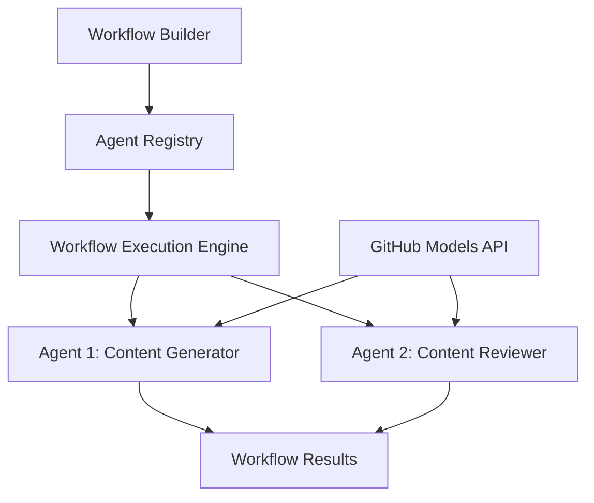

<!--
CO_OP_TRANSLATOR_METADATA:
{
  "original_hash": "034158688d0a45aae06dcbb21b0da5ae",
  "translation_date": "2025-11-11T13:01:35+00:00",
  "source_file": "08-multi-agent/code_samples/workflows-agent-framework/dotNET/01.dotnet-agent-framework-workflow-ghmodel-basic.md",
  "language_code": "uk"
}
-->
# 🔄 Основні робочі процеси агентів з моделями GitHub (.NET)

## 📋 Підручник з оркестрації робочих процесів

Цей блокнот демонструє, як створювати складні **робочі процеси агентів** за допомогою Microsoft Agent Framework для .NET і моделей GitHub. Ви навчитеся створювати багатокрокові бізнес-процеси, де AI-агенти співпрацюють для виконання складних завдань через структуровані шаблони оркестрації.

## 🎯 Навчальні цілі

### 🏗️ **Основи архітектури робочих процесів**
- **Конструктор робочих процесів**: Проектуйте та оркеструйте складні багатокрокові AI-процеси
- **Координація агентів**: Координуйте роботу кількох спеціалізованих агентів у межах робочих процесів
- **Інтеграція моделей GitHub**: Використовуйте сервіс інференції моделей GitHub у робочих процесах
- **Візуальний дизайн робочих процесів**: Створюйте та візуалізуйте структури робочих процесів для кращого розуміння

### 🔄 **Шаблони оркестрації процесів**
- **Послідовна обробка**: Зв’язуйте завдання агентів у логічному порядку
- **Управління станом**: Підтримуйте контекст і потік даних між етапами робочого процесу
- **Обробка помилок**: Реалізуйте надійне відновлення після помилок і стійкість робочих процесів
- **Оптимізація продуктивності**: Проектуйте ефективні робочі процеси для операцій корпоративного масштабу

### 🏢 **Застосування робочих процесів у підприємствах**
- **Автоматизація бізнес-процесів**: Автоматизуйте складні організаційні робочі процеси
- **Контентні виробничі лінії**: Редакційні робочі процеси з етапами перегляду та затвердження
- **Автоматизація обслуговування клієнтів**: Багатокрокове вирішення запитів клієнтів
- **Робочі процеси обробки даних**: ETL-процеси з AI-перетворенням даних

## ⚙️ Попередні вимоги та налаштування

### 📦 **Необхідні пакети NuGet**

Ця демонстрація робочого процесу використовує кілька ключових пакетів .NET:

```xml
<!-- Core AI Framework -->
<PackageReference Include="Microsoft.Extensions.AI" Version="9.9.0" />

<!-- Agent Framework (Local Development) -->
<!-- Microsoft.Agents.AI.dll - Core agent abstractions -->
<!-- Microsoft.Agents.AI.OpenAI.dll - OpenAI/GitHub Models integration -->

<!-- Configuration and Environment -->
<PackageReference Include="DotNetEnv" Version="3.1.1" />
```

### 🔑 **Налаштування моделей GitHub**

**Налаштування середовища (.env файл):**
```env
GITHUB_TOKEN=your_github_personal_access_token
GITHUB_ENDPOINT=https://models.inference.ai.azure.com
GITHUB_MODEL_ID=gpt-4o-mini
```

**Доступ до моделей GitHub:**
1. Зареєструйтеся для використання моделей GitHub (наразі в режимі попереднього перегляду)
2. Згенеруйте персональний токен доступу з дозволами на доступ до моделей
3. Налаштуйте змінні середовища, як показано вище

### 🏗️ **Огляд архітектури робочого процесу**



**Ключові компоненти:**
- **WorkflowBuilder**: Основний механізм оркестрації для проектування робочих процесів
- **AIAgent**: Індивідуальні спеціалізовані агенти з конкретними можливостями
- **GitHub Models Client**: Інтеграція сервісу інференції моделей AI
- **Execution Context**: Управляє станом і потоком даних між етапами робочого процесу

## 🎨 **Шаблони дизайну робочих процесів для підприємств**

### 📝 **Робочий процес створення контенту**
```
User Request → Content Generation → Quality Review → Final Output
```

### 🔍 **Потік обробки документів**
```
Document Input → Analysis → Extraction → Validation → Structured Output
```

### 💼 **Робочий процес бізнес-аналітики**
```
Data Collection → Processing → Analysis → Report Generation → Distribution
```

### 🤝 **Автоматизація обслуговування клієнтів**
```
Customer Inquiry → Classification → Processing → Response Generation → Follow-up
```

## 🏢 **Переваги для підприємств**

### 🎯 **Надійність і масштабованість**
- **Детерміноване виконання**: Стабільні, повторювані результати робочих процесів
- **Відновлення після помилок**: Гнучке управління збоями на будь-якому етапі робочого процесу
- **Моніторинг продуктивності**: Відстеження метрик виконання та можливостей оптимізації
- **Управління ресурсами**: Ефективний розподіл і використання ресурсів моделей AI

### 🔒 **Безпека та відповідність**
- **Безпечна автентифікація**: Аутентифікація на основі токенів GitHub для доступу до API
- **Журнали аудиту**: Повне логування виконання робочих процесів і точок прийняття рішень
- **Контроль доступу**: Гранульовані дозволи на виконання та моніторинг робочих процесів
- **Конфіденційність даних**: Безпечна обробка конфіденційної інформації в межах робочих процесів

### 📊 **Спостережуваність і управління**
- **Візуальний дизайн робочих процесів**: Чітке представлення потоків процесів і залежностей
- **Моніторинг виконання**: Відстеження прогресу та продуктивності робочих процесів у реальному часі
- **Звітування про помилки**: Детальний аналіз помилок і можливості налагодження
- **Аналітика продуктивності**: Метрики для оптимізації та планування потужностей

Давайте створимо ваш перший AI-робочий процес, готовий для підприємства! 🚀

## 💻 Виконання коду

Повна реалізація доступна у файлі `01.dotnet-agent-framework-workflow-ghmodel-basic.cs`. Цей файл демонструє:

1. **Налаштування середовища** - Завантаження облікових даних моделей GitHub з `.env` файлу
2. **Налаштування клієнта OpenAI** - Конфігурація клієнта для використання кінцевої точки моделей GitHub
3. **Створення агентів** - Визначення спеціалізованих агентів (Front Desk і Concierge)
4. **Конструктор робочих процесів** - Створення багатокрокового робочого процесу з послідовною обробкою
5. **Виконання робочого процесу** - Запуск робочого процесу з потоковими результатами

### 🚀 Виконання прикладу

```bash
# Make the script executable (Unix/Linux/macOS)
chmod +x 01.dotnet-agent-framework-workflow-ghmodel-basic.cs

# Run the workflow
./01.dotnet-agent-framework-workflow-ghmodel-basic.cs
```

Або на Windows:
```powershell
dotnet run 01.dotnet-agent-framework-workflow-ghmodel-basic.cs
```

### 📝 Очікуваний результат

Робочий процес:
1. Прийме ваш запит щодо місця подорожі ("Я хочу поїхати до Парижа")
2. Агент Front Desk надасть початкову рекомендацію
3. Агент Concierge перегляне та вдосконалить рекомендацію
4. Остаточний результат покаже повний потік розмови

### 🔧 Налаштування

Ви можете налаштувати робочий процес, змінивши:
- Інструкції агентів для зміни їхньої поведінки
- Додавши більше агентів для створення складних багатокрокових робочих процесів
- Змінивши повідомлення користувача для тестування різних сценаріїв
- Налаштувавши зв’язки робочого процесу для створення різних шаблонів виконання

---

<!-- CO-OP TRANSLATOR DISCLAIMER START -->
**Відмова від відповідальності**:  
Цей документ був перекладений за допомогою сервісу автоматичного перекладу [Co-op Translator](https://github.com/Azure/co-op-translator). Хоча ми прагнемо до точності, будь ласка, майте на увазі, що автоматичні переклади можуть містити помилки або неточності. Оригінальний документ на його рідній мові слід вважати авторитетним джерелом. Для критичної інформації рекомендується професійний людський переклад. Ми не несемо відповідальності за будь-які непорозуміння або неправильні тлумачення, що виникають внаслідок використання цього перекладу.
<!-- CO-OP TRANSLATOR DISCLAIMER END -->