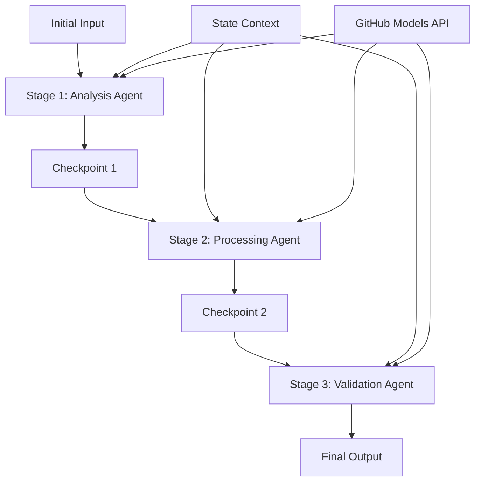

<!--
CO_OP_TRANSLATOR_METADATA:
{
  "original_hash": "1be9c8dcbd79a02d33d2c138684c1394",
  "translation_date": "2025-11-11T14:07:22+00:00",
  "source_file": "08-multi-agent/code_samples/workflows-agent-framework/dotNET/02.dotnet-agent-framework-workflow-ghmodel-sequential.md",
  "language_code": "uk"
}
-->
# ⏩ Послідовні робочі процеси агентів з моделями GitHub (.NET)

## 📋 Поглиблений посібник з послідовної обробки

Цей блокнот демонструє **шаблони послідовних робочих процесів** за допомогою Microsoft Agent Framework для .NET і моделей GitHub. Ви навчитеся створювати складні, покрокові обробні конвеєри, де агенти виконуються у визначеному порядку, а кожен етап базується на результатах попереднього.

## 🎯 Цілі навчання

### 🔄 **Архітектура послідовної обробки**
- **Дизайн лінійного робочого процесу**: Створення покрокових конвеєрів обробки з чіткими залежностями
- **Управління станом**: Підтримка контексту та потоку даних через етапи послідовного робочого процесу
- **Інтеграція моделей GitHub**: Використання AI моделей GitHub у багатоступеневих робочих процесах .NET
- **Шаблони корпоративних конвеєрів**: Створення готових до виробництва систем послідовної обробки

### 🏗️ **Розширені шаблони послідовної обробки**
- **Обробка з перевіркою етапів**: Реалізація контрольних точок перевірки між етапами робочого процесу
- **Збереження контексту**: Підтримка стану та накопичених знань через усі етапи
- **Пропагування помилок**: Грамотне управління збоями в ланцюгах послідовної обробки
- **Оптимізація продуктивності**: Ефективне послідовне виконання з мінімальними витратами

### 🏢 **Корпоративні послідовні застосування**
- **Конвеєр обробки документів**: Багатоступенева аналіз, трансформація та перевірка документів
- **Робочі процеси контролю якості**: Послідовний огляд, перевірка та процеси затвердження
- **Конвеєр створення контенту**: Дослідження → Написання → Редагування → Огляд → Публікація
- **Автоматизація бізнес-процесів**: Багатоступеневі бізнес-процеси з чіткими залежностями між етапами

## ⚙️ Передумови та налаштування

### 📦 **Необхідні пакети NuGet**

Основні пакети для послідовних робочих процесів .NET:

```xml
<!-- Core AI Framework -->
<PackageReference Include="Microsoft.Extensions.AI" Version="9.9.0" />

<!-- Client Model Abstractions -->
<PackageReference Include="System.ClientModel" Version="1.6.1.0" />

<!-- Azure Identity and Async LINQ Support -->
<PackageReference Include="Azure.Identity" Version="1.15.0" />
<PackageReference Include="System.Linq.Async" Version="6.0.3" />

<!-- Local Agent Framework References -->
<!-- Microsoft.Agents.AI.dll - Core agent abstractions -->
<!-- Microsoft.Agents.AI.OpenAI.dll - GitHub Models integration -->
```

### 🔑 **Налаштування моделей GitHub**

**Налаштування середовища (.env файл):**
```env
GITHUB_TOKEN=your_github_personal_access_token
GITHUB_ENDPOINT=https://models.inference.ai.azure.com
GITHUB_MODEL_ID=gpt-4o-mini
```

**Управління конфігурацією:**
```csharp
// Load environment variables securely
Env.Load("../../../.env");
var githubToken = Environment.GetEnvironmentVariable("GITHUB_TOKEN");
var githubEndpoint = Environment.GetEnvironmentVariable("GITHUB_ENDPOINT");
var modelId = Environment.GetEnvironmentVariable("GITHUB_MODEL_ID");
```

### 🏗️ **Архітектура послідовного робочого процесу**



**Основні компоненти:**
- **Послідовні агенти**: Спеціалізовані агенти для кожного етапу обробки
- **Контекст стану**: Підтримує накопичені дані та рішення через етапи
- **Контрольні точки**: Точки перевірки між етапами для забезпечення якості та узгодженості
- **Клієнт моделей GitHub**: Постійний доступ до AI моделей на всіх етапах робочого процесу

## 🎨 **Шаблони дизайну послідовного робочого процесу**

### 📝 **Конвеєр обробки документів**
```
Raw Document → Content Extraction → Analysis → Validation → Structured Output
```

### 🎯 **Робочий процес створення контенту**
```
Brief/Requirements → Research → Content Creation → Review → Final Polish
```

### 🔍 **Конвеєр контролю якості**
```
Initial Review → Technical Validation → Compliance Check → Final Approval
```

### 💼 **Робочий процес бізнес-аналітики**
```
Data Collection → Processing → Analysis → Report Generation → Distribution
```

## 🏢 **Переваги корпоративної послідовності**

### 🎯 **Надійність та якість**
- **Детермінована обробка**: Стабільні, повторювані результати через структуровані етапи
- **Контроль якості**: Точки перевірки забезпечують якість на кожному етапі
- **Ізоляція помилок**: Проблеми на одному етапі не впливають на наступні
- **Журнали аудиту**: Повне відстеження рішень та трансформацій на кожному етапі

### 📈 **Масштабованість та продуктивність**
- **Модульний дизайн**: Кожен етап можна оптимізувати окремо
- **Управління ресурсами**: Ефективний розподіл ресурсів AI моделей через етапи
- **Оптимізація стану**: Мінімальний перенос стану між етапами для оптимальної продуктивності
- **Паралельні групи етапів**: Множинні послідовні робочі процеси можуть виконуватися паралельно

### 🔒 **Безпека та відповідність**
- **Безпека на рівні етапів**: Різні політики безпеки для різних етапів обробки
- **Перевірка даних**: Забезпечення цілісності даних та відповідності на кожній контрольній точці
- **Контроль доступу**: Гранульовані дозволи для різних етапів робочого процесу
- **Регуляторна відповідність**: Відповідність регуляторним вимогам через структуровану обробку

### 📊 **Моніторинг та аналітика**
- **Метрики на рівні етапів**: Моніторинг продуктивності для кожного етапу робочого процесу
- **Виявлення вузьких місць**: Ідентифікація та оптимізація повільних етапів
- **Метрики якості**: Відстеження якості та рівня успіху на кожному етапі
- **Оптимізація процесу**: Постійне вдосконалення на основі аналітики рівня етапів

Давайте створимо надійні послідовні конвеєри обробки AI! 🚀

## 💻 Виконання коду

Повна реалізація доступна у файлі `02.dotnet-agent-framework-workflow-ghmodel-sequential.cs`. Цей файл демонструє **трьохетапний робочий процес аналізу меблів**:

1. **Етап 1 - Агент продажів**: Аналізує зображення меблів і надає рекомендації щодо покупки
2. **Етап 2 - Агент цін**: Надає детальний розподіл цін і варіанти бюджету
3. **Етап 3 - Агент пропозицій**: Генерує професійний документ пропозиції у форматі Markdown

### 🏗️ **Архітектура робочого процесу**

```
Image Input → Sales Analysis → Price Estimation → Quote Generation → Final Output
```

Кожен агент:
- Отримує вихідні дані з попереднього етапу як контекст
- Базується на попередньому аналізі зі спеціалізованою експертизою
- Підтримує безперервність робочого процесу через управління станом

### 🚀 Виконання прикладу

**Передумови:**
- Розмістіть зображення меблів у `../imgs/home.png` (або оновіть змінну `imgPath`)
- Налаштуйте ваш `.env` файл з обліковими даними моделей GitHub

```bash
# Make the script executable (Unix/Linux/macOS)
chmod +x 02.dotnet-agent-framework-workflow-ghmodel-sequential.cs

# Run the sequential workflow
./02.dotnet-agent-framework-workflow-ghmodel-sequential.cs
```

Або на Windows:
```powershell
dotnet run 02.dotnet-agent-framework-workflow-ghmodel-sequential.cs
```

### 📝 Очікуваний результат

Робочий процес:
1. **Агент продажів**: Визначить предмети меблів на зображенні та надасть рекомендації
2. **Агент цін**: Додасть детальний аналіз цін з бюджетними рівнями та рекомендаціями покупок
3. **Агент пропозицій**: Згенерує форматований документ пропозиції з усією синтезованою інформацією

Кінцевий результат буде комплексною, професійною пропозицією меблів на основі аналізу зображення.

### 🔧 Варіанти налаштування

**Змінити поведінку агентів:**
```csharp
// Adjust agent instructions to change their focus
const string SalesAgentInstructions = "Your custom instructions...";
```

**Змінити послідовний потік:**
```csharp
// Add or reorder workflow stages
var workflow = new WorkflowBuilder(salesagent)
    .AddEdge(salesagent, priceagent)
    .AddEdge(priceagent, quoteagent)
    .AddEdge(quoteagent, newAgent)  // Add another stage
    .Build();
```

**Використовувати інший вхід:**
```csharp
// Process text instead of images
ChatMessage userMessage = new ChatMessage(ChatRole.User, [
    new TextContent("Analyze pricing for a modern living room set")
]);
```

### 🎯 Реальні застосування

Цей шаблон послідовності ідеально підходить для:
- **Електронної комерції**: Аналіз продукту → Ціноутворення → Генерація пропозиції
- **Нерухомості**: Аналіз нерухомості → Оцінка → Створення списку
- **Страхування**: Аналіз претензій → Оцінка → Генерація пропозиції
- **Створення контенту**: Дослідження → Написання → Редагування → Публікація

### 🔍 Розуміння потоку стану

Кожен агент у послідовності отримує:
- **Оригінальний вхід**: Початкове повідомлення користувача (зображення + текст)
- **Вихідні дані попередніх агентів**: Усі відповіді попередніх агентів в історії розмови
- **Накопичений контекст**: Повний стан, підтримуваний протягом усього робочого процесу

Це дозволяє здійснювати складну багатоступеневу обробку, де кожен агент базується на комплексному контексті з усіх попередніх етапів.

---

<!-- CO-OP TRANSLATOR DISCLAIMER START -->
**Відмова від відповідальності**:  
Цей документ був перекладений за допомогою сервісу автоматичного перекладу [Co-op Translator](https://github.com/Azure/co-op-translator). Хоча ми прагнемо до точності, будь ласка, майте на увазі, що автоматичні переклади можуть містити помилки або неточності. Оригінальний документ на його рідній мові слід вважати авторитетним джерелом. Для критичної інформації рекомендується професійний людський переклад. Ми не несемо відповідальності за будь-які непорозуміння або неправильні тлумачення, що виникають внаслідок використання цього перекладу.
<!-- CO-OP TRANSLATOR DISCLAIMER END -->