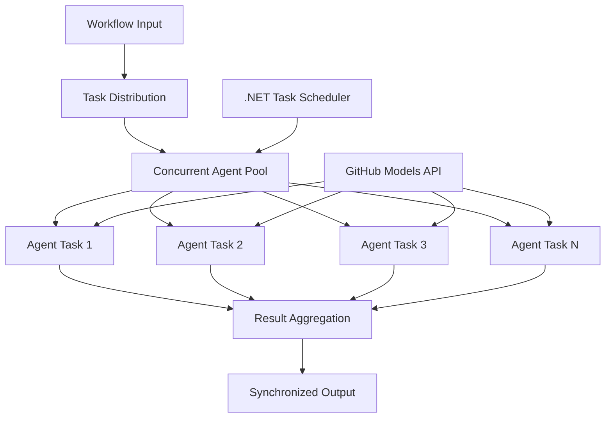

<!--
CO_OP_TRANSLATOR_METADATA:
{
  "original_hash": "b9c6e32c9b5f2fed20b6916984440d88",
  "translation_date": "2025-11-11T13:35:11+00:00",
  "source_file": "08-multi-agent/code_samples/workflows-agent-framework/dotNET/03.dotnet-agent-framework-workflow-ghmodel-concurrent.md",
  "language_code": "uk"
}
-->
# ⚡ Конкурентні робочі процеси агентів з моделями GitHub (.NET)

## 📋 Посібник з високопродуктивної паралельної обробки

Цей блокнот демонструє **шаблони конкурентних робочих процесів** за допомогою Microsoft Agent Framework для .NET і моделей GitHub. Ви навчитеся створювати високопродуктивні робочі процеси паралельної обробки, які максимізують пропускну здатність, виконуючи кілька AI-агентів одночасно, зберігаючи координацію та узгодженість даних.

## 🎯 Навчальні цілі

### 🚀 **Основи конкурентної обробки**
- **Паралельне виконання агентів**: Запуск кількох AI-агентів одночасно для максимальної продуктивності
- **Шаблони Async/Await**: Використання асинхронної моделі програмування .NET для ефективної конкурентності
- **Інтеграція моделей GitHub**: Координація кількох одночасних викликів до сервісу інференції моделей GitHub
- **Управління ресурсами**: Ефективне управління ресурсами моделей AI у конкурентних операціях

### 🏗️ **Розширена архітектура конкурентності**
- **Паралелізм на основі завдань**: Використання бібліотеки Task Parallel Library .NET для оптимального виконання конкурентних операцій
- **Шаблони синхронізації**: Координація конкурентних агентів, уникнення умов гонки
- **Балансування навантаження**: Ефективний розподіл роботи між доступною потужністю конкурентної обробки
- **Толерантність до помилок**: Обробка збоїв окремих агентів без зупинки всього робочого процесу

### 🏢 **Конкурентні додатки для підприємств**
- **Обробка документів великого обсягу**: Одночасна обробка кількох документів
- **Аналіз контенту в реальному часі**: Конкурентний аналіз вхідних потоків даних
- **Оптимізація пакетної обробки**: Максимізація пропускної здатності для операцій обробки даних великого масштабу
- **Мультимодальний аналіз**: Паралельна обробка різних типів і форматів контенту

## ⚙️ Попередні вимоги та налаштування

### 📦 **Необхідні пакети NuGet**

Основні пакети для високопродуктивних конкурентних робочих процесів:

```xml
<!-- Core AI Framework with Async Support -->
<PackageReference Include="Microsoft.Extensions.AI" Version="9.9.0" />

<!-- Client Model Abstractions for API Communication -->
<PackageReference Include="System.ClientModel" Version="1.6.1.0" />

<!-- Azure Identity and Async LINQ for Advanced Operations -->
<PackageReference Include="Azure.Identity" Version="1.15.0" />
<PackageReference Include="System.Linq.Async" Version="6.0.3" />

<!-- Local Agent Framework References -->
<!-- Microsoft.Agents.AI.dll - Core agent abstractions with async support -->
<!-- Microsoft.Agents.AI.OpenAI.dll - GitHub Models integration with concurrency -->
```

### 🔑 **Конфігурація моделей GitHub**

**Налаштування середовища (.env файл):**
```env
GITHUB_TOKEN=your_github_personal_access_token
GITHUB_ENDPOINT=https://models.inference.ai.azure.com
GITHUB_MODEL_ID=gpt-4o-mini
```

**Міркування щодо конкурентної обробки:**
```csharp
// Configure for concurrent operations
var clientOptions = new OpenAIClientOptions()
{
    Endpoint = new Uri(githubEndpoint),
    // Configure connection pooling for concurrent requests
    NetworkTimeout = TimeSpan.FromMinutes(5)
};
```

### 🏗️ **Архітектура конкурентного робочого процесу**



**Основні компоненти:**
- **Task Parallel Library**: Вбудована підтримка .NET для конкурентних операцій
- **Пул агентів**: Кілька екземплярів агентів для паралельної обробки
- **Агрегація результатів**: Координація та об'єднання результатів конкурентних агентів
- **Точки синхронізації**: Забезпечення узгодженості даних у конкурентних операціях

## 🎨 **Шаблони дизайну конкурентних робочих процесів**

### 🔍 **Паралельне дослідження та аналіз**
```
Research Topic → Concurrent Research Agents → Result Synthesis → Final Report
```

### 📊 **Обробка даних з кількох джерел**
```
Data Sources → Parallel Processing Agents → Data Integration → Unified Output
```

### 🎭 **Пайплайн генерації контенту**
```
Content Requirements → Concurrent Content Generators → Quality Review → Final Content
```

### 🔄 **Обробка Fan-Out/Fan-In**
```
Single Input → Multiple Concurrent Processors → Result Aggregation → Single Output
```

## 🏢 **Переваги продуктивності для підприємств**

### ⚡ **Пропускна здатність та масштабованість**
- **Лінійне масштабування продуктивності**: Додавання більше конкурентних агентів для збільшення пропускної здатності
- **Використання ресурсів**: Максимальна ефективність доступної потужності моделей AI
- **Скорочення часу обробки**: Значне скорочення часу завдяки паралельному виконанню
- **Еластичне масштабування**: Динамічне регулювання кількості конкурентних агентів залежно від навантаження

### 🛡️ **Надійність та стійкість**
- **Ізоляція помилок**: Збої окремих агентів не впливають на інші конкурентні операції
- **Плавна деградація**: Система продовжує працювати зі зменшеною потужністю агентів
- **Відновлення помилок**: Автоматичні механізми повтору для невдалих конкурентних операцій
- **Розподіл навантаження**: Рівномірний розподіл роботи між доступними агентами

### 📊 **Моніторинг продуктивності**
- **Метрики конкурентного виконання**: Відстеження продуктивності всіх паралельних операцій
- **Аналітика використання ресурсів**: Моніторинг використання CPU, пам'яті та мережі
- **Аналіз пропускної здатності**: Вимірювання ефективності, отриманої від конкурентної обробки
- **Виявлення вузьких місць**: Ідентифікація та вирішення обмежень продуктивності

### 🔧 **Розробка та операції**
- **Асинхронна модель програмування**: Використання зрілих шаблонів async/await .NET
- **Координація завдань**: Вбудовані можливості управління та координації завдань
- **Обробка винятків**: Комплексна обробка помилок для конкурентних операцій
- **Підтримка налагодження**: Інструменти налагодження Visual Studio для конкурентних робочих процесів

Давайте створимо високопродуктивні конкурентні AI-робочі процеси з .NET! 🚀

## 💻 Запуск коду

Повна реалізація доступна у файлі `03.dotnet-agent-framework-workflow-ghmodel-concurrent.cs`. Цей файл демонструє **конкурентний робочий процес Fan-Out/Fan-In** для планування подорожей:

### 🏗️ **Архітектура робочого процесу**

```
User Request → ConcurrentStartExecutor → [Researcher Agent || Planner Agent] → ConcurrentAggregationExecutor → Final Output
```

**Основні компоненти:**

1. **ConcurrentStartExecutor**: Одночасно передає запит користувача всім агентам
2. **Researcher Agent**: Аналізує напрямки та визначні місця паралельно
3. **Planner Agent**: Створює детальні плани подорожей паралельно
4. **ConcurrentAggregationExecutor**: Збирає та об'єднує результати від обох агентів

### 🎯 **Шаблон Fan-Out/Fan-In**

Цей робочий процес демонструє класичний шаблон **Fan-Out/Fan-In**:
- **Fan-Out**: Один вхідний запит передається кільком агентам одночасно
- **Конкурентна обробка**: Кілька агентів працюють паралельно над одним завданням
- **Fan-In**: Результати від усіх агентів збираються та об'єднуються в один вихідний результат

### 🚀 Запуск прикладу

```bash
# Make the script executable (Unix/Linux/macOS)
chmod +x 03.dotnet-agent-framework-workflow-ghmodel-concurrent.cs

# Run the concurrent workflow
./03.dotnet-agent-framework-workflow-ghmodel-concurrent.cs
```

Або на Windows:
```powershell
dotnet run 03.dotnet-agent-framework-workflow-ghmodel-concurrent.cs
```

### 📝 Очікуваний результат

Робочий процес:
1. **Передача запиту**: Надсилає "Сплануйте подорож до Сіетла в грудні" обом агентам
2. **Конкурентна обробка**: Обидва агенти працюють одночасно:
   - Дослідник визначає визначні місця та деталі
   - Планувальник створює маршрут і логістику
3. **Агрегація**: Об'єднує обидві відповіді в комплексний результат
4. **Відображення результатів**: Показує об'єднаний план подорожі з усією інформацією

### 🔧 Опції налаштування

**Додати більше конкурентних агентів:**
```csharp
// Create additional specialized agents
AIAgent budgetAgent = openAIClient.GetChatClient(github_model_id).CreateAIAgent(
    name: "Budget-Agent", instructions: "Calculate travel costs...");

// Add to fan-out
var workflow = new WorkflowBuilder(startExecutor)
    .AddFanOutEdge(startExecutor, targets: [researcherAgent, plannerAgent, budgetAgent])
    .AddFanInEdge(aggregationExecutor, sources: [researcherAgent, plannerAgent, budgetAgent])
    .WithOutputFrom(aggregationExecutor)
    .Build();

// Update aggregation count
if (this._messages.Count == 3) { ... }
```

**Змінити інструкції агентів:**
```csharp
const string ResearcherAgentInstructions = "Your custom instructions for research...";
const string PlanAgentInstructions = "Your custom instructions for planning...";
```

**Змінити завдання:**
```csharp
StreamingRun run = await InProcessExecution.StreamAsync(
    workflow, 
    "Plan a European vacation for 2 weeks in summer"
);
```

### 🎯 Реальні застосування

Цей конкурентний шаблон ідеально підходить для:
- **Створення контенту**: Кілька авторів створюють різні розділи одночасно
- **Рецензування коду**: Кілька рецензентів аналізують код з різних перспектив
- **Маркетингові дослідження**: Паралельний аналіз різних сегментів ринку
- **Обробка документів**: Конкурентне вилучення, аналіз і перевірка
- **Аналіз з різних точок зору**: Отримання різноманітних думок щодо одного запиту

### 🔍 Розуміння кастомних виконавців

**ConcurrentStartExecutor:**
- Реалізує `IMessageHandler<string>` для прийому вхідних даних у вигляді рядка
- Передає повідомлення всім підключеним агентам
- Надсилає `TurnToken` для запуску конкурентної обробки

**ConcurrentAggregationExecutor:**
- Реалізує `IMessageHandler<ChatMessage>` для отримання відповідей агентів
- Збирає повідомлення у потокобезпечний спосіб
- Агрегує, коли всі очікувані відповіді отримані
- Видає фінальний результат за допомогою `context.YieldOutputAsync()`

### ⚡ Переваги продуктивності

**Конкурентний vs Послідовний:**
- Послідовний: Agent1 (30с) → Agent2 (30с) = **60 секунд загалом**
- Конкурентний: Agent1 (30с) || Agent2 (30с) = **30 секунд загалом**

**Покращення пропускної здатності**: До N× швидше для N конкурентних агентів (залежно від навантаження та ресурсів)

### 🛡️ Обробка помилок

Робочий процес обробляє збої окремих агентів плавно:
- Якщо один агент зазнає збою, інші продовжують обробку
- Агрегатор може реалізувати логіку тайм-ауту
- Можна повернути часткові результати, якщо це необхідно

### 📊 Розширені функції

**Динамічна кількість агентів:**
Змініть логіку агрегації для підтримки змінної кількості агентів:

```csharp
private int _expectedAgentCount;
private readonly List<ChatMessage> _messages = [];

public async ValueTask HandleAsync(ChatMessage message, IWorkflowContext context)
{
    this._messages.Add(message);
    if (this._messages.Count == _expectedAgentCount)
    {
        // Process aggregation
    }
}
```

Цей шаблон конкурентного робочого процесу є ключовим для створення високопродуктивних, масштабованих систем AI-агентів!

---

<!-- CO-OP TRANSLATOR DISCLAIMER START -->
**Відмова від відповідальності**:  
Цей документ був перекладений за допомогою сервісу автоматичного перекладу [Co-op Translator](https://github.com/Azure/co-op-translator). Хоча ми прагнемо до точності, будь ласка, майте на увазі, що автоматичні переклади можуть містити помилки або неточності. Оригінальний документ на його рідній мові слід вважати авторитетним джерелом. Для критичної інформації рекомендується професійний людський переклад. Ми не несемо відповідальності за будь-які непорозуміння або неправильні тлумачення, що виникають внаслідок використання цього перекладу.
<!-- CO-OP TRANSLATOR DISCLAIMER END -->