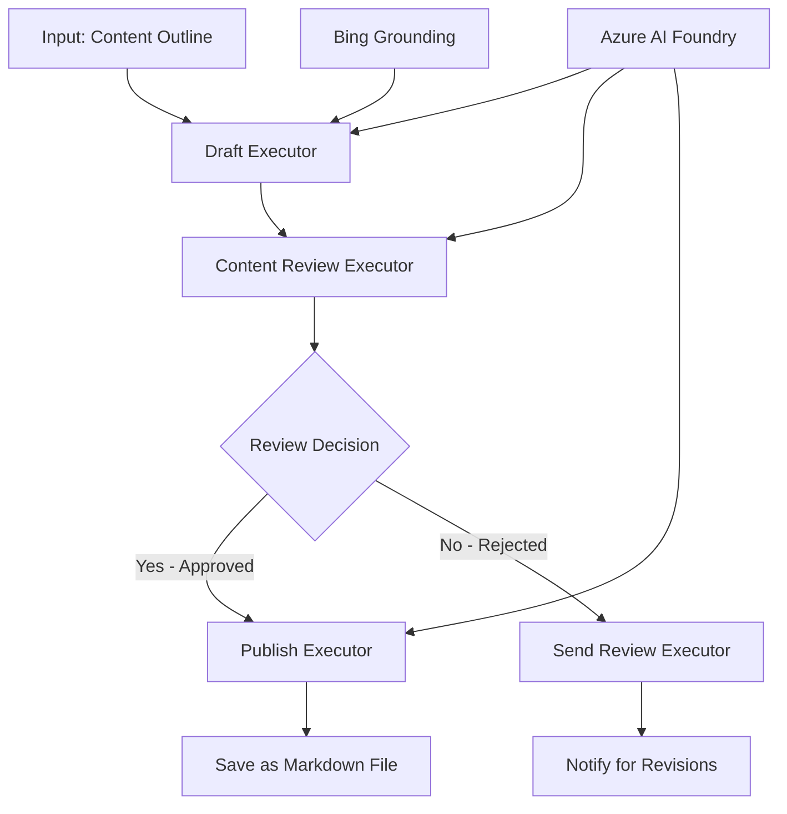

<!--
CO_OP_TRANSLATOR_METADATA:
{
  "original_hash": "8abd335151cee553293b637ee3d80d10",
  "translation_date": "2025-11-11T12:34:34+00:00",
  "source_file": "08-multi-agent/code_samples/workflows-agent-framework/dotNET/04.dotnet-agent-framework-workflow-aifoundry-condition.md",
  "language_code": "uk"
}
-->
# 🔀 Умовні робочі процеси агентів з Azure AI Foundry (.NET)

## 📋 Підручник з інтелектуальних робочих процесів на основі рішень

Цей блокнот демонструє **умовні шаблони робочих процесів** за допомогою Azure AI Foundry та Microsoft Agent Framework для .NET. Ви навчитеся створювати складні, рішення-орієнтовані робочі процеси, які інтелектуально спрямовують обробку на основі аналізу AI, бізнес-правил та динамічних умов для автоматизації корпоративного рівня.

## 🎯 Навчальні цілі

### 🧠 **Архітектура інтелектуальних рішень**
- **Реалізація умовної логіки**: Створення складних дерев рішень з кількома точками розгалуження
- **Маршрутизація на основі AI**: Використання моделей Azure AI Foundry для прийняття інтелектуальних рішень щодо маршрутизації
- **Динамічна адаптація робочого процесу**: Зміна поведінки робочого процесу на основі аналізу під час виконання та умов
- **Інтеграція бізнес-правил**: Включення бізнес-логіки та вимог до відповідності у робочі процеси

### 🔀 **Розширені умовні шаблони**
- **Прийняття рішень на основі багатьох критеріїв**: Оцінка кількох факторів для прийняття рішень щодо маршрутизації
- **Контекстно-орієнтована обробка**: Прийняття рішень на основі накопиченого контексту та історії робочого процесу
- **Адаптивна модифікація робочого процесу**: Динамічне коригування шляхів обробки на основі умов у реальному часі
- **Інтеграція з двигуном правил**: Реалізація складних двигунів бізнес-правил у робочих процесах

### 🏢 **Умовні застосування для підприємств**
- **Класифікація та маршрутизація документів**: Автоматична класифікація та маршрутизація документів до відповідних робочих процесів
- **Тріаж обслуговування клієнтів**: Інтелектуальна маршрутизація запитів клієнтів до спеціалізованих команд
- **Обробка відповідності та ризиків**: Застосування різних процесів перевірки та огляду на основі оцінки ризиків
- **Робочі процеси контролю якості**: Маршрутизація контенту через відповідні процеси огляду на основі метрик якості

## ⚙️ Передумови та налаштування

### 📦 **Необхідні пакети NuGet**

Розширені пакети для обробки умовних робочих процесів:

```xml
<!-- Core AI Framework -->
<PackageReference Include="Microsoft.Extensions.AI" Version="9.9.0" />

<!-- Azure AI Agents with Persistent State -->
<PackageReference Include="Azure.AI.Agents.Persistent" Version="1.2.0-beta.5" />

<!-- Azure Identity and Utilities -->
<PackageReference Include="Azure.Identity" Version="1.15.0" />
<PackageReference Include="System.Linq.Async" Version="6.0.3" />
<PackageReference Include="DotNetEnv" Version="3.1.1" />

<!-- Local Workflow Framework References -->
<!-- Microsoft.Agents.Workflows.dll - Advanced workflow orchestration -->
<!-- Microsoft.Agents.AI.AzureAI.dll - Azure AI Foundry integration -->
<!-- Microsoft.Agents.AI.dll - Core agent abstractions -->
```

### 🔑 **Конфігурація Azure AI Foundry**

**Необхідні ресурси Azure:**
- Робоче середовище Azure AI Foundry з моделями умовної обробки
- Підписка Azure з відповідними квотами обчислень та дозволами
- Розгорнуті моделі AI для прийняття рішень та аналізу контенту
- (Опціонально) Підключення Bing Search API для можливостей обґрунтування

**Конфігурація середовища (.env файл):**
```env
# Azure AI Foundry Configuration
AZURE_AI_PROJECT_ENDPOINT=https://your-project.cognitiveservices.azure.com/
BING_CONNECTION_ID=your-bing-connection-id
```

**Налаштування автентифікації:**
```csharp
// Azure CLI or Managed Identity authentication
using Azure.Identity;
var credential = new AzureCliCredential();

// Load environment configuration
DotNetEnv.Env.Load("../../../.env");
```

### 🏗️ **Архітектура умовного робочого процесу**



**Ключові компоненти:**
- **Draft Executor**: AI-агент, який створює початкові чернетки контенту з контурів
- **Content Review Executor**: AI-агент, який оцінює якість чернетки та відповідність
- **Conditional Routing**: Логіка прийняття рішень, яка маршрутизує на основі результатів огляду
- **Шляхи публікації/огляду**: Окремі шляхи обробки для затвердженого та відхиленого контенту
- **Управління станом**: Підтримує контекст контенту та огляду протягом усього робочого процесу

## 🎨 **Шаблони дизайну умовного робочого процесу**

### 📋 **Виробництво контенту з якісними воротами**
```
Outline → Draft Creation → Quality Review → {Approve: Publish | Reject: Revise}
```

### 🎯 **Обробка документів на основі ризиків**
```
Document → Risk Assessment → {Low: Standard | High: Enhanced Review}
```

### 🔍 **Інтелектуальна маршрутизація обслуговування клієнтів**
```
Customer Query → Analysis → {Simple: FAQ Bot | Complex: Human Agent}
```

### 💼 **Робочі процеси, керовані відповідністю**
```
Content → Compliance Check → {Pass: Publish | Fail: Legal Review}
```

## 🏢 **Переваги умовного підходу для підприємств**

### 🎯 **Інтелектуальна автоматизація**
- **Розумне прийняття рішень**: Рішення щодо маршрутизації на основі аналізу контенту та контексту
- **Адаптивна обробка**: Робочі процеси, які автоматично коригуються на основі змінних умов
- **Застосування бізнес-правил**: Автоматичне застосування складної бізнес-логіки та політик
- **Контекстно-орієнтована маршрутизація**: Рішення на основі повної історії робочого процесу та накопиченого контексту

### 📈 **Операційна досконалість**
- **Оптимізований розподіл ресурсів**: Маршрутизація роботи до найбільш відповідних спеціалістів та процесів
- **Зменшення ручного втручання**: Автоматизоване прийняття рішень мінімізує потребу в людській маршрутизації
- **Швидше вирішення завдань**: Пряма маршрутизація до відповідних експертів та можливостей обробки
- **Послідовне застосування**: Єдине застосування бізнес-правил та критеріїв прийняття рішень

### 🛡️ **Управління ризиками та відповідність**
- **Автоматизована оцінка ризиків**: Оцінка рівнів ризику контенту та ситуацій за допомогою AI
- **Застосування відповідності**: Автоматична маршрутизація через необхідні регуляторні процеси
- **Застосування протоколів безпеки**: Посилені заходи безпеки, застосовані на основі оцінки ризиків
- **Підтримка аудиторського сліду**: Повна документація рішень щодо маршрутизації та їх обґрунтування

### 📊 **Аналітика та постійне вдосконалення**
- **Аналітика рішень**: Відстеження ефективності та точності рішень щодо маршрутизації
- **Розпізнавання шаблонів**: Виявлення тенденцій та шаблонів у рішеннях щодо маршрутизації з часом
- **Оптимізація продуктивності**: Постійне вдосконалення критеріїв прийняття рішень та ефективності маршрутизації
- **Бізнес-аналітика**: Інсайти щодо характеристик контенту та вимог до обробки

### 🔧 **Технічна досконалість**
- **Постійне управління станом**: Підтримка складного стану протягом виконання робочого процесу
- **Масштабована архітектура**: Обробка високих обсягів умовних вимог
- **Можливості інтеграції**: Безшовна інтеграція з існуючими бізнес-системами та процесами
- **Моніторинг та спостережуваність**: Комплексне відстеження продуктивності робочого процесу та рішень

Давайте створювати інтелектуальні, рішення-орієнтовані робочі процеси для підприємств з .NET! 🚀

## 💻 Виконання коду

Повна реалізація доступна у файлі `04.dotnet-agent-framework-workflow-aifoundry-condition.cs`. Це демонструє **робочий процес створення контенту з якісними воротами**:

### 🏗️ **Архітектура робочого процесу**

```
Content Outline → Draft Creation → Quality Review → Conditional Routing:
                                                      ├─ Approved (>200 words) → Publish
                                                      └─ Rejected (<200 words) → Review Notification
```

**Агенти у робочому процесі:**
1. **Evangelist Agent**: Створює чернетки підручників з контурів за допомогою Bing
2. **Content Reviewer Agent**: Оцінює якість чернетки (кількість слів, повнота)
3. **Publisher Agent**: Зберігає затверджений контент як файли Markdown з позначкою часу

**Користувацькі виконавці:**
1. **DraftExecutor**: Організовує створення чернетки
2. **ContentReviewExecutor**: Виконує оцінку якості
3. **PublishExecutor**: Обробляє публікацію затвердженого контенту
4. **SendReviewExecutor**: Управляє повідомленнями про відхилений контент

### 🚀 Виконання прикладу

**Передумови:**
- Налаштоване робоче середовище Azure AI Foundry
- Автентифікація через Azure CLI (`az login`)
- (Опціонально) Підключення Bing Search для обґрунтування

```bash
# Make the script executable (Unix/Linux/macOS)
chmod +x 04.dotnet-agent-framework-workflow-aifoundry-condition.cs

# Run the conditional workflow
./04.dotnet-agent-framework-workflow-aifoundry-condition.cs
```

Або на Windows:
```powershell
dotnet run 04.dotnet-agent-framework-workflow-aifoundry-condition.cs
```

### 📝 Очікуваний результат

Робочий процес:
1. **Створює агентів**: Ініціалізує три спеціалізовані агенти Azure AI Foundry
2. **Генерує чернетку**: Агент Evangelist створює чернетку підручника з контуру
3. **Оглядає контент**: Content Reviewer оцінює якість чернетки
4. **Умовна маршрутизація**:
   - **Якщо затверджено (>200 слів)**: Виконавець Publish зберігає як файл Markdown
   - **Якщо відхилено (<200 слів)**: Виконавець SendReview надсилає повідомлення про огляд
5. **Відображає результати**: Показує кінцевий результат робочого процесу

### 🔧 Варіанти налаштування

**Змінити критерії огляду:**
```csharp
const string ContentReviewerInstructions = @"
You are a content reviewer...
1. Check if content is more than 500 words (instead of 200)
2. Verify technical accuracy
3. Ensure proper formatting
...";
```

**Додати більше умовних шляхів:**
```csharp
var workflow = new WorkflowBuilder(draftExecutor)
    .AddEdge(draftExecutor, contentReviewerExecutor)
    .AddEdge(contentReviewerExecutor, publishExecutor, condition: GetCondition("Excellent"))
    .AddEdge(contentReviewerExecutor, editExecutor, condition: GetCondition("Good"))
    .AddEdge(contentReviewerExecutor, sendReviewerExecutor, condition: GetCondition("Poor"))
    .Build();
```

**Змінити вимоги до контенту:**
```csharp
string OUTLINE_Content = @"
# Your Custom Topic
## Section 1
https://your-reference-url
## Section 2
...
";
```

### 🎯 Реальні застосування

Цей шаблон умовного робочого процесу ідеально підходить для:
- **Систем управління контентом**: Автоматизовані редакційні робочі процеси з якісними воротами
- **Обробки документів**: Маршрутизація документів на основі класифікації та відповідності
- **Підтримки клієнтів**: Інтелектуальна маршрутизація запитів на основі складності та терміновості
- **Юридичного огляду**: Маршрутизація контрактів на основі оцінки ризиків та вартості
- **HR-процесів**: Маршрутизація заявок через відповідні процеси перевірки

### 🔍 Розуміння умовної логіки

**Функція умови:**
```csharp
public Func<object?, bool> GetCondition(string expectedResult) =>
    reviewResult => reviewResult is ReviewResult review && review.Result == expectedResult;
```

Ця функція створює предикат, який:
1. Перевіряє, чи результат є типу `ReviewResult`
2. Порівнює властивість `Result` з очікуваним значенням
3. Повертає true/false для визначення маршрутизації

**Краї робочого процесу з умовами:**
```csharp
.AddEdge(contentReviewerExecutor, publishExecutor, condition: GetCondition("Yes"))
.AddEdge(contentReviewerExecutor, sendReviewerExecutor, condition: GetCondition("No"))
```

### 📊 Розширені функції

**Перевірка схеми JSON:**
Робочий процес використовує схеми JSON для забезпечення структурованих відповідей:

```csharp
// Define response structure
public class ReviewResult
{
    [JsonPropertyName("review_result")]
    public string Result { get; set; } = string.Empty;
    
    [JsonPropertyName("reason")]
    public string Reason { get; set; } = string.Empty;
    
    [JsonPropertyName("draft_content")]
    public string DraftContent { get; set; } = string.Empty;
}

// Apply to agent
ResponseFormat = ChatResponseFormat.ForJsonSchema(
    AIJsonUtilities.CreateJsonSchema(typeof(ReviewResult)), 
    "ReviewResult", 
    "Review Result From DraftContent"
)
```

**Інтеграція Bing Grounding:**
Агент Evangelist використовує Bing для доступу до актуальної інформації:

```csharp
var bingGroundingConfig = new BingGroundingSearchConfiguration(bing_conn_id);
BingGroundingToolDefinition bingGroundingTool = new(
    new BingGroundingSearchToolParameters([bingGroundingConfig])
);
```

Це дозволяє агенту слідувати URL-адресам у контурі та витягувати актуальну інформацію.

### 🛡️ Обробка помилок

Робочий процес включає надійну обробку помилок для відхиленого контенту:
- Невдачі огляду запускають альтернативний шлях
- Повідомлення надають чіткі причини відхилення
- Контент зберігається для перегляду

### 🔄 Розширення робочого процесу

**Додати цикл перегляду:**
Створіть цикл зворотного зв'язку, який автоматично переробляє контент:

```csharp
.AddEdge(contentReviewerExecutor, publishExecutor, condition: GetCondition("Yes"))
.AddEdge(contentReviewerExecutor, draftExecutor, condition: GetCondition("No")) // Loop back
```

**Реалізувати багаторівневий огляд:**
Додайте кілька етапів огляду з різними критеріями:

```csharp
.AddEdge(draftExecutor, technicalReviewer)
.AddEdge(technicalReviewer, editorialReviewer, condition: GetCondition("TechPass"))
.AddEdge(editorialReviewer, publishExecutor, condition: GetCondition("EditPass"))
```

Цей шаблон умовного робочого процесу забезпечує основу для створення складних, інтелектуальних систем автоматизації підприємств! 🚀

---

<!-- CO-OP TRANSLATOR DISCLAIMER START -->
**Відмова від відповідальності**:  
Цей документ був перекладений за допомогою сервісу автоматичного перекладу [Co-op Translator](https://github.com/Azure/co-op-translator). Хоча ми прагнемо до точності, будь ласка, майте на увазі, що автоматичні переклади можуть містити помилки або неточності. Оригінальний документ на його рідній мові слід вважати авторитетним джерелом. Для критичної інформації рекомендується професійний людський переклад. Ми не несемо відповідальності за будь-які непорозуміння або неправильні тлумачення, що виникають внаслідок використання цього перекладу.
<!-- CO-OP TRANSLATOR DISCLAIMER END -->