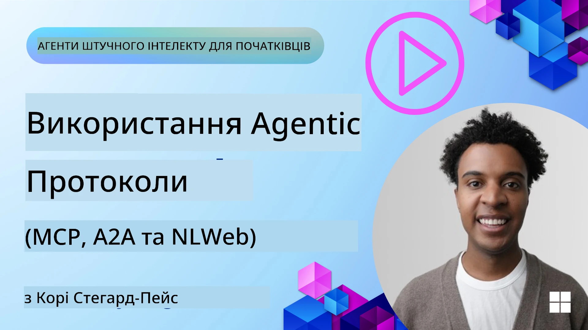
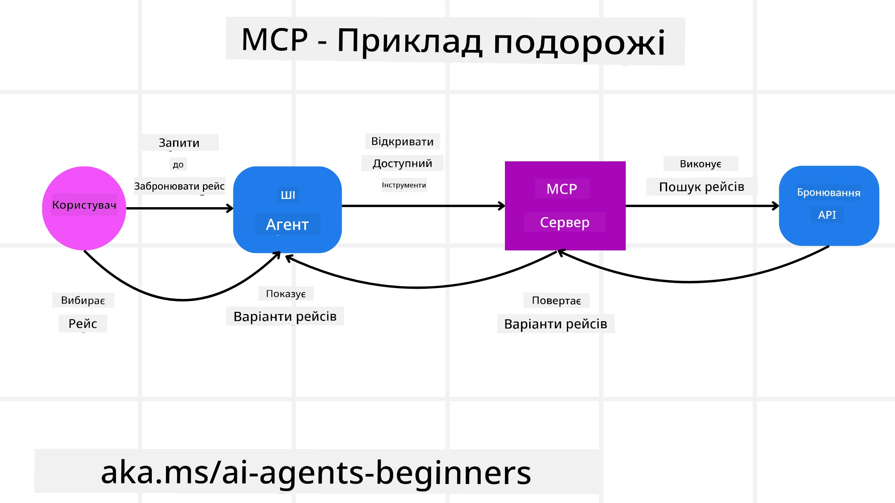
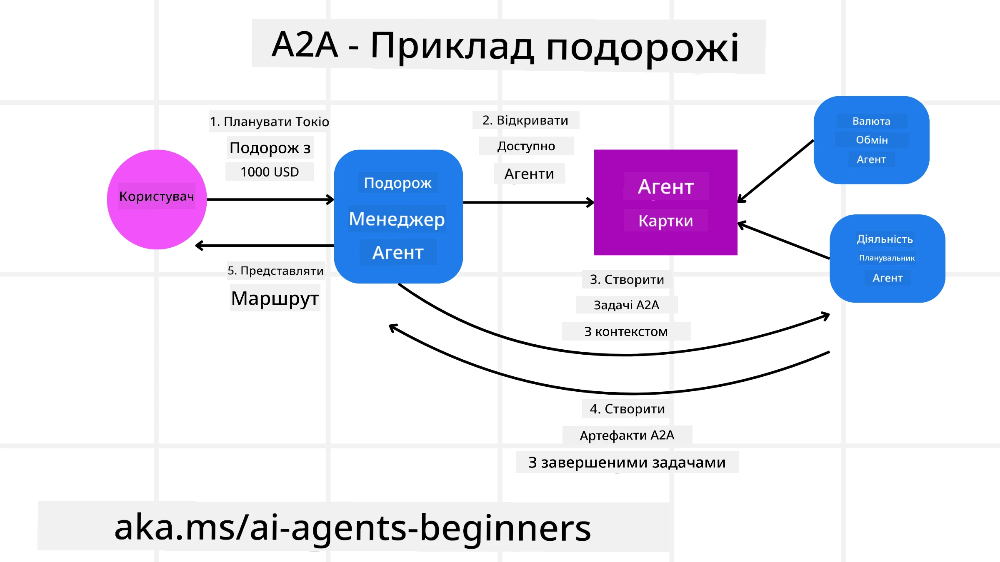
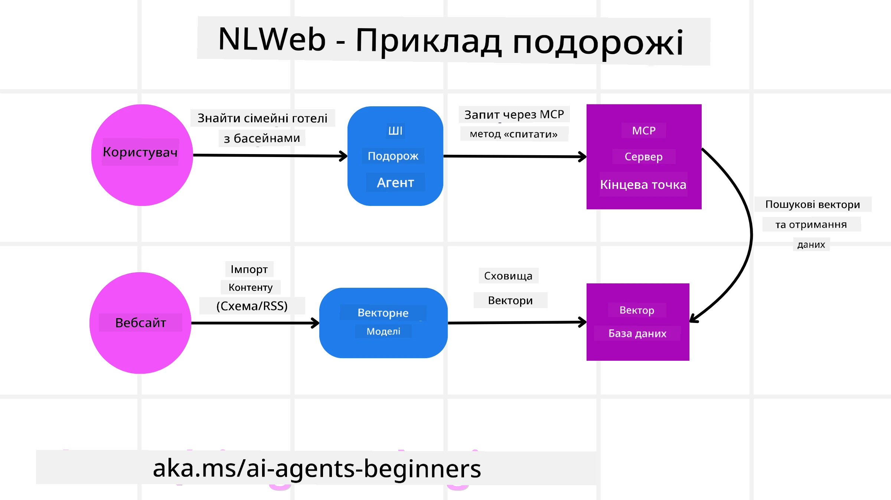

<!--
CO_OP_TRANSLATOR_METADATA:
{
  "original_hash": "aff92c6f019b4627ca9399c6e3882e17",
  "translation_date": "2025-09-18T15:53:48+00:00",
  "source_file": "11-agentic-protocols/README.md",
  "language_code": "uk"
}
-->
# Використання агентних протоколів (MCP, A2A та NLWeb)

> _(Натисніть на зображення вище, щоб переглянути відео цього уроку)_

Зі зростанням використання AI-агентів зростає і потреба в протоколах, які забезпечують стандартизацію, безпеку та підтримують відкриті інновації. У цьому уроці ми розглянемо три протоколи, які прагнуть задовольнити ці потреби: Model Context Protocol (MCP), Agent to Agent (A2A) та Natural Language Web (NLWeb).

## Вступ

У цьому уроці ми розглянемо:

• Як **MCP** дозволяє AI-агентам отримувати доступ до зовнішніх інструментів і даних для виконання завдань користувача.

• Як **A2A** забезпечує комунікацію та співпрацю між різними AI-агентами.

• Як **NLWeb** додає інтерфейси природної мови до будь-якого вебсайту, дозволяючи AI-агентам знаходити та взаємодіяти з контентом.

## Цілі навчання

• **Визначити** основну мету та переваги MCP, A2A та NLWeb у контексті AI-агентів.

• **Пояснити**, як кожен протокол сприяє комунікації та взаємодії між LLM, інструментами та іншими агентами.

• **Розпізнати** унікальні ролі кожного протоколу у створенні складних агентних систем.

## Протокол контексту моделі (Model Context Protocol)

**Model Context Protocol (MCP)** — це відкритий стандарт, який забезпечує стандартизований спосіб для додатків надавати контекст і інструменти для LLM. Це дозволяє створити "універсальний адаптер" для різних джерел даних та інструментів, до яких AI-агенти можуть підключатися узгодженим способом.

Розглянемо компоненти MCP, переваги порівняно з прямим використанням API та приклад того, як AI-агенти можуть використовувати сервер MCP.

### Основні компоненти MCP

MCP працює на основі **архітектури клієнт-сервер**, і основними компонентами є:

• **Хости** — це додатки LLM (наприклад, редактор коду, як VSCode), які ініціюють з'єднання з сервером MCP.

• **Клієнти** — це компоненти в додатку-хості, які підтримують одноразові з'єднання із серверами.

• **Сервери** — це легкі програми, які надають певні можливості.

Протокол включає три основні примітиви, які є можливостями сервера MCP:

• **Інструменти**: Це окремі дії або функції, які AI-агент може викликати для виконання завдання. Наприклад, сервіс погоди може надавати інструмент "отримати погоду", або сервер електронної комерції може надавати інструмент "купити продукт". Сервери MCP рекламують назву кожного інструменту, опис та схему вводу/виводу у своєму списку можливостей.

• **Ресурси**: Це дані або документи, які сервер MCP може надати, а клієнти можуть отримати їх за запитом. Приклади включають вміст файлів, записи баз даних або журнали. Ресурси можуть бути текстовими (наприклад, код або JSON) або бінарними (наприклад, зображення або PDF).

• **Підказки**: Це заздалегідь визначені шаблони, які пропонують рекомендовані підказки, дозволяючи створювати складніші робочі процеси.

### Переваги MCP

MCP пропонує значні переваги для AI-агентів:

• **Динамічне виявлення інструментів**: Агенти можуть динамічно отримувати список доступних інструментів від сервера разом із описами їх функцій. Це відрізняється від традиційних API, які часто вимагають статичного кодування для інтеграцій, що означає необхідність оновлення коду при зміні API. MCP пропонує підхід "інтегрувати один раз", що забезпечує більшу адаптивність.

• **Сумісність між LLM**: MCP працює з різними LLM, забезпечуючи гнучкість у виборі основних моделей для оцінки кращої продуктивності.

• **Стандартизована безпека**: MCP включає стандартний метод автентифікації, що спрощує масштабування при додаванні доступу до додаткових серверів MCP. Це простіше, ніж управління різними ключами та типами автентифікації для різних традиційних API.

### Приклад MCP

Уявімо, що користувач хоче забронювати рейс за допомогою AI-асистента, який працює на основі MCP.

1. **З'єднання**: AI-асистент (клієнт MCP) підключається до сервера MCP, наданого авіакомпанією.

2. **Виявлення інструментів**: Клієнт запитує сервер MCP авіакомпанії: "Які інструменти у вас доступні?" Сервер відповідає інструментами, такими як "пошук рейсів" і "бронювання рейсів".

3. **Виклик інструменту**: Ви просите AI-асистента: "Будь ласка, знайди рейс з Портленда до Гонолулу". AI-асистент, використовуючи свій LLM, визначає, що йому потрібно викликати інструмент "пошук рейсів" і передає відповідні параметри (місце відправлення, місце призначення) серверу MCP.

4. **Виконання та відповідь**: Сервер MCP, виступаючи як обгортка, здійснює фактичний виклик внутрішнього API бронювання авіакомпанії. Потім він отримує інформацію про рейс (наприклад, дані JSON) і надсилає її назад AI-асистенту.

5. **Подальша взаємодія**: AI-асистент представляє варіанти рейсів. Після того, як ви вибираєте рейс, асистент може викликати інструмент "бронювання рейсу" на тому ж сервері MCP, завершуючи бронювання.

## Протокол агент-до-агента (Agent-to-Agent Protocol, A2A)

У той час як MCP зосереджений на підключенні LLM до інструментів, **Agent-to-Agent (A2A) Protocol** йде далі, дозволяючи комунікацію та співпрацю між різними AI-агентами. A2A з'єднує AI-агенти з різних організацій, середовищ та технологічних стеків для виконання спільного завдання.

Ми розглянемо компоненти та переваги A2A, а також приклад його застосування в нашому додатку для подорожей.

### Основні компоненти A2A

A2A зосереджений на забезпеченні комунікації між агентами та їх співпраці для виконання підзавдання користувача. Кожен компонент протоколу сприяє цьому:

#### Картка агента

Подібно до того, як сервер MCP ділиться списком інструментів, картка агента містить:
- Назву агента.
- **Опис загальних завдань**, які він виконує.
- **Список конкретних навичок** з описами, щоб допомогти іншим агентам (або навіть людським користувачам) зрозуміти, коли і чому вони можуть викликати цього агента.
- **Поточний URL-адресу кінцевої точки** агента.
- **Версію** та **можливості** агента, такі як потокові відповіді та push-сповіщення.

#### Виконавець агента

Виконавець агента відповідає за **передачу контексту чату користувача віддаленому агенту**, щоб той міг зрозуміти завдання, яке потрібно виконати. У сервері A2A агент використовує свою власну модель LLM для аналізу вхідних запитів і виконання завдань за допомогою своїх внутрішніх інструментів.

#### Артефакт

Після того, як віддалений агент виконав запитане завдання, його робочий продукт створюється як артефакт. Артефакт **містить результат роботи агента**, **опис того, що було виконано**, і **текстовий контекст**, який передається через протокол. Після відправки артефакту з'єднання з віддаленим агентом закривається до наступного запиту.

#### Черга подій

Цей компонент використовується для **обробки оновлень і передачі повідомлень**. Він особливо важливий у виробничих системах для запобігання закриттю з'єднання між агентами до завершення завдання, особливо коли час виконання завдання може бути тривалим.

### Переваги A2A

• **Покращена співпраця**: Дозволяє агентам від різних постачальників і платформ взаємодіяти, ділитися контекстом і працювати разом, забезпечуючи безперервну автоматизацію між традиційно роз'єднаними системами.

• **Гнучкість вибору моделі**: Кожен агент A2A може вирішувати, яку модель LLM використовувати для обслуговування своїх запитів, дозволяючи оптимізовані або налаштовані моделі для кожного агента, на відміну від єдиного з'єднання LLM у деяких сценаріях MCP.

• **Вбудована автентифікація**: Автентифікація інтегрована безпосередньо в протокол A2A, забезпечуючи надійну систему безпеки для взаємодії агентів.

### Приклад A2A

Розширимо наш сценарій бронювання подорожі, але цього разу використовуючи A2A.

1. **Запит користувача до мультиагента**: Користувач взаємодіє з "агентом подорожей" (клієнтом/агентом A2A), наприклад, кажучи: "Будь ласка, забронюй повну поїздку до Гонолулу на наступний тиждень, включаючи рейси, готель і оренду автомобіля".

2. **Оркестрація агентом подорожей**: Агент подорожей отримує цей складний запит. Він використовує свою модель LLM, щоб обдумати завдання і визначити, що йому потрібно взаємодіяти з іншими спеціалізованими агентами.

3. **Міжагентна комунікація**: Агент подорожей використовує протокол A2A для підключення до агентів нижчого рівня, таких як "агент авіакомпанії", "агент готелю" і "агент оренди автомобіля", створених різними компаніями.

4. **Делеговане виконання завдань**: Агент подорожей надсилає конкретні завдання цим спеціалізованим агентам (наприклад, "Знайди рейси до Гонолулу", "Забронюй готель", "Орендуй автомобіль"). Кожен із цих спеціалізованих агентів, використовуючи свої власні моделі LLM і інструменти (які можуть бути серверами MCP), виконує свою конкретну частину бронювання.

5. **Консолідована відповідь**: Після того, як усі агенти нижчого рівня завершують свої завдання, агент подорожей компілює результати (деталі рейсу, підтвердження готелю, бронювання автомобіля) і надсилає комплексну відповідь у стилі чату назад користувачу.

## Природномовний веб (Natural Language Web, NLWeb)

Вебсайти давно стали основним способом доступу користувачів до інформації та даних в інтернеті.

Розглянемо різні компоненти NLWeb, переваги NLWeb і приклад роботи NLWeb на основі нашого додатку для подорожей.

### Компоненти NLWeb

- **Додаток NLWeb (основний код сервісу)**: Система, яка обробляє запитання природною мовою. Вона з'єднує різні частини платформи для створення відповідей. Її можна уявити як **двигун, що забезпечує функції природної мови** вебсайту.

- **Протокол NLWeb**: Це **базовий набір правил для взаємодії природною мовою** з вебсайтом. Він повертає відповіді у форматі JSON (часто використовуючи Schema.org). Його мета — створити простий фундамент для "AI Web", так само як HTML зробив можливим обмін документами онлайн.

- **Сервер MCP (кінцева точка Model Context Protocol)**: Кожна установка NLWeb також працює як **сервер MCP**. Це означає, що вона може **ділитися інструментами (наприклад, методом "запитати") і даними** з іншими AI-системами. На практиці це робить контент і можливості вебсайту доступними для AI-агентів, дозволяючи вебсайту стати частиною ширшої "екосистеми агентів".

- **Моделі вбудовування**: Ці моделі використовуються для **перетворення контенту вебсайту в числові представлення, які називаються векторами** (вбудовування). Ці вектори захоплюють значення таким чином, щоб комп'ютери могли порівнювати і шукати. Вони зберігаються в спеціальній базі даних, і користувачі можуть вибирати, яку модель вбудовування вони хочуть використовувати.

- **Векторна база даних (механізм пошуку)**: Ця база даних **зберігає вбудовування контенту вебсайту**. Коли хтось задає запитання, NLWeb перевіряє векторну базу даних, щоб швидко знайти найбільш релевантну інформацію. Вона надає швидкий список можливих відповідей, ранжованих за схожістю. NLWeb працює з різними системами зберігання векторів, такими як Qdrant, Snowflake, Milvus, Azure AI Search і Elasticsearch.

### Приклад NLWeb

Розглянемо наш вебсайт для бронювання подорожей, але цього разу він працює на основі NLWeb.

1. **Інтеграція даних**: Існуючі каталоги продуктів вебсайту (наприклад, списки рейсів, описи готелів, туристичні пакети) форматуються за допомогою Schema.org або завантажуються через RSS-канали. Інструменти NLWeb інтегрують ці структуровані дані, створюють вбудовування і зберігають їх у локальній або віддаленій векторній базі даних.

2. **Запит природною мовою (людина)**: Користувач заходить на вебсайт і, замість навігації по меню, вводить у чат-інтерфейс: "Знайди мені сімейний готель у Гонолулу з басейном на наступний тиждень".

3. **Обробка NLWeb**: Додаток NLWeb отримує цей запит. Він надсилає запит до LLM для розуміння і одночасно шукає у своїй векторній базі даних релевантні списки готелів.

4. **Точні результати**: LLM допомагає інтерпретувати результати пошуку з бази даних, визначити найкращі відповідності за критеріями "сімейний", "басейн" і "Гонолулу", а потім форматує відповідь природною мовою. Важливо, що відповідь посилається на реальні готелі з каталогу вебсайту, уникаючи вигаданих даних.

5. **Взаємодія AI-агента**: Оскільки NLWeb працює як сервер MCP, зовнішній AI-агент для подорожей також може підключитися до цього вебсайту через NLWeb. AI-агент може використовувати метод `ask` MCP для прямого запиту до вебсайту: `ask("Чи є веганські ресторани в районі Гонолулу, рекомендовані готелем?")`.

---

**Відмова від відповідальності**:  
Цей документ був перекладений за допомогою сервісу автоматичного перекладу [Co-op Translator](https://github.com/Azure/co-op-translator). Хоча ми прагнемо до точності, будь ласка, майте на увазі, що автоматичні переклади можуть містити помилки або неточності. Оригінальний документ на його рідній мові слід вважати авторитетним джерелом. Для критичної інформації рекомендується професійний людський переклад. Ми не несемо відповідальності за будь-які непорозуміння або неправильні тлумачення, що виникають внаслідок використання цього перекладу.