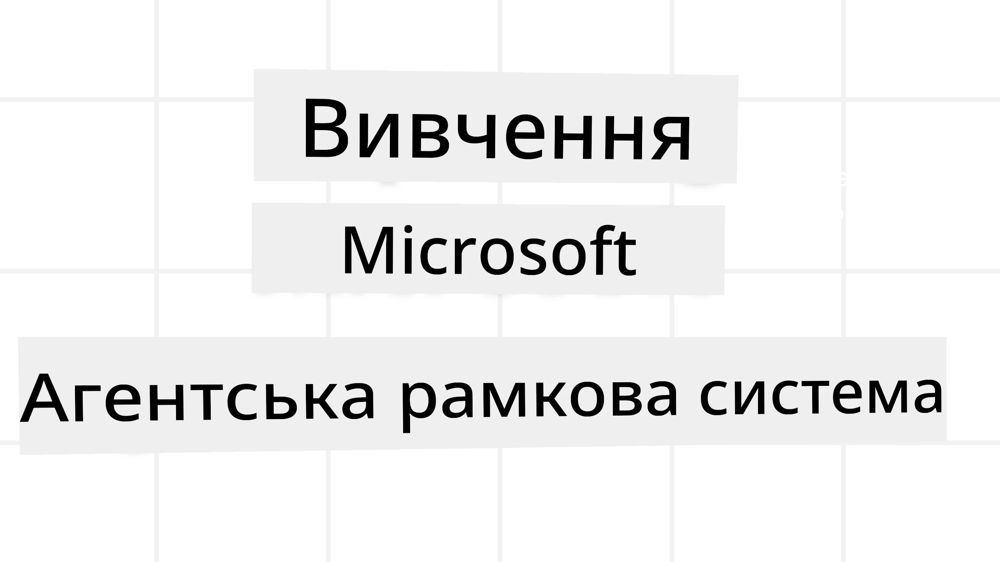
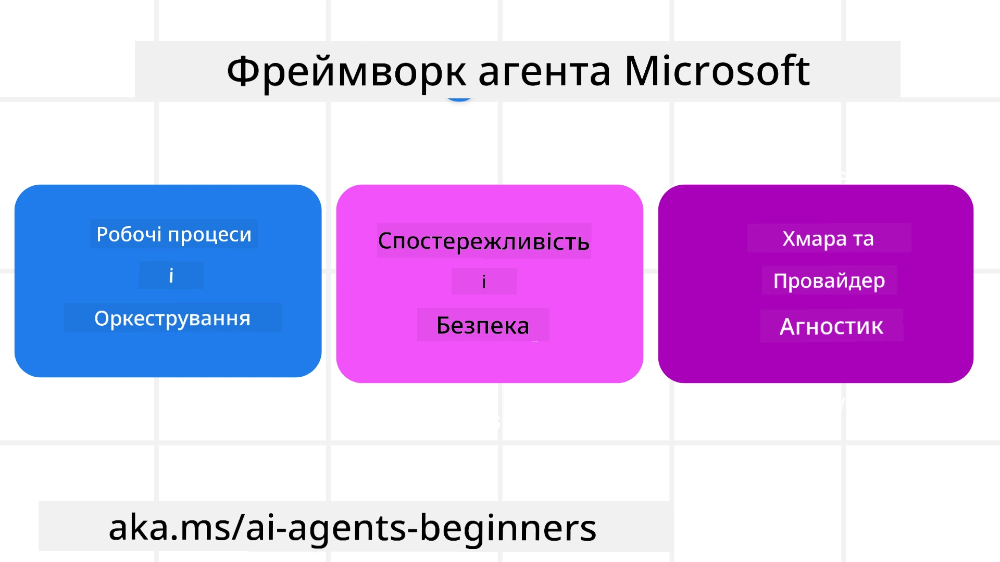
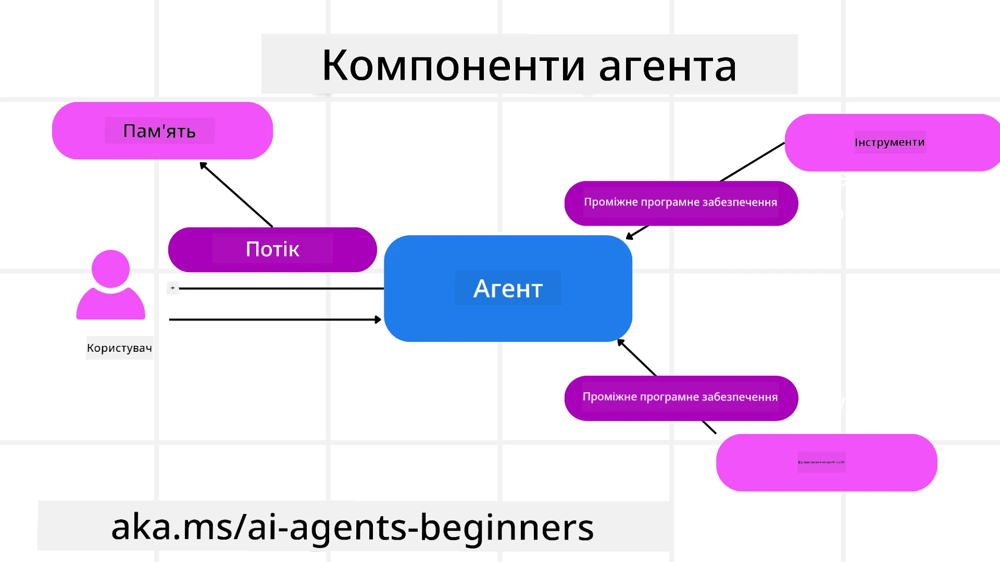

<!--
CO_OP_TRANSLATOR_METADATA:
{
  "original_hash": "19c4dab375acbc733855cc7f2f04edbc",
  "translation_date": "2025-10-02T06:05:48+00:00",
  "source_file": "14-microsoft-agent-framework/README.md",
  "language_code": "uk"
}
-->
# Дослідження Microsoft Agent Framework



### Вступ

У цьому уроці ми розглянемо:

- Розуміння Microsoft Agent Framework: ключові особливості та цінність  
- Дослідження основних концепцій Microsoft Agent Framework
- Порівняння MAF із Semantic Kernel та AutoGen: посібник з міграції

## Цілі навчання

Після завершення цього уроку ви зможете:

- Створювати готових до використання AI-агентів за допомогою Microsoft Agent Framework
- Застосовувати основні функції Microsoft Agent Framework до ваших агентних сценаріїв використання
- Мігрувати та інтегрувати існуючі агентні фреймворки та інструменти  

## Зразки коду 

Зразки коду для [Microsoft Agent Framework (MAF)](https://aka.ms/ai-agents-beginners/agent-framewrok) можна знайти в цьому репозиторії у файлах `xx-python-agent-framework` та `xx-dotnet-agent-framework`.

## Розуміння Microsoft Agent Framework



[Microsoft Agent Framework (MAF)](https://aka.ms/ai-agents-beginners/agent-framewrok) базується на досвіді та висновках із Semantic Kernel та AutoGen. Він пропонує гнучкість для вирішення широкого спектру агентних сценаріїв використання як у виробничих, так і в дослідницьких середовищах, включаючи:

- **Послідовну оркестрацію агентів** у сценаріях, де потрібні покрокові робочі процеси.
- **Паралельну оркестрацію** у сценаріях, де агенти повинні виконувати завдання одночасно.
- **Оркестрацію групового чату** у сценаріях, де агенти можуть співпрацювати над одним завданням.
- **Оркестрацію передачі** у сценаріях, де агенти передають завдання один одному після завершення підзавдань.
- **Магнітну оркестрацію** у сценаріях, де агент-менеджер створює та змінює список завдань і координує підагентів для виконання завдання.

Для впровадження AI-агентів у виробництво MAF також включає функції для:

- **Спостережуваності** через використання OpenTelemetry, де кожна дія AI-агента, включаючи виклик інструментів, кроки оркестрації, логіку роздумів і моніторинг продуктивності через інформаційні панелі Azure AI Foundry, відстежується.
- **Безпеки** завдяки розміщенню агентів нативно на Azure AI Foundry, що включає засоби контролю безпеки, такі як доступ на основі ролей, обробка приватних даних і вбудована безпека контенту.
- **Стійкості**, оскільки потоки агентів і робочі процеси можуть призупинятися, відновлюватися та виправляти помилки, що дозволяє виконувати довготривалі процеси.
- **Контролю**, оскільки підтримуються робочі процеси з участю людини, де завдання позначаються як такі, що потребують схвалення людиною.

Microsoft Agent Framework також орієнтований на сумісність завдяки:

- **Незалежності від хмар** - агенти можуть працювати в контейнерах, локально та в різних хмарних середовищах.
- **Незалежності від провайдерів** - агенти можуть створюватися через ваш улюблений SDK, включаючи Azure OpenAI та OpenAI.
- **Інтеграції відкритих стандартів** - агенти можуть використовувати протоколи, такі як Agent-to-Agent (A2A) та Model Context Protocol (MCP), для виявлення та використання інших агентів і інструментів.
- **Плагіни та конектори** - можна встановлювати з'єднання з сервісами даних і пам'яті, такими як Microsoft Fabric, SharePoint, Pinecone та Qdrant.

Давайте розглянемо, як ці функції застосовуються до основних концепцій Microsoft Agent Framework.

## Основні концепції Microsoft Agent Framework

### Агенти



**Створення агентів**

Створення агентів здійснюється шляхом визначення сервісу інференції (постачальника LLM), набору інструкцій для AI-агента та призначення `name`:

```python
agent = AzureOpenAIChatClient(credential=AzureCliCredential()).create_agent( instructions="You are good at recommending trips to customers based on their preferences.", name="TripRecommender" )
```

У наведеному прикладі використовується `Azure OpenAI`, але агенти можуть створюватися за допомогою різних сервісів, включаючи `Azure AI Foundry Agent Service`:

```python
AzureAIAgentClient(async_credential=credential).create_agent( name="HelperAgent", instructions="You are a helpful assistant." ) as agent
```

OpenAI `Responses`, `ChatCompletion` APIs

```python
agent = OpenAIResponsesClient().create_agent( name="WeatherBot", instructions="You are a helpful weather assistant.", )
```

```python
agent = OpenAIChatClient().create_agent( name="HelpfulAssistant", instructions="You are a helpful assistant.", )
```

або віддалені агенти за допомогою протоколу A2A:

```python
agent = A2AAgent( name=agent_card.name, description=agent_card.description, agent_card=agent_card, url="https://your-a2a-agent-host" )
```

**Запуск агентів**

Агенти запускаються за допомогою методів `.run` або `.run_stream` для отримання відповідей без потоків або з потоками.

```python
result = await agent.run("What are good places to visit in Amsterdam?")
print(result.text)
```

```python
async for update in agent.run_stream("What are the good places to visit in Amsterdam?"):
    if update.text:
        print(update.text, end="", flush=True)

```

Кожен запуск агента також може мати опції для налаштування параметрів, таких як `max_tokens`, які використовує агент, `tools`, які агент може викликати, і навіть `model`, який використовується агентом.

Це корисно в ситуаціях, коли для виконання завдання користувача потрібні конкретні моделі або інструменти.

**Інструменти**

Інструменти можна визначати як під час створення агента:

```python
def get_attractions( location: Annotated[str, Field(description="The location to get the top tourist attractions for")], ) -> str: """Get the top tourist attractions for a given location.""" return f"The top attractions for {location} are." 


# When creating a ChatAgent directly 

agent = ChatAgent( chat_client=OpenAIChatClient(), instructions="You are a helpful assistant", tools=[get_attractions]

```

так і під час запуску агента:

```python

result1 = await agent.run( "What's the best place to visit in Seattle?", tools=[get_attractions] # Tool provided for this run only )
```

**Потоки агентів**

Потоки агентів використовуються для обробки багатокрокових розмов. Потоки можна створювати за допомогою:

- Використання `get_new_thread()`, що дозволяє зберігати потік протягом часу.
- Автоматичного створення потоку під час запуску агента, коли потік існує лише протягом поточного запуску.

Для створення потоку код виглядає так:

```python
# Create a new thread. 
thread = agent.get_new_thread() # Run the agent with the thread. 
response = await agent.run("Hello, I am here to help you book travel. Where would you like to go?", thread=thread)

```

Потім ви можете серіалізувати потік для збереження його для подальшого використання:

```python
# Create a new thread. 
thread = agent.get_new_thread() 

# Run the agent with the thread. 

response = await agent.run("Hello, how are you?", thread=thread) 

# Serialize the thread for storage. 

serialized_thread = await thread.serialize() 

# Deserialize the thread state after loading from storage. 

resumed_thread = await agent.deserialize_thread(serialized_thread)
```

**Проміжне програмне забезпечення агента**

Агенти взаємодіють з інструментами та LLM для виконання завдань користувача. У певних сценаріях ми хочемо виконати або відстежити дії між цими взаємодіями. Проміжне програмне забезпечення агента дозволяє нам це зробити через:

*Function Middleware*

Це проміжне програмне забезпечення дозволяє виконувати дію між агентом і функцією/інструментом, який він викликає. Наприклад, це може бути корисно для ведення журналу викликів функцій.

У наведеному нижче коді `next` визначає, чи слід викликати наступне проміжне програмне забезпечення або фактичну функцію.

```python
async def logging_function_middleware(
    context: FunctionInvocationContext,
    next: Callable[[FunctionInvocationContext], Awaitable[None]],
) -> None:
    """Function middleware that logs function execution."""
    # Pre-processing: Log before function execution
    print(f"[Function] Calling {context.function.name}")

    # Continue to next middleware or function execution
    await next(context)

    # Post-processing: Log after function execution
    print(f"[Function] {context.function.name} completed")
```

*Chat Middleware*

Це проміжне програмне забезпечення дозволяє виконувати або реєструвати дії між агентом і запитами до LLM.

Воно містить важливу інформацію, таку як `messages`, які надсилаються до AI-сервісу.

```python
async def logging_chat_middleware(
    context: ChatContext,
    next: Callable[[ChatContext], Awaitable[None]],
) -> None:
    """Chat middleware that logs AI interactions."""
    # Pre-processing: Log before AI call
    print(f"[Chat] Sending {len(context.messages)} messages to AI")

    # Continue to next middleware or AI service
    await next(context)

    # Post-processing: Log after AI response
    print("[Chat] AI response received")

```

**Пам'ять агента**

Як розглянуто в уроці `Agentic Memory`, пам'ять є важливим елементом, що дозволяє агенту працювати в різних контекстах. MAF пропонує кілька типів пам'яті:

*Зберігання в пам'яті*

Це пам'ять, яка зберігається в потоках під час виконання програми.

```python
# Create a new thread. 
thread = agent.get_new_thread() # Run the agent with the thread. 
response = await agent.run("Hello, I am here to help you book travel. Where would you like to go?", thread=thread)
```

*Стійкі повідомлення*

Ця пам'ять використовується для зберігання історії розмов між різними сесіями. Вона визначається за допомогою `chat_message_store_factory`:

```python
from agent_framework import ChatMessageStore

# Create a custom message store
def create_message_store():
    return ChatMessageStore()

agent = ChatAgent(
    chat_client=OpenAIChatClient(),
    instructions="You are a Travel assistant.",
    chat_message_store_factory=create_message_store
)

```

*Динамічна пам'ять*

Ця пам'ять додається до контексту перед запуском агентів. Ці пам'яті можуть зберігатися у зовнішніх сервісах, таких як mem0:

```python
from agent_framework.mem0 import Mem0Provider

# Using Mem0 for advanced memory capabilities
memory_provider = Mem0Provider(
    api_key="your-mem0-api-key",
    user_id="user_123",
    application_id="my_app"
)

agent = ChatAgent(
    chat_client=OpenAIChatClient(),
    instructions="You are a helpful assistant with memory.",
    context_providers=memory_provider
)

```

**Спостережуваність агента**

Спостережуваність важлива для створення надійних і підтримуваних агентних систем. MAF інтегрується з OpenTelemetry для забезпечення трасування та метрик для кращої спостережуваності.

```python
from agent_framework.observability import get_tracer, get_meter

tracer = get_tracer()
meter = get_meter()
with tracer.start_as_current_span("my_custom_span"):
    # do something
    pass
counter = meter.create_counter("my_custom_counter")
counter.add(1, {"key": "value"})
```

### Робочі процеси

MAF пропонує робочі процеси, які є попередньо визначеними кроками для виконання завдання і включають AI-агентів як компоненти цих кроків.

Робочі процеси складаються з різних компонентів, які дозволяють краще контролювати потік даних. Робочі процеси також дозволяють **оркестрацію кількох агентів** і **збереження станів** для робочих процесів.

Основні компоненти робочого процесу:

**Виконавці**

Виконавці отримують вхідні повідомлення, виконують призначені їм завдання і потім створюють вихідне повідомлення. Це просуває робочий процес до завершення більшого завдання. Виконавцями можуть бути як AI-агенти, так і користувацька логіка.

**Краї**

Краї використовуються для визначення потоку повідомлень у робочому процесі. Вони можуть бути:

*Прямі краї* - Просте з'єднання один до одного між виконавцями:

```python
from agent_framework import WorkflowBuilder

builder = WorkflowBuilder()
builder.add_edge(source_executor, target_executor)
builder.set_start_executor(source_executor)
workflow = builder.build()
```

*Умовні краї* - Активуються після виконання певної умови. Наприклад, коли номери в готелях недоступні, виконавець може запропонувати інші варіанти.

*Краї "перемикач-випадок"* - Направляють повідомлення до різних виконавців на основі визначених умов. Наприклад, якщо клієнт подорожей має пріоритетний доступ, його завдання оброблятимуться через інший робочий процес.

*Краї "розгалуження"* - Надсилають одне повідомлення до кількох цільових точок.

*Краї "злиття"* - Збирають кілька повідомлень від різних виконавців і надсилають до однієї цільової точки.

**Події**

Для забезпечення кращої спостережуваності за робочими процесами MAF пропонує вбудовані події для виконання, включаючи:

- `WorkflowStartedEvent`  - Початок виконання робочого процесу
- `WorkflowOutputEvent` - Робочий процес створює вихідні дані
- `WorkflowErrorEvent` - Робочий процес стикається з помилкою
- `ExecutorInvokeEvent`  - Виконавець починає обробку
- `ExecutorCompleteEvent`  - Виконавець завершує обробку
- `RequestInfoEvent` - Видається запит

## Міграція з інших фреймворків (Semantic Kernel та AutoGen)

### Відмінності між MAF та Semantic Kernel

**Спрощене створення агентів**

Semantic Kernel вимагає створення екземпляра Kernel для кожного агента. MAF використовує спрощений підхід через розширення для основних провайдерів.

```python
agent = AzureOpenAIChatClient(credential=AzureCliCredential()).create_agent( instructions="You are good at reccomending trips to customers based on their preferences.", name="TripRecommender" )
```

**Створення потоків агентів**

Semantic Kernel вимагає ручного створення потоків. У MAF агенту безпосередньо призначається потік.

```python
thread = agent.get_new_thread() # Run the agent with the thread. 
```

**Реєстрація інструментів**

У Semantic Kernel інструменти реєструються в Kernel, а Kernel потім передається агенту. У MAF інструменти реєструються безпосередньо під час створення агента.

```python
agent = ChatAgent( chat_client=OpenAIChatClient(), instructions="You are a helpful assistant", tools=[get_attractions]
```

### Відмінності між MAF та AutoGen

**Команди проти робочих процесів**

`Teams` є структурою подій для діяльності, керованої подіями, з агентами в AutoGen. MAF використовує `Workflows`, які направляють дані до виконавців через архітектуру графів.

**Створення інструментів**

AutoGen використовує `FunctionTool` для обгортання функцій, які можуть викликати агенти. MAF використовує @ai_function, який працює аналогічно, але також автоматично визначає схеми для кожної функції.

**Поведінка агентів**

Агенти за замовчуванням є одноразовими в AutoGen, якщо `max_tool_iterations` не встановлено на більше значення. У MAF `ChatAgent` за замовчуванням є багатокроковим, тобто він буде продовжувати викликати інструменти, поки завдання користувача не буде виконано.

## Зразки коду 

Зразки коду для Microsoft Agent Framework можна знайти в цьому репозиторії у файлах `xx-python-agent-framework` та `xx-dotnet-agent-framework`.

## Є додаткові запитання про Microsoft Agent Framework?

Приєднуйтесь до [Azure AI Foundry Discord](https://aka.ms/ai-agents/discord), щоб зустрітися з іншими учнями, відвідати години консультацій та отримати відповіді на ваші запитання про AI-агентів.

---

**Відмова від відповідальності**:  
Цей документ був перекладений за допомогою сервісу автоматичного перекладу [Co-op Translator](https://github.com/Azure/co-op-translator). Хоча ми прагнемо до точності, будь ласка, майте на увазі, що автоматичні переклади можуть містити помилки або неточності. Оригінальний документ на його рідній мові слід вважати авторитетним джерелом. Для критичної інформації рекомендується професійний людський переклад. Ми не несемо відповідальності за будь-які непорозуміння або неправильні тлумачення, що виникають внаслідок використання цього перекладу.