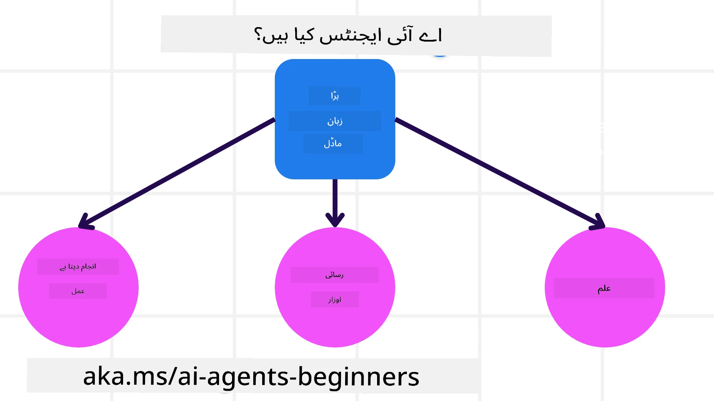

<!--
CO_OP_TRANSLATOR_METADATA:
{
  "original_hash": "cdd28bc00816d2773bb2b5968d782abc",
  "translation_date": "2025-11-11T10:54:02+00:00",
  "source_file": "01-intro-to-ai-agents/README.md",
  "language_code": "ur"
}
-->

> _(اوپر دی گئی تصویر پر کلک کریں تاکہ اس سبق کی ویڈیو دیکھ سکیں)_

# AI ایجنٹس اور ان کے استعمال کے کیسز کا تعارف

"AI ایجنٹس برائے ابتدائی افراد" کورس میں خوش آمدید! یہ کورس AI ایجنٹس بنانے کے لیے بنیادی معلومات اور عملی نمونے فراہم کرتا ہے۔

<a href="https://discord.gg/kzRShWzttr" target="_blank">Azure AI Discord کمیونٹی</a> میں شامل ہوں تاکہ دیگر سیکھنے والوں اور AI ایجنٹ بنانے والوں سے ملاقات کریں اور اس کورس کے بارے میں اپنے سوالات پوچھ سکیں۔

اس کورس کو شروع کرنے کے لیے، ہم پہلے یہ سمجھنے کی کوشش کریں گے کہ AI ایجنٹس کیا ہیں اور ہم انہیں اپنی ایپلیکیشنز اور ورک فلو میں کیسے استعمال کر سکتے ہیں۔

## تعارف

اس سبق میں شامل ہے:

- AI ایجنٹس کیا ہیں اور ان کی مختلف اقسام کیا ہیں؟
- کون سے استعمال کے کیسز AI ایجنٹس کے لیے بہترین ہیں اور وہ ہماری کیسے مدد کر سکتے ہیں؟
- ایجنٹک حل ڈیزائن کرتے وقت بنیادی اجزاء کیا ہیں؟

## سیکھنے کے اہداف
اس سبق کو مکمل کرنے کے بعد، آپ کو یہ سمجھنے کے قابل ہونا چاہیے:

- AI ایجنٹ کے تصورات کو سمجھنا اور دیگر AI حلوں سے ان کا فرق جاننا۔
- AI ایجنٹس کو مؤثر طریقے سے استعمال کرنا۔
- صارفین اور گاہکوں کے لیے ایجنٹک حل کو مؤثر طریقے سے ڈیزائن کرنا۔

## AI ایجنٹس کی تعریف اور ان کی اقسام

### AI ایجنٹس کیا ہیں؟

AI ایجنٹس وہ **سسٹمز** ہیں جو **بڑے زبان کے ماڈلز (LLMs)** کو **عمل انجام دینے** کے قابل بناتے ہیں، ان کی صلاحیتوں کو بڑھا کر انہیں **ٹولز** اور **علم** تک رسائی فراہم کرتے ہیں۔

آئیے اس تعریف کو چھوٹے حصوں میں تقسیم کرتے ہیں:

- **سسٹم** - ایجنٹس کو صرف ایک جزو کے طور پر نہیں بلکہ کئی اجزاء کے سسٹم کے طور پر سوچنا ضروری ہے۔ AI ایجنٹ کے بنیادی اجزاء درج ذیل ہیں:
  - **ماحول** - وہ مخصوص جگہ جہاں AI ایجنٹ کام کر رہا ہے۔ مثال کے طور پر، اگر ہمارے پاس ایک سفر بکنگ AI ایجنٹ ہو، تو ماحول وہ سفر بکنگ سسٹم ہو سکتا ہے جسے AI ایجنٹ کام مکمل کرنے کے لیے استعمال کرتا ہے۔
  - **سینسرز** - ماحول میں معلومات ہوتی ہیں اور فیڈبیک فراہم کیا جاتا ہے۔ AI ایجنٹس سینسرز کا استعمال کرتے ہوئے ماحول کی موجودہ حالت کے بارے میں معلومات جمع کرتے ہیں اور ان کی تشریح کرتے ہیں۔ سفر بکنگ ایجنٹ کی مثال میں، سفر بکنگ سسٹم معلومات فراہم کر سکتا ہے جیسے ہوٹل کی دستیابی یا فلائٹ کی قیمتیں۔
  - **ایکچیویٹرز** - جب AI ایجنٹ ماحول کی موجودہ حالت حاصل کر لیتا ہے، تو موجودہ کام کے لیے ایجنٹ یہ طے کرتا ہے کہ ماحول کو تبدیل کرنے کے لیے کون سا عمل انجام دینا ہے۔ سفر بکنگ ایجنٹ کے لیے، یہ صارف کے لیے دستیاب کمرہ بک کرنا ہو سکتا ہے۔

**بڑے زبان کے ماڈلز** - ایجنٹس کا تصور LLMs کی تخلیق سے پہلے موجود تھا۔ LLMs کے ساتھ AI ایجنٹس بنانے کا فائدہ یہ ہے کہ وہ انسانی زبان اور ڈیٹا کی تشریح کرنے کی صلاحیت رکھتے ہیں۔ یہ صلاحیت LLMs کو ماحولیاتی معلومات کی تشریح کرنے اور ماحول کو تبدیل کرنے کے لیے منصوبہ بنانے کے قابل بناتی ہے۔

**عمل انجام دینا** - AI ایجنٹ سسٹمز کے باہر، LLMs صرف ان حالات تک محدود ہیں جہاں عمل صارف کی درخواست پر مواد یا معلومات پیدا کرنا ہے۔ AI ایجنٹ سسٹمز کے اندر، LLMs صارف کی درخواست کی تشریح کر کے اور اپنے ماحول میں دستیاب ٹولز کا استعمال کر کے کام انجام دے سکتے ہیں۔

**ٹولز تک رسائی** - LLM کو کون سے ٹولز تک رسائی حاصل ہے، یہ 1) اس کے کام کرنے کے ماحول اور 2) AI ایجنٹ کے ڈویلپر کے ذریعے طے کیا جاتا ہے۔ ہمارے سفر ایجنٹ کی مثال میں، ایجنٹ کے ٹولز بکنگ سسٹم میں دستیاب آپریشنز تک محدود ہیں، اور/یا ڈویلپر ایجنٹ کے ٹولز کی رسائی کو فلائٹس تک محدود کر سکتا ہے۔

**یادداشت+علم** - یادداشت گفتگو کے سیاق و سباق میں مختصر مدت کی ہو سکتی ہے جو صارف اور ایجنٹ کے درمیان ہوتی ہے۔ طویل مدت میں، ماحول کی فراہم کردہ معلومات کے علاوہ، AI ایجنٹس دیگر سسٹمز، سروسز، ٹولز، اور یہاں تک کہ دیگر ایجنٹس سے علم حاصل کر سکتے ہیں۔ سفر ایجنٹ کی مثال میں، یہ علم صارف کے سفر کی ترجیحات کے بارے میں معلومات ہو سکتی ہے جو کسٹمر ڈیٹا بیس میں موجود ہے۔

### ایجنٹس کی مختلف اقسام

اب جب کہ ہمارے پاس AI ایجنٹس کی عمومی تعریف موجود ہے، آئیے کچھ مخصوص ایجنٹ کی اقسام اور ان کے سفر بکنگ AI ایجنٹ پر اطلاق کو دیکھتے ہیں۔

| **ایجنٹ کی قسم**                | **تفصیل**                                                                                                                       | **مثال**                                                                                                                                                                                                                   |
| ----------------------------- | ------------------------------------------------------------------------------------------------------------------------------------- | ----------------------------------------------------------------------------------------------------------------------------------------------------------------------------------------------------------------------------- |
| **سادہ ریفلیکس ایجنٹس**      | پہلے سے طے شدہ اصولوں کی بنیاد پر فوری عمل انجام دیتے ہیں۔                                                                                  | سفر ایجنٹ ای میل کے سیاق و سباق کی تشریح کرتا ہے اور سفر کی شکایات کو کسٹمر سروس کی طرف بھیجتا ہے۔                                                                                                                          |
| **ماڈل پر مبنی ریفلیکس ایجنٹس** | دنیا کے ماڈل اور اس ماڈل میں تبدیلیوں کی بنیاد پر عمل انجام دیتے ہیں۔                                                              | سفر ایجنٹ تاریخی قیمتوں کے ڈیٹا تک رسائی کی بنیاد پر اہم قیمتوں میں تبدیلی والے راستوں کو ترجیح دیتا ہے۔                                                                                                             |
| **گول پر مبنی ایجنٹس**         | مخصوص اہداف حاصل کرنے کے لیے منصوبے بناتے ہیں، مقصد کی تشریح کرتے ہیں اور اسے حاصل کرنے کے لیے عمل طے کرتے ہیں۔                                  | سفر ایجنٹ موجودہ مقام سے منزل تک ضروری سفر کے انتظامات (کار، پبلک ٹرانزٹ، فلائٹس) طے کر کے سفر بک کرتا ہے۔                                                                                |
| **یوٹیلیٹی پر مبنی ایجنٹس**      | ترجیحات کو مدنظر رکھتے ہیں اور اہداف حاصل کرنے کے لیے عددی طور پر تجارتی مواقع کا وزن کرتے ہیں۔                                               | سفر ایجنٹ سفر بک کرتے وقت سہولت بمقابلہ قیمت کا وزن دے کر یوٹیلیٹی کو زیادہ سے زیادہ کرتا ہے۔                                                                                                                                          |
| **سیکھنے والے ایجنٹس**           | وقت کے ساتھ فیڈبیک کا جواب دے کر اور عمل کو ایڈجسٹ کر کے بہتر ہوتے ہیں۔                                                        | سفر ایجنٹ بعد از سفر سروے سے کسٹمر فیڈبیک کا استعمال کر کے مستقبل کی بکنگز میں ایڈجسٹمنٹ کر کے بہتر ہوتا ہے۔                                                                                                               |
| **درجہ بندی والے ایجنٹس**       | ایک درجے والے سسٹم میں متعدد ایجنٹس شامل ہوتے ہیں، جہاں اعلیٰ سطح کے ایجنٹس کاموں کو ذیلی کاموں میں تقسیم کرتے ہیں تاکہ نچلی سطح کے ایجنٹس انہیں مکمل کریں۔ | سفر ایجنٹ ایک سفر کو منسوخ کرتا ہے، کام کو ذیلی کاموں میں تقسیم کرتا ہے (مثال کے طور پر، مخصوص بکنگز کو منسوخ کرنا) اور نچلی سطح کے ایجنٹس کو انہیں مکمل کرنے دیتا ہے، جو اعلیٰ سطح کے ایجنٹ کو رپورٹ کرتے ہیں۔                                     |
| **ملٹی ایجنٹ سسٹمز (MAS)** | ایجنٹس آزادانہ طور پر کام مکمل کرتے ہیں، یا تو تعاون کے ساتھ یا مقابلہ کرتے ہوئے۔                                                           | تعاون: متعدد ایجنٹس مخصوص سفر کی خدمات جیسے ہوٹل، فلائٹس، اور تفریح بک کرتے ہیں۔ مقابلہ: متعدد ایجنٹس مشترکہ ہوٹل بکنگ کیلنڈر کا انتظام کرتے ہیں اور گاہکوں کو ہوٹل میں بک کرنے کے لیے مقابلہ کرتے ہیں۔ |

## AI ایجنٹس کب استعمال کریں؟

پچھلے حصے میں، ہم نے سفر ایجنٹ کے استعمال کے کیس کو استعمال کیا تاکہ یہ وضاحت کی جا سکے کہ مختلف قسم کے ایجنٹس سفر بکنگ کے مختلف منظرناموں میں کیسے استعمال کیے جا سکتے ہیں۔ ہم اس ایپلیکیشن کو پورے کورس میں استعمال کرتے رہیں گے۔

آئیے ان استعمال کے کیسز کو دیکھتے ہیں جن کے لیے AI ایجنٹس بہترین ہیں:

- **کھلے اختتام والے مسائل** - LLM کو یہ اجازت دینا کہ وہ کام مکمل کرنے کے لیے ضروری اقدامات طے کرے کیونکہ یہ ہمیشہ ورک فلو میں ہارڈ کوڈ نہیں کیا جا سکتا۔
- **کثیر مرحلہ عمل** - ایسے کام جن میں پیچیدگی کی سطح درکار ہوتی ہے جس میں AI ایجنٹ کو ایک ہی بار کی بازیافت کے بجائے کئی مراحل میں ٹولز یا معلومات استعمال کرنے کی ضرورت ہوتی ہے۔
- **وقت کے ساتھ بہتری** - ایسے کام جہاں ایجنٹ وقت کے ساتھ اپنے ماحول یا صارفین سے فیڈبیک حاصل کر کے بہتر یوٹیلیٹی فراہم کرنے کے لیے بہتر ہو سکتا ہے۔

AI ایجنٹس کے استعمال کے مزید غور و فکر ہم "قابل اعتماد AI ایجنٹس بنانا" سبق میں کور کریں گے۔

## ایجنٹک حل کی بنیادی باتیں

### ایجنٹ کی ترقی

AI ایجنٹ سسٹم کو ڈیزائن کرنے کا پہلا قدم ٹولز، اعمال، اور رویوں کی وضاحت کرنا ہے۔ اس کورس میں، ہم اپنے ایجنٹس کی وضاحت کے لیے **Azure AI Agent Service** کا استعمال کرتے ہیں۔ یہ خصوصیات پیش کرتا ہے جیسے:

- اوپن ماڈلز کا انتخاب جیسے OpenAI، Mistral، اور Llama
- Tripadvisor جیسے فراہم کنندگان کے ذریعے لائسنس یافتہ ڈیٹا کا استعمال
- معیاری OpenAPI 3.0 ٹولز کا استعمال

### ایجنٹک پیٹرنز

LLMs کے ساتھ مواصلت پرامپٹس کے ذریعے ہوتی ہے۔ AI ایجنٹس کی نیم خود مختار نوعیت کی وجہ سے، یہ ہمیشہ ممکن یا ضروری نہیں ہوتا کہ ماحول میں تبدیلی کے بعد LLM کو دستی طور پر دوبارہ پرامپٹ کیا جائے۔ ہم **ایجنٹک پیٹرنز** استعمال کرتے ہیں جو ہمیں LLM کو کئی مراحل میں زیادہ قابل پیمانہ طریقے سے پرامپٹ کرنے کی اجازت دیتے ہیں۔

یہ کورس موجودہ مقبول ایجنٹک پیٹرنز میں تقسیم ہے۔

### ایجنٹک فریم ورک

ایجنٹک فریم ورک ڈویلپرز کو کوڈ کے ذریعے ایجنٹک پیٹرنز کو نافذ کرنے کی اجازت دیتے ہیں۔ یہ فریم ورک ٹیمپلیٹس، پلگ انز، اور ٹولز پیش کرتے ہیں تاکہ AI ایجنٹ کے تعاون کو بہتر بنایا جا سکے۔ یہ فوائد AI ایجنٹ سسٹمز کی بہتر مشاہدہ اور خرابیوں کا پتہ لگانے کی صلاحیت فراہم کرتے ہیں۔

اس کورس میں، ہم تحقیق پر مبنی AutoGen فریم ورک اور Semantic Kernel سے پروڈکشن کے لیے تیار ایجنٹ فریم ورک کو دریافت کریں گے۔

## نمونہ کوڈز

- Python: [ایجنٹ فریم ورک](./code_samples/01-python-agent-framework.ipynb)
- .NET: [ایجنٹ فریم ورک](./code_samples/01-dotnet-agent-framework.md)

## AI ایجنٹس کے بارے میں مزید سوالات ہیں؟

[Azure AI Foundry Discord](https://aka.ms/ai-agents/discord) میں شامل ہوں تاکہ دیگر سیکھنے والوں سے ملاقات کریں، آفس آورز میں شرکت کریں اور اپنے AI ایجنٹس کے سوالات کے جوابات حاصل کریں۔

## پچھلا سبق

[کورس سیٹ اپ](../00-course-setup/README.md)

## اگلا سبق

[ایجنٹک فریم ورکز کی دریافت](../02-explore-agentic-frameworks/README.md)

---

<!-- CO-OP TRANSLATOR DISCLAIMER START -->
**اعلانِ لاتعلقی**:  
یہ دستاویز AI ترجمہ سروس [Co-op Translator](https://github.com/Azure/co-op-translator) کا استعمال کرتے ہوئے ترجمہ کی گئی ہے۔ ہم درستگی کے لیے کوشش کرتے ہیں، لیکن براہ کرم آگاہ رہیں کہ خودکار ترجمے میں غلطیاں یا غیر درستیاں ہو سکتی ہیں۔ اصل دستاویز کو اس کی اصل زبان میں مستند ذریعہ سمجھا جانا چاہیے۔ اہم معلومات کے لیے، پیشہ ور انسانی ترجمہ کی سفارش کی جاتی ہے۔ ہم اس ترجمے کے استعمال سے پیدا ہونے والی کسی بھی غلط فہمی یا غلط تشریح کے ذمہ دار نہیں ہیں۔
<!-- CO-OP TRANSLATOR DISCLAIMER END -->