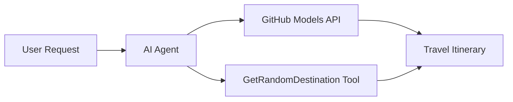

<!--
CO_OP_TRANSLATOR_METADATA:
{
  "original_hash": "5f351412e934f0833c8c821a0a60efaf",
  "translation_date": "2025-11-13T11:10:29+00:00",
  "source_file": "01-intro-to-ai-agents/code_samples/01-dotnet-agent-framework.md",
  "language_code": "ur"
}
-->
# 🌍 مائیکروسافٹ ایجنٹ فریم ورک (.NET) کے ساتھ AI ٹریول ایجنٹ

## 📋 منظرنامے کا جائزہ

یہ مثال دکھاتی ہے کہ مائیکروسافٹ ایجنٹ فریم ورک برائے .NET کا استعمال کرتے ہوئے ایک ذہین سفر منصوبہ بندی ایجنٹ کیسے بنایا جا سکتا ہے۔ یہ ایجنٹ دنیا بھر کے مختلف مقامات کے لیے خودکار طور پر ذاتی نوعیت کے دن بھر کے سفر کے منصوبے تیار کر سکتا ہے۔

### اہم خصوصیات:

- 🎲 **تصادفی منزل کا انتخاب**: چھٹی کے مقامات منتخب کرنے کے لیے ایک حسب ضرورت ٹول کا استعمال
- 🗺️ **ذہین سفر کی منصوبہ بندی**: دن بہ دن تفصیلی منصوبے بناتا ہے
- 🔄 **حقیقی وقت کی اسٹریمنگ**: فوری اور اسٹریمنگ جوابات دونوں کی حمایت کرتا ہے
- 🛠️ **حسب ضرورت ٹول انضمام**: ایجنٹ کی صلاحیتوں کو بڑھانے کا مظاہرہ کرتا ہے

## 🔧 تکنیکی فن تعمیر

### بنیادی ٹیکنالوجیز

- **مائیکروسافٹ ایجنٹ فریم ورک**: AI ایجنٹ کی ترقی کے لیے .NET کا جدید ترین نفاذ
- **GitHub ماڈلز انضمام**: GitHub کے AI ماڈل انفرنس سروس کا استعمال
- **OpenAI API مطابقت**: OpenAI کلائنٹ لائبریریوں کو حسب ضرورت اینڈ پوائنٹس کے ساتھ استعمال کرتا ہے
- **محفوظ ترتیب**: ماحول پر مبنی API کلید کا انتظام

### اہم اجزاء

1. **AIAgent**: مرکزی ایجنٹ آرکیسٹریٹر جو گفتگو کے بہاؤ کو سنبھالتا ہے
2. **حسب ضرورت ٹولز**: `GetRandomDestination()` فنکشن ایجنٹ کے لیے دستیاب
3. **چیٹ کلائنٹ**: GitHub ماڈلز پر مبنی گفتگو کا انٹرفیس
4. **اسٹریمنگ سپورٹ**: حقیقی وقت میں جواب پیدا کرنے کی صلاحیت

### انضمام کا نمونہ



## 🚀 شروعات کریں

### ضروریات

- [.NET 10 SDK](https://dotnet.microsoft.com/download/dotnet/10.0) یا اس سے جدید
- [GitHub ماڈلز API ایکسیس ٹوکن](https://docs.github.com/github-models/github-models-at-scale/using-your-own-api-keys-in-github-models)

### مطلوبہ ماحول متغیرات

```bash
# zsh/bash
export GH_TOKEN=<your_github_token>
export GH_ENDPOINT=https://models.github.ai/inference
export GH_MODEL_ID=openai/gpt-5-mini
```

```powershell
# PowerShell
$env:GH_TOKEN = "<your_github_token>"
$env:GH_ENDPOINT = "https://models.github.ai/inference"
$env:GH_MODEL_ID = "openai/gpt-5-mini"
```

### نمونہ کوڈ

کوڈ مثال چلانے کے لیے،

```bash
# zsh/bash
chmod +x ./01-dotnet-agent-framework.cs
./01-dotnet-agent-framework.cs
```

یا dotnet CLI کا استعمال کرتے ہوئے:

```bash
dotnet run ./01-dotnet-agent-framework.cs
```

مکمل کوڈ کے لیے [`01-dotnet-agent-framework.cs`](../../../../01-intro-to-ai-agents/code_samples/01-dotnet-agent-framework.cs) دیکھیں۔

```csharp
#!/usr/bin/dotnet run

#:package Microsoft.Extensions.AI@9.*
#:package Microsoft.Agents.AI.OpenAI@1.*-*

using System.ClientModel;
using System.ComponentModel;

using Microsoft.Agents.AI;
using Microsoft.Extensions.AI;

using OpenAI;

// Tool Function: Random Destination Generator
// This static method will be available to the agent as a callable tool
// The [Description] attribute helps the AI understand when to use this function
// This demonstrates how to create custom tools for AI agents
[Description("Provides a random vacation destination.")]
static string GetRandomDestination()
{
    // List of popular vacation destinations around the world
    // The agent will randomly select from these options
    var destinations = new List<string>
    {
        "Paris, France",
        "Tokyo, Japan",
        "New York City, USA",
        "Sydney, Australia",
        "Rome, Italy",
        "Barcelona, Spain",
        "Cape Town, South Africa",
        "Rio de Janeiro, Brazil",
        "Bangkok, Thailand",
        "Vancouver, Canada"
    };

    // Generate random index and return selected destination
    // Uses System.Random for simple random selection
    var random = new Random();
    int index = random.Next(destinations.Count);
    return destinations[index];
}

// Extract configuration from environment variables
// Retrieve the GitHub Models API endpoint, defaults to https://models.github.ai/inference if not specified
// Retrieve the model ID, defaults to openai/gpt-5-mini if not specified
// Retrieve the GitHub token for authentication, throws exception if not specified
var github_endpoint = Environment.GetEnvironmentVariable("GH_ENDPOINT") ?? "https://models.github.ai/inference";
var github_model_id = Environment.GetEnvironmentVariable("GH_MODEL_ID") ?? "openai/gpt-5-mini";
var github_token = Environment.GetEnvironmentVariable("GH_TOKEN") ?? throw new InvalidOperationException("GH_TOKEN is not set.");

// Configure OpenAI Client Options
// Create configuration options to point to GitHub Models endpoint
// This redirects OpenAI client calls to GitHub's model inference service
var openAIOptions = new OpenAIClientOptions()
{
    Endpoint = new Uri(github_endpoint)
};

// Initialize OpenAI Client with GitHub Models Configuration
// Create OpenAI client using GitHub token for authentication
// Configure it to use GitHub Models endpoint instead of OpenAI directly
var openAIClient = new OpenAIClient(new ApiKeyCredential(github_token), openAIOptions);

// Create AI Agent with Travel Planning Capabilities
// Initialize OpenAI client, get chat client for specified model, and create AI agent
// Configure agent with travel planning instructions and random destination tool
// The agent can now plan trips using the GetRandomDestination function
AIAgent agent = openAIClient
    .GetChatClient(github_model_id)
    .CreateAIAgent(
        instructions: "You are a helpful AI Agent that can help plan vacations for customers at random destinations",
        tools: [AIFunctionFactory.Create(GetRandomDestination)]
    );

// Execute Agent: Plan a Day Trip
// Run the agent with streaming enabled for real-time response display
// Shows the agent's thinking and response as it generates the content
// Provides better user experience with immediate feedback
await foreach (var update in agent.RunStreamingAsync("Plan me a day trip"))
{
    await Task.Delay(10);
    Console.Write(update);
}
```

## 🎓 اہم نکات

1. **ایجنٹ فن تعمیر**: مائیکروسافٹ ایجنٹ فریم ورک .NET میں AI ایجنٹس بنانے کے لیے ایک صاف، ٹائپ سیف طریقہ فراہم کرتا ہے
2. **ٹول انضمام**: `[Description]` ایٹریبیوٹ کے ساتھ سجائے گئے فنکشنز ایجنٹ کے لیے دستیاب ٹولز بن جاتے ہیں
3. **ترتیب کا انتظام**: ماحول متغیرات اور محفوظ اسناد کا انتظام .NET کے بہترین طریقوں پر عمل کرتا ہے
4. **OpenAI مطابقت**: GitHub ماڈلز انضمام OpenAI کے موافق APIs کے ذریعے بغیر کسی رکاوٹ کے کام کرتا ہے

## 🔗 اضافی وسائل

- [مائیکروسافٹ ایجنٹ فریم ورک دستاویزات](https://learn.microsoft.com/agent-framework)
- [GitHub ماڈلز مارکیٹ پلیس](https://github.com/marketplace?type=models)
- [Microsoft.Extensions.AI](https://learn.microsoft.com/dotnet/ai/microsoft-extensions-ai)
- [.NET سنگل فائل ایپس](https://devblogs.microsoft.com/dotnet/announcing-dotnet-run-app)

---

<!-- CO-OP TRANSLATOR DISCLAIMER START -->
**اعلانِ لاتعلقی**:  
یہ دستاویز AI ترجمہ سروس [Co-op Translator](https://github.com/Azure/co-op-translator) کا استعمال کرتے ہوئے ترجمہ کی گئی ہے۔ ہم درستگی کے لیے کوشش کرتے ہیں، لیکن براہ کرم آگاہ رہیں کہ خودکار ترجمے میں غلطیاں یا خامیاں ہو سکتی ہیں۔ اصل دستاویز کو اس کی اصل زبان میں مستند ذریعہ سمجھا جانا چاہیے۔ اہم معلومات کے لیے، پیشہ ور انسانی ترجمہ کی سفارش کی جاتی ہے۔ اس ترجمے کے استعمال سے پیدا ہونے والی کسی بھی غلط فہمی یا غلط تشریح کے لیے ہم ذمہ دار نہیں ہیں۔
<!-- CO-OP TRANSLATOR DISCLAIMER END -->