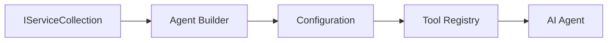

<!--
CO_OP_TRANSLATOR_METADATA:
{
  "original_hash": "bcc874e190347bd6a095aed56dc16de8",
  "translation_date": "2025-11-13T11:15:33+00:00",
  "source_file": "03-agentic-design-patterns/code_samples/03-dotnet-agent-framework.md",
  "language_code": "ur"
}
-->
# 🎨 ایجنٹک ڈیزائن پیٹرنز کے ساتھ GitHub ماڈلز (.NET)

## 📋 سیکھنے کے مقاصد

یہ مثال Microsoft Agent Framework کو .NET میں GitHub ماڈلز کے انضمام کے ساتھ استعمال کرتے ہوئے ذہین ایجنٹس بنانے کے لیے انٹرپرائز گریڈ ڈیزائن پیٹرنز کو ظاہر کرتی ہے۔ آپ پیشہ ورانہ پیٹرنز اور آرکیٹیکچرل طریقے سیکھیں گے جو ایجنٹس کو پروڈکشن کے لیے تیار، قابلِ دیکھ بھال، اور قابلِ توسیع بناتے ہیں۔

### انٹرپرائز ڈیزائن پیٹرنز

- 🏭 **فیکٹری پیٹرن**: ڈپینڈنسی انجیکشن کے ساتھ معیاری ایجنٹ تخلیق
- 🔧 **بلڈر پیٹرن**: ایجنٹ کی روانی ترتیب اور سیٹ اپ
- 🧵 **تھریڈ-سیف پیٹرنز**: ہم وقتی گفتگو کا انتظام
- 📋 **ریپوزیٹری پیٹرن**: منظم ٹول اور صلاحیت کا انتظام

## 🎯 .NET کے مخصوص آرکیٹیکچرل فوائد

### انٹرپرائز خصوصیات

- **مضبوط ٹائپنگ**: کمپائل-ٹائم توثیق اور IntelliSense سپورٹ
- **ڈپینڈنسی انجیکشن**: بلٹ ان DI کنٹینر انضمام
- **کنفیگریشن مینجمنٹ**: IConfiguration اور Options پیٹرنز
- **Async/Await**: غیر ہم وقتی پروگرامنگ کی فرسٹ کلاس سپورٹ

### پروڈکشن کے لیے تیار پیٹرنز

- **لاگنگ انضمام**: ILogger اور ساختی لاگنگ سپورٹ
- **ہیلتھ چیکس**: بلٹ ان مانیٹرنگ اور تشخیص
- **کنفیگریشن توثیق**: مضبوط ٹائپنگ کے ساتھ ڈیٹا اینوٹیشنز
- **غلطی کا انتظام**: ساختی استثنا کا انتظام

## 🔧 تکنیکی آرکیٹیکچر

### کور .NET اجزاء

- **Microsoft.Extensions.AI**: متحد AI سروس ایبسٹریکشنز
- **Microsoft.Agents.AI**: انٹرپرائز ایجنٹ آرکیسٹریشن فریم ورک
- **GitHub ماڈلز انضمام**: اعلی کارکردگی API کلائنٹ پیٹرنز
- **کنفیگریشن سسٹم**: appsettings.json اور ماحول کا انضمام

### ڈیزائن پیٹرن کا نفاذ



## 🏗️ انٹرپرائز پیٹرنز کا مظاہرہ

### 1. **تخلیقی پیٹرنز**

- **ایجنٹ فیکٹری**: مستقل کنفیگریشن کے ساتھ مرکزی ایجنٹ تخلیق
- **بلڈر پیٹرن**: پیچیدہ ایجنٹ کنفیگریشن کے لیے روانی API
- **سنگلٹن پیٹرن**: مشترکہ وسائل اور کنفیگریشن مینجمنٹ
- **ڈپینڈنسی انجیکشن**: ڈھیلا جوڑ اور ٹیسٹ کی صلاحیت

### 2. **رویے کے پیٹرنز**

- **اسٹریٹیجی پیٹرن**: قابل تبادلہ ٹول عملدرآمد کی حکمت عملی
- **کمانڈ پیٹرن**: انکیپسولیٹڈ ایجنٹ آپریشنز کے ساتھ انڈو/ریڈو
- **آبزرور پیٹرن**: ایونٹ ڈرائیو ایجنٹ لائف سائیکل مینجمنٹ
- **ٹیمپلیٹ میتھڈ**: معیاری ایجنٹ عملدرآمد ورک فلو

### 3. **ساختی پیٹرنز**

- **ایڈاپٹر پیٹرن**: GitHub ماڈلز API انضمام کی پرت
- **ڈیکوریٹر پیٹرن**: ایجنٹ کی صلاحیت میں اضافہ
- **فیساد پیٹرن**: ایجنٹ کے تعامل کے آسان انٹرفیس
- **پراکسی پیٹرن**: کارکردگی کے لیے سست لوڈنگ اور کیشنگ

## 📚 .NET ڈیزائن اصول

### SOLID اصول

- **سنگل ریسپانسبلٹی**: ہر جزو کا ایک واضح مقصد
- **اوپن/کلوزڈ**: ترمیم کے بغیر توسیع پذیر
- **لسکوف سبسٹیٹیوشن**: انٹرفیس پر مبنی ٹول نفاذ
- **انٹرفیس سیگریگیشن**: مرکوز، ہم آہنگ انٹرفیس
- **ڈپینڈنسی انورژن**: ایبسٹریکشنز پر انحصار کریں، کنکریشنز پر نہیں

### کلین آرکیٹیکچر

- **ڈومین لیئر**: کور ایجنٹ اور ٹول ایبسٹریکشنز
- **ایپلیکیشن لیئر**: ایجنٹ آرکیسٹریشن اور ورک فلو
- **انفراسٹرکچر لیئر**: GitHub ماڈلز انضمام اور بیرونی خدمات
- **پریزنٹیشن لیئر**: صارف کے تعامل اور جواب کی فارمیٹنگ

## 🔒 انٹرپرائز غور و فکر

### سیکیورٹی

- **کریڈینشل مینجمنٹ**: IConfiguration کے ساتھ محفوظ API کلید ہینڈلنگ
- **ان پٹ توثیق**: مضبوط ٹائپنگ اور ڈیٹا اینوٹیشن توثیق
- **آؤٹ پٹ صفائی**: محفوظ جواب کی پروسیسنگ اور فلٹرنگ
- **آڈٹ لاگنگ**: جامع آپریشن ٹریکنگ

### کارکردگی

- **غیر ہم وقتی پیٹرنز**: بلاک نہ کرنے والے I/O آپریشنز
- **کنکشن پولنگ**: موثر HTTP کلائنٹ مینجمنٹ
- **کیشنگ**: بہتر کارکردگی کے لیے جواب کیشنگ
- **وسائل کا انتظام**: مناسب ڈسپوزل اور صفائی کے پیٹرنز

### توسیع پذیری

- **تھریڈ سیفٹی**: ہم وقتی ایجنٹ عملدرآمد کی حمایت
- **وسائل پولنگ**: وسائل کا موثر استعمال
- **لوڈ مینجمنٹ**: ریٹ لمیٹنگ اور بیک پریشر ہینڈلنگ
- **مانیٹرنگ**: کارکردگی میٹرکس اور ہیلتھ چیکس

## 🚀 پروڈکشن ڈیپلائمنٹ

- **کنفیگریشن مینجمنٹ**: ماحول کے مخصوص سیٹنگز
- **لاگنگ حکمت عملی**: ساختی لاگنگ کے ساتھ تعلق IDs
- **غلطی کا انتظام**: عالمی استثنا کا انتظام اور مناسب بحالی
- **مانیٹرنگ**: ایپلیکیشن انسائٹس اور کارکردگی کاؤنٹرز
- **ٹیسٹنگ**: یونٹ ٹیسٹس، انٹیگریشن ٹیسٹس، اور لوڈ ٹیسٹنگ پیٹرنز

.NET کے ساتھ انٹرپرائز گریڈ ذہین ایجنٹس بنانے کے لیے تیار ہیں؟ آئیے کچھ مضبوط آرکیٹیکچر بنائیں! 🏢✨

## 🚀 شروعات کریں

### ضروریات

- [.NET 10 SDK](https://dotnet.microsoft.com/download/dotnet/10.0) یا اس سے زیادہ
- [GitHub ماڈلز API ایکسیس ٹوکن](https://docs.github.com/github-models/github-models-at-scale/using-your-own-api-keys-in-github-models)

### مطلوبہ ماحول متغیرات

```bash
# zsh/bash
export GH_TOKEN=<your_github_token>
export GH_ENDPOINT=https://models.github.ai/inference
export GH_MODEL_ID=openai/gpt-5-mini
```

```powershell
# PowerShell
$env:GH_TOKEN = "<your_github_token>"
$env:GH_ENDPOINT = "https://models.github.ai/inference"
$env:GH_MODEL_ID = "openai/gpt-5-mini"
```

### نمونہ کوڈ

کوڈ مثال چلانے کے لیے،

```bash
# zsh/bash
chmod +x ./03-dotnet-agent-framework.cs
./03-dotnet-agent-framework.cs
```

یا dotnet CLI استعمال کرتے ہوئے:

```bash
dotnet run ./03-dotnet-agent-framework.cs
```

مکمل کوڈ کے لیے [`03-dotnet-agent-framework.cs`](../../../../03-agentic-design-patterns/code_samples/03-dotnet-agent-framework.cs) دیکھیں۔

```csharp
#!/usr/bin/dotnet run

#:package Microsoft.Extensions.AI@10.*
#:package Microsoft.Agents.AI.OpenAI@1.*-*

using System.ClientModel;
using System.ComponentModel;

using Microsoft.Agents.AI;
using Microsoft.Extensions.AI;

using OpenAI;

// Tool Function: Random Destination Generator
// This static method will be available to the agent as a callable tool
// The [Description] attribute helps the AI understand when to use this function
// This demonstrates how to create custom tools for AI agents
[Description("Provides a random vacation destination.")]
static string GetRandomDestination()
{
    // List of popular vacation destinations around the world
    // The agent will randomly select from these options
    var destinations = new List<string>
    {
        "Paris, France",
        "Tokyo, Japan",
        "New York City, USA",
        "Sydney, Australia",
        "Rome, Italy",
        "Barcelona, Spain",
        "Cape Town, South Africa",
        "Rio de Janeiro, Brazil",
        "Bangkok, Thailand",
        "Vancouver, Canada"
    };

    // Generate random index and return selected destination
    // Uses System.Random for simple random selection
    var random = new Random();
    int index = random.Next(destinations.Count);
    return destinations[index];
}

// Extract configuration from environment variables
// Retrieve the GitHub Models API endpoint, defaults to https://models.github.ai/inference if not specified
// Retrieve the model ID, defaults to openai/gpt-5-mini if not specified
// Retrieve the GitHub token for authentication, throws exception if not specified
var github_endpoint = Environment.GetEnvironmentVariable("GH_ENDPOINT") ?? "https://models.github.ai/inference";
var github_model_id = Environment.GetEnvironmentVariable("GH_MODEL_ID") ?? "openai/gpt-5-mini";
var github_token = Environment.GetEnvironmentVariable("GH_TOKEN") ?? throw new InvalidOperationException("GH_TOKEN is not set.");

// Configure OpenAI Client Options
// Create configuration options to point to GitHub Models endpoint
// This redirects OpenAI client calls to GitHub's model inference service
var openAIOptions = new OpenAIClientOptions()
{
    Endpoint = new Uri(github_endpoint)
};

// Initialize OpenAI Client with GitHub Models Configuration
// Create OpenAI client using GitHub token for authentication
// Configure it to use GitHub Models endpoint instead of OpenAI directly
var openAIClient = new OpenAIClient(new ApiKeyCredential(github_token), openAIOptions);

// Define Agent Identity and Comprehensive Instructions
// Agent name for identification and logging purposes
var AGENT_NAME = "TravelAgent";

// Detailed instructions that define the agent's personality, capabilities, and behavior
// This system prompt shapes how the agent responds and interacts with users
var AGENT_INSTRUCTIONS = """
You are a helpful AI Agent that can help plan vacations for customers.

Important: When users specify a destination, always plan for that location. Only suggest random destinations when the user hasn't specified a preference.

When the conversation begins, introduce yourself with this message:
"Hello! I'm your TravelAgent assistant. I can help plan vacations and suggest interesting destinations for you. Here are some things you can ask me:
1. Plan a day trip to a specific location
2. Suggest a random vacation destination
3. Find destinations with specific features (beaches, mountains, historical sites, etc.)
4. Plan an alternative trip if you don't like my first suggestion

What kind of trip would you like me to help you plan today?"

Always prioritize user preferences. If they mention a specific destination like "Bali" or "Paris," focus your planning on that location rather than suggesting alternatives.
""";

// Create AI Agent with Advanced Travel Planning Capabilities
// Initialize complete agent pipeline: OpenAI client → Chat client → AI agent
// Configure agent with name, detailed instructions, and available tools
// This demonstrates the .NET agent creation pattern with full configuration
AIAgent agent = openAIClient
    .GetChatClient(github_model_id)
    .CreateAIAgent(
        name: AGENT_NAME,
        instructions: AGENT_INSTRUCTIONS,
        tools: [AIFunctionFactory.Create(GetRandomDestination)]
    );

// Create New Conversation Thread for Context Management
// Initialize a new conversation thread to maintain context across multiple interactions
// Threads enable the agent to remember previous exchanges and maintain conversational state
// This is essential for multi-turn conversations and contextual understanding
AgentThread thread = agent.GetNewThread();

// Execute Agent: First Travel Planning Request
// Run the agent with an initial request that will likely trigger the random destination tool
// The agent will analyze the request, use the GetRandomDestination tool, and create an itinerary
// Using the thread parameter maintains conversation context for subsequent interactions
await foreach (var update in agent.RunStreamingAsync("Plan me a day trip", thread))
{
    await Task.Delay(10);
    Console.Write(update);
}

Console.WriteLine();

// Execute Agent: Follow-up Request with Context Awareness
// Demonstrate contextual conversation by referencing the previous response
// The agent remembers the previous destination suggestion and will provide an alternative
// This showcases the power of conversation threads and contextual understanding in .NET agents
await foreach (var update in agent.RunStreamingAsync("I don't like that destination. Plan me another vacation.", thread))
{
    await Task.Delay(10);
    Console.Write(update);
}
```

---

<!-- CO-OP TRANSLATOR DISCLAIMER START -->
**اعلانِ لاتعلقی**:  
یہ دستاویز AI ترجمہ سروس [Co-op Translator](https://github.com/Azure/co-op-translator) کا استعمال کرتے ہوئے ترجمہ کی گئی ہے۔ ہم درستگی کے لیے کوشش کرتے ہیں، لیکن براہ کرم آگاہ رہیں کہ خودکار ترجمے میں غلطیاں یا خامیاں ہو سکتی ہیں۔ اصل دستاویز کو اس کی اصل زبان میں مستند ذریعہ سمجھا جانا چاہیے۔ اہم معلومات کے لیے، پیشہ ور انسانی ترجمہ کی سفارش کی جاتی ہے۔ اس ترجمے کے استعمال سے پیدا ہونے والی کسی بھی غلط فہمی یا غلط تشریح کے لیے ہم ذمہ دار نہیں ہیں۔
<!-- CO-OP TRANSLATOR DISCLAIMER END -->