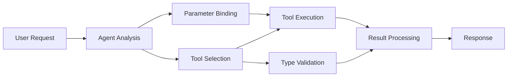

<!--
CO_OP_TRANSLATOR_METADATA:
{
  "original_hash": "91d6061e402489603f2ec8b528cae59b",
  "translation_date": "2025-11-18T16:43:52+00:00",
  "source_file": "04-tool-use/code_samples/04-dotnet-agent-framework.md",
  "language_code": "ur"
}
-->
# 🛠️ GitHub ماڈلز کے ساتھ جدید ٹول استعمال (.NET)

## 📋 سیکھنے کے مقاصد

یہ نوٹ بک Microsoft Agent Framework کو .NET میں GitHub ماڈلز کے ساتھ استعمال کرتے ہوئے انٹرپرائز گریڈ ٹول انٹیگریشن کے نمونے پیش کرتی ہے۔ آپ سیکھیں گے کہ کس طرح متعدد خصوصی ٹولز کے ساتھ پیچیدہ ایجنٹس بنائے جائیں، C# کی مضبوط ٹائپنگ اور .NET کی انٹرپرائز خصوصیات کا فائدہ اٹھاتے ہوئے۔

### جدید ٹول صلاحیتیں جو آپ سیکھیں گے

- 🔧 **ملٹی ٹول آرکیٹیکچر**: متعدد خصوصی صلاحیتوں کے ساتھ ایجنٹس بنانا
- 🎯 **ٹائپ سیف ٹول ایگزیکیوشن**: C# کی کمپائل ٹائم ویلیڈیشن کا فائدہ اٹھانا
- 📊 **انٹرپرائز ٹول نمونے**: پروڈکشن کے لیے تیار ٹول ڈیزائن اور ایرر ہینڈلنگ
- 🔗 **ٹول کمپوزیشن**: پیچیدہ کاروباری ورک فلو کے لیے ٹولز کو یکجا کرنا

## 🎯 .NET ٹول آرکیٹیکچر کے فوائد

### انٹرپرائز ٹول خصوصیات

- **کمپائل ٹائم ویلیڈیشن**: مضبوط ٹائپنگ ٹول پیرامیٹر کی درستگی کو یقینی بناتی ہے
- **ڈپینڈنسی انجیکشن**: IoC کنٹینر انٹیگریشن ٹول مینجمنٹ کے لیے
- **ایسینک/اویٹ نمونے**: غیر بلاکنگ ٹول ایگزیکیوشن کے ساتھ مناسب وسائل کا انتظام
- **ساختی لاگنگ**: ٹول ایگزیکیوشن کی نگرانی کے لیے بلٹ ان لاگنگ انٹیگریشن

### پروڈکشن کے لیے تیار نمونے

- **ایکسپشن ہینڈلنگ**: ٹائپڈ ایکسپشنز کے ساتھ جامع ایرر مینجمنٹ
- **وسائل کا انتظام**: مناسب ڈسپوزل نمونے اور میموری مینجمنٹ
- **کارکردگی کی نگرانی**: بلٹ ان میٹرکس اور پرفارمنس کاؤنٹرز
- **کنفیگریشن مینجمنٹ**: ویلیڈیشن کے ساتھ ٹائپ سیف کنفیگریشن

## 🔧 تکنیکی آرکیٹیکچر

### بنیادی .NET ٹول اجزاء

- **Microsoft.Extensions.AI**: متحد ٹول ایبسٹریکشن لیئر
- **Microsoft.Agents.AI**: انٹرپرائز گریڈ ٹول آرکیسٹریشن
- **GitHub ماڈلز انٹیگریشن**: ہائی پرفارمنس API کلائنٹ کنکشن پولنگ کے ساتھ

### ٹول ایگزیکیوشن پائپ لائن



## 🛠️ ٹول کیٹیگریز اور نمونے

### 1. **ڈیٹا پروسیسنگ ٹولز**

- **ان پٹ ویلیڈیشن**: مضبوط ٹائپنگ کے ساتھ ڈیٹا اینوٹیشنز
- **ٹرانسفارم آپریشنز**: ٹائپ سیف ڈیٹا کنورژن اور فارمیٹنگ
- **بزنس لاجک**: ڈومین مخصوص کیلکولیشن اور تجزیہ کے ٹولز
- **آؤٹ پٹ فارمیٹنگ**: ساختی جواب کی تخلیق

### 2. **انٹیگریشن ٹولز**

- **API کنیکٹرز**: RESTful سروس انٹیگریشن HttpClient کے ساتھ
- **ڈیٹا بیس ٹولز**: ڈیٹا ایکسیس کے لیے Entity Framework انٹیگریشن
- **فائل آپریشنز**: ویلیڈیشن کے ساتھ محفوظ فائل سسٹم آپریشنز
- **ایکسٹرنل سروسز**: تھرڈ پارٹی سروس انٹیگریشن کے نمونے

### 3. **یوٹیلیٹی ٹولز**

- **ٹیکسٹ پروسیسنگ**: اسٹرنگ مینپولیشن اور فارمیٹنگ یوٹیلیٹیز
- **تاریخ/وقت کے آپریشنز**: کلچر کے مطابق تاریخ/وقت کے حسابات
- **ریاضی کے ٹولز**: درستگی کے حسابات اور شماریاتی آپریشنز
- **ویلیڈیشن ٹولز**: بزنس رول ویلیڈیشن اور ڈیٹا ویریفیکیشن

کیا آپ انٹرپرائز گریڈ ایجنٹس کو طاقتور، ٹائپ سیف ٹول صلاحیتوں کے ساتھ .NET میں بنانے کے لیے تیار ہیں؟ آئیے کچھ پروفیشنل گریڈ حل تیار کریں! 🏢⚡

## 🚀 شروعات کریں

### ضروریات

- [.NET 10 SDK](https://dotnet.microsoft.com/download/dotnet/10.0) یا اس سے زیادہ
- [GitHub ماڈلز API ایکسیس ٹوکن](https://docs.github.com/github-models/github-models-at-scale/using-your-own-api-keys-in-github-models)

### مطلوبہ ماحول متغیرات

```bash
# zsh/bash
export GH_TOKEN=<your_github_token>
export GH_ENDPOINT=https://models.github.ai/inference
export GH_MODEL_ID=openai/gpt-5-mini
```

```powershell
# PowerShell
$env:GH_TOKEN = "<your_github_token>"
$env:GH_ENDPOINT = "https://models.github.ai/inference"
$env:GH_MODEL_ID = "openai/gpt-5-mini"
```

### نمونہ کوڈ

کوڈ مثال چلانے کے لیے،

```bash
# zsh/bash
chmod +x ./04-dotnet-agent-framework.cs
./04-dotnet-agent-framework.cs
```

یا dotnet CLI استعمال کرتے ہوئے:

```bash
dotnet run ./04-dotnet-agent-framework.cs
```

مکمل کوڈ کے لیے [`04-dotnet-agent-framework.cs`](../../../../04-tool-use/code_samples/04-dotnet-agent-framework.cs) دیکھیں۔

```csharp
#!/usr/bin/dotnet run

#:package Microsoft.Extensions.AI@10.*
#:package Microsoft.Agents.AI.OpenAI@1.*-*

using System.ClientModel;
using System.ComponentModel;

using Microsoft.Agents.AI;
using Microsoft.Extensions.AI;

using OpenAI;

// Tool Function: Random Destination Generator
// This static method will be available to the agent as a callable tool
// The [Description] attribute helps the AI understand when to use this function
// This demonstrates how to create custom tools for AI agents
[Description("Provides a random vacation destination.")]
static string GetRandomDestination()
{
    // List of popular vacation destinations around the world
    // The agent will randomly select from these options
    var destinations = new List<string>
    {
        "Paris, France",
        "Tokyo, Japan",
        "New York City, USA",
        "Sydney, Australia",
        "Rome, Italy",
        "Barcelona, Spain",
        "Cape Town, South Africa",
        "Rio de Janeiro, Brazil",
        "Bangkok, Thailand",
        "Vancouver, Canada"
    };

    // Generate random index and return selected destination
    // Uses System.Random for simple random selection
    var random = new Random();
    int index = random.Next(destinations.Count);
    return destinations[index];
}

// Extract configuration from environment variables
// Retrieve the GitHub Models API endpoint, defaults to https://models.github.ai/inference if not specified
// Retrieve the model ID, defaults to openai/gpt-5-mini if not specified
// Retrieve the GitHub token for authentication, throws exception if not specified
var github_endpoint = Environment.GetEnvironmentVariable("GH_ENDPOINT") ?? "https://models.github.ai/inference";
var github_model_id = Environment.GetEnvironmentVariable("GH_MODEL_ID") ?? "openai/gpt-5-mini";
var github_token = Environment.GetEnvironmentVariable("GH_TOKEN") ?? throw new InvalidOperationException("GH_TOKEN is not set.");

// Configure OpenAI Client Options
// Create configuration options to point to GitHub Models endpoint
// This redirects OpenAI client calls to GitHub's model inference service
var openAIOptions = new OpenAIClientOptions()
{
    Endpoint = new Uri(github_endpoint)
};

// Initialize OpenAI Client with GitHub Models Configuration
// Create OpenAI client using GitHub token for authentication
// Configure it to use GitHub Models endpoint instead of OpenAI directly
var openAIClient = new OpenAIClient(new ApiKeyCredential(github_token), openAIOptions);

// Define Agent Identity and Comprehensive Instructions
// Agent name for identification and logging purposes
var AGENT_NAME = "TravelAgent";

// Detailed instructions that define the agent's personality, capabilities, and behavior
// This system prompt shapes how the agent responds and interacts with users
var AGENT_INSTRUCTIONS = """
You are a helpful AI Agent that can help plan vacations for customers.

Important: When users specify a destination, always plan for that location. Only suggest random destinations when the user hasn't specified a preference.

When the conversation begins, introduce yourself with this message:
"Hello! I'm your TravelAgent assistant. I can help plan vacations and suggest interesting destinations for you. Here are some things you can ask me:
1. Plan a day trip to a specific location
2. Suggest a random vacation destination
3. Find destinations with specific features (beaches, mountains, historical sites, etc.)
4. Plan an alternative trip if you don't like my first suggestion

What kind of trip would you like me to help you plan today?"

Always prioritize user preferences. If they mention a specific destination like "Bali" or "Paris," focus your planning on that location rather than suggesting alternatives.
""";

// Create AI Agent with Advanced Travel Planning Capabilities
// Initialize complete agent pipeline: OpenAI client → Chat client → AI agent
// Configure agent with name, detailed instructions, and available tools
// This demonstrates the .NET agent creation pattern with full configuration
AIAgent agent = openAIClient
    .GetChatClient(github_model_id)
    .CreateAIAgent(
        name: AGENT_NAME,
        instructions: AGENT_INSTRUCTIONS,
        tools: [AIFunctionFactory.Create(GetRandomDestination)]
    );

// Create New Conversation Thread for Context Management
// Initialize a new conversation thread to maintain context across multiple interactions
// Threads enable the agent to remember previous exchanges and maintain conversational state
// This is essential for multi-turn conversations and contextual understanding
AgentThread thread = agent.GetNewThread();

// Execute Agent: First Travel Planning Request
// Run the agent with an initial request that will likely trigger the random destination tool
// The agent will analyze the request, use the GetRandomDestination tool, and create an itinerary
// Using the thread parameter maintains conversation context for subsequent interactions
await foreach (var update in agent.RunStreamingAsync("Plan me a day trip", thread))
{
    await Task.Delay(10);
    Console.Write(update);
}

Console.WriteLine();

// Execute Agent: Follow-up Request with Context Awareness
// Demonstrate contextual conversation by referencing the previous response
// The agent remembers the previous destination suggestion and will provide an alternative
// This showcases the power of conversation threads and contextual understanding in .NET agents
await foreach (var update in agent.RunStreamingAsync("I don't like that destination. Plan me another vacation.", thread))
{
    await Task.Delay(10);
    Console.Write(update);
}
```

---

<!-- CO-OP TRANSLATOR DISCLAIMER START -->
**اعلانِ لاتعلقی**:  
یہ دستاویز AI ترجمہ سروس [Co-op Translator](https://github.com/Azure/co-op-translator) کا استعمال کرتے ہوئے ترجمہ کی گئی ہے۔ ہم درستگی کے لیے کوشش کرتے ہیں، لیکن براہ کرم آگاہ رہیں کہ خودکار ترجمے میں غلطیاں یا عدم درستگی ہو سکتی ہیں۔ اصل دستاویز کو اس کی اصل زبان میں مستند ذریعہ سمجھا جانا چاہیے۔ اہم معلومات کے لیے، پیشہ ور انسانی ترجمہ کی سفارش کی جاتی ہے۔ اس ترجمے کے استعمال سے پیدا ہونے والی کسی بھی غلط فہمی یا غلط تشریح کے لیے ہم ذمہ دار نہیں ہیں۔
<!-- CO-OP TRANSLATOR DISCLAIMER END -->