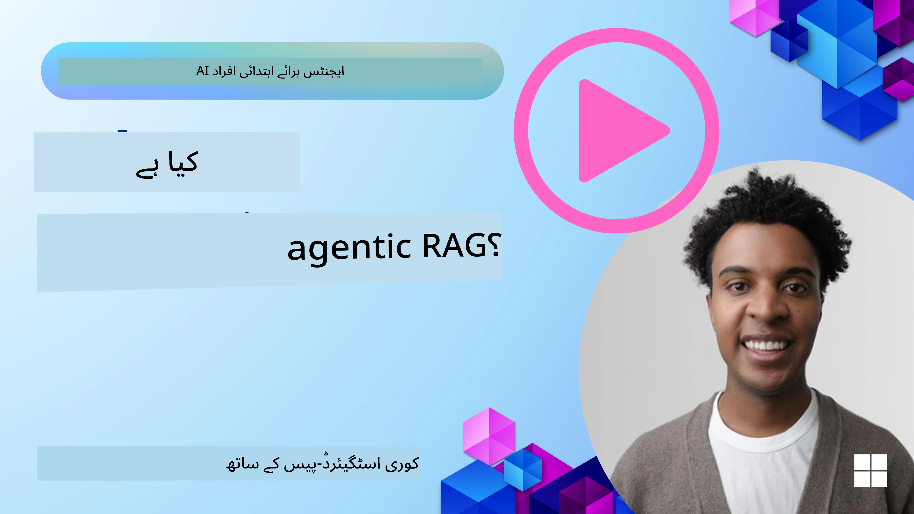
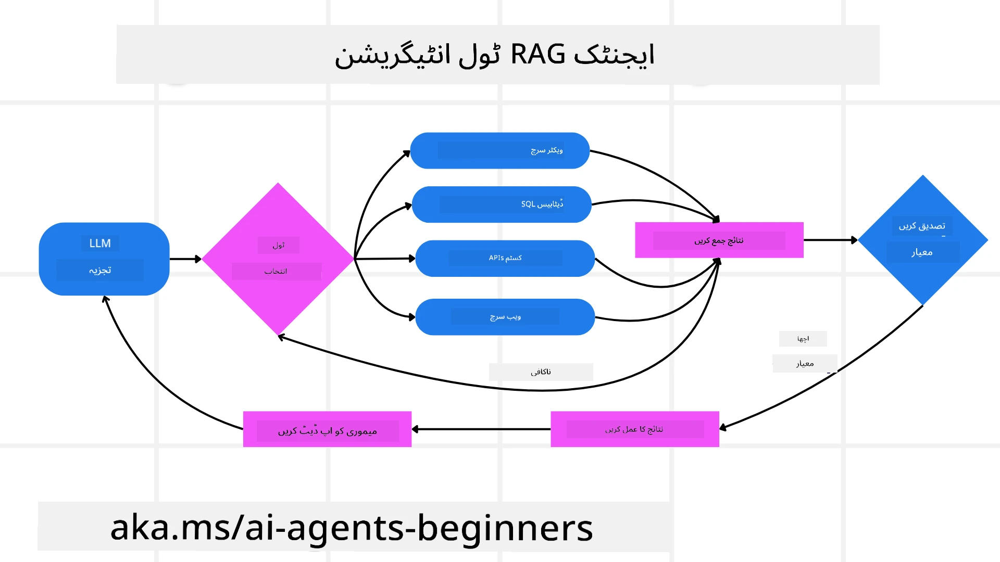
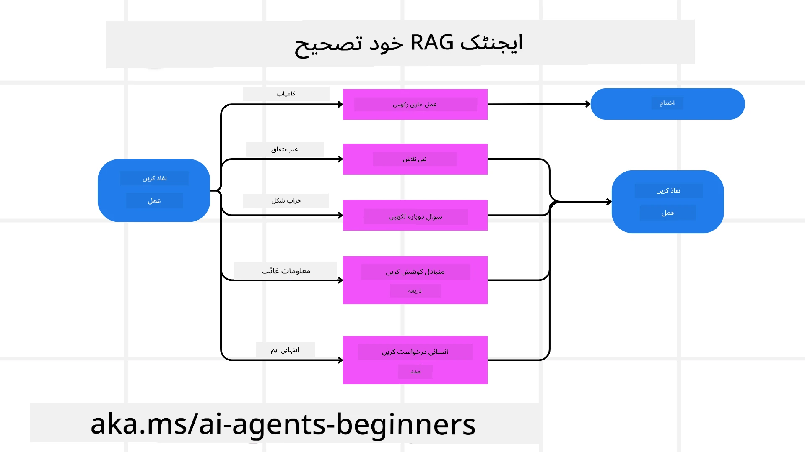

<!--
CO_OP_TRANSLATOR_METADATA:
{
  "original_hash": "0ebf6b2290db55dbf2d10cc49655523b",
  "translation_date": "2025-09-30T06:22:54+00:00",
  "source_file": "05-agentic-rag/README.md",
  "language_code": "ur"
}
-->

> _(اوپر دی گئی تصویر پر کلک کریں تاکہ اس سبق کی ویڈیو دیکھ سکیں)_

# ایجنٹک RAG

یہ سبق ایجنٹک ریٹریول-اگمینٹڈ جنریشن (Agentic RAG) کا جامع جائزہ فراہم کرتا ہے، جو ایک ابھرتا ہوا AI ماڈل ہے جہاں بڑے لینگویج ماڈلز (LLMs) خود مختار طور پر اپنے اگلے اقدامات کی منصوبہ بندی کرتے ہیں اور بیرونی ذرائع سے معلومات حاصل کرتے ہیں۔ جامد ریٹریول-پھر-ریڈ پیٹرنز کے برعکس، ایجنٹک RAG میں LLM کے بار بار کالز شامل ہیں، جن کے درمیان ٹول یا فنکشن کالز اور منظم آؤٹ پٹس ہوتے ہیں۔ یہ نظام نتائج کا جائزہ لیتا ہے، سوالات کو بہتر بناتا ہے، اضافی ٹولز کو استعمال کرتا ہے اگر ضرورت ہو، اور اس سائیکل کو جاری رکھتا ہے جب تک کہ ایک تسلی بخش حل حاصل نہ ہو جائے۔

## تعارف

یہ سبق درج ذیل موضوعات کا احاطہ کرے گا:

- **ایجنٹک RAG کو سمجھنا:** AI کے اس ابھرتے ہوئے ماڈل کے بارے میں جانیں جہاں بڑے لینگویج ماڈلز (LLMs) خود مختار طور پر اپنے اگلے اقدامات کی منصوبہ بندی کرتے ہیں اور بیرونی ڈیٹا ذرائع سے معلومات حاصل کرتے ہیں۔
- **تکراری میکر-چیکر انداز:** LLM کے بار بار کالز کے لوپ کو سمجھیں، جن کے درمیان ٹول یا فنکشن کالز اور منظم آؤٹ پٹس ہوتے ہیں، جو درستگی کو بہتر بنانے اور خراب سوالات کو سنبھالنے کے لیے ڈیزائن کیا گیا ہے۔
- **عملی اطلاقات کا جائزہ:** ان حالات کی شناخت کریں جہاں ایجنٹک RAG بہترین کام کرتا ہے، جیسے درستگی پر مبنی ماحول، پیچیدہ ڈیٹا بیس تعاملات، اور طویل ورک فلو۔

## سیکھنے کے اہداف

اس سبق کو مکمل کرنے کے بعد، آپ درج ذیل کو جانیں گے یا سمجھیں گے:

- **ایجنٹک RAG کو سمجھنا:** AI کے اس ابھرتے ہوئے ماڈل کے بارے میں جانیں جہاں بڑے لینگویج ماڈلز (LLMs) خود مختار طور پر اپنے اگلے اقدامات کی منصوبہ بندی کرتے ہیں اور بیرونی ڈیٹا ذرائع سے معلومات حاصل کرتے ہیں۔
- **تکراری میکر-چیکر انداز:** LLM کے بار بار کالز کے لوپ کو سمجھیں، جن کے درمیان ٹول یا فنکشن کالز اور منظم آؤٹ پٹس ہوتے ہیں، جو درستگی کو بہتر بنانے اور خراب سوالات کو سنبھالنے کے لیے ڈیزائن کیا گیا ہے۔
- **استدلالی عمل کی ملکیت:** نظام کی اس صلاحیت کو سمجھیں کہ وہ اپنے استدلالی عمل کی ملکیت رکھتا ہے، مسائل کو حل کرنے کے لیے فیصلے کرتا ہے بغیر پہلے سے طے شدہ راستوں پر انحصار کیے۔
- **ورک فلو:** سمجھیں کہ ایجنٹک ماڈل کس طرح خود مختار طور پر مارکیٹ کے رجحانات کی رپورٹس حاصل کرتا ہے، حریفوں کے ڈیٹا کی شناخت کرتا ہے، داخلی فروخت کے میٹرکس کو مربوط کرتا ہے، نتائج کو ترکیب کرتا ہے، اور حکمت عملی کا جائزہ لیتا ہے۔
- **تکراری لوپس، ٹول انٹیگریشن، اور میموری:** نظام کے لوپڈ تعامل کے انداز پر انحصار کے بارے میں جانیں، جو مراحل کے دوران حالت اور میموری کو برقرار رکھتا ہے تاکہ بار بار لوپس سے بچا جا سکے اور باخبر فیصلے کیے جا سکیں۔
- **ناکامی کے طریقوں کو سنبھالنا اور خود اصلاح:** نظام کے مضبوط خود اصلاحی میکانزم کا جائزہ لیں، جن میں تکرار اور دوبارہ سوال کرنا، تشخیصی ٹولز کا استعمال، اور انسانی نگرانی پر انحصار شامل ہے۔
- **ایجنسی کی حدود:** ایجنٹک RAG کی حدود کو سمجھیں، ڈومین مخصوص خود مختاری، انفراسٹرکچر پر انحصار، اور گارڈریل کے احترام پر توجہ مرکوز کریں۔
- **عملی استعمال کے کیسز اور قدر:** ان حالات کی شناخت کریں جہاں ایجنٹک RAG بہترین کام کرتا ہے، جیسے درستگی پر مبنی ماحول، پیچیدہ ڈیٹا بیس تعاملات، اور طویل ورک فلو۔
- **گورننس، شفافیت، اور اعتماد:** گورننس اور شفافیت کی اہمیت کے بارے میں جانیں، جن میں وضاحتی استدلال، تعصب کنٹرول، اور انسانی نگرانی شامل ہیں۔

## ایجنٹک RAG کیا ہے؟

ایجنٹک ریٹریول-اگمینٹڈ جنریشن (Agentic RAG) ایک ابھرتا ہوا AI ماڈل ہے جہاں بڑے لینگویج ماڈلز (LLMs) خود مختار طور پر اپنے اگلے اقدامات کی منصوبہ بندی کرتے ہیں اور بیرونی ذرائع سے معلومات حاصل کرتے ہیں۔ جامد ریٹریول-پھر-ریڈ پیٹرنز کے برعکس، ایجنٹک RAG میں LLM کے بار بار کالز شامل ہیں، جن کے درمیان ٹول یا فنکشن کالز اور منظم آؤٹ پٹس ہوتے ہیں۔ یہ نظام نتائج کا جائزہ لیتا ہے، سوالات کو بہتر بناتا ہے، اضافی ٹولز کو استعمال کرتا ہے اگر ضرورت ہو، اور اس سائیکل کو جاری رکھتا ہے جب تک کہ ایک تسلی بخش حل حاصل نہ ہو جائے۔ یہ تکراری "میکر-چیکر" انداز درستگی کو بہتر بناتا ہے، خراب سوالات کو سنبھالتا ہے، اور اعلیٰ معیار کے نتائج کو یقینی بناتا ہے۔

نظام فعال طور پر اپنے استدلالی عمل کی ملکیت رکھتا ہے، ناکام سوالات کو دوبارہ لکھتا ہے، مختلف ریٹریول طریقے منتخب کرتا ہے، اور متعدد ٹولز کو مربوط کرتا ہے—جیسے Azure AI Search میں ویکٹر سرچ، SQL ڈیٹا بیس، یا کسٹم APIs—پہلے جواب کو حتمی شکل دینے سے پہلے۔ ایجنٹک نظام کی امتیازی خصوصیت اس کی استدلالی عمل کی ملکیت رکھنے کی صلاحیت ہے۔ روایتی RAG نفاذ پہلے سے طے شدہ راستوں پر انحصار کرتے ہیں، لیکن ایجنٹک نظام معلومات کے معیار کی بنیاد پر اقدامات کی ترتیب خود مختار طور پر طے کرتا ہے۔

## ایجنٹک ریٹریول-اگمینٹڈ جنریشن (Agentic RAG) کی تعریف

ایجنٹک ریٹریول-اگمینٹڈ جنریشن (Agentic RAG) AI ترقی میں ایک ابھرتا ہوا ماڈل ہے جہاں LLMs نہ صرف بیرونی ڈیٹا ذرائع سے معلومات حاصل کرتے ہیں بلکہ خود مختار طور پر اپنے اگلے اقدامات کی منصوبہ بندی بھی کرتے ہیں۔ جامد ریٹریول-پھر-ریڈ پیٹرنز یا احتیاط سے اسکرپٹ کیے گئے پرامپٹ سیکوینسز کے برعکس، ایجنٹک RAG میں LLM کے بار بار کالز شامل ہیں، جن کے درمیان ٹول یا فنکشن کالز اور منظم آؤٹ پٹس ہوتے ہیں۔ ہر مرحلے پر، نظام حاصل کردہ نتائج کا جائزہ لیتا ہے، فیصلہ کرتا ہے کہ آیا سوالات کو بہتر بنانا ہے، اضافی ٹولز کو استعمال کرتا ہے اگر ضرورت ہو، اور اس سائیکل کو جاری رکھتا ہے جب تک کہ ایک تسلی بخش حل حاصل نہ ہو جائے۔

یہ تکراری "میکر-چیکر" انداز درستگی کو بہتر بنانے، خراب سوالات کو سنبھالنے (مثلاً NL2SQL)، اور متوازن، اعلیٰ معیار کے نتائج کو یقینی بنانے کے لیے ڈیزائن کیا گیا ہے۔ احتیاط سے انجینئرڈ پرامپٹ چینز پر انحصار کرنے کے بجائے، نظام فعال طور پر اپنے استدلالی عمل کی ملکیت رکھتا ہے۔ یہ ناکام سوالات کو دوبارہ لکھ سکتا ہے، مختلف ریٹریول طریقے منتخب کر سکتا ہے، اور متعدد ٹولز کو مربوط کر سکتا ہے—جیسے Azure AI Search میں ویکٹر سرچ، SQL ڈیٹا بیس، یا کسٹم APIs—پہلے جواب کو حتمی شکل دینے سے پہلے۔ اس سے پیچیدہ آرکیسٹریشن فریم ورک کی ضرورت ختم ہو جاتی ہے۔ اس کے بجائے، "LLM کال → ٹول استعمال → LLM کال → ..." کا ایک نسبتاً سادہ لوپ پیچیدہ اور اچھی طرح سے بنیاد شدہ آؤٹ پٹس فراہم کر سکتا ہے۔

## استدلالی عمل کی ملکیت

وہ امتیازی خصوصیت جو ایک نظام کو "ایجنٹک" بناتی ہے وہ اس کی استدلالی عمل کی ملکیت رکھنے کی صلاحیت ہے۔ روایتی RAG نفاذ اکثر انسانوں پر انحصار کرتے ہیں کہ وہ ماڈل کے لیے ایک راستہ پہلے سے طے کریں: ایک چین-آف-تھوٹ جو یہ بتاتا ہے کہ کیا حاصل کرنا ہے اور کب۔
لیکن جب ایک نظام واقعی ایجنٹک ہوتا ہے، تو وہ اندرونی طور پر فیصلہ کرتا ہے کہ مسئلے سے کیسے نمٹنا ہے۔ یہ صرف ایک اسکرپٹ کو نافذ نہیں کر رہا ہوتا؛ یہ معلومات کے معیار کی بنیاد پر اقدامات کی ترتیب خود مختار طور پر طے کر رہا ہوتا ہے۔
مثال کے طور پر، اگر اسے ایک پروڈکٹ لانچ حکمت عملی بنانے کے لیے کہا جائے، تو یہ صرف ایک پرامپٹ پر انحصار نہیں کرتا جو پورے تحقیق اور فیصلہ سازی کے ورک فلو کو بیان کرتا ہے۔ اس کے بجائے، ایجنٹک ماڈل خود مختار طور پر فیصلہ کرتا ہے:

1. Bing Web Grounding کا استعمال کرتے ہوئے موجودہ مارکیٹ رجحانات کی رپورٹس حاصل کرنا۔
2. Azure AI Search کا استعمال کرتے ہوئے متعلقہ حریفوں کے ڈیٹا کی شناخت کرنا۔
3. Azure SQL Database کا استعمال کرتے ہوئے تاریخی داخلی فروخت کے میٹرکس کو مربوط کرنا۔
4. Azure OpenAI Service کے ذریعے منظم کردہ ایک مربوط حکمت عملی میں نتائج کو ترکیب کرنا۔
5. حکمت عملی میں خلا یا تضادات کا جائزہ لینا، اگر ضروری ہو تو ریٹریول کے ایک اور دور کی درخواست کرنا۔
یہ تمام اقدامات—سوالات کو بہتر بنانا، ذرائع کا انتخاب کرنا، جواب سے "خوش" ہونے تک تکرار کرنا—ماڈل کے ذریعے فیصلہ کیے جاتے ہیں، انسان کے ذریعے پہلے سے اسکرپٹ نہیں کیے جاتے۔

## تکراری لوپس، ٹول انٹیگریشن، اور میموری

ایجنٹک نظام ایک لوپڈ تعامل کے انداز پر انحصار کرتا ہے:

- **ابتدائی کال:** صارف کا مقصد (یعنی صارف پرامپٹ) LLM کو پیش کیا جاتا ہے۔
- **ٹول کا استعمال:** اگر ماڈل کو معلومات کی کمی یا مبہم ہدایات کا پتہ چلتا ہے، تو یہ ایک ٹول یا ریٹریول طریقہ منتخب کرتا ہے—جیسے ویکٹر ڈیٹا بیس سوال (مثلاً Azure AI Search Hybrid search پرائیویٹ ڈیٹا پر) یا ایک منظم SQL کال—زیادہ سیاق و سباق حاصل کرنے کے لیے۔
- **جائزہ اور بہتری:** واپس کیے گئے ڈیٹا کا جائزہ لینے کے بعد، ماڈل فیصلہ کرتا ہے کہ آیا معلومات کافی ہیں۔ اگر نہیں، تو یہ سوال کو بہتر بناتا ہے، ایک مختلف ٹول آزماتا ہے، یا اپنے انداز کو ایڈجسٹ کرتا ہے۔
- **تسلی تک دہرائیں:** یہ سائیکل اس وقت تک جاری رہتا ہے جب تک ماڈل یہ طے نہ کر لے کہ اس کے پاس ایک حتمی، اچھی طرح سے سوچا ہوا جواب دینے کے لیے کافی وضاحت اور شواہد موجود ہیں۔
- **میموری اور حالت:** چونکہ نظام مراحل کے دوران حالت اور میموری کو برقرار رکھتا ہے، یہ پچھلے کوششوں اور ان کے نتائج کو یاد رکھ سکتا ہے، بار بار لوپس سے بچ سکتا ہے، اور جیسے جیسے یہ آگے بڑھتا ہے، زیادہ باخبر فیصلے کر سکتا ہے۔

وقت کے ساتھ، یہ ایک ارتقائی سمجھ پیدا کرتا ہے، ماڈل کو پیچیدہ، کثیر مرحلہ وار کاموں کو نیویگیٹ کرنے کے قابل بناتا ہے بغیر اس کی ضرورت کے کہ انسان مسلسل مداخلت کرے یا پرامپٹ کو دوبارہ تشکیل دے۔

## ناکامی کے طریقوں کو سنبھالنا اور خود اصلاح

ایجنٹک RAG کی خود مختاری میں مضبوط خود اصلاحی میکانزم بھی شامل ہیں۔ جب نظام ڈیڈ اینڈز پر پہنچتا ہے—جیسے غیر متعلقہ دستاویزات حاصل کرنا یا خراب سوالات کا سامنا کرنا—تو یہ کر سکتا ہے:

- **تکرار اور دوبارہ سوال کرنا:** کم قدر والے جوابات واپس کرنے کے بجائے، ماڈل نئے تلاش کے طریقے آزماتا ہے، ڈیٹا بیس سوالات کو دوبارہ لکھتا ہے، یا متبادل ڈیٹا سیٹس کو دیکھتا ہے۔
- **تشخیصی ٹولز کا استعمال:** نظام اضافی فنکشنز کو استعمال کر سکتا ہے جو اسے اپنے استدلالی مراحل کو ڈیبگ کرنے یا حاصل کردہ ڈیٹا کی درستگی کی تصدیق کرنے میں مدد دیتے ہیں۔ Azure AI Tracing جیسے ٹولز مضبوط مشاہدہ اور نگرانی کو فعال کرنے کے لیے اہم ہوں گے۔
- **انسانی نگرانی پر انحصار:** اعلیٰ خطرے والے یا بار بار ناکام ہونے والے حالات کے لیے، ماڈل غیر یقینی صورتحال کو جھنڈا لگا سکتا ہے اور انسانی رہنمائی کی درخواست کر سکتا ہے۔ ایک بار جب انسان اصلاحی فیڈبیک فراہم کرتا ہے، ماڈل اس سبق کو آگے بڑھانے میں شامل کر سکتا ہے۔

یہ تکراری اور متحرک انداز ماڈل کو مسلسل بہتر بنانے کی اجازت دیتا ہے، یہ یقینی بناتا ہے کہ یہ صرف ایک بار استعمال ہونے والا نظام نہیں ہے بلکہ ایک ایسا نظام ہے جو دیے گئے سیشن کے دوران اپنی غلطیوں سے سیکھتا ہے۔

## ایجنسی کی حدود

ایک کام کے اندر اپنی خود مختاری کے باوجود، ایجنٹک RAG مصنوعی عمومی ذہانت کے مترادف نہیں ہے۔ اس کی "ایجنٹک" صلاحیتیں انسانی ڈویلپرز کے ذریعے فراہم کردہ ٹولز، ڈیٹا ذرائع، اور پالیسیوں تک محدود ہیں۔ یہ اپنے ٹولز ایجاد نہیں کر سکتا یا ان ڈومین حدود سے باہر نہیں جا سکتا جو مقرر کی گئی ہیں۔ بلکہ، یہ دستیاب وسائل کو متحرک طور پر منظم کرنے میں مہارت رکھتا ہے۔
زیادہ ترقی یافتہ AI فارموں سے کلیدی اختلافات میں شامل ہیں:

1. **ڈومین مخصوص خود مختاری:** ایجنٹک RAG نظام صارف کے طے شدہ اہداف کو ایک معلوم ڈومین کے اندر حاصل کرنے پر مرکوز ہیں، جیسے سوالات کو دوبارہ لکھنا یا ٹول کا انتخاب کرنا تاکہ نتائج کو بہتر بنایا جا سکے۔
2. **انفراسٹرکچر پر انحصار:** نظام کی صلاحیتیں ڈویلپرز کے ذریعے مربوط ٹولز اور ڈیٹا پر منحصر ہیں۔ یہ ان حدود سے باہر نہیں جا سکتا بغیر انسانی مداخلت کے۔
3. **گارڈریل کا احترام:** اخلاقی رہنما اصول، تعمیل کے قواعد، اور کاروباری پالیسیاں بہت اہم رہتی ہیں۔ ایجنٹ کی آزادی ہمیشہ حفاظتی اقدامات اور نگرانی کے میکانزم کے ذریعے محدود رہتی ہے (شاید؟)

## عملی استعمال کے کیسز اور قدر

ایجنٹک RAG ان حالات میں بہترین کام کرتا ہے جہاں تکراری بہتری اور درستگی کی ضرورت ہو:

1. **درستگی پر مبنی ماحول:** تعمیل چیک، ریگولیٹری تجزیہ، یا قانونی تحقیق میں، ایجنٹک ماڈل حقائق کی بار بار تصدیق کر سکتا ہے، متعدد ذرائع سے مشورہ کر سکتا ہے، اور سوالات کو دوبارہ لکھ سکتا ہے جب تک کہ یہ مکمل طور پر تصدیق شدہ جواب پیدا نہ کرے۔
2. **پیچیدہ ڈیٹا بیس تعاملات:** جب منظم ڈیٹا کے ساتھ کام کرتے ہوئے سوالات اکثر ناکام ہو سکتے ہیں یا ایڈجسٹمنٹ کی ضرورت ہو سکتی ہے، نظام خود مختار طور پر اپنے سوالات کو Azure SQL یا Microsoft Fabric OneLake کا استعمال کرتے ہوئے بہتر بنا سکتا ہے، یہ یقینی بناتے ہوئے کہ حتمی ریٹریول صارف کے ارادے کے مطابق ہو۔
3. **طویل ورک فلو:** طویل سیشنز نئے معلومات کے ظاہر ہونے کے ساتھ ترقی کر سکتے ہیں۔ ایجنٹک RAG مسلسل نئے ڈیٹا کو شامل کر سکتا ہے، مسئلے کی جگہ کے بارے میں مزید سیکھتے ہوئے حکمت عملی کو تبدیل کر سکتا ہے۔

## گورننس، شفافیت، اور اعتماد

جیسے جیسے یہ نظام اپنے استدلال میں زیادہ خود مختار ہوتے جا رہے ہیں، گورننس اور شفافیت بہت اہم ہیں:

- **وضاحتی استدلال:** ماڈل ان سوالات کا آڈٹ ٹریل فراہم کر سکتا ہے جو اس نے کیے، وہ ذرائع جن سے اس نے مشورہ کیا، اور وہ استدلالی مراحل جو اس نے اپنے نتیجے تک پہنچنے کے لیے کیے۔ Azure AI Content Safety اور Azure AI Tracing / GenAIOps جیسے ٹولز شفافیت کو برقرار رکھنے اور خطرات کو کم کرنے میں مدد کر سکتے ہیں۔
- **تعصب کنٹرول اور متوازن ریٹریول:** ڈویلپرز ریٹریول کی حکمت عملیوں کو ٹیون کر سکتے ہیں تاکہ یہ یقینی بنایا جا سکے کہ متوازن، نمائندہ ڈیٹا ذرائع پر غور کیا جائے، اور آؤٹ پٹس کا باقاعدگی سے آڈٹ کریں تاکہ تعصب یا جھکے ہوئے پیٹرنز کا پتہ لگایا جا سکے، Azure Machine Learning کا استعمال کرتے ہوئے جدید ڈیٹا سائنس تنظیموں کے لیے کسٹم ماڈلز کے ذریعے۔
- **انسانی نگرانی اور تعمیل:** حساس کاموں کے لیے، انسانی جائزہ ضروری رہتا ہے۔ ایجنٹک RAG اعلیٰ خطرے والے فیصلوں میں انسانی فیصلے کی جگہ نہیں لیتا—یہ زیادہ مکمل طور پر تصدیق شدہ اختیارات فراہم کرکے اسے بڑھاتا ہے۔

ایسے ٹولز کا ہونا
- <a href="https://ragaboutit.com/agentic-rag-a-complete-guide-to-agent-based-retrieval-augmented-generation/" target="_blank">ایجنٹک RAG: ایجنٹ پر مبنی ریٹریول آگمینٹڈ جنریشن کے لیے مکمل گائیڈ – جنریشن RAG سے خبریں</a>
- <a href="https://huggingface.co/learn/cookbook/agent_rag" target="_blank">ایجنٹک RAG: اپنی RAG کو کوئری ریفارمیشن اور سیلف کوئری کے ساتھ تیز کریں! ہگنگ فیس اوپن سورس AI کک بک</a>
- <a href="https://youtu.be/aQ4yQXeB1Ss?si=2HUqBzHoeB5tR04U" target="_blank">RAG میں ایجنٹک لیئرز شامل کرنا</a>
- <a href="https://www.youtube.com/watch?v=zeAyuLc_f3Q&t=244s" target="_blank">علمی معاونین کا مستقبل: جیری لیو</a>
- <a href="https://www.youtube.com/watch?v=AOSjiXP1jmQ" target="_blank">ایجنٹک RAG سسٹمز کیسے بنائیں</a>
- <a href="https://ignite.microsoft.com/sessions/BRK102?source=sessions" target="_blank">اپنے AI ایجنٹس کو بڑھانے کے لیے Azure AI Foundry Agent Service کا استعمال</a>

### علمی مقالے

- <a href="https://arxiv.org/abs/2303.17651" target="_blank">2303.17651 سیلف ریفائن: سیلف فیڈبیک کے ساتھ تکراری اصلاح</a>
- <a href="https://arxiv.org/abs/2303.11366" target="_blank">2303.11366 ریفلیکشن: زبانی ری انفورسمنٹ لرننگ کے ساتھ لینگویج ایجنٹس</a>
- <a href="https://arxiv.org/abs/2305.11738" target="_blank">2305.11738 CRITIC: بڑے لینگویج ماڈلز ٹول انٹرایکٹو تنقید کے ذریعے خود کو درست کر سکتے ہیں</a>
- <a href="https://arxiv.org/abs/2501.09136" target="_blank">2501.09136 ایجنٹک ریٹریول آگمینٹڈ جنریشن: ایجنٹک RAG پر ایک سروے</a>

## پچھلا سبق

[ٹول استعمال ڈیزائن پیٹرن](../04-tool-use/README.md)

## اگلا سبق

[قابل اعتماد AI ایجنٹس بنانا](../06-building-trustworthy-agents/README.md)

---

**ڈسکلیمر**:  
یہ دستاویز AI ترجمہ سروس [Co-op Translator](https://github.com/Azure/co-op-translator) کا استعمال کرتے ہوئے ترجمہ کی گئی ہے۔ ہم درستگی کے لیے کوشش کرتے ہیں، لیکن براہ کرم آگاہ رہیں کہ خودکار ترجمے میں غلطیاں یا غیر درستیاں ہو سکتی ہیں۔ اصل دستاویز کو اس کی اصل زبان میں مستند ذریعہ سمجھا جانا چاہیے۔ اہم معلومات کے لیے، پیشہ ور انسانی ترجمہ کی سفارش کی جاتی ہے۔ ہم اس ترجمے کے استعمال سے پیدا ہونے والی کسی بھی غلط فہمی یا غلط تشریح کے ذمہ دار نہیں ہیں۔