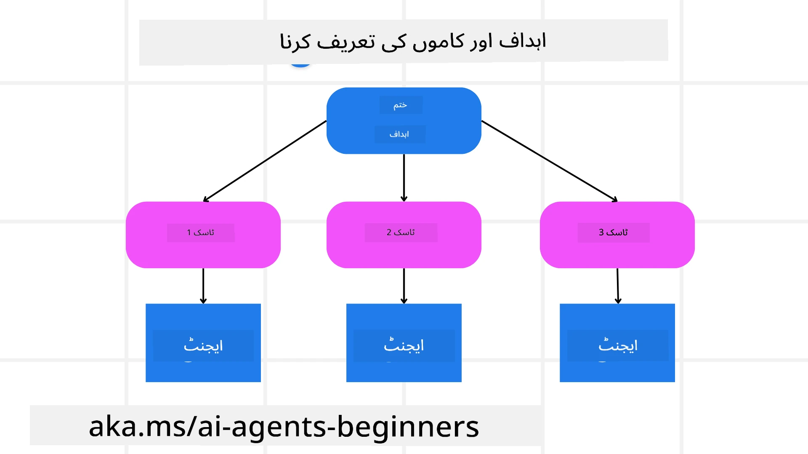

<!--
CO_OP_TRANSLATOR_METADATA:
{
  "original_hash": "43069833a0412210ad5c3cc93d9c2146",
  "translation_date": "2025-09-18T14:15:53+00:00",
  "source_file": "07-planning-design/README.md",
  "language_code": "ur"
}
-->
[](https://youtu.be/kPfJ2BrBCMY?si=9pYpPXp0sSbK91Dr)

> _(اوپر دی گئی تصویر پر کلک کریں تاکہ اس سبق کی ویڈیو دیکھی جا سکے)_

# پلاننگ ڈیزائن

## تعارف

اس سبق میں ہم درج ذیل موضوعات کا احاطہ کریں گے:

* ایک واضح مجموعی ہدف کی وضاحت اور پیچیدہ کام کو قابلِ انتظام حصوں میں تقسیم کرنا۔
* زیادہ قابلِ اعتماد اور مشین کے قابلِ پڑھائی جوابات کے لیے ساختی آؤٹ پٹ کا استعمال۔
* متحرک کاموں اور غیر متوقع ان پٹ کو سنبھالنے کے لیے ایونٹ ڈرائیون اپروچ کا اطلاق۔

## سیکھنے کے مقاصد

اس سبق کو مکمل کرنے کے بعد، آپ درج ذیل باتوں کو سمجھ سکیں گے:

* AI ایجنٹ کے لیے ایک مجموعی ہدف کی شناخت اور وضاحت کرنا تاکہ یہ واضح ہو کہ کیا حاصل کرنا ہے۔
* پیچیدہ کام کو قابلِ انتظام ذیلی کاموں میں تقسیم کرنا اور انہیں منطقی ترتیب میں منظم کرنا۔
* ایجنٹس کو صحیح ٹولز (جیسے سرچ ٹولز یا ڈیٹا اینالیٹکس ٹولز) سے لیس کرنا، یہ فیصلہ کرنا کہ انہیں کب اور کیسے استعمال کیا جائے، اور غیر متوقع حالات کو سنبھالنا۔
* ذیلی کاموں کے نتائج کا جائزہ لینا، کارکردگی کو ماپنا، اور حتمی آؤٹ پٹ کو بہتر بنانے کے لیے اقدامات کو دہرانا۔

## مجموعی ہدف کی وضاحت اور کام کو تقسیم کرنا



زیادہ تر حقیقی دنیا کے کام اتنے پیچیدہ ہوتے ہیں کہ انہیں ایک ہی قدم میں مکمل نہیں کیا جا سکتا۔ ایک AI ایجنٹ کو اپنے منصوبہ بندی اور اقدامات کی رہنمائی کے لیے ایک مختصر مقصد کی ضرورت ہوتی ہے۔ مثال کے طور پر، یہ ہدف لیں:

    "ایک 3 دن کا سفر نامہ تیار کریں۔"

اگرچہ یہ بیان کرنا آسان ہے، لیکن اس میں مزید وضاحت کی ضرورت ہے۔ جتنا واضح ہدف ہوگا، ایجنٹ (اور کسی بھی انسانی معاونین) اتنا ہی بہتر طریقے سے صحیح نتیجہ حاصل کرنے پر توجہ مرکوز کر سکیں گے، جیسے کہ ایک جامع سفر نامہ بنانا جس میں فلائٹ کے اختیارات، ہوٹل کی سفارشات، اور سرگرمیوں کی تجاویز شامل ہوں۔

### کام کی تقسیم

بڑے یا پیچیدہ کام زیادہ قابلِ انتظام ہو جاتے ہیں جب انہیں چھوٹے، مقصد پر مبنی ذیلی کاموں میں تقسیم کیا جائے۔
سفر نامہ کی مثال کے لیے، آپ ہدف کو درج ذیل میں تقسیم کر سکتے ہیں:

* فلائٹ بکنگ
* ہوٹل بکنگ
* کار کرایہ پر لینا
* ذاتی نوعیت کی تجاویز

ہر ذیلی کام کو پھر مخصوص ایجنٹس یا عمل کے ذریعے انجام دیا جا سکتا ہے۔ ایک ایجنٹ بہترین فلائٹ ڈیلز تلاش کرنے میں مہارت رکھ سکتا ہے، دوسرا ہوٹل بکنگ پر توجہ مرکوز کر سکتا ہے، وغیرہ۔ ایک مربوط یا "ڈاؤن اسٹریم" ایجنٹ ان نتائج کو ایک مربوط سفر نامے میں یکجا کر کے آخری صارف کو پیش کر سکتا ہے۔

یہ ماڈیولر اپروچ بتدریج بہتری کی بھی اجازت دیتا ہے۔ مثال کے طور پر، آپ فوڈ کی سفارشات یا مقامی سرگرمیوں کی تجاویز کے لیے مخصوص ایجنٹس شامل کر سکتے ہیں اور وقت کے ساتھ سفر نامے کو بہتر بنا سکتے ہیں۔

### ساختی آؤٹ پٹ

بڑے لینگویج ماڈلز (LLMs) ساختی آؤٹ پٹ (مثلاً JSON) تیار کر سکتے ہیں جو ڈاؤن اسٹریم ایجنٹس یا سروسز کے لیے پارس اور پروسیس کرنا آسان ہوتا ہے۔ یہ خاص طور پر ایک ملٹی ایجنٹ سیاق و سباق میں مفید ہے، جہاں ہم منصوبہ بندی کے آؤٹ پٹ کے موصول ہونے کے بعد ان کاموں پر عمل کر سکتے ہیں۔ 

جلدی جائزے کے لیے درج ذیل پائتھون کوڈ کا ٹکڑا ایک سادہ پلاننگ ایجنٹ کو ایک ہدف کو ذیلی کاموں میں تقسیم کرتے اور ایک ساختی منصوبہ تیار کرتے ہوئے دکھاتا ہے:

```python
from pydantic import BaseModel
from enum import Enum
from typing import List, Optional, Union
import json
import os
from typing import Optional
from pprint import pprint
from autogen_core.models import UserMessage, SystemMessage, AssistantMessage
from autogen_ext.models.azure import AzureAIChatCompletionClient
from azure.core.credentials import AzureKeyCredential

class AgentEnum(str, Enum):
    FlightBooking = "flight_booking"
    HotelBooking = "hotel_booking"
    CarRental = "car_rental"
    ActivitiesBooking = "activities_booking"
    DestinationInfo = "destination_info"
    DefaultAgent = "default_agent"
    GroupChatManager = "group_chat_manager"

# Travel SubTask Model
class TravelSubTask(BaseModel):
    task_details: str
    assigned_agent: AgentEnum  # we want to assign the task to the agent

class TravelPlan(BaseModel):
    main_task: str
    subtasks: List[TravelSubTask]
    is_greeting: bool

client = AzureAIChatCompletionClient(
    model="gpt-4o-mini",
    endpoint="https://models.inference.ai.azure.com",
    # To authenticate with the model you will need to generate a personal access token (PAT) in your GitHub settings.
    # Create your PAT token by following instructions here: https://docs.github.com/en/authentication/keeping-your-account-and-data-secure/managing-your-personal-access-tokens
    credential=AzureKeyCredential(os.environ["GITHUB_TOKEN"]),
    model_info={
        "json_output": False,
        "function_calling": True,
        "vision": True,
        "family": "unknown",
    },
)

# Define the user message
messages = [
    SystemMessage(content="""You are an planner agent.
    Your job is to decide which agents to run based on the user's request.
                      Provide your response in JSON format with the following structure:
{'main_task': 'Plan a family trip from Singapore to Melbourne.',
 'subtasks': [{'assigned_agent': 'flight_booking',
               'task_details': 'Book round-trip flights from Singapore to '
                               'Melbourne.'}
    Below are the available agents specialised in different tasks:
    - FlightBooking: For booking flights and providing flight information
    - HotelBooking: For booking hotels and providing hotel information
    - CarRental: For booking cars and providing car rental information
    - ActivitiesBooking: For booking activities and providing activity information
    - DestinationInfo: For providing information about destinations
    - DefaultAgent: For handling general requests""", source="system"),
    UserMessage(
        content="Create a travel plan for a family of 2 kids from Singapore to Melboune", source="user"),
]

response = await client.create(messages=messages, extra_create_args={"response_format": 'json_object'})

response_content: Optional[str] = response.content if isinstance(
    response.content, str) else None
if response_content is None:
    raise ValueError("Response content is not a valid JSON string" )

pprint(json.loads(response_content))

# # Ensure the response content is a valid JSON string before loading it
# response_content: Optional[str] = response.content if isinstance(
#     response.content, str) else None
# if response_content is None:
#     raise ValueError("Response content is not a valid JSON string")

# # Print the response content after loading it as JSON
# pprint(json.loads(response_content))

# Validate the response content with the MathReasoning model
# TravelPlan.model_validate(json.loads(response_content))
```

### ملٹی ایجنٹ آرکیسٹریشن کے ساتھ پلاننگ ایجنٹ

اس مثال میں، ایک Semantic Router Agent صارف کی درخواست وصول کرتا ہے (مثلاً، "مجھے اپنے سفر کے لیے ہوٹل کا منصوبہ چاہیے۔")۔

پلانر پھر:

* ہوٹل پلان وصول کرتا ہے: پلانر صارف کے پیغام کو لیتا ہے اور، ایک سسٹم پرامپٹ (جس میں دستیاب ایجنٹس کی تفصیلات شامل ہیں) کی بنیاد پر، ایک ساختی سفر کا منصوبہ تیار کرتا ہے۔
* ایجنٹس اور ان کے ٹولز کی فہرست بناتا ہے: ایجنٹ رجسٹری ایجنٹس (جیسے فلائٹ، ہوٹل، کار کرایہ، اور سرگرمیاں) کی فہرست اور ان کے فراہم کردہ فنکشنز یا ٹولز کو رکھتی ہے۔
* منصوبے کو متعلقہ ایجنٹس تک پہنچاتا ہے: ذیلی کاموں کی تعداد کے مطابق، پلانر یا تو پیغام کو براہ راست ایک مخصوص ایجنٹ کو بھیجتا ہے (سنگل ٹاسک کے منظرناموں کے لیے) یا ملٹی ایجنٹ تعاون کے لیے ایک گروپ چیٹ مینیجر کے ذریعے ہم آہنگی کرتا ہے۔
* نتیجہ کا خلاصہ کرتا ہے: آخر میں، پلانر وضاحت کے لیے تیار کردہ منصوبے کا خلاصہ کرتا ہے۔

درج ذیل پائتھون کوڈ کے نمونے ان مراحل کو واضح کرتے ہیں:

```python

from pydantic import BaseModel

from enum import Enum
from typing import List, Optional, Union

class AgentEnum(str, Enum):
    FlightBooking = "flight_booking"
    HotelBooking = "hotel_booking"
    CarRental = "car_rental"
    ActivitiesBooking = "activities_booking"
    DestinationInfo = "destination_info"
    DefaultAgent = "default_agent"
    GroupChatManager = "group_chat_manager"

# Travel SubTask Model

class TravelSubTask(BaseModel):
    task_details: str
    assigned_agent: AgentEnum # we want to assign the task to the agent

class TravelPlan(BaseModel):
    main_task: str
    subtasks: List[TravelSubTask]
    is_greeting: bool
import json
import os
from typing import Optional

from autogen_core.models import UserMessage, SystemMessage, AssistantMessage
from autogen_ext.models.openai import AzureOpenAIChatCompletionClient

# Create the client with type-checked environment variables

client = AzureOpenAIChatCompletionClient(
    azure_deployment=os.getenv("AZURE_OPENAI_DEPLOYMENT_NAME"),
    model=os.getenv("AZURE_OPENAI_DEPLOYMENT_NAME"),
    api_version=os.getenv("AZURE_OPENAI_API_VERSION"),
    azure_endpoint=os.getenv("AZURE_OPENAI_ENDPOINT"),
    api_key=os.getenv("AZURE_OPENAI_API_KEY"),
)

from pprint import pprint

# Define the user message

messages = [
    SystemMessage(content="""You are an planner agent.
    Your job is to decide which agents to run based on the user's request.
    Below are the available agents specialized in different tasks:
    - FlightBooking: For booking flights and providing flight information
    - HotelBooking: For booking hotels and providing hotel information
    - CarRental: For booking cars and providing car rental information
    - ActivitiesBooking: For booking activities and providing activity information
    - DestinationInfo: For providing information about destinations
    - DefaultAgent: For handling general requests""", source="system"),
    UserMessage(content="Create a travel plan for a family of 2 kids from Singapore to Melbourne", source="user"),
]

response = await client.create(messages=messages, extra_create_args={"response_format": TravelPlan})

# Ensure the response content is a valid JSON string before loading it

response_content: Optional[str] = response.content if isinstance(response.content, str) else None
if response_content is None:
    raise ValueError("Response content is not a valid JSON string")

# Print the response content after loading it as JSON

pprint(json.loads(response_content))
```

پچھلے کوڈ کے آؤٹ پٹ کے بعد، آپ اس ساختی آؤٹ پٹ کو `assigned_agent` پر بھیج سکتے ہیں اور سفر کے منصوبے کو آخری صارف کے لیے خلاصہ کر سکتے ہیں۔

```json
{
    "is_greeting": "False",
    "main_task": "Plan a family trip from Singapore to Melbourne.",
    "subtasks": [
        {
            "assigned_agent": "flight_booking",
            "task_details": "Book round-trip flights from Singapore to Melbourne."
        },
        {
            "assigned_agent": "hotel_booking",
            "task_details": "Find family-friendly hotels in Melbourne."
        },
        {
            "assigned_agent": "car_rental",
            "task_details": "Arrange a car rental suitable for a family of four in Melbourne."
        },
        {
            "assigned_agent": "activities_booking",
            "task_details": "List family-friendly activities in Melbourne."
        },
        {
            "assigned_agent": "destination_info",
            "task_details": "Provide information about Melbourne as a travel destination."
        }
    ]
}
```

پچھلے کوڈ کے نمونے کے ساتھ ایک مثال نوٹ بک [یہاں](07-autogen.ipynb) دستیاب ہے۔

### تکراری منصوبہ بندی

کچھ کاموں کو آگے پیچھے یا دوبارہ منصوبہ بندی کی ضرورت ہوتی ہے، جہاں ایک ذیلی کام کا نتیجہ اگلے پر اثر انداز ہوتا ہے۔ مثال کے طور پر، اگر ایجنٹ فلائٹ بکنگ کے دوران ایک غیر متوقع ڈیٹا فارمیٹ دریافت کرتا ہے، تو اسے ہوٹل بکنگ پر جانے سے پہلے اپنی حکمت عملی کو اپنانا پڑ سکتا ہے۔

مزید برآں، صارف کی رائے (مثلاً، ایک انسان جو فیصلہ کرتا ہے کہ وہ ایک پہلے کی فلائٹ کو ترجیح دیتا ہے) جزوی دوبارہ منصوبہ بندی کو متحرک کر سکتی ہے۔ یہ متحرک، تکراری اپروچ اس بات کو یقینی بناتی ہے کہ حتمی حل حقیقی دنیا کی حدود اور صارف کی بدلتی ہوئی ترجیحات کے مطابق ہو۔

مثال کے طور پر کوڈ:

```python
from autogen_core.models import UserMessage, SystemMessage, AssistantMessage
#.. same as previous code and pass on the user history, current plan
messages = [
    SystemMessage(content="""You are a planner agent to optimize the
    Your job is to decide which agents to run based on the user's request.
    Below are the available agents specialized in different tasks:
    - FlightBooking: For booking flights and providing flight information
    - HotelBooking: For booking hotels and providing hotel information
    - CarRental: For booking cars and providing car rental information
    - ActivitiesBooking: For booking activities and providing activity information
    - DestinationInfo: For providing information about destinations
    - DefaultAgent: For handling general requests""", source="system"),
    UserMessage(content="Create a travel plan for a family of 2 kids from Singapore to Melbourne", source="user"),
    AssistantMessage(content=f"Previous travel plan - {TravelPlan}", source="assistant")
]
# .. re-plan and send the tasks to respective agents
```

زیادہ جامع منصوبہ بندی کے لیے Magnetic One کو ضرور دیکھیں، جو پیچیدہ کاموں کو حل کرنے کے لیے ایک عمومی ملٹی ایجنٹ سسٹم ہے۔

## خلاصہ

اس مضمون میں ہم نے ایک ایسے پلانر کی مثال دیکھی جو دستیاب ایجنٹس کو متحرک طور پر منتخب کر سکتا ہے۔ پلانر کے آؤٹ پٹ کاموں کو تقسیم کرتا ہے اور ایجنٹس کو تفویض کرتا ہے تاکہ وہ ان پر عمل کر سکیں۔ یہ فرض کیا جاتا ہے کہ ایجنٹس کے پاس وہ فنکشنز/ٹولز موجود ہیں جو کام کو انجام دینے کے لیے ضروری ہیں۔ ایجنٹس کے علاوہ، آپ دیگر پیٹرنز جیسے ریفلیکشن، سمریزر، اور راؤنڈ روبن چیٹ کو شامل کر کے مزید حسب ضرورت بنا سکتے ہیں۔

## اضافی وسائل

AutoGen Magnetic One - ایک عمومی ملٹی ایجنٹ سسٹم جو پیچیدہ کاموں کو حل کرنے کے لیے ہے اور متعدد چیلنجنگ ایجنٹک بینچ مارکس پر شاندار نتائج حاصل کر چکا ہے۔ حوالہ: 

اس نفاذ میں آرکیسٹریٹر کام کے لیے مخصوص منصوبہ بناتا ہے اور ان کاموں کو دستیاب ایجنٹس کو تفویض کرتا ہے۔ منصوبہ بندی کے علاوہ، آرکیسٹریٹر ایک ٹریکنگ میکانزم بھی استعمال کرتا ہے تاکہ کام کی پیش رفت کی نگرانی کرے اور ضرورت کے مطابق دوبارہ منصوبہ بندی کرے۔

### پلاننگ ڈیزائن پیٹرن کے بارے میں مزید سوالات ہیں؟

[Azure AI Foundry Discord](https://aka.ms/ai-agents/discord) میں شامل ہوں تاکہ دیگر سیکھنے والوں سے ملاقات کریں، آفس آورز میں شرکت کریں، اور اپنے AI ایجنٹس کے سوالات کے جوابات حاصل کریں۔

## پچھلا سبق

[قابلِ اعتماد AI ایجنٹس بنانا](../06-building-trustworthy-agents/README.md)

## اگلا سبق

[ملٹی ایجنٹ ڈیزائن پیٹرن](../08-multi-agent/README.md)

---

**ڈسکلیمر**:  
یہ دستاویز AI ترجمہ سروس [Co-op Translator](https://github.com/Azure/co-op-translator) کا استعمال کرتے ہوئے ترجمہ کی گئی ہے۔ ہم درستگی کے لیے کوشش کرتے ہیں، لیکن براہ کرم آگاہ رہیں کہ خودکار ترجمے میں غلطیاں یا غیر درستیاں ہو سکتی ہیں۔ اصل دستاویز کو اس کی اصل زبان میں مستند ذریعہ سمجھا جانا چاہیے۔ اہم معلومات کے لیے، پیشہ ور انسانی ترجمہ کی سفارش کی جاتی ہے۔ ہم اس ترجمے کے استعمال سے پیدا ہونے والی کسی بھی غلط فہمی یا غلط تشریح کے ذمہ دار نہیں ہیں۔