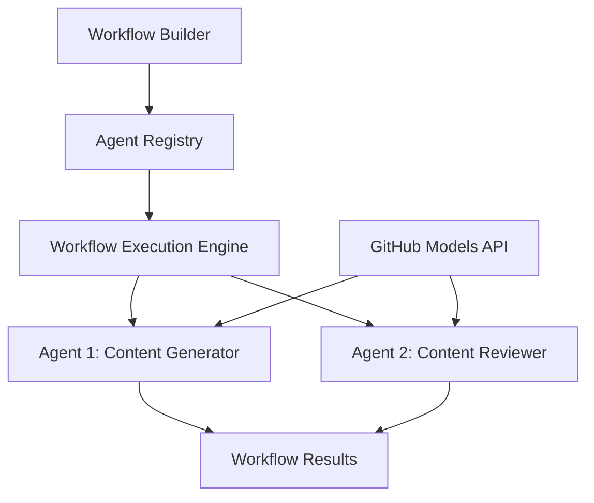

<!--
CO_OP_TRANSLATOR_METADATA:
{
  "original_hash": "034158688d0a45aae06dcbb21b0da5ae",
  "translation_date": "2025-11-11T12:41:22+00:00",
  "source_file": "08-multi-agent/code_samples/workflows-agent-framework/dotNET/01.dotnet-agent-framework-workflow-ghmodel-basic.md",
  "language_code": "ur"
}
-->
# 🔄 GitHub ماڈلز کے ساتھ بنیادی ایجنٹ ورک فلو (.NET)

## 📋 ورک فلو آرکیسٹریشن ٹیوٹوریل

یہ نوٹ بک Microsoft Agent Framework for .NET اور GitHub ماڈلز کا استعمال کرتے ہوئے پیچیدہ **ایجنٹ ورک فلو** بنانے کا طریقہ دکھاتی ہے۔ آپ سیکھیں گے کہ کس طرح AI ایجنٹس کے ذریعے تعاون کے ذریعے پیچیدہ کاموں کو مکمل کرنے کے لیے کثیر مرحلہ کاروباری عمل تخلیق کریں۔

## 🎯 سیکھنے کے مقاصد

### 🏗️ **ورک فلو آرکیٹیکچر کی بنیادی باتیں**
- **ورک فلو بلڈر**: پیچیدہ کثیر مرحلہ AI عمل کو ڈیزائن اور آرکیسٹریٹ کریں
- **ایجنٹ کوآرڈینیشن**: ورک فلو میں متعدد ماہر ایجنٹس کو مربوط کریں
- **GitHub ماڈلز انٹیگریشن**: ورک فلو میں GitHub کے AI ماڈل انفرنس سروس کا فائدہ اٹھائیں
- **بصری ورک فلو ڈیزائن**: بہتر سمجھ کے لیے ورک فلو ڈھانچے تخلیق کریں اور دیکھیں

### 🔄 **پروسیس آرکیسٹریشن پیٹرنز**
- **تسلسل پروسیسنگ**: منطقی ترتیب میں متعدد ایجنٹ کاموں کو جوڑیں
- **اسٹیٹ مینجمنٹ**: ورک فلو مراحل کے دوران سیاق و سباق اور ڈیٹا فلو کو برقرار رکھیں
- **ایرر ہینڈلنگ**: مضبوط خرابی کی بازیابی اور ورک فلو کی لچک کو نافذ کریں
- **کارکردگی کی اصلاح**: انٹرپرائز پیمانے پر آپریشنز کے لیے موثر ورک فلو ڈیزائن کریں

### 🏢 **انٹرپرائز ورک فلو ایپلیکیشنز**
- **بزنس پروسیس آٹومیشن**: پیچیدہ تنظیمی ورک فلو کو خودکار بنائیں
- **مواد کی پیداوار کی پائپ لائن**: جائزہ اور منظوری کے مراحل کے ساتھ اداریاتی ورک فلو
- **کسٹمر سروس آٹومیشن**: کثیر مرحلہ کسٹمر انکوائری حل
- **ڈیٹا پروسیسنگ ورک فلو**: AI سے چلنے والی تبدیلی کے ساتھ ETL ورک فلو

## ⚙️ ضروریات اور سیٹ اپ

### 📦 **ضروری NuGet پیکجز**

یہ ورک فلو مظاہرہ کئی اہم .NET پیکجز استعمال کرتا ہے:

```xml
<!-- Core AI Framework -->
<PackageReference Include="Microsoft.Extensions.AI" Version="9.9.0" />

<!-- Agent Framework (Local Development) -->
<!-- Microsoft.Agents.AI.dll - Core agent abstractions -->
<!-- Microsoft.Agents.AI.OpenAI.dll - OpenAI/GitHub Models integration -->

<!-- Configuration and Environment -->
<PackageReference Include="DotNetEnv" Version="3.1.1" />
```

### 🔑 **GitHub ماڈلز کنفیگریشن**

**ماحول سیٹ اپ (.env فائل):**
```env
GITHUB_TOKEN=your_github_personal_access_token
GITHUB_ENDPOINT=https://models.inference.ai.azure.com
GITHUB_MODEL_ID=gpt-4o-mini
```

**GitHub ماڈلز تک رسائی:**
1. GitHub ماڈلز کے لیے سائن اپ کریں (فی الحال پیش نظارہ میں)
2. ماڈل تک رسائی کی اجازتوں کے ساتھ ایک ذاتی رسائی ٹوکن تیار کریں
3. اوپر دکھائے گئے ماحول متغیرات کو ترتیب دیں

### 🏗️ **ورک فلو آرکیٹیکچر کا جائزہ**



**اہم اجزاء:**
- **WorkflowBuilder**: ورک فلو ڈیزائن کرنے کے لیے مرکزی آرکیسٹریشن انجن
- **AIAgent**: مخصوص صلاحیتوں کے ساتھ انفرادی ماہر ایجنٹس
- **GitHub Models Client**: AI ماڈل انفرنس سروس انٹیگریشن
- **Execution Context**: ورک فلو مراحل کے درمیان اسٹیٹ اور ڈیٹا فلو کا انتظام کرتا ہے

## 🎨 **انٹرپرائز ورک فلو ڈیزائن پیٹرنز**

### 📝 **مواد کی پیداوار ورک فلو**
```
User Request → Content Generation → Quality Review → Final Output
```

### 🔍 **دستاویز پروسیسنگ پائپ لائن**
```
Document Input → Analysis → Extraction → Validation → Structured Output
```

### 💼 **بزنس انٹیلیجنس ورک فلو**
```
Data Collection → Processing → Analysis → Report Generation → Distribution
```

### 🤝 **کسٹمر سروس آٹومیشن**
```
Customer Inquiry → Classification → Processing → Response Generation → Follow-up
```

## 🏢 **انٹرپرائز فوائد**

### 🎯 **قابل اعتماد اور توسیع پذیر**
- **ڈیٹرمینسٹک ایگزیکیوشن**: مستقل، قابل تکرار ورک فلو نتائج
- **ایرر ریکوری**: ورک فلو کے کسی بھی مرحلے پر ناکامیوں کو خوش اسلوبی سے سنبھالنا
- **کارکردگی کی نگرانی**: ایگزیکیوشن میٹرکس اور اصلاح کے مواقع کو ٹریک کریں
- **وسائل کا انتظام**: AI ماڈل وسائل کی موثر مختص اور استعمال

### 🔒 **سیکیورٹی اور تعمیل**
- **محفوظ تصدیق**: API تک رسائی کے لیے GitHub ٹوکن پر مبنی تصدیق
- **آڈٹ ٹریلز**: ورک فلو ایگزیکیوشن اور فیصلہ سازی کے پوائنٹس کی مکمل لاگنگ
- **رسائی کنٹرول**: ورک فلو ایگزیکیوشن اور نگرانی کے لیے تفصیلی اجازتیں
- **ڈیٹا پرائیویسی**: ورک فلو کے دوران حساس معلومات کو محفوظ طریقے سے سنبھالنا

### 📊 **مشاہدہ اور انتظام**
- **بصری ورک فلو ڈیزائن**: عمل کے بہاؤ اور انحصار کی واضح نمائندگی
- **ایگزیکیوشن مانیٹرنگ**: ورک فلو کی پیش رفت اور کارکردگی کا حقیقی وقت میں ٹریکنگ
- **ایرر رپورٹنگ**: تفصیلی خرابی کا تجزیہ اور ڈیبگنگ کی صلاحیتیں
- **کارکردگی کے تجزیات**: اصلاح اور صلاحیت کی منصوبہ بندی کے لیے میٹرکس

چلیں آپ کا پہلا انٹرپرائز تیار AI ورک فلو بناتے ہیں! 🚀

## 💻 کوڈ چلانا

مکمل عمل درآمد `01.dotnet-agent-framework-workflow-ghmodel-basic.cs` میں دستیاب ہے۔ یہ فائل مظاہرہ کرتی ہے:

1. **ماحول کی ترتیب** - `.env` فائل سے GitHub ماڈلز کی اسناد لوڈ کرنا
2. **OpenAI کلائنٹ سیٹ اپ** - GitHub ماڈلز اینڈ پوائنٹ استعمال کرنے کے لیے کلائنٹ کو ترتیب دینا
3. **ایجنٹ تخلیق** - ماہر ایجنٹس کی وضاحت کرنا (فرنٹ ڈیسک اور کونسیئر)
4. **ورک فلو بلڈر** - تسلسل پروسیسنگ کے ساتھ کثیر ایجنٹ ورک فلو بنانا
5. **ورک فلو ایگزیکیوشن** - اسٹریمنگ نتائج کے ساتھ ورک فلو چلانا

### 🚀 مثال چلانا

```bash
# Make the script executable (Unix/Linux/macOS)
chmod +x 01.dotnet-agent-framework-workflow-ghmodel-basic.cs

# Run the workflow
./01.dotnet-agent-framework-workflow-ghmodel-basic.cs
```

یا ونڈوز پر:
```powershell
dotnet run 01.dotnet-agent-framework-workflow-ghmodel-basic.cs
```

### 📝 متوقع آؤٹ پٹ

ورک فلو:
1. آپ کی سفر کی منزل کی درخواست قبول کرے گا ("مجھے پیرس جانا ہے")
2. فرنٹ ڈیسک ایجنٹ ابتدائی سفارش فراہم کرے گا
3. کونسیئر ایجنٹ سفارش کا جائزہ لے گا اور اسے بہتر بنائے گا
4. حتمی آؤٹ پٹ مکمل گفتگو کا سلسلہ دکھائے گا

### 🔧 حسب ضرورت

آپ ورک فلو کو حسب ضرورت بنا سکتے ہیں:
- ایجنٹ کی ہدایات میں ترمیم کر کے ان کے رویے کو تبدیل کریں
- مزید ایجنٹس شامل کر کے پیچیدہ کثیر مرحلہ ورک فلو بنائیں
- مختلف منظرناموں کی جانچ کے لیے صارف کا پیغام تبدیل کریں
- مختلف ایگزیکیوشن پیٹرنز بنانے کے لیے ورک فلو ایجز کو ایڈجسٹ کریں

---

<!-- CO-OP TRANSLATOR DISCLAIMER START -->
**اعلانِ لاتعلقی**:  
یہ دستاویز AI ترجمہ سروس [Co-op Translator](https://github.com/Azure/co-op-translator) کا استعمال کرتے ہوئے ترجمہ کی گئی ہے۔ ہم درستگی کی بھرپور کوشش کرتے ہیں، لیکن براہ کرم آگاہ رہیں کہ خودکار ترجمے میں غلطیاں یا عدم درستگی ہو سکتی ہے۔ اصل دستاویز کو اس کی اصل زبان میں مستند ذریعہ سمجھا جانا چاہیے۔ اہم معلومات کے لیے، پیشہ ور انسانی ترجمہ کی سفارش کی جاتی ہے۔ اس ترجمے کے استعمال سے پیدا ہونے والی کسی بھی غلط فہمی یا غلط تشریح کے لیے ہم ذمہ دار نہیں ہیں۔
<!-- CO-OP TRANSLATOR DISCLAIMER END -->