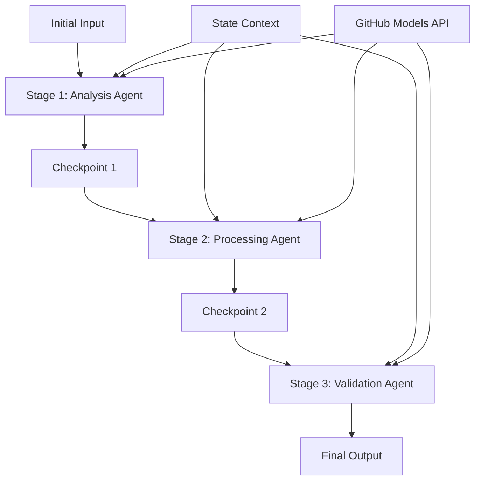

<!--
CO_OP_TRANSLATOR_METADATA:
{
  "original_hash": "1be9c8dcbd79a02d33d2c138684c1394",
  "translation_date": "2025-11-11T13:42:29+00:00",
  "source_file": "08-multi-agent/code_samples/workflows-agent-framework/dotNET/02.dotnet-agent-framework-workflow-ghmodel-sequential.md",
  "language_code": "ur"
}
-->
# ⏩ GitHub ماڈلز کے ساتھ ترتیب وار ایجنٹ ورک فلو (.NET)

## 📋 اعلیٰ درجے کی ترتیب وار پروسیسنگ ٹیوٹوریل

یہ نوٹ بک Microsoft Agent Framework for .NET اور GitHub ماڈلز کا استعمال کرتے ہوئے **ترتیب وار ورک فلو پیٹرنز** کو ظاہر کرتی ہے۔ آپ سیکھیں گے کہ کس طرح پیچیدہ، مرحلہ وار پروسیسنگ پائپ لائنز بنائی جائیں جہاں ایجنٹس ایک مخصوص ترتیب میں کام کرتے ہیں، اور ہر مرحلہ پچھلے مرحلے کے نتائج پر مبنی ہوتا ہے۔

## 🎯 سیکھنے کے مقاصد

### 🔄 **ترتیب وار پروسیسنگ آرکیٹیکچر**
- **لکیری ورک فلو ڈیزائن**: واضح انحصار کے ساتھ مرحلہ وار پروسیسنگ پائپ لائنز بنائیں
- **اسٹیٹ مینجمنٹ**: ترتیب وار ورک فلو مراحل کے دوران سیاق و سباق اور ڈیٹا کا بہاؤ برقرار رکھیں
- **GitHub ماڈلز انضمام**: .NET ورک فلو میں GitHub کے AI ماڈلز کا استعمال کریں
- **انٹرپرائز پائپ لائن پیٹرنز**: پروڈکشن کے لیے تیار ترتیب وار پروسیسنگ سسٹمز بنائیں

### 🏗️ **اعلیٰ درجے کے ترتیب وار پیٹرنز**
- **اسٹیج گیٹ پروسیسنگ**: ورک فلو مراحل کے درمیان توثیق کے چیک پوائنٹس نافذ کریں
- **سیاق و سباق کا تحفظ**: تمام مراحل کے دوران اسٹیٹ اور جمع شدہ معلومات کو برقرار رکھیں
- **خرابیوں کا پھیلاؤ**: ترتیب وار پروسیسنگ چینز میں ناکامیوں کو مؤثر طریقے سے سنبھالیں
- **کارکردگی کی اصلاح**: کم سے کم اوور ہیڈ کے ساتھ مؤثر ترتیب وار عمل درآمد

### 🏢 **انٹرپرائز ترتیب وار ایپلیکیشنز**
- **دستاویز پروسیسنگ پائپ لائن**: کثیر مرحلہ دستاویز تجزیہ، تبدیلی، اور توثیق
- **کوالٹی اشورنس ورک فلو**: ترتیب وار جائزہ، توثیق، اور منظوری کے عمل
- **مواد کی پیداوار پائپ لائن**: تحقیق → تحریر → ترمیم → جائزہ → اشاعت
- **کاروباری عمل کی خودکاریت**: واضح مرحلہ وار انحصار کے ساتھ کثیر مرحلہ کاروباری ورک فلو

## ⚙️ ضروریات اور سیٹ اپ

### 📦 **ضروری NuGet پیکجز**

.NET ترتیب وار ورک فلو کے لیے ضروری پیکجز:

```xml
<!-- Core AI Framework -->
<PackageReference Include="Microsoft.Extensions.AI" Version="9.9.0" />

<!-- Client Model Abstractions -->
<PackageReference Include="System.ClientModel" Version="1.6.1.0" />

<!-- Azure Identity and Async LINQ Support -->
<PackageReference Include="Azure.Identity" Version="1.15.0" />
<PackageReference Include="System.Linq.Async" Version="6.0.3" />

<!-- Local Agent Framework References -->
<!-- Microsoft.Agents.AI.dll - Core agent abstractions -->
<!-- Microsoft.Agents.AI.OpenAI.dll - GitHub Models integration -->
```

### 🔑 **GitHub ماڈلز کی ترتیب**

**ماحول کی ترتیب (.env فائل):**
```env
GITHUB_TOKEN=your_github_personal_access_token
GITHUB_ENDPOINT=https://models.inference.ai.azure.com
GITHUB_MODEL_ID=gpt-4o-mini
```

**ترتیب کا انتظام:**
```csharp
// Load environment variables securely
Env.Load("../../../.env");
var githubToken = Environment.GetEnvironmentVariable("GITHUB_TOKEN");
var githubEndpoint = Environment.GetEnvironmentVariable("GITHUB_ENDPOINT");
var modelId = Environment.GetEnvironmentVariable("GITHUB_MODEL_ID");
```

### 🏗️ **ترتیب وار ورک فلو آرکیٹیکچر**



**اہم اجزاء:**
- **ترتیب وار ایجنٹس**: ہر پروسیسنگ مرحلے کے لیے مخصوص ایجنٹس
- **اسٹیٹ سیاق و سباق**: تمام مراحل کے دوران جمع شدہ ڈیٹا اور فیصلے برقرار رکھتا ہے
- **چیک پوائنٹس**: مراحل کے درمیان توثیق کے پوائنٹس تاکہ معیار اور مستقل مزاجی کو یقینی بنایا جا سکے
- **GitHub ماڈلز کلائنٹ**: تمام ورک فلو مراحل میں مستقل AI ماڈل تک رسائی

## 🎨 **ترتیب وار ورک فلو ڈیزائن پیٹرنز**

### 📝 **دستاویز پروسیسنگ پائپ لائن**
```
Raw Document → Content Extraction → Analysis → Validation → Structured Output
```

### 🎯 **مواد تخلیق ورک فلو**
```
Brief/Requirements → Research → Content Creation → Review → Final Polish
```

### 🔍 **کوالٹی اشورنس پائپ لائن**
```
Initial Review → Technical Validation → Compliance Check → Final Approval
```

### 💼 **کاروباری ذہانت ورک فلو**
```
Data Collection → Processing → Analysis → Report Generation → Distribution
```

## 🏢 **انٹرپرائز ترتیب وار فوائد**

### 🎯 **قابل اعتماد اور معیار**
- **ڈیٹرمنسٹک پروسیسنگ**: منظم مراحل کے ذریعے مستقل، قابل تکرار نتائج
- **معیار کے گیٹس**: ہر مرحلے پر معیار کو یقینی بنانے کے لیے توثیق کے چیک پوائنٹس
- **خرابیوں کی تنہائی**: ایک مرحلے میں مسائل اگلے مراحل تک نہیں پہنچتے
- **آڈٹ ٹریلز**: ہر مرحلے پر فیصلوں اور تبدیلیوں کا مکمل ٹریکنگ

### 📈 **اسکیل ایبلٹی اور کارکردگی**
- **ماڈیولر ڈیزائن**: ہر مرحلے کو آزادانہ طور پر بہتر بنایا جا سکتا ہے
- **وسائل کا انتظام**: مراحل کے دوران AI ماڈل وسائل کا مؤثر استعمال
- **اسٹیٹ کی اصلاح**: بہترین کارکردگی کے لیے مراحل کے درمیان کم سے کم اسٹیٹ ٹرانسفر
- **متوازی مرحلہ گروپس**: متعدد ترتیب وار ورک فلو متوازی طور پر چل سکتے ہیں

### 🔒 **سیکیورٹی اور تعمیل**
- **مرحلہ سطح کی سیکیورٹی**: مختلف پروسیسنگ مراحل کے لیے مختلف سیکیورٹی پالیسیاں
- **ڈیٹا کی توثیق**: ہر چیک پوائنٹ پر ڈیٹا کی سالمیت اور تعمیل کو یقینی بنائیں
- **رسائی کنٹرول**: مختلف ورک فلو مراحل کے لیے تفصیلی اجازتیں
- **ریگولیٹری تعمیل**: منظم پروسیسنگ کے ذریعے ریگولیٹری ضروریات کو پورا کریں

### 📊 **مانیٹرنگ اور تجزیات**
- **مرحلہ سطح کے میٹرکس**: ہر ورک فلو مرحلے کے لیے کارکردگی کی نگرانی
- **بوتل نیک کی شناخت**: سست مراحل کی شناخت اور اصلاح کریں
- **معیار کے میٹرکس**: ہر مرحلے پر معیار اور کامیابی کی شرح کو ٹریک کریں
- **عمل کی اصلاح**: مرحلہ سطح کے تجزیات کی بنیاد پر مسلسل بہتری

آئیے مضبوط ترتیب وار AI پروسیسنگ پائپ لائنز بنائیں! 🚀

## 💻 کوڈ چلانا

مکمل عمل درآمد `02.dotnet-agent-framework-workflow-ghmodel-sequential.cs` میں دستیاب ہے۔ یہ فائل **تین مرحلہ فرنیچر تجزیہ ورک فلو** کو ظاہر کرتی ہے:

1. **مرحلہ 1 - سیلز ایجنٹ**: فرنیچر کی تصاویر کا تجزیہ کرتا ہے اور خریداری کی تجاویز فراہم کرتا ہے
2. **مرحلہ 2 - قیمت ایجنٹ**: تفصیلی قیمتوں کا تجزیہ اور بجٹ کے اختیارات فراہم کرتا ہے
3. **مرحلہ 3 - کوٹ ایجنٹ**: Markdown فارمیٹ میں ایک پیشہ ور کوٹ دستاویز تیار کرتا ہے

### 🏗️ **ورک فلو آرکیٹیکچر**

```
Image Input → Sales Analysis → Price Estimation → Quote Generation → Final Output
```

ہر ایجنٹ:
- پچھلے مرحلے کے آؤٹ پٹ کو سیاق و سباق کے طور پر وصول کرتا ہے
- پچھلے تجزیے پر خصوصی مہارت کے ساتھ کام کرتا ہے
- اسٹیٹ مینجمنٹ کے ذریعے ورک فلو تسلسل کو برقرار رکھتا ہے

### 🚀 مثال چلانا

**ضروریات:**
- ایک فرنیچر تصویر `../imgs/home.png` پر رکھیں (یا `imgPath` ویری ایبل کو اپ ڈیٹ کریں)
- اپنی `.env` فائل کو GitHub ماڈلز کی اسناد کے ساتھ ترتیب دیں

```bash
# Make the script executable (Unix/Linux/macOS)
chmod +x 02.dotnet-agent-framework-workflow-ghmodel-sequential.cs

# Run the sequential workflow
./02.dotnet-agent-framework-workflow-ghmodel-sequential.cs
```

یا ونڈوز پر:
```powershell
dotnet run 02.dotnet-agent-framework-workflow-ghmodel-sequential.cs
```

### 📝 متوقع آؤٹ پٹ

ورک فلو:
1. **سیلز ایجنٹ**: تصویر سے فرنیچر آئٹمز کی شناخت کرے گا اور تجاویز فراہم کرے گا
2. **قیمت ایجنٹ**: تفصیلی قیمتوں کا تجزیہ بجٹ کے درجات اور خریداری کی تجاویز کے ساتھ شامل کرے گا
3. **کوٹ ایجنٹ**: تمام معلومات کو یکجا کرتے ہوئے ایک فارمیٹڈ کوٹ دستاویز تیار کرے گا

حتمی آؤٹ پٹ تصویر کے تجزیے پر مبنی ایک جامع، پیشہ ور فرنیچر کوٹ ہوگا۔

### 🔧 حسب ضرورت اختیارات

**ایجنٹ کے رویے میں ترمیم کریں:**
```csharp
// Adjust agent instructions to change their focus
const string SalesAgentInstructions = "Your custom instructions...";
```

**ترتیب وار بہاؤ کو تبدیل کریں:**
```csharp
// Add or reorder workflow stages
var workflow = new WorkflowBuilder(salesagent)
    .AddEdge(salesagent, priceagent)
    .AddEdge(priceagent, quoteagent)
    .AddEdge(quoteagent, newAgent)  // Add another stage
    .Build();
```

**مختلف ان پٹ استعمال کریں:**
```csharp
// Process text instead of images
ChatMessage userMessage = new ChatMessage(ChatRole.User, [
    new TextContent("Analyze pricing for a modern living room set")
]);
```

### 🎯 حقیقی دنیا کی ایپلیکیشنز

یہ ترتیب وار پیٹرن مثالی ہے:
- **ای کامرس**: پروڈکٹ تجزیہ → قیمتیں → کوٹ جنریشن
- **ریئل اسٹیٹ**: پراپرٹی تجزیہ → قیمت کا تعین → لسٹنگ تخلیق
- **انشورنس**: کلیم تجزیہ → تشخیص → کوٹ جنریشن
- **مواد تخلیق**: تحقیق → تحریر → ترمیم → اشاعت

### 🔍 اسٹیٹ فلو کو سمجھنا

ترتیب میں ہر ایجنٹ وصول کرتا ہے:
- **اصل ان پٹ**: ابتدائی صارف پیغام (تصویر + متن)
- **پچھلے ایجنٹ کے آؤٹ پٹس**: گفتگو کی تاریخ میں تمام پچھلے ایجنٹ کے جوابات
- **جمع شدہ سیاق و سباق**: مکمل اسٹیٹ جو پورے ورک فلو کے دوران برقرار رہتا ہے

یہ پیچیدہ کثیر مرحلہ پروسیسنگ کو قابل بناتا ہے جہاں ہر ایجنٹ تمام پچھلے مراحل کے جامع سیاق و سباق پر مبنی کام کرتا ہے۔

---

<!-- CO-OP TRANSLATOR DISCLAIMER START -->
**اعلانِ لاتعلقی**:  
یہ دستاویز AI ترجمہ سروس [Co-op Translator](https://github.com/Azure/co-op-translator) کا استعمال کرتے ہوئے ترجمہ کی گئی ہے۔ ہم درستگی کی بھرپور کوشش کرتے ہیں، لیکن براہ کرم آگاہ رہیں کہ خودکار ترجمے میں غلطیاں یا غیر درستیاں ہو سکتی ہیں۔ اصل دستاویز کو اس کی اصل زبان میں مستند ذریعہ سمجھا جانا چاہیے۔ اہم معلومات کے لیے، پیشہ ور انسانی ترجمہ کی سفارش کی جاتی ہے۔ اس ترجمے کے استعمال سے پیدا ہونے والی کسی بھی غلط فہمی یا غلط تشریح کے لیے ہم ذمہ دار نہیں ہیں۔
<!-- CO-OP TRANSLATOR DISCLAIMER END -->