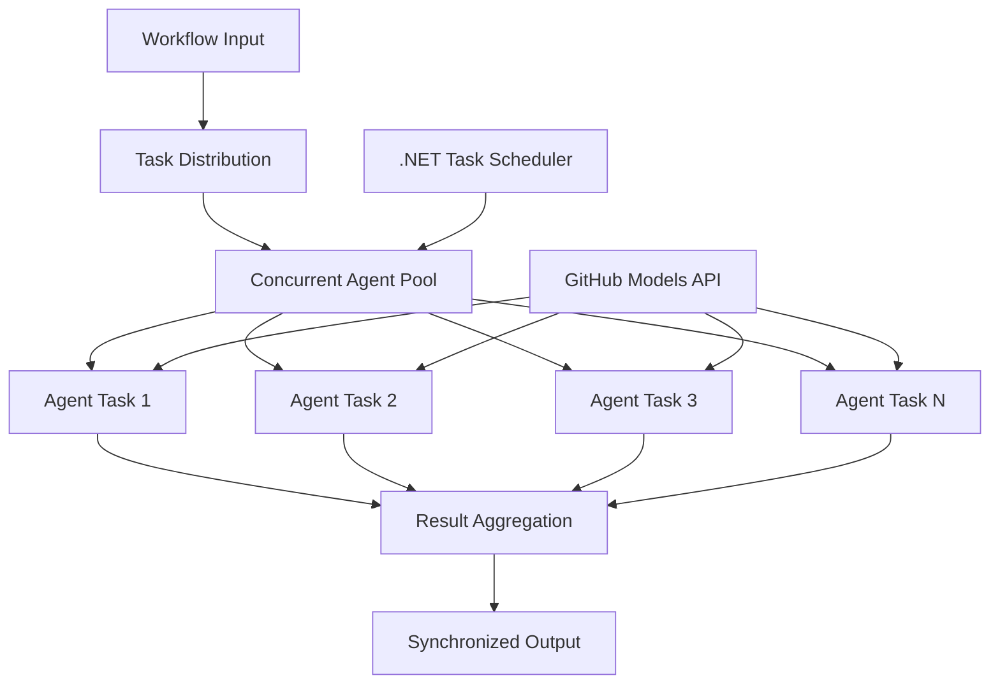

<!--
CO_OP_TRANSLATOR_METADATA:
{
  "original_hash": "b9c6e32c9b5f2fed20b6916984440d88",
  "translation_date": "2025-11-11T13:08:16+00:00",
  "source_file": "08-multi-agent/code_samples/workflows-agent-framework/dotNET/03.dotnet-agent-framework-workflow-ghmodel-concurrent.md",
  "language_code": "ur"
}
-->
# ⚡ گٹ ہب ماڈلز (.NET) کے ساتھ ہم وقتی ایجنٹ ورک فلو

## 📋 اعلی کارکردگی کے متوازی پروسیسنگ کا سبق

یہ نوٹ بک **ہم وقتی ورک فلو پیٹرنز** کو Microsoft Agent Framework for .NET اور گٹ ہب ماڈلز کے ساتھ استعمال کرنے کا مظاہرہ کرتی ہے۔ آپ سیکھیں گے کہ کس طرح اعلی کارکردگی، متوازی پروسیسنگ ورک فلو بنائے جائیں جو ایک ساتھ متعدد AI ایجنٹس کو چلا کر throughput کو زیادہ سے زیادہ کریں، جبکہ ہم آہنگی اور ڈیٹا مستقل مزاجی کو برقرار رکھیں۔

## 🎯 سیکھنے کے مقاصد

### 🚀 **ہم وقتی پروسیسنگ کی بنیادی باتیں**
- **متوازی ایجنٹ عملدرآمد**: زیادہ سے زیادہ کارکردگی کے لیے ایک ساتھ متعدد AI ایجنٹس چلائیں
- **Async/Await پیٹرنز**: .NET کے async پروگرامنگ ماڈل کا استعمال کرتے ہوئے مؤثر ہم وقتی عملدرآمد
- **گٹ ہب ماڈلز انضمام**: گٹ ہب کے AI ماڈل انفرنس سروس کے لیے متعدد ہم وقتی کالز کو ہم آہنگ کریں
- **وسائل کا انتظام**: ہم وقتی آپریشنز کے دوران AI ماڈل وسائل کو مؤثر طریقے سے منظم کریں

### 🏗️ **اعلی درجے کی ہم وقتی آرکیٹیکچر**
- **ٹاسک پر مبنی متوازی عملدرآمد**: .NET Task Parallel Library کا استعمال کرتے ہوئے بہترین ہم وقتی عملدرآمد
- **ہم آہنگی کے پیٹرنز**: ہم وقتی ایجنٹس کو ہم آہنگ کریں اور ریس کنڈیشنز سے بچیں
- **لوڈ بیلنسنگ**: دستیاب ہم وقتی پروسیسنگ کی صلاحیت کے مطابق کام کو مؤثر طریقے سے تقسیم کریں
- **خرابی برداشت**: انفرادی ایجنٹ کی ناکامیوں کو پورے ورک فلو کو روکنے کے بغیر سنبھالیں

### 🏢 **انٹرپرائز ہم وقتی ایپلیکیشنز**
- **اعلی حجم دستاویز پروسیسنگ**: ایک ساتھ متعدد دستاویزات پر عملدرآمد کریں
- **ریئل ٹائم مواد کا تجزیہ**: آنے والے ڈیٹا اسٹریمز کا ہم وقتی تجزیہ
- **بیچ پروسیسنگ کی اصلاح**: بڑے پیمانے پر ڈیٹا پروسیسنگ آپریشنز کے لیے throughput کو زیادہ سے زیادہ کریں
- **ملٹی موڈل تجزیہ**: مختلف مواد کی اقسام اور فارمیٹس کا متوازی پروسیسنگ

## ⚙️ ضروریات اور سیٹ اپ

### 📦 **ضروری NuGet پیکجز**

اعلی کارکردگی کے ہم وقتی ورک فلو کے لیے ضروری پیکجز:

```xml
<!-- Core AI Framework with Async Support -->
<PackageReference Include="Microsoft.Extensions.AI" Version="9.9.0" />

<!-- Client Model Abstractions for API Communication -->
<PackageReference Include="System.ClientModel" Version="1.6.1.0" />

<!-- Azure Identity and Async LINQ for Advanced Operations -->
<PackageReference Include="Azure.Identity" Version="1.15.0" />
<PackageReference Include="System.Linq.Async" Version="6.0.3" />

<!-- Local Agent Framework References -->
<!-- Microsoft.Agents.AI.dll - Core agent abstractions with async support -->
<!-- Microsoft.Agents.AI.OpenAI.dll - GitHub Models integration with concurrency -->
```

### 🔑 **گٹ ہب ماڈلز کی ترتیب**

**ماحولیاتی سیٹ اپ (.env فائل):**
```env
GITHUB_TOKEN=your_github_personal_access_token
GITHUB_ENDPOINT=https://models.inference.ai.azure.com
GITHUB_MODEL_ID=gpt-4o-mini
```

**ہم وقتی پروسیسنگ کے خیالات:**
```csharp
// Configure for concurrent operations
var clientOptions = new OpenAIClientOptions()
{
    Endpoint = new Uri(githubEndpoint),
    // Configure connection pooling for concurrent requests
    NetworkTimeout = TimeSpan.FromMinutes(5)
};
```

### 🏗️ **ہم وقتی ورک فلو آرکیٹیکچر**



**اہم اجزاء:**
- **ٹاسک متوازی لائبریری**: .NET کی ہم وقتی آپریشنز کے لیے بلٹ ان سپورٹ
- **ایجنٹ پول**: متوازی پروسیسنگ کے لیے متعدد ایجنٹ انسٹینسز
- **نتائج کا مجموعہ**: ہم وقتی ایجنٹ کے نتائج کو ہم آہنگ کریں اور ضم کریں
- **ہم آہنگی کے پوائنٹس**: ہم وقتی آپریشنز کے دوران ڈیٹا مستقل مزاجی کو یقینی بنائیں

## 🎨 **ہم وقتی ورک فلو ڈیزائن پیٹرنز**

### 🔍 **متوازی تحقیق اور تجزیہ**
```
Research Topic → Concurrent Research Agents → Result Synthesis → Final Report
```

### 📊 **ملٹی سورس ڈیٹا پروسیسنگ**
```
Data Sources → Parallel Processing Agents → Data Integration → Unified Output
```

### 🎭 **مواد تخلیق پائپ لائن**
```
Content Requirements → Concurrent Content Generators → Quality Review → Final Content
```

### 🔄 **Fan-Out/Fan-In پروسیسنگ**
```
Single Input → Multiple Concurrent Processors → Result Aggregation → Single Output
```

## 🏢 **انٹرپرائز کارکردگی کے فوائد**

### ⚡ **throughput اور scalability**
- **لکیری کارکردگی اسکیلنگ**: throughput بڑھانے کے لیے مزید ہم وقتی ایجنٹس شامل کریں
- **وسائل کا استعمال**: دستیاب AI ماڈل کی صلاحیت کی زیادہ سے زیادہ کارکردگی
- **پروسیسنگ وقت میں کمی**: متوازی عملدرآمد کے ذریعے وقت میں نمایاں کمی
- **لچکدار اسکیلنگ**: ورک لوڈ کے مطابق ہم وقتی ایجنٹ کی تعداد کو متحرک طور پر ایڈجسٹ کریں

### 🛡️ **قابل اعتماد اور لچکدار**
- **خرابی کی تنہائی**: انفرادی ایجنٹ کی ناکامی دیگر ہم وقتی آپریشنز کو متاثر نہیں کرتی
- **گریسفل ڈیگریڈیشن**: نظام کم ایجنٹ کی صلاحیت کے ساتھ کام جاری رکھتا ہے
- **خرابی کی بازیابی**: ناکام ہم وقتی آپریشنز کے لیے خودکار ریٹری میکانزم
- **کام کی تقسیم**: دستیاب ایجنٹس کے درمیان کام کی مساوی تقسیم

### 📊 **کارکردگی کی نگرانی**
- **ہم وقتی عملدرآمد میٹرکس**: تمام متوازی آپریشنز کی کارکردگی کو ٹریک کریں
- **وسائل کے استعمال کے تجزیات**: CPU، میموری، اور نیٹ ورک کے استعمال کی نگرانی کریں
- **throughput تجزیہ**: ہم وقتی پروسیسنگ سے حاصل ہونے والے کارکردگی کے فوائد کی پیمائش کریں
- **رکاوٹوں کا پتہ لگانا**: کارکردگی کی رکاوٹوں کی شناخت اور حل کریں

### 🔧 **ترقی اور آپریشنز**
- **Async پروگرامنگ ماڈل**: .NET کے پختہ async/await پیٹرنز کا فائدہ اٹھائیں
- **ٹاسک ہم آہنگی**: بلٹ ان ٹاسک مینجمنٹ اور ہم آہنگی کی صلاحیتیں
- **استثنا ہینڈلنگ**: ہم وقتی آپریشنز کے لیے جامع خرابی ہینڈلنگ
- **ڈیبگنگ سپورٹ**: ہم وقتی ورک فلو کے لیے Visual Studio ڈیبگنگ ٹولز

چلیں .NET کے ساتھ اعلی کارکردگی کے ہم وقتی AI ورک فلو بنائیں! 🚀

## 💻 کوڈ چلانا

مکمل عملدرآمد `03.dotnet-agent-framework-workflow-ghmodel-concurrent.cs` میں دستیاب ہے۔ یہ فائل **Fan-Out/Fan-In ہم وقتی ورک فلو** کو سفر کی منصوبہ بندی کے لیے مظاہرہ کرتی ہے:

### 🏗️ **ورک فلو آرکیٹیکچر**

```
User Request → ConcurrentStartExecutor → [Researcher Agent || Planner Agent] → ConcurrentAggregationExecutor → Final Output
```

**اہم اجزاء:**

1. **ConcurrentStartExecutor**: صارف کی درخواست کو ایک ساتھ تمام ایجنٹس کو نشر کرتا ہے
2. **Researcher Agent**: مقامات اور کششوں کا ہم وقتی تجزیہ کرتا ہے
3. **Planner Agent**: تفصیلی سفر کے منصوبے ہم وقتی طور پر بناتا ہے
4. **ConcurrentAggregationExecutor**: دونوں ایجنٹس کے نتائج کو جمع اور ضم کرتا ہے

### 🎯 **Fan-Out/Fan-In پیٹرن**

یہ ورک فلو کلاسک **Fan-Out/Fan-In** پیٹرن کو مظاہرہ کرتا ہے:
- **Fan-Out**: ایک ان پٹ پیغام کو ایک ساتھ متعدد ایجنٹس کو نشر کیا جاتا ہے
- **ہم وقتی پروسیسنگ**: متعدد ایجنٹس ایک ہی کام پر متوازی کام کرتے ہیں
- **Fan-In**: تمام ایجنٹس کے نتائج کو جمع اور ایک آؤٹ پٹ میں ضم کیا جاتا ہے

### 🚀 مثال چلانا

```bash
# Make the script executable (Unix/Linux/macOS)
chmod +x 03.dotnet-agent-framework-workflow-ghmodel-concurrent.cs

# Run the concurrent workflow
./03.dotnet-agent-framework-workflow-ghmodel-concurrent.cs
```

یا ونڈوز پر:
```powershell
dotnet run 03.dotnet-agent-framework-workflow-ghmodel-concurrent.cs
```

### 📝 متوقع آؤٹ پٹ

ورک فلو:
1. **درخواست نشر کرے گا**: "دسمبر میں سیئٹل کا سفر منصوبہ بنائیں" دونوں ایجنٹس کو بھیجے گا
2. **ہم وقتی پروسیسنگ**: دونوں ایجنٹس ایک ساتھ کام کریں گے:
   - Researcher کششوں اور تفصیلات کی شناخت کرے گا
   - Planner سفر کا منصوبہ اور لاجسٹکس بنائے گا
3. **مجموعہ**: دونوں جوابات کو جامع آؤٹ پٹ میں ضم کرے گا
4. **نتائج دکھائیں**: تمام معلومات کے ساتھ ضم شدہ سفر کا منصوبہ دکھائیں

### 🔧 حسب ضرورت کے اختیارات

**مزید ہم وقتی ایجنٹس شامل کریں:**
```csharp
// Create additional specialized agents
AIAgent budgetAgent = openAIClient.GetChatClient(github_model_id).CreateAIAgent(
    name: "Budget-Agent", instructions: "Calculate travel costs...");

// Add to fan-out
var workflow = new WorkflowBuilder(startExecutor)
    .AddFanOutEdge(startExecutor, targets: [researcherAgent, plannerAgent, budgetAgent])
    .AddFanInEdge(aggregationExecutor, sources: [researcherAgent, plannerAgent, budgetAgent])
    .WithOutputFrom(aggregationExecutor)
    .Build();

// Update aggregation count
if (this._messages.Count == 3) { ... }
```

**ایجنٹ کی ہدایات میں ترمیم کریں:**
```csharp
const string ResearcherAgentInstructions = "Your custom instructions for research...";
const string PlanAgentInstructions = "Your custom instructions for planning...";
```

**کام تبدیل کریں:**
```csharp
StreamingRun run = await InProcessExecution.StreamAsync(
    workflow, 
    "Plan a European vacation for 2 weeks in summer"
);
```

### 🎯 حقیقی دنیا کی ایپلیکیشنز

یہ ہم وقتی پیٹرن مثالی ہے:
- **مواد تخلیق**: متعدد مصنفین ایک ساتھ مختلف سیکشنز تخلیق کر رہے ہیں
- **کوڈ کا جائزہ**: متعدد جائزہ لینے والے مختلف زاویوں سے کوڈ کا تجزیہ کر رہے ہیں
- **مارکیٹ ریسرچ**: مختلف مارکیٹ حصوں کا متوازی تجزیہ
- **دستاویز پروسیسنگ**: ہم وقتی نکالنا، تجزیہ کرنا، اور توثیق کرنا
- **ملٹی پرسپیکٹیو تجزیہ**: ایک ہی ان پٹ پر مختلف نقطہ نظر حاصل کرنا

### 🔍 حسب ضرورت Executors کو سمجھنا

**ConcurrentStartExecutor:**
- `IMessageHandler<string>` کو نافذ کرتا ہے تاکہ string ان پٹ قبول کرے
- تمام منسلک ایجنٹس کو پیغامات نشر کرتا ہے
- ہم وقتی پروسیسنگ کو متحرک کرنے کے لیے `TurnToken` بھیجتا ہے

**ConcurrentAggregationExecutor:**
- `IMessageHandler<ChatMessage>` کو نافذ کرتا ہے تاکہ ایجنٹ کے جوابات وصول کرے
- تھریڈ سیف طریقے سے پیغامات جمع کرتا ہے
- جب تمام متوقع جوابات پہنچ جائیں تو مجموعہ کرتا ہے
- `context.YieldOutputAsync()` کا استعمال کرتے ہوئے حتمی آؤٹ پٹ دیتا ہے

### ⚡ کارکردگی کے فوائد

**ہم وقتی بمقابلہ ترتیب وار:**
- ترتیب وار: Agent1 (30s) → Agent2 (30s) = **کل 60 سیکنڈ**
- ہم وقتی: Agent1 (30s) || Agent2 (30s) = **کل 30 سیکنڈ**

**throughput میں بہتری**: N ہم وقتی ایجنٹس کے لیے N× تیز (ورک لوڈ اور وسائل پر منحصر)

### 🛡️ خرابی ہینڈلنگ

ورک فلو انفرادی ایجنٹ کی ناکامیوں کو مؤثر طریقے سے سنبھالتا ہے:
- اگر ایک ایجنٹ ناکام ہو جائے تو دوسرے پروسیسنگ جاری رکھتے ہیں
- Aggregator ٹائم آؤٹ منطق نافذ کر سکتا ہے
- اگر ضرورت ہو تو جزوی نتائج واپس کیے جا سکتے ہیں

### 📊 اعلی درجے کی خصوصیات

**متحرک ایجنٹ کی تعداد:**
مجموعہ منطق کو متغیر ایجنٹ کی تعداد کی حمایت کرنے کے لیے تبدیل کریں:

```csharp
private int _expectedAgentCount;
private readonly List<ChatMessage> _messages = [];

public async ValueTask HandleAsync(ChatMessage message, IWorkflowContext context)
{
    this._messages.Add(message);
    if (this._messages.Count == _expectedAgentCount)
    {
        // Process aggregation
    }
}
```

یہ ہم وقتی ورک فلو پیٹرن اعلی کارکردگی، اسکیل ایبل AI ایجنٹ سسٹمز بنانے کے لیے ضروری ہے!

---

<!-- CO-OP TRANSLATOR DISCLAIMER START -->
**اعلانِ لاتعلقی**:  
یہ دستاویز AI ترجمہ سروس [Co-op Translator](https://github.com/Azure/co-op-translator) کا استعمال کرتے ہوئے ترجمہ کی گئی ہے۔ ہم درستگی کی بھرپور کوشش کرتے ہیں، لیکن براہ کرم آگاہ رہیں کہ خودکار ترجمے میں غلطیاں یا غیر درستیاں ہو سکتی ہیں۔ اصل دستاویز کو اس کی اصل زبان میں مستند ذریعہ سمجھا جانا چاہیے۔ اہم معلومات کے لیے، پیشہ ور انسانی ترجمہ کی سفارش کی جاتی ہے۔ اس ترجمے کے استعمال سے پیدا ہونے والی کسی بھی غلط فہمی یا غلط تشریح کے لیے ہم ذمہ دار نہیں ہیں۔
<!-- CO-OP TRANSLATOR DISCLAIMER END -->