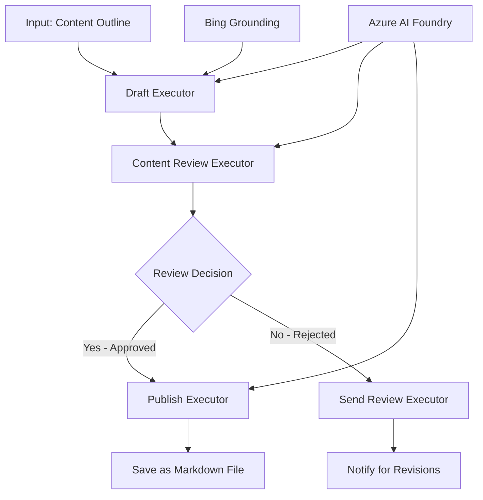

<!--
CO_OP_TRANSLATOR_METADATA:
{
  "original_hash": "8abd335151cee553293b637ee3d80d10",
  "translation_date": "2025-11-11T12:03:56+00:00",
  "source_file": "08-multi-agent/code_samples/workflows-agent-framework/dotNET/04.dotnet-agent-framework-workflow-aifoundry-condition.md",
  "language_code": "ur"
}
-->
# 🔀 Azure AI Foundry (.NET) کے ساتھ مشروط ایجنٹ ورک فلو

## 📋 ذہین فیصلہ پر مبنی ورک فلو ٹیوٹوریل

یہ نوٹ بک Azure AI Foundry اور Microsoft Agent Framework for .NET کا استعمال کرتے ہوئے **مشروط ورک فلو پیٹرنز** کو ظاہر کرتی ہے۔ آپ سیکھیں گے کہ کس طرح پیچیدہ، فیصلہ پر مبنی ورک فلو بنائیں جو AI تجزیہ، کاروباری اصولوں، اور متحرک حالات کی بنیاد پر پروسیسنگ کو ذہانت سے روٹ کرے، تاکہ انٹرپرائز گریڈ آٹومیشن حاصل کی جا سکے۔

## 🎯 سیکھنے کے مقاصد

### 🧠 **ذہین فیصلہ سازی کی ساخت**
- **مشروط منطق کا نفاذ**: متعدد شاخوں کے ساتھ پیچیدہ فیصلہ درخت بنائیں
- **AI سے چلنے والا روٹنگ**: Azure AI Foundry ماڈلز کا استعمال کرتے ہوئے ذہین روٹنگ کے فیصلے کریں
- **متحرک ورک فلو کی موافقت**: رن ٹائم تجزیہ اور حالات کی بنیاد پر ورک فلو کے رویے میں ترمیم کریں
- **کاروباری اصولوں کا انضمام**: ورک فلو میں کاروباری منطق اور تعمیل کی ضروریات کو شامل کریں

### 🔀 **اعلی درجے کے مشروط پیٹرنز**
- **کثیر معیار فیصلہ سازی**: روٹنگ کے فیصلوں کے لیے متعدد عوامل کا جائزہ لیں
- **سیاق و سباق سے آگاہ پروسیسنگ**: جمع شدہ ورک فلو سیاق و سباق اور تاریخ کی بنیاد پر فیصلے کریں
- **متحرک ورک فلو میں ترمیم**: حقیقی وقت کے حالات کی بنیاد پر پروسیسنگ کے راستے کو متحرک طور پر ایڈجسٹ کریں
- **قواعد انجن کا انضمام**: ورک فلو میں پیچیدہ کاروباری اصولوں کے انجن کو نافذ کریں

### 🏢 **انٹرپرائز مشروط ایپلیکیشنز**
- **دستاویز کی درجہ بندی اور روٹنگ**: دستاویزات کو خود بخود مناسب ورک فلو میں درجہ بندی اور روٹ کریں
- **کسٹمر سروس ٹرائیج**: کسٹمر کی انکوائری کو خصوصی ہینڈلنگ ٹیموں کی طرف ذہانت سے روٹ کریں
- **تعمیل اور خطرے کی پروسیسنگ**: خطرے کی تشخیص کی بنیاد پر مختلف توثیق اور جائزہ عمل کو لاگو کریں
- **معیار کی یقین دہانی کے ورک فلو**: معیار کے میٹرکس کی بنیاد پر مواد کو مناسب جائزہ عمل کے ذریعے روٹ کریں

## ⚙️ ضروریات اور سیٹ اپ

### 📦 **ضروری NuGet پیکجز**

مشروط ورک فلو پروسیسنگ کے لیے اعلی درجے کے پیکجز:

```xml
<!-- Core AI Framework -->
<PackageReference Include="Microsoft.Extensions.AI" Version="9.9.0" />

<!-- Azure AI Agents with Persistent State -->
<PackageReference Include="Azure.AI.Agents.Persistent" Version="1.2.0-beta.5" />

<!-- Azure Identity and Utilities -->
<PackageReference Include="Azure.Identity" Version="1.15.0" />
<PackageReference Include="System.Linq.Async" Version="6.0.3" />
<PackageReference Include="DotNetEnv" Version="3.1.1" />

<!-- Local Workflow Framework References -->
<!-- Microsoft.Agents.Workflows.dll - Advanced workflow orchestration -->
<!-- Microsoft.Agents.AI.AzureAI.dll - Azure AI Foundry integration -->
<!-- Microsoft.Agents.AI.dll - Core agent abstractions -->
```

### 🔑 **Azure AI Foundry کی تشکیل**

**ضروری Azure وسائل:**
- مشروط پروسیسنگ ماڈلز کے ساتھ Azure AI Foundry ورک اسپیس
- مناسب کمپیوٹ کوٹہ اور اجازتوں کے ساتھ Azure سبسکرپشن
- فیصلہ سازی اور مواد کے تجزیہ کے لیے تعینات AI ماڈلز
- (اختیاری) Bing Search API کنکشن گراؤنڈنگ صلاحیتوں کے لیے

**ماحول کی تشکیل (.env فائل):**
```env
# Azure AI Foundry Configuration
AZURE_AI_PROJECT_ENDPOINT=https://your-project.cognitiveservices.azure.com/
BING_CONNECTION_ID=your-bing-connection-id
```

**تصدیق کی ترتیب:**
```csharp
// Azure CLI or Managed Identity authentication
using Azure.Identity;
var credential = new AzureCliCredential();

// Load environment configuration
DotNetEnv.Env.Load("../../../.env");
```

### 🏗️ **مشروط ورک فلو کی ساخت**



**اہم اجزاء:**
- **ڈرافٹ ایگزیکیوٹر**: AI ایجنٹ جو ابتدائی مواد کے ڈرافٹس کو خاکوں سے تخلیق کرتا ہے
- **مواد جائزہ ایگزیکیوٹر**: AI ایجنٹ جو ڈرافٹ کے معیار اور تعمیل کا جائزہ لیتا ہے
- **مشروط روٹنگ**: جائزہ کے نتائج کی بنیاد پر فیصلہ منطق جو روٹ کرتا ہے
- **پبلش/جائزہ کے راستے**: منظور شدہ بمقابلہ مسترد شدہ مواد کے لیے علیحدہ پروسیسنگ راستے
- **ریاست کا انتظام**: ورک فلو کے دوران مواد اور جائزہ سیاق و سباق کو برقرار رکھتا ہے

## 🎨 **مشروط ورک فلو ڈیزائن پیٹرنز**

### 📋 **معیار کے گیٹس کے ساتھ مواد کی پیداوار**
```
Outline → Draft Creation → Quality Review → {Approve: Publish | Reject: Revise}
```

### 🎯 **خطرے پر مبنی دستاویز پروسیسنگ**
```
Document → Risk Assessment → {Low: Standard | High: Enhanced Review}
```

### 🔍 **ذہین کسٹمر سروس روٹنگ**
```
Customer Query → Analysis → {Simple: FAQ Bot | Complex: Human Agent}
```

### 💼 **تعمیل پر مبنی ورک فلو**
```
Content → Compliance Check → {Pass: Publish | Fail: Legal Review}
```

## 🏢 **انٹرپرائز مشروط فوائد**

### 🎯 **ذہین آٹومیشن**
- **سمارٹ فیصلہ سازی**: مواد کے تجزیہ اور سیاق و سباق کی بنیاد پر AI سے چلنے والے روٹنگ کے فیصلے
- **متحرک پروسیسنگ**: ورک فلو جو بدلتے ہوئے حالات کی بنیاد پر خود بخود ایڈجسٹ ہوتے ہیں
- **کاروباری اصولوں کا نفاذ**: پیچیدہ کاروباری منطق اور پالیسیوں کا خودکار اطلاق
- **سیاق و سباق سے آگاہ روٹنگ**: مکمل ورک فلو تاریخ اور جمع شدہ سیاق و سباق کی بنیاد پر فیصلے

### 📈 **آپریشنل عمدگی**
- **وسائل کی مختص کاری کو بہتر بنائیں**: کام کو سب سے زیادہ مناسب ماہرین اور عملوں کی طرف روٹ کریں
- **دستی مداخلت کو کم کریں**: خودکار فیصلہ سازی انسانی روٹنگ کی ضرورت کو کم کرتی ہے
- **تیز تر حل کے اوقات**: مناسب مہارت اور پروسیسنگ صلاحیتوں کی طرف براہ راست روٹنگ
- **یکساں اطلاق**: کاروباری اصولوں اور فیصلہ معیار کا یکساں اطلاق

### 🛡️ **خطرے کا انتظام اور تعمیل**
- **خطرے کی خودکار تشخیص**: مواد اور صورتحال کے خطرے کی سطح کا AI سے چلنے والا جائزہ
- **تعمیل کا نفاذ**: مطلوبہ ریگولیٹری عمل کے ذریعے خودکار روٹنگ
- **سیکیورٹی پروٹوکول کا اطلاق**: خطرے کی تشخیص کی بنیاد پر بہتر حفاظتی اقدامات کا اطلاق
- **آڈٹ ٹریل کا انتظام**: روٹنگ کے فیصلوں اور منطق کی مکمل دستاویزات

### 📊 **تجزیات اور مسلسل بہتری**
- **فیصلہ تجزیات**: روٹنگ کے فیصلوں کی تاثیر اور درستگی کو ٹریک کریں
- **پیٹرن کی شناخت**: وقت کے ساتھ روٹنگ کے فیصلوں میں رجحانات اور پیٹرنز کی شناخت کریں
- **کارکردگی کی اصلاح**: فیصلہ معیار اور روٹنگ کی کارکردگی کی مسلسل بہتری
- **کاروباری ذہانت**: مواد کی خصوصیات اور پروسیسنگ کی ضروریات کے بارے میں بصیرت

### 🔧 **تکنیکی عمدگی**
- **مستقل ریاست کا انتظام**: ورک فلو کے نفاذ کے دوران پیچیدہ ریاست کو برقرار رکھیں
- **قابل توسیع ساخت**: اعلی حجم مشروط پروسیسنگ کی ضروریات کو سنبھالیں
- **انضمام کی صلاحیتیں**: موجودہ کاروباری نظاموں اور عملوں کے ساتھ ہموار انضمام
- **مانیٹرنگ اور مشاہدہ**: ورک فلو کی کارکردگی اور فیصلوں کا جامع ٹریکنگ

.NET کے ساتھ ذہین، فیصلہ پر مبنی انٹرپرائز ورک فلو بنائیں! 🚀

## 💻 کوڈ چلانا

مکمل نفاذ `04.dotnet-agent-framework-workflow-aifoundry-condition.cs` میں دستیاب ہے۔ یہ **معیار کے گیٹس کے ساتھ مواد کی پیداوار ورک فلو** کو ظاہر کرتا ہے:

### 🏗️ **ورک فلو کی ساخت**

```
Content Outline → Draft Creation → Quality Review → Conditional Routing:
                                                      ├─ Approved (>200 words) → Publish
                                                      └─ Rejected (<200 words) → Review Notification
```

**ورک فلو میں ایجنٹس:**
1. **ایونجلسٹ ایجنٹ**: Bing گراؤنڈنگ کے ساتھ خاکوں سے ٹیوٹوریل ڈرافٹس تخلیق کرتا ہے
2. **مواد جائزہ ایجنٹ**: ڈرافٹ کے معیار کا جائزہ لیتا ہے (لفظوں کی تعداد، مکملیت)
3. **پبلشر ایجنٹ**: منظور شدہ مواد کو ٹائم اسٹیمپڈ Markdown فائلوں کے طور پر محفوظ کرتا ہے

**حسب ضرورت ایگزیکیوٹرز:**
1. **DraftExecutor**: ڈرافٹ تخلیق کو منظم کرتا ہے
2. **ContentReviewExecutor**: معیار کا جائزہ لیتا ہے
3. **PublishExecutor**: منظور شدہ مواد کی اشاعت کو سنبھالتا ہے
4. **SendReviewExecutor**: مسترد شدہ مواد کی اطلاعات کا انتظام کرتا ہے

### 🚀 مثال چلانا

**ضروریات:**
- Azure AI Foundry ورک اسپیس تشکیل شدہ
- Azure CLI تصدیق (`az login`)
- (اختیاری) Bing Search کنکشن گراؤنڈنگ کے لیے

```bash
# Make the script executable (Unix/Linux/macOS)
chmod +x 04.dotnet-agent-framework-workflow-aifoundry-condition.cs

# Run the conditional workflow
./04.dotnet-agent-framework-workflow-aifoundry-condition.cs
```

یا Windows پر:
```powershell
dotnet run 04.dotnet-agent-framework-workflow-aifoundry-condition.cs
```

### 📝 متوقع نتائج

ورک فلو:
1. **ایجنٹس تخلیق کریں**: تین خصوصی Azure AI Foundry ایجنٹس کو شروع کریں
2. **ڈرافٹ تخلیق کریں**: ایونجلسٹ ایجنٹ خاکے سے ٹیوٹوریل ڈرافٹ تخلیق کرتا ہے
3. **مواد کا جائزہ لیں**: مواد جائزہ لینے والا ڈرافٹ کے معیار کا جائزہ لیتا ہے
4. **مشروط روٹنگ**:
   - **اگر منظور شدہ (>200 الفاظ)**: پبلش ایگزیکیوٹر Markdown فائل کے طور پر محفوظ کرتا ہے
   - **اگر مسترد شدہ (<200 الفاظ)**: جائزہ اطلاع بھیجیں
5. **نتائج دکھائیں**: حتمی ورک فلو کا نتیجہ دکھائیں

### 🔧 حسب ضرورت اختیارات

**جائزہ معیار میں ترمیم کریں:**
```csharp
const string ContentReviewerInstructions = @"
You are a content reviewer...
1. Check if content is more than 500 words (instead of 200)
2. Verify technical accuracy
3. Ensure proper formatting
...";
```

**مزید مشروط راستے شامل کریں:**
```csharp
var workflow = new WorkflowBuilder(draftExecutor)
    .AddEdge(draftExecutor, contentReviewerExecutor)
    .AddEdge(contentReviewerExecutor, publishExecutor, condition: GetCondition("Excellent"))
    .AddEdge(contentReviewerExecutor, editExecutor, condition: GetCondition("Good"))
    .AddEdge(contentReviewerExecutor, sendReviewerExecutor, condition: GetCondition("Poor"))
    .Build();
```

**مواد کی ضروریات تبدیل کریں:**
```csharp
string OUTLINE_Content = @"
# Your Custom Topic
## Section 1
https://your-reference-url
## Section 2
...
";
```

### 🎯 حقیقی دنیا کی ایپلیکیشنز

یہ مشروط ورک فلو پیٹرن مثالی ہے:
- **مواد کے انتظام کے نظام**: معیار کے گیٹس کے ساتھ خودکار اداریاتی ورک فلو
- **دستاویز پروسیسنگ**: درجہ بندی اور تعمیل کی بنیاد پر دستاویزات کو روٹ کریں
- **کسٹمر سپورٹ**: پیچیدگی اور فوری ضرورت کی بنیاد پر ذہین ٹکٹ روٹنگ
- **قانونی جائزہ**: خطرے کی تشخیص اور قدر کی بنیاد پر معاہدوں کو روٹ کریں
- **HR عمل**: درخواستوں کو مناسب اسکریننگ ورک فلو کے ذریعے روٹ کریں

### 🔍 مشروط منطق کو سمجھنا

**شرط فنکشن:**
```csharp
public Func<object?, bool> GetCondition(string expectedResult) =>
    reviewResult => reviewResult is ReviewResult review && review.Result == expectedResult;
```

یہ فنکشن ایک پیش گوئی تخلیق کرتا ہے جو:
1. چیک کرتا ہے کہ نتیجہ `ReviewResult` قسم کا ہے
2. `Result` پراپرٹی کو متوقع قدر سے موازنہ کرتا ہے
3. روٹنگ کا تعین کرنے کے لیے true/false واپس کرتا ہے

**شرائط کے ساتھ ورک فلو ایجز:**
```csharp
.AddEdge(contentReviewerExecutor, publishExecutor, condition: GetCondition("Yes"))
.AddEdge(contentReviewerExecutor, sendReviewerExecutor, condition: GetCondition("No"))
```

### 📊 اعلی درجے کی خصوصیات

**JSON اسکیمہ کی توثیق:**
ورک فلو JSON اسکیموں کا استعمال کرتا ہے تاکہ ساختی جوابات کو یقینی بنایا جا سکے:

```csharp
// Define response structure
public class ReviewResult
{
    [JsonPropertyName("review_result")]
    public string Result { get; set; } = string.Empty;
    
    [JsonPropertyName("reason")]
    public string Reason { get; set; } = string.Empty;
    
    [JsonPropertyName("draft_content")]
    public string DraftContent { get; set; } = string.Empty;
}

// Apply to agent
ResponseFormat = ChatResponseFormat.ForJsonSchema(
    AIJsonUtilities.CreateJsonSchema(typeof(ReviewResult)), 
    "ReviewResult", 
    "Review Result From DraftContent"
)
```

**Bing گراؤنڈنگ انضمام:**
ایونجلسٹ ایجنٹ Bing گراؤنڈنگ کا استعمال کرتا ہے تاکہ حقیقی وقت کی معلومات تک رسائی حاصل کی جا سکے:

```csharp
var bingGroundingConfig = new BingGroundingSearchConfiguration(bing_conn_id);
BingGroundingToolDefinition bingGroundingTool = new(
    new BingGroundingSearchToolParameters([bingGroundingConfig])
);
```

یہ ایجنٹ کو خاکے میں URLs کی پیروی کرنے اور موجودہ معلومات نکالنے کے قابل بناتا ہے۔

### 🛡️ خرابی سے نمٹنا

ورک فلو مسترد شدہ مواد کے لیے مضبوط خرابی سے نمٹنے کو شامل کرتا ہے:
- جائزہ کی ناکامی متبادل راستے کو متحرک کرتی ہے
- اطلاعات واضح مسترد وجوہات فراہم کرتی ہیں
- مواد نظرثانی کے لیے محفوظ کیا جاتا ہے

### 🔄 ورک فلو کو بڑھانا

**نظرثانی لوپ شامل کریں:**
ایک فیڈ بیک لوپ بنائیں جو خود بخود مواد کو دوبارہ ڈرافٹ کرے:

```csharp
.AddEdge(contentReviewerExecutor, publishExecutor, condition: GetCondition("Yes"))
.AddEdge(contentReviewerExecutor, draftExecutor, condition: GetCondition("No")) // Loop back
```

**کثیر سطحی جائزہ نافذ کریں:**
مختلف معیار کے ساتھ متعدد جائزہ مراحل شامل کریں:

```csharp
.AddEdge(draftExecutor, technicalReviewer)
.AddEdge(technicalReviewer, editorialReviewer, condition: GetCondition("TechPass"))
.AddEdge(editorialReviewer, publishExecutor, condition: GetCondition("EditPass"))
```

یہ مشروط ورک فلو پیٹرن پیچیدہ، ذہین انٹرپرائز آٹومیشن سسٹمز بنانے کی بنیاد فراہم کرتا ہے! 🚀

---

<!-- CO-OP TRANSLATOR DISCLAIMER START -->
**ڈسکلیمر**:  
یہ دستاویز AI ترجمہ سروس [Co-op Translator](https://github.com/Azure/co-op-translator) کا استعمال کرتے ہوئے ترجمہ کی گئی ہے۔ ہم درستگی کے لیے کوشش کرتے ہیں، لیکن براہ کرم آگاہ رہیں کہ خودکار ترجمے میں غلطیاں یا غیر درستیاں ہو سکتی ہیں۔ اصل دستاویز کو اس کی اصل زبان میں مستند ذریعہ سمجھا جانا چاہیے۔ اہم معلومات کے لیے، پیشہ ور انسانی ترجمہ کی سفارش کی جاتی ہے۔ ہم اس ترجمے کے استعمال سے پیدا ہونے والی کسی بھی غلط فہمی یا غلط تشریح کے ذمہ دار نہیں ہیں۔
<!-- CO-OP TRANSLATOR DISCLAIMER END -->