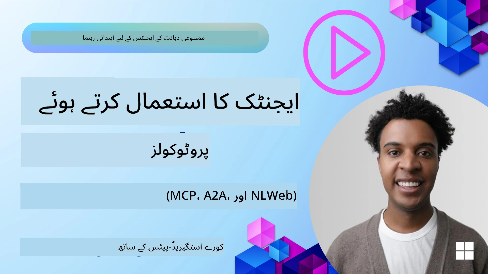
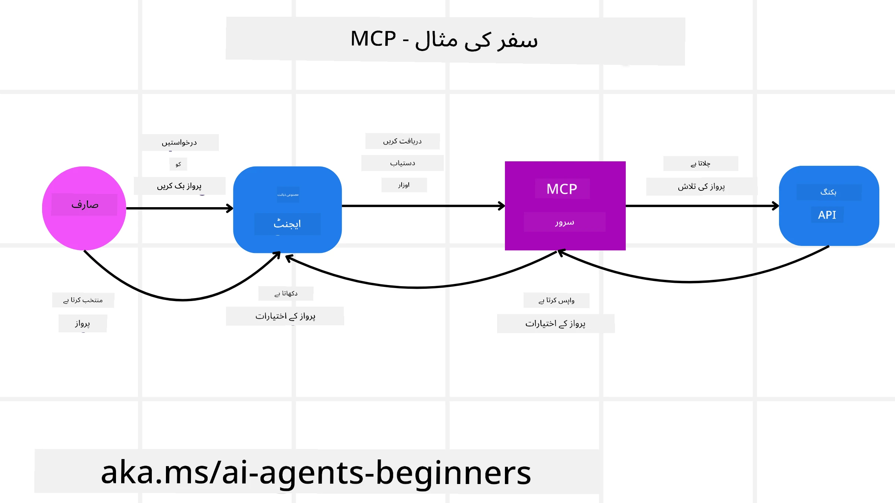
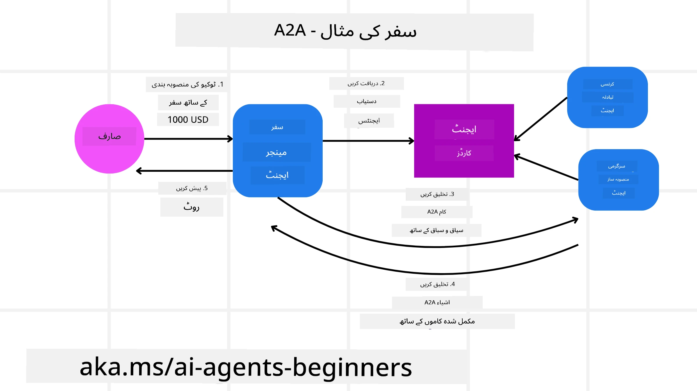
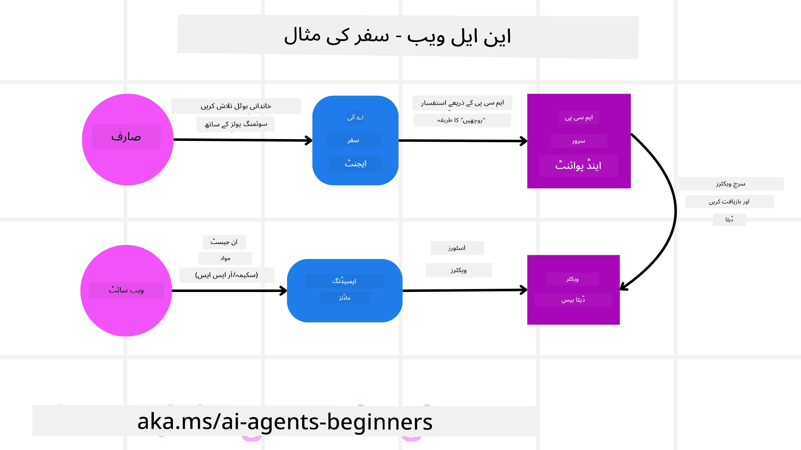

<!--
CO_OP_TRANSLATOR_METADATA:
{
  "original_hash": "aff92c6f019b4627ca9399c6e3882e17",
  "translation_date": "2025-09-18T14:14:51+00:00",
  "source_file": "11-agentic-protocols/README.md",
  "language_code": "ur"
}
-->
# ایجنٹک پروٹوکولز (MCP، A2A اور NLWeb) کا استعمال

> _(اوپر دی گئی تصویر پر کلک کریں تاکہ اس سبق کی ویڈیو دیکھ سکیں)_

جیسے جیسے AI ایجنٹس کا استعمال بڑھ رہا ہے، ویسے ویسے ایسے پروٹوکولز کی ضرورت بھی بڑھ رہی ہے جو معیار، سیکیورٹی، اور کھلی جدت کو یقینی بنائیں۔ اس سبق میں ہم تین پروٹوکولز کا جائزہ لیں گے جو اس ضرورت کو پورا کرنے کی کوشش کر رہے ہیں - ماڈل کانٹیکسٹ پروٹوکول (MCP)، ایجنٹ ٹو ایجنٹ (A2A) اور نیچرل لینگویج ویب (NLWeb)۔

## تعارف

اس سبق میں ہم درج ذیل موضوعات کا احاطہ کریں گے:

• **MCP** کس طرح AI ایجنٹس کو بیرونی ٹولز اور ڈیٹا تک رسائی فراہم کرتا ہے تاکہ صارف کے کام مکمل کیے جا سکیں۔

• **A2A** کس طرح مختلف AI ایجنٹس کے درمیان بات چیت اور تعاون کو ممکن بناتا ہے۔

• **NLWeb** کس طرح کسی بھی ویب سائٹ پر نیچرل لینگویج انٹرفیس فراہم کرتا ہے تاکہ AI ایجنٹس مواد کو دریافت اور اس کے ساتھ تعامل کر سکیں۔

## سیکھنے کے مقاصد

• **شناخت کریں** MCP، A2A، اور NLWeb کے بنیادی مقصد اور فوائد کو AI ایجنٹس کے تناظر میں۔

• **وضاحت کریں** کہ ہر پروٹوکول کس طرح LLMs، ٹولز، اور دیگر ایجنٹس کے درمیان بات چیت اور تعامل کو آسان بناتا ہے۔

• **پہچانیں** کہ ہر پروٹوکول پیچیدہ ایجنٹک سسٹمز کی تعمیر میں کیا کردار ادا کرتا ہے۔

## ماڈل کانٹیکسٹ پروٹوکول

**ماڈل کانٹیکسٹ پروٹوکول (MCP)** ایک کھلا معیار ہے جو ایپلیکیشنز کو LLMs کے لیے کانٹیکسٹ اور ٹولز فراہم کرنے کا معیاری طریقہ فراہم کرتا ہے۔ یہ مختلف ڈیٹا ذرائع اور ٹولز کے لیے "یونیورسل اڈاپٹر" کے طور پر کام کرتا ہے، جس سے AI ایجنٹس کو مستقل طریقے سے جڑنے کی سہولت ملتی ہے۔

آئیے MCP کے اجزاء، براہ راست API استعمال کے مقابلے میں فوائد، اور ایک مثال دیکھتے ہیں کہ AI ایجنٹس MCP سرور کا استعمال کیسے کر سکتے ہیں۔

### MCP کے بنیادی اجزاء

MCP **کلائنٹ-سرور آرکیٹیکچر** پر کام کرتا ہے اور اس کے بنیادی اجزاء درج ذیل ہیں:

• **ہوسٹس** وہ LLM ایپلیکیشنز ہیں (مثال کے طور پر، کوڈ ایڈیٹر جیسے VSCode) جو MCP سرور سے کنکشن شروع کرتی ہیں۔

• **کلائنٹس** وہ اجزاء ہیں جو ہوسٹ ایپلیکیشن کے اندر موجود ہوتے ہیں اور سرورز کے ساتھ ایک-ٹو-ون کنکشن برقرار رکھتے ہیں۔

• **سرورز** ہلکے پروگرامز ہیں جو مخصوص صلاحیتیں فراہم کرتے ہیں۔

پروٹوکول میں تین بنیادی پرائمٹوز شامل ہیں جو MCP سرور کی صلاحیتوں کو ظاہر کرتے ہیں:

• **ٹولز**: یہ وہ مخصوص اعمال یا فنکشنز ہیں جنہیں AI ایجنٹ کسی عمل کو انجام دینے کے لیے کال کر سکتا ہے۔ مثال کے طور پر، ایک موسم کی سروس "موسم معلوم کریں" ٹول فراہم کر سکتی ہے، یا ایک ای کامرس سرور "پروڈکٹ خریدیں" ٹول فراہم کر سکتا ہے۔ MCP سرورز ہر ٹول کا نام، تفصیل، اور ان پٹ/آؤٹ پٹ اسکیمہ اپنی صلاحیتوں کی فہرست میں ظاہر کرتے ہیں۔

• **وسائل**: یہ صرف پڑھنے کے قابل ڈیٹا آئٹمز یا دستاویزات ہیں جو MCP سرور فراہم کر سکتا ہے، اور کلائنٹس انہیں ضرورت کے وقت حاصل کر سکتے ہیں۔ مثالوں میں فائل مواد، ڈیٹا بیس ریکارڈز، یا لاگ فائلز شامل ہیں۔ وسائل متن (جیسے کوڈ یا JSON) یا بائنری (جیسے تصاویر یا PDFs) ہو سکتے ہیں۔

• **پرومپٹس**: یہ پہلے سے طے شدہ ٹیمپلیٹس ہیں جو تجویز کردہ پرومپٹس فراہم کرتے ہیں، جس سے زیادہ پیچیدہ ورک فلو ممکن ہوتا ہے۔

### MCP کے فوائد

MCP AI ایجنٹس کے لیے اہم فوائد فراہم کرتا ہے:

• **ڈائنامک ٹول دریافت**: ایجنٹس سرور سے دستیاب ٹولز کی فہرست اور ان کے کام کی تفصیلات متحرک طور پر حاصل کر سکتے ہیں۔ یہ روایتی APIs کے برعکس ہے، جن میں اکثر انضمام کے لیے جامد کوڈنگ کی ضرورت ہوتی ہے، اور کسی بھی API تبدیلی کے لیے کوڈ اپڈیٹس کی ضرورت ہوتی ہے۔ MCP "ایک بار انضمام کریں" کا طریقہ پیش کرتا ہے، جس سے زیادہ موافقت پذیری حاصل ہوتی ہے۔

• **LLMs کے درمیان انٹرآپریبلٹی**: MCP مختلف LLMs کے ساتھ کام کرتا ہے، جس سے بنیادی ماڈلز کو بہتر کارکردگی کے لیے تبدیل کرنے کی لچک فراہم ہوتی ہے۔

• **معیاری سیکیورٹی**: MCP ایک معیاری تصدیقی طریقہ شامل کرتا ہے، جس سے اضافی MCP سرورز تک رسائی شامل کرنے پر توسیع پذیری بہتر ہوتی ہے۔ یہ مختلف روایتی APIs کے لیے مختلف کیز اور تصدیقی اقسام کو منظم کرنے سے زیادہ آسان ہے۔

### MCP کی مثال

فرض کریں کہ ایک صارف AI اسسٹنٹ کے ذریعے فلائٹ بک کرنا چاہتا ہے جو MCP پر مبنی ہے۔

1. **کنکشن**: AI اسسٹنٹ (MCP کلائنٹ) ایک ایئرلائن کے فراہم کردہ MCP سرور سے جڑتا ہے۔

2. **ٹول دریافت**: کلائنٹ ایئرلائن کے MCP سرور سے پوچھتا ہے، "آپ کے پاس کون سے ٹولز دستیاب ہیں؟" سرور "فلائٹس تلاش کریں" اور "فلائٹس بک کریں" جیسے ٹولز کے ساتھ جواب دیتا ہے۔

3. **ٹول انووکیشن**: آپ AI اسسٹنٹ سے کہتے ہیں، "براہ کرم پورٹ لینڈ سے ہونولولو کے لیے فلائٹ تلاش کریں۔" AI اسسٹنٹ، اپنے LLM کا استعمال کرتے ہوئے، پہچانتا ہے کہ اسے "فلائٹس تلاش کریں" ٹول کو کال کرنا ہے اور متعلقہ پیرامیٹرز (اصل، منزل) MCP سرور کو بھیجتا ہے۔

4. **عملدرآمد اور جواب**: MCP سرور، ایک ریپر کے طور پر کام کرتے ہوئے، ایئرلائن کے اندرونی بکنگ API کو اصل کال کرتا ہے۔ پھر فلائٹ کی معلومات (جیسے JSON ڈیٹا) حاصل کرتا ہے اور اسے AI اسسٹنٹ کو واپس بھیجتا ہے۔

5. **مزید تعامل**: AI اسسٹنٹ فلائٹ کے اختیارات پیش کرتا ہے۔ ایک بار جب آپ فلائٹ منتخب کرتے ہیں، اسسٹنٹ ممکنہ طور پر اسی MCP سرور پر "فلائٹ بک کریں" ٹول کو کال کرتا ہے، بکنگ مکمل کرتا ہے۔

## ایجنٹ ٹو ایجنٹ پروٹوکول (A2A)

جبکہ MCP LLMs کو ٹولز سے جوڑنے پر توجہ مرکوز کرتا ہے، **ایجنٹ ٹو ایجنٹ (A2A) پروٹوکول** ایک قدم آگے بڑھتا ہے اور مختلف AI ایجنٹس کے درمیان بات چیت اور تعاون کو ممکن بناتا ہے۔ A2A مختلف تنظیموں، ماحولیات، اور ٹیک اسٹیکس کے AI ایجنٹس کو ایک مشترکہ کام مکمل کرنے کے لیے جوڑتا ہے۔

ہم A2A کے اجزاء اور فوائد کا جائزہ لیں گے، ساتھ ہی ایک مثال دیکھیں گے کہ یہ ہمارے ٹریول ایپلیکیشن میں کیسے لاگو ہو سکتا ہے۔

### A2A کے بنیادی اجزاء

A2A ایجنٹس کے درمیان بات چیت کو ممکن بناتا ہے اور انہیں صارف کے ذیلی کام کو مکمل کرنے کے لیے ایک ساتھ کام کرنے دیتا ہے۔ پروٹوکول کے ہر جزو اس میں اپنا کردار ادا کرتا ہے:

#### ایجنٹ کارڈ

جیسے MCP سرور ٹولز کی فہرست فراہم کرتا ہے، ایجنٹ کارڈ میں شامل ہوتا ہے:
- ایجنٹ کا نام۔
- **عام کاموں کی تفصیل** جو یہ مکمل کرتا ہے۔
- **خصوصی مہارتوں کی فہرست** جو دوسرے ایجنٹس (یا حتیٰ کہ انسانی صارفین) کو یہ سمجھنے میں مدد دیتی ہے کہ کب اور کیوں اس ایجنٹ کو کال کرنا چاہیے۔
- ایجنٹ کا **موجودہ اینڈپوائنٹ URL**۔
- ایجنٹ کا **ورژن** اور **صلاحیتیں** جیسے اسٹریمنگ جوابات اور پش نوٹیفیکیشنز۔

#### ایجنٹ ایگزیکیوٹر

ایجنٹ ایگزیکیوٹر **صارف چیٹ کے کانٹیکسٹ کو ریموٹ ایجنٹ تک پہنچانے** کا ذمہ دار ہوتا ہے، تاکہ ریموٹ ایجنٹ یہ سمجھ سکے کہ کون سا کام مکمل کرنا ہے۔ A2A سرور میں، ایک ایجنٹ اپنے LLM کا استعمال کرتے ہوئے آنے والی درخواستوں کو پارس کرتا ہے اور اپنے اندرونی ٹولز کا استعمال کرتے ہوئے کام انجام دیتا ہے۔

#### آرٹیفیکٹ

جب ریموٹ ایجنٹ مطلوبہ کام مکمل کر لیتا ہے، تو اس کا کام آرٹیفیکٹ کے طور پر تیار ہوتا ہے۔ آرٹیفیکٹ **ایجنٹ کے کام کا نتیجہ**، **کیا مکمل کیا گیا** کی تفصیل، اور **متن کانٹیکسٹ** پر مشتمل ہوتا ہے جو پروٹوکول کے ذریعے بھیجا جاتا ہے۔ آرٹیفیکٹ بھیجنے کے بعد، ریموٹ ایجنٹ کے ساتھ کنکشن بند کر دیا جاتا ہے جب تک کہ دوبارہ ضرورت نہ ہو۔

#### ایونٹ قطار

یہ جزو **اپڈیٹس کو ہینڈل کرنے اور پیغامات پاس کرنے** کے لیے استعمال ہوتا ہے۔ یہ خاص طور پر پروڈکشن میں ایجنٹک سسٹمز کے لیے اہم ہے تاکہ ایجنٹس کے درمیان کنکشن اس وقت تک بند نہ ہو جب تک کہ کام مکمل نہ ہو جائے، خاص طور پر جب کام مکمل ہونے میں زیادہ وقت لگ سکتا ہو۔

### A2A کے فوائد

• **بہتر تعاون**: یہ مختلف وینڈرز اور پلیٹ فارمز کے ایجنٹس کو بات چیت، کانٹیکسٹ شیئر کرنے، اور ایک ساتھ کام کرنے کے قابل بناتا ہے، روایتی طور پر منقطع سسٹمز کے درمیان ہموار آٹومیشن کو آسان بناتا ہے۔

• **ماڈل انتخاب کی لچک**: ہر A2A ایجنٹ یہ فیصلہ کر سکتا ہے کہ کون سا LLM اپنی درخواستوں کو سروس فراہم کرنے کے لیے استعمال کرے، جس سے ایجنٹ کے مطابق بہتر یا فائن ٹیونڈ ماڈلز کا انتخاب ممکن ہوتا ہے، جو کچھ MCP منظرناموں میں ایک واحد LLM کنکشن کے برعکس ہے۔

• **بلٹ ان تصدیق**: تصدیق براہ راست A2A پروٹوکول میں شامل ہے، ایجنٹ تعاملات کے لیے ایک مضبوط سیکیورٹی فریم ورک فراہم کرتی ہے۔

### A2A کی مثال

آئیے ہمارے ٹریول بکنگ منظرنامے کو وسعت دیتے ہیں، لیکن اس بار A2A کا استعمال کرتے ہوئے۔

1. **صارف کی درخواست ملٹی ایجنٹ کو**: ایک صارف "ٹریول ایجنٹ" A2A کلائنٹ/ایجنٹ کے ساتھ بات چیت کرتا ہے، شاید یہ کہہ کر، "براہ کرم اگلے ہفتے ہونولولو کے لیے پورے سفر کی بکنگ کریں، جس میں فلائٹس، ہوٹل، اور کرائے کی گاڑی شامل ہو۔"

2. **ٹریول ایجنٹ کی آرکسٹریشن**: ٹریول ایجنٹ اس پیچیدہ درخواست کو وصول کرتا ہے۔ یہ اپنے LLM کا استعمال کرتے ہوئے کام کے بارے میں سوچتا ہے اور فیصلہ کرتا ہے کہ اسے دوسرے خصوصی ایجنٹس کے ساتھ بات چیت کرنی ہے۔

3. **ایجنٹس کے درمیان بات چیت**: ٹریول ایجنٹ پھر A2A پروٹوکول کا استعمال کرتے ہوئے نیچے والے ایجنٹس سے جڑتا ہے، جیسے "ایئرلائن ایجنٹ"، "ہوٹل ایجنٹ"، اور "کار رینٹل ایجنٹ" جو مختلف کمپنیوں کے ذریعے بنائے گئے ہیں۔

4. **تفویض کردہ کام کی انجام دہی**: ٹریول ایجنٹ ان خصوصی ایجنٹس کو مخصوص کام بھیجتا ہے (جیسے "ہونولولو کے لیے فلائٹس تلاش کریں"، "ہوٹل بک کریں"، "گاڑی کرائے پر لیں")۔ ان میں سے ہر خصوصی ایجنٹ، اپنے LLMs اور اپنے ٹولز کا استعمال کرتے ہوئے (جو خود MCP سرورز ہو سکتے ہیں)، بکنگ کے اپنے مخصوص حصے کو انجام دیتا ہے۔

5. **مرکب شدہ جواب**: ایک بار جب تمام نیچے والے ایجنٹس اپنے کام مکمل کر لیتے ہیں، ٹریول ایجنٹ نتائج (فلائٹ کی تفصیلات، ہوٹل کی تصدیق، کار رینٹل بکنگ) کو مرتب کرتا ہے اور صارف کو ایک جامع، چیٹ اسٹائل جواب بھیجتا ہے۔

## نیچرل لینگویج ویب (NLWeb)

ویب سائٹس طویل عرصے سے صارفین کے لیے انٹرنیٹ پر معلومات اور ڈیٹا تک رسائی کا بنیادی ذریعہ رہی ہیں۔

آئیے NLWeb کے مختلف اجزاء، فوائد، اور ایک مثال دیکھتے ہیں کہ ہمارا NLWeb ہمارے ٹریول ایپلیکیشن میں کیسے کام کرتا ہے۔

### NLWeb کے اجزاء

- **NLWeb ایپلیکیشن (کور سروس کوڈ)**: وہ نظام جو نیچرل لینگویج سوالات کو پروسیس کرتا ہے۔ یہ پلیٹ فارم کے مختلف حصوں کو جوڑتا ہے تاکہ جوابات تیار کیے جا سکیں۔ آپ اسے ویب سائٹ کی نیچرل لینگویج خصوصیات کو طاقت دینے والے **انجن** کے طور پر سمجھ سکتے ہیں۔

- **NLWeb پروٹوکول**: یہ ویب سائٹ کے ساتھ نیچرل لینگویج تعامل کے لیے **بنیادی اصولوں کا ایک سیٹ** ہے۔ یہ JSON فارمیٹ میں جوابات واپس بھیجتا ہے (اکثر Schema.org کا استعمال کرتے ہوئے)۔ اس کا مقصد "AI ویب" کے لیے ایک سادہ بنیاد بنانا ہے، بالکل اسی طرح جیسے HTML نے آن لائن دستاویزات شیئر کرنا ممکن بنایا۔

- **MCP سرور (ماڈل کانٹیکسٹ پروٹوکول اینڈپوائنٹ)**: ہر NLWeb سیٹ اپ ایک **MCP سرور** کے طور پر بھی کام کرتا ہے۔ اس کا مطلب ہے کہ یہ **ٹولز (جیسے "پوچھیں" طریقہ) اور ڈیٹا** دوسرے AI سسٹمز کے ساتھ شیئر کر سکتا ہے۔ عملی طور پر، یہ ویب سائٹ کے مواد اور صلاحیتوں کو AI ایجنٹس کے لیے قابل استعمال بناتا ہے، جس سے ویب سائٹ وسیع "ایجنٹ ایکوسسٹم" کا حصہ بن جاتی ہے۔

- **ایمبیڈنگ ماڈلز**: یہ ماڈلز ویب سائٹ کے مواد کو **عددی نمائندگیوں میں تبدیل کرنے** کے لیے استعمال ہوتے ہیں جنہیں ویکٹرز (ایمبیڈنگز) کہا جاتا ہے۔ یہ ویکٹرز معنی کو اس طرح پکڑتے ہیں کہ کمپیوٹرز ان کا موازنہ اور تلاش کر سکیں۔ انہیں ایک خاص ڈیٹا بیس میں ذخیرہ کیا جاتا ہے، اور صارفین یہ منتخب کر سکتے ہیں کہ کون سا ایمبیڈنگ ماڈل استعمال کرنا ہے۔

- **ویکٹر ڈیٹا بیس (ریٹریول میکانزم)**: یہ ڈیٹا بیس ویب سائٹ کے مواد کے ایمبیڈنگز کو **ذخیرہ کرتا ہے**۔ جب کوئی سوال پوچھا جاتا ہے، NLWeb ویکٹر ڈیٹا بیس کو چیک کرتا ہے تاکہ جلدی سے سب سے متعلقہ معلومات تلاش کی جا سکیں۔ یہ ممکنہ جوابات کی ایک تیز فہرست دیتا ہے، مماثلت کے لحاظ سے درجہ بندی کی گئی۔ NLWeb مختلف ویکٹر اسٹوریج سسٹمز جیسے Qdrant، Snowflake، Milvus، Azure AI Search، اور Elasticsearch کے ساتھ کام کرتا ہے۔

### NLWeb کی مثال

ہمارے ٹریول بکنگ ویب سائٹ کو دوبارہ دیکھیں، لیکن اس بار یہ NLWeb کے ذریعے چلائی جا رہی ہے۔

1. **ڈیٹا انٹیک**: ٹریول ویب سائٹ کے موجودہ پروڈکٹ کیٹلاگز (جیسے فلائٹ لسٹنگز، ہوٹل کی تفصیلات، ٹور پیکجز) Schema.org کا استعمال کرتے ہوئے فارمیٹ کیے جاتے ہیں یا RSS فیڈز کے ذریعے لوڈ کیے جاتے ہیں۔ NLWeb کے ٹولز اس منظم ڈیٹا کو انٹیک کرتے ہیں، ایمبیڈنگز بناتے ہیں، اور انہیں مقامی یا ریموٹ ویکٹر ڈیٹا بیس میں ذخیرہ کرتے ہیں۔

2. **نیچرل لینگویج سوال (انسان)**: ایک صارف ویب سائٹ پر جاتا ہے اور، مینو نیویگیٹ کرنے کے بجائے، چیٹ انٹرفیس میں ٹائپ کرتا ہے: "ہونولولو میں اگلے ہفتے کے لیے فیملی فرینڈلی ہوٹل تلاش کریں جس میں پول ہو۔"

3. **NLWeb پروسیسنگ**: NLWeb ایپلیکیشن اس سوال کو وصول کرتی ہے۔ یہ سوال کو سمجھنے کے لیے LLM کو بھیجتی ہے اور ساتھ ہی اپنے ویکٹر ڈیٹا بیس میں متعلقہ ہوٹل لسٹنگز تلاش کرتی ہے۔

4. **صحیح نتائج**: LLM ڈیٹا بیس سے تلاش کے نتائج کی تشریح کرنے میں مدد کرتا ہے، "فیملی فرینڈلی"، "پول"، اور "ہونولولو" کے معیار کی بنیاد پر بہترین مماثلتوں کی شناخت کرتا ہے، اور پھر نیچرل لینگویج جواب کی شکل میں فارمیٹ

---

**ڈسکلیمر**:  
یہ دستاویز AI ترجمہ سروس [Co-op Translator](https://github.com/Azure/co-op-translator) کا استعمال کرتے ہوئے ترجمہ کی گئی ہے۔ ہم درستگی کے لیے کوشش کرتے ہیں، لیکن براہ کرم آگاہ رہیں کہ خودکار ترجمے میں غلطیاں یا غیر درستیاں ہو سکتی ہیں۔ اصل دستاویز کو اس کی اصل زبان میں مستند ذریعہ سمجھا جانا چاہیے۔ اہم معلومات کے لیے، پیشہ ور انسانی ترجمہ کی سفارش کی جاتی ہے۔ ہم اس ترجمے کے استعمال سے پیدا ہونے والی کسی بھی غلط فہمی یا غلط تشریح کے ذمہ دار نہیں ہیں۔