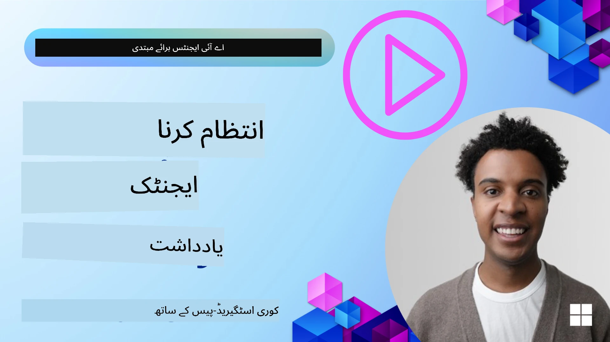

<!--
CO_OP_TRANSLATOR_METADATA:
{
  "original_hash": "a1d90991499ad697c4ad24decaf36968",
  "translation_date": "2025-12-09T11:52:52+00:00",
  "source_file": "13-agent-memory/README.md",
  "language_code": "ur"
}
-->
# اے آئی ایجنٹس کے لیے میموری

جب اے آئی ایجنٹس بنانے کے منفرد فوائد پر بات کی جاتی ہے، تو دو چیزیں خاص طور پر زیر بحث آتی ہیں: ٹاسک مکمل کرنے کے لیے ٹولز کا استعمال اور وقت کے ساتھ بہتر ہونے کی صلاحیت۔ میموری ایک خود کو بہتر بنانے والے ایجنٹ کی بنیاد ہے جو ہمارے صارفین کے لیے بہتر تجربات تخلیق کر سکتی ہے۔

اس سبق میں، ہم دیکھیں گے کہ اے آئی ایجنٹس کے لیے میموری کیا ہے اور ہم اسے اپنے ایپلیکیشنز کے فائدے کے لیے کیسے منظم اور استعمال کر سکتے ہیں۔

## تعارف

یہ سبق درج ذیل موضوعات کا احاطہ کرے گا:

• **اے آئی ایجنٹ میموری کو سمجھنا**: میموری کیا ہے اور ایجنٹس کے لیے یہ کیوں ضروری ہے۔

• **میموری کو نافذ کرنا اور محفوظ کرنا**: آپ کے اے آئی ایجنٹس میں میموری کی صلاحیتوں کو شامل کرنے کے عملی طریقے، خاص طور پر قلیل مدتی اور طویل مدتی میموری پر توجہ مرکوز کرتے ہوئے۔

• **اے آئی ایجنٹس کو خود کو بہتر بنانے کے قابل بنانا**: میموری کس طرح ایجنٹس کو ماضی کی بات چیت سے سیکھنے اور وقت کے ساتھ بہتر ہونے کے قابل بناتی ہے۔

## دستیاب عمل درآمد

یہ سبق دو جامع نوٹ بک ٹیوٹوریلز شامل کرتا ہے:

• **[13-agent-memory.ipynb](./13-agent-memory.ipynb)**: میموری کو Mem0 اور Azure AI Search کے ساتھ Semantic Kernel فریم ورک کا استعمال کرتے ہوئے نافذ کرتا ہے۔

• **[13-agent-memory-cognee.ipynb](./13-agent-memory-cognee.ipynb)**: Cognee کا استعمال کرتے ہوئے ساختی میموری کو نافذ کرتا ہے، جو خود بخود ایمبیڈنگ کے ذریعے نالج گراف بناتا ہے، گراف کو بصری بناتا ہے، اور ذہین بازیافت فراہم کرتا ہے۔

## سیکھنے کے مقاصد

اس سبق کو مکمل کرنے کے بعد، آپ جان سکیں گے کہ:

• **اے آئی ایجنٹ میموری کی مختلف اقسام میں فرق کریں**، بشمول ورکنگ، قلیل مدتی، اور طویل مدتی میموری، نیز خصوصی اقسام جیسے پرسونا اور ایپیسوڈک میموری۔

• **اے آئی ایجنٹس کے لیے قلیل مدتی اور طویل مدتی میموری کو نافذ کریں اور منظم کریں** Semantic Kernel فریم ورک کا استعمال کرتے ہوئے، جیسے Mem0، Cognee، وائٹ بورڈ میموری، اور Azure AI Search کے ساتھ انضمام۔

• **خود کو بہتر بنانے والے اے آئی ایجنٹس کے اصولوں کو سمجھیں** اور کس طرح مضبوط میموری مینجمنٹ سسٹمز مسلسل سیکھنے اور موافقت میں معاون ہیں۔

## اے آئی ایجنٹ میموری کو سمجھنا

بنیادی طور پر، **اے آئی ایجنٹس کے لیے میموری ان میکانزمز کو کہتے ہیں جو انہیں معلومات کو برقرار رکھنے اور یاد کرنے کے قابل بناتے ہیں**۔ یہ معلومات کسی بات چیت کی مخصوص تفصیلات، صارف کی ترجیحات، ماضی کے اعمال، یا سیکھے گئے نمونوں پر مشتمل ہو سکتی ہیں۔

میموری کے بغیر، اے آئی ایپلیکیشنز اکثر اسٹیٹ لیس ہوتی ہیں، یعنی ہر تعامل نئے سرے سے شروع ہوتا ہے۔ اس سے ایک دہرانے والا اور مایوس کن صارف تجربہ پیدا ہوتا ہے جہاں ایجنٹ پچھلے سیاق و سباق یا ترجیحات کو "بھول" جاتا ہے۔

### میموری کیوں اہم ہے؟

کسی ایجنٹ کی ذہانت اس کی ماضی کی معلومات کو یاد کرنے اور استعمال کرنے کی صلاحیت سے گہرا تعلق رکھتی ہے۔ میموری ایجنٹس کو درج ذیل خصوصیات فراہم کرتی ہے:

• **عکاس**: ماضی کے اعمال اور نتائج سے سیکھنا۔

• **تفاعلی**: جاری بات چیت کے دوران سیاق و سباق کو برقرار رکھنا۔

• **پیشگی اور ردعمل**: تاریخی ڈیٹا کی بنیاد پر ضروریات کا اندازہ لگانا یا مناسب جواب دینا۔

• **خود مختار**: ذخیرہ شدہ علم کو استعمال کرتے ہوئے زیادہ آزادانہ طور پر کام کرنا۔

میموری کو نافذ کرنے کا مقصد ایجنٹس کو زیادہ **قابل اعتماد اور قابل** بنانا ہے۔

### میموری کی اقسام

#### ورکنگ میموری

اسے ایک قسم کے نوٹ پیڈ کے طور پر سوچیں جو ایجنٹ کسی ایک جاری ٹاسک یا سوچ کے عمل کے دوران استعمال کرتا ہے۔ یہ فوری معلومات کو رکھتا ہے جو اگلے مرحلے کا حساب لگانے کے لیے ضروری ہوتی ہیں۔

اے آئی ایجنٹس کے لیے، ورکنگ میموری اکثر بات چیت سے سب سے زیادہ متعلقہ معلومات کو قید کرتی ہے، چاہے مکمل چیٹ ہسٹری طویل ہو یا مختصر۔ یہ کلیدی عناصر جیسے ضروریات، تجاویز، فیصلے، اور اعمال کو نکالنے پر توجہ مرکوز کرتا ہے۔

**ورکنگ میموری کی مثال**

ایک ٹریول بکنگ ایجنٹ میں، ورکنگ میموری صارف کی موجودہ درخواست کو قید کر سکتی ہے، جیسے "میں پیرس کا سفر بک کرنا چاہتا ہوں"۔ یہ مخصوص ضرورت موجودہ تعامل کی رہنمائی کے لیے ایجنٹ کے فوری سیاق و سباق میں رکھی جاتی ہے۔

#### قلیل مدتی میموری

یہ قسم کی میموری ایک ہی بات چیت یا سیشن کے دوران معلومات کو برقرار رکھتی ہے۔ یہ موجودہ چیٹ کا سیاق و سباق ہے، جو ایجنٹ کو مکالمے کے پچھلے موڑ کا حوالہ دینے کی اجازت دیتا ہے۔

**قلیل مدتی میموری کی مثال**

اگر کوئی صارف پوچھے، "پیرس کے لیے فلائٹ کی قیمت کتنی ہوگی؟" اور پھر اس کے بعد کہے، "وہاں رہائش کے بارے میں کیا خیال ہے؟"، قلیل مدتی میموری اس بات کو یقینی بناتی ہے کہ ایجنٹ جانتا ہو کہ "وہاں" کا مطلب "پیرس" ہے۔

#### طویل مدتی میموری

یہ وہ معلومات ہے جو متعدد بات چیت یا سیشنز کے دوران برقرار رہتی ہے۔ یہ ایجنٹس کو صارف کی ترجیحات، تاریخی تعاملات، یا عمومی علم کو طویل عرصے تک یاد رکھنے کی اجازت دیتی ہے۔ یہ ذاتی نوعیت کے لیے اہم ہے۔

**طویل مدتی میموری کی مثال**

ایک طویل مدتی میموری یہ ذخیرہ کر سکتی ہے کہ "بین کو اسکیئنگ اور آؤٹ ڈور سرگرمیاں پسند ہیں، کافی پہاڑی منظر کے ساتھ پسند ہے، اور ماضی کی چوٹ کی وجہ سے ایڈوانسڈ اسکی سلوپس سے بچنا چاہتا ہے"۔ یہ معلومات، پچھلے تعاملات سے سیکھی گئی، مستقبل کے ٹریول پلاننگ سیشنز میں سفارشات کو متاثر کرتی ہے، انہیں انتہائی ذاتی بناتی ہے۔

#### پرسونا میموری

یہ ایک خاص قسم کی میموری ہے جو ایجنٹ کو ایک مستقل "شخصیت" یا "پرسونا" تیار کرنے میں مدد دیتی ہے۔ یہ ایجنٹ کو اپنے بارے میں یا اپنے مطلوبہ کردار کے بارے میں تفصیلات یاد رکھنے کی اجازت دیتی ہے، جس سے تعاملات زیادہ روانی اور مرکوز ہو جاتے ہیں۔

**پرسونا میموری کی مثال**

اگر ٹریول ایجنٹ کو "ماہر اسکی پلانر" کے طور پر ڈیزائن کیا گیا ہے، تو پرسونا میموری اس کردار کو تقویت دے سکتی ہے، اس کے جوابات کو ماہر کے لہجے اور علم کے مطابق متاثر کرتی ہے۔

#### ورک فلو/ایپیسوڈک میموری

یہ میموری ایک پیچیدہ ٹاسک کے دوران ایجنٹ کے اٹھائے گئے اقدامات کی ترتیب کو ذخیرہ کرتی ہے، بشمول کامیابیاں اور ناکامیاں۔ یہ ماضی کے مخصوص "اقساط" یا تجربات کو یاد رکھنے جیسا ہے تاکہ ان سے سیکھا جا سکے۔

**ایپیسوڈک میموری کی مثال**

اگر ایجنٹ نے ایک مخصوص فلائٹ بک کرنے کی کوشش کی لیکن یہ عدم دستیابی کی وجہ سے ناکام ہو گئی، تو ایپیسوڈک میموری اس ناکامی کو ریکارڈ کر سکتی ہے، جس سے ایجنٹ کو متبادل فلائٹس آزمانے یا کسی بعد کی کوشش میں صارف کو مسئلے کے بارے میں زیادہ معلومات فراہم کرنے کی اجازت ملتی ہے۔

#### اینٹیٹی میموری

یہ بات چیت سے مخصوص اداروں (جیسے لوگ، مقامات، یا چیزیں) اور واقعات کو نکالنے اور یاد رکھنے پر مشتمل ہے۔ یہ ایجنٹ کو زیر بحث کلیدی عناصر کی ایک ساختہ تفہیم بنانے کی اجازت دیتی ہے۔

**اینٹیٹی میموری کی مثال**

ایک ماضی کے سفر کے بارے میں بات چیت سے، ایجنٹ "پیرس"، "ایفل ٹاور"، اور "لی شاٹ نوئر ریسٹورنٹ میں ڈنر" کو اداروں کے طور پر نکال سکتا ہے۔ ایک مستقبل کے تعامل میں، ایجنٹ "لی شاٹ نوئر" کو یاد کر سکتا ہے اور وہاں ایک نئی ریزرویشن کرنے کی پیشکش کر سکتا ہے۔

#### ساختہ RAG (ریٹریول آگمینٹڈ جنریشن)

جبکہ RAG ایک وسیع تکنیک ہے، "ساختہ RAG" کو ایک طاقتور میموری ٹیکنالوجی کے طور پر اجاگر کیا گیا ہے۔ یہ مختلف ذرائع (بات چیت، ای میلز، تصاویر) سے گھنی، ساختہ معلومات نکالتا ہے اور اسے جوابات میں درستگی، یادداشت، اور رفتار بڑھانے کے لیے استعمال کرتا ہے۔ کلاسک RAG کے برعکس جو صرف سیمینٹک مماثلت پر انحصار کرتا ہے، ساختہ RAG معلومات کی اندرونی ساخت کے ساتھ کام کرتا ہے۔

**ساختہ RAG کی مثال**

صرف کلیدی الفاظ سے میل کھانے کے بجائے، ساختہ RAG ای میل سے فلائٹ کی تفصیلات (منزل، تاریخ، وقت، ایئر لائن) کو پارس کر سکتا ہے اور انہیں ایک ساختہ طریقے سے ذخیرہ کر سکتا ہے۔ یہ درست سوالات جیسے "میں نے منگل کو پیرس کے لیے کون سی فلائٹ بک کی؟" کے لیے اجازت دیتا ہے۔

## میموری کو نافذ کرنا اور محفوظ کرنا

اے آئی ایجنٹس کے لیے میموری کو نافذ کرنا **میموری مینجمنٹ** کے ایک منظم عمل پر مشتمل ہے، جس میں معلومات پیدا کرنا، ذخیرہ کرنا، بازیافت کرنا، انضمام کرنا، اپ ڈیٹ کرنا، اور یہاں تک کہ "بھولنا" (یا حذف کرنا) شامل ہے۔ بازیافت ایک خاص طور پر اہم پہلو ہے۔

### خصوصی میموری ٹولز

#### Mem0

ایجنٹ میموری کو ذخیرہ کرنے اور منظم کرنے کا ایک طریقہ خصوصی ٹولز جیسے Mem0 کا استعمال ہے۔ Mem0 ایک مستقل میموری لیئر کے طور پر کام کرتا ہے، جو ایجنٹس کو متعلقہ تعاملات کو یاد کرنے، صارف کی ترجیحات اور حقیقی سیاق و سباق کو ذخیرہ کرنے، اور وقت کے ساتھ کامیابیوں اور ناکامیوں سے سیکھنے کی اجازت دیتا ہے۔ یہاں خیال یہ ہے کہ اسٹیٹ لیس ایجنٹس کو اسٹیٹ فل میں تبدیل کیا جائے۔

یہ **دو مرحلہ میموری پائپ لائن: نکالنا اور اپ ڈیٹ کرنا** کے ذریعے کام کرتا ہے۔ پہلے، ایجنٹ کے تھریڈ میں شامل پیغامات Mem0 سروس کو بھیجے جاتے ہیں، جو بات چیت کی تاریخ کا خلاصہ کرنے اور نئی یادیں نکالنے کے لیے ایک بڑے لینگویج ماڈل (LLM) کا استعمال کرتی ہے۔ اس کے بعد، ایک LLM سے چلنے والا اپ ڈیٹ مرحلہ ان یادوں کو شامل کرنے، ترمیم کرنے، یا حذف کرنے کا تعین کرتا ہے، انہیں ایک ہائبرڈ ڈیٹا اسٹور میں ذخیرہ کرتا ہے جس میں ویکٹر، گراف، اور کلیدی قدر کے ڈیٹا بیس شامل ہو سکتے ہیں۔ یہ نظام مختلف میموری اقسام کی بھی حمایت کرتا ہے اور اداروں کے درمیان تعلقات کو منظم کرنے کے لیے گراف میموری کو شامل کر سکتا ہے۔

#### Cognee

ایک اور طاقتور طریقہ **Cognee** کا استعمال ہے، جو اے آئی ایجنٹس کے لیے ایک اوپن سورس سیمینٹک میموری ہے جو ساختہ اور غیر ساختہ ڈیٹا کو قابل سوال نالج گراف میں تبدیل کرتی ہے جو ایمبیڈنگ کے ذریعے تعاون یافتہ ہے۔ Cognee ایک **دوہری اسٹور آرکیٹیکچر** فراہم کرتا ہے جو ویکٹر مماثلت تلاش کو گراف تعلقات کے ساتھ جوڑتا ہے، ایجنٹس کو یہ سمجھنے کے قابل بناتا ہے کہ نہ صرف کون سی معلومات ملتی جلتی ہیں بلکہ تصورات ایک دوسرے سے کیسے متعلق ہیں۔

یہ **ہائبرڈ بازیافت** میں مہارت رکھتا ہے جو ویکٹر مماثلت، گراف ڈھانچے، اور LLM استدلال کو یکجا کرتا ہے - خام چنک تلاش سے لے کر گراف سے آگاہ سوالات کے جوابات تک۔ یہ نظام **زندہ میموری** کو برقرار رکھتا ہے جو بڑھتی اور ترقی کرتی ہے جبکہ ایک جڑے ہوئے گراف کے طور پر قابل سوال رہتی ہے، جو قلیل مدتی سیشن سیاق و سباق اور طویل مدتی مستقل میموری دونوں کی حمایت کرتی ہے۔

Cognee نوٹ بک ٹیوٹوریل ([13-agent-memory-cognee.ipynb](./13-agent-memory-cognee.ipynb)) اس متحد میموری لیئر کی تعمیر کا مظاہرہ کرتا ہے، متنوع ڈیٹا ذرائع کو شامل کرنے، نالج گراف کو بصری بنانے، اور مخصوص ایجنٹ کی ضروریات کے مطابق مختلف تلاش کی حکمت عملیوں کے ساتھ سوالات کرنے کی عملی مثالوں کے ساتھ۔

### RAG کے ساتھ میموری کو ذخیرہ کرنا

خصوصی میموری ٹولز جیسے Mem0 کے علاوہ، آپ **Azure AI Search** جیسی مضبوط تلاش کی خدمات کو میموری ذخیرہ کرنے اور بازیافت کرنے کے لیے استعمال کر سکتے ہیں، خاص طور پر ساختہ RAG کے لیے۔

یہ آپ کو اپنے ایجنٹ کے جوابات کو اپنے ڈیٹا کے ساتھ بنیاد فراہم کرنے کی اجازت دیتا ہے، اس بات کو یقینی بناتے ہوئے کہ جوابات زیادہ متعلقہ اور درست ہوں۔ Azure AI Search کو صارف کے مخصوص ٹریول میموری، پروڈکٹ کیٹلاگ، یا کسی بھی دوسرے ڈومین مخصوص علم کو ذخیرہ کرنے کے لیے استعمال کیا جا سکتا ہے۔

Azure AI Search **ساختہ RAG** جیسی صلاحیتوں کی حمایت کرتا ہے، جو بات چیت کی تاریخ، ای میلز، یا یہاں تک کہ تصاویر جیسے بڑے ڈیٹا سیٹس سے گھنی، ساختہ معلومات نکالنے اور بازیافت کرنے میں مہارت رکھتا ہے۔ یہ روایتی ٹیکسٹ چنکنگ اور ایمبیڈنگ کے طریقوں کے مقابلے میں "سپر ہیومن درستگی اور یادداشت" فراہم کرتا ہے۔

## اے آئی ایجنٹس کو خود کو بہتر بنانا

خود کو بہتر بنانے والے ایجنٹس کے لیے ایک عام نمونہ **"نالج ایجنٹ"** متعارف کرانا شامل ہے۔ یہ الگ ایجنٹ صارف اور پرائمری ایجنٹ کے درمیان مرکزی بات چیت کا مشاہدہ کرتا ہے۔ اس کا کردار یہ ہے:

1. **قیمتی معلومات کی شناخت کریں**: یہ تعین کریں کہ کیا بات چیت کا کوئی حصہ عام علم یا کسی مخصوص صارف کی ترجیح کے طور پر محفوظ کرنے کے قابل ہے۔

2. **نکالیں اور خلاصہ کریں**: بات چیت سے ضروری سیکھنے یا ترجیح کو کشید کریں۔

3. **نالج بیس میں محفوظ کریں**: اس نکالی گئی معلومات کو مستقل کریں، اکثر ایک ویکٹر ڈیٹا بیس میں، تاکہ اسے بعد میں بازیافت کیا جا سکے۔

4. **مستقبل کے سوالات کو بڑھائیں**: جب صارف ایک نیا سوال شروع کرتا ہے، تو نالج ایجنٹ متعلقہ ذخیرہ شدہ معلومات کو بازیافت کرتا ہے اور اسے صارف کے پرامپٹ میں شامل کرتا ہے، پرائمری ایجنٹ کو اہم سیاق و سباق فراہم کرتا ہے (RAG کی طرح)۔

### میموری کے لیے اصلاحات

• **لیٹنسی مینجمنٹ**: صارف کے تعاملات کو سست ہونے سے بچانے کے لیے، ایک سستا، تیز ماڈل ابتدائی طور پر استعمال کیا جا سکتا ہے تاکہ یہ جلدی سے چیک کیا جا سکے کہ معلومات ذخیرہ کرنے یا بازیافت کرنے کے قابل ہے یا نہیں، صرف اس وقت زیادہ پیچیدہ نکالنے/بازیافت کے عمل کو مدعو کیا جائے جب ضروری ہو۔

• **نالج بیس کی دیکھ بھال**: بڑھتے ہوئے نالج بیس کے لیے، کم کثرت سے استعمال ہونے والی معلومات کو "کولڈ اسٹوریج" میں منتقل کیا جا سکتا ہے تاکہ اخراجات کا انتظام کیا جا سکے۔

## ایجنٹ میموری کے بارے میں مزید سوالات ہیں؟

[Azure AI Foundry Discord](https://aka.ms/ai-agents/discord) میں شامل ہوں تاکہ دوسرے سیکھنے والوں سے ملاقات کریں، آفس آورز میں شرکت کریں، اور اپنے اے آئی ایجنٹس کے سوالات کے جوابات حاصل کریں۔

---

<!-- CO-OP TRANSLATOR DISCLAIMER START -->
**ڈسکلیمر**:  
یہ دستاویز AI ترجمہ سروس [Co-op Translator](https://github.com/Azure/co-op-translator) کا استعمال کرتے ہوئے ترجمہ کی گئی ہے۔ ہم درستگی کے لیے کوشش کرتے ہیں، لیکن براہ کرم آگاہ رہیں کہ خودکار ترجمے میں غلطیاں یا غیر درستیاں ہو سکتی ہیں۔ اصل دستاویز کو اس کی اصل زبان میں مستند ذریعہ سمجھا جانا چاہیے۔ اہم معلومات کے لیے، پیشہ ور انسانی ترجمہ کی سفارش کی جاتی ہے۔ ہم اس ترجمے کے استعمال سے پیدا ہونے والی کسی بھی غلط فہمی یا غلط تشریح کے ذمہ دار نہیں ہیں۔
<!-- CO-OP TRANSLATOR DISCLAIMER END -->