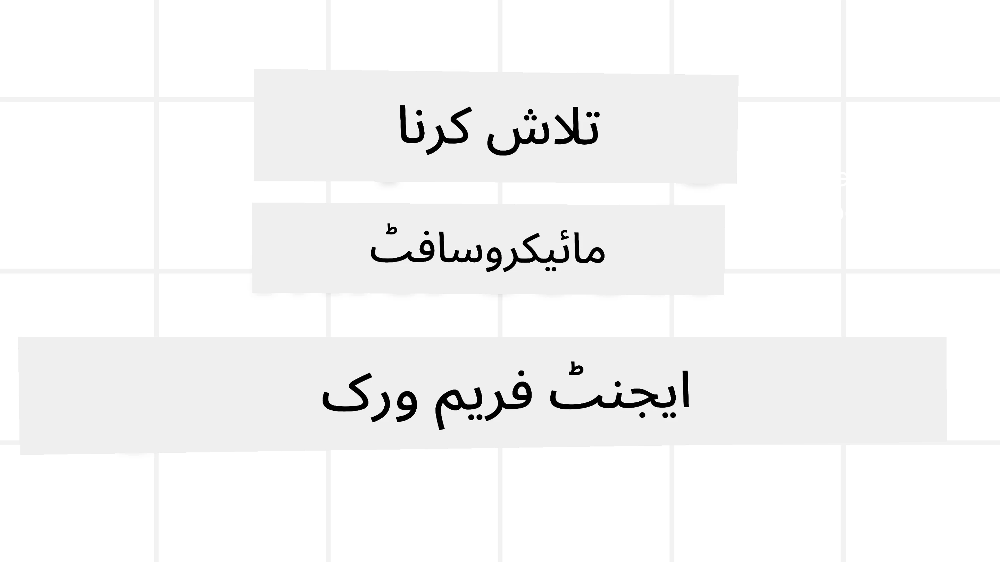
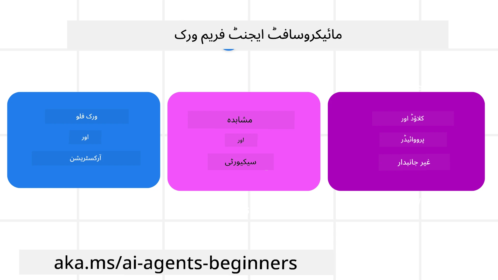
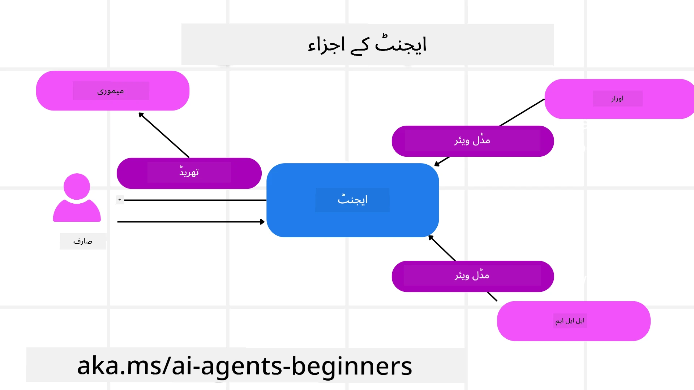

<!--
CO_OP_TRANSLATOR_METADATA:
{
  "original_hash": "19c4dab375acbc733855cc7f2f04edbc",
  "translation_date": "2025-10-02T11:14:14+00:00",
  "source_file": "14-microsoft-agent-framework/README.md",
  "language_code": "ur"
}
-->
# مائیکروسافٹ ایجنٹ فریم ورک کا جائزہ



### تعارف

اس سبق میں شامل ہے:

- مائیکروسافٹ ایجنٹ فریم ورک کو سمجھنا: اہم خصوصیات اور قدر  
- مائیکروسافٹ ایجنٹ فریم ورک کے بنیادی تصورات کا جائزہ  
- MAF کا سیمینٹک کرنل اور آٹو جن سے موازنہ: مائیگریشن گائیڈ  

## سیکھنے کے اہداف

اس سبق کو مکمل کرنے کے بعد، آپ جان سکیں گے کہ:

- مائیکروسافٹ ایجنٹ فریم ورک کا استعمال کرتے ہوئے پروڈکشن کے لیے تیار AI ایجنٹس بنانا  
- اپنے ایجنٹک استعمال کے کیسز میں مائیکروسافٹ ایجنٹ فریم ورک کی بنیادی خصوصیات کا اطلاق کرنا  
- موجودہ ایجنٹک فریم ورکس اور ٹولز کو منتقل اور انضمام کرنا  

## کوڈ کے نمونے

[مائیکروسافٹ ایجنٹ فریم ورک (MAF)](https://aka.ms/ai-agents-beginners/agent-framewrok) کے کوڈ کے نمونے اس ریپوزٹری میں `xx-python-agent-framework` اور `xx-dotnet-agent-framework` فائلز کے تحت دستیاب ہیں۔

## مائیکروسافٹ ایجنٹ فریم ورک کو سمجھنا



[مائیکروسافٹ ایجنٹ فریم ورک (MAF)](https://aka.ms/ai-agents-beginners/agent-framewrok) سیمینٹک کرنل اور آٹو جن سے حاصل کردہ تجربات اور سیکھنے پر مبنی ہے۔ یہ پروڈکشن اور تحقیق کے ماحول میں مختلف ایجنٹک استعمال کے کیسز کو حل کرنے کے لیے لچک فراہم کرتا ہے، جن میں شامل ہیں:

- **تسلسل ایجنٹ آرکیسٹریشن** ایسے منظرناموں میں جہاں قدم بہ قدم ورک فلو کی ضرورت ہو۔  
- **ہم وقتی آرکیسٹریشن** ایسے منظرناموں میں جہاں ایجنٹس کو ایک ہی وقت میں کام مکمل کرنے کی ضرورت ہو۔  
- **گروپ چیٹ آرکیسٹریشن** ایسے منظرناموں میں جہاں ایجنٹس ایک کام پر مل کر تعاون کر سکیں۔  
- **ہینڈ آف آرکیسٹریشن** ایسے منظرناموں میں جہاں ایجنٹس ایک دوسرے کو کام منتقل کریں جب ذیلی کام مکمل ہو جائیں۔  
- **مقناطیسی آرکیسٹریشن** ایسے منظرناموں میں جہاں ایک مینیجر ایجنٹ کاموں کی فہرست بناتا اور ترمیم کرتا ہے اور ذیلی ایجنٹس کے تعاون سے کام مکمل کرتا ہے۔  

پروڈکشن میں AI ایجنٹس فراہم کرنے کے لیے، MAF میں درج ذیل خصوصیات شامل ہیں:

- **مشاہدہ پذیری** اوپن ٹیلیمیٹری کے استعمال کے ذریعے، جہاں AI ایجنٹ کے ہر عمل کو Azure AI Foundry ڈیش بورڈز کے ذریعے ٹول انووکیشن، آرکیسٹریشن مراحل، ریزننگ فلو اور کارکردگی کی نگرانی شامل ہے۔  
- **سیکیورٹی** ایجنٹس کو Azure AI Foundry پر مقامی طور پر ہوسٹ کرنے کے ذریعے، جس میں رول بیسڈ رسائی، نجی ڈیٹا ہینڈلنگ اور بلٹ ان مواد کی حفاظت جیسے سیکیورٹی کنٹرولز شامل ہیں۔  
- **پائیداری** ایجنٹ تھریڈز اور ورک فلوز کو روکنے، دوبارہ شروع کرنے اور غلطیوں سے بحال کرنے کی صلاحیت فراہم کرتا ہے، جو طویل مدتی عمل کو ممکن بناتا ہے۔  
- **کنٹرول** انسانی مداخلت کے ورک فلو کی حمایت کرتا ہے، جہاں کاموں کو انسانی منظوری کی ضرورت کے طور پر نشان زد کیا جاتا ہے۔  

مائیکروسافٹ ایجنٹ فریم ورک انٹرآپریبل ہونے پر بھی توجہ مرکوز کرتا ہے:

- **کلاؤڈ-اگناسٹک ہونا** - ایجنٹس کنٹینرز، آن-پریم اور مختلف کلاؤڈز پر چل سکتے ہیں۔  
- **پرووائیڈر-اگناسٹک ہونا** - ایجنٹس آپ کے پسندیدہ SDK کے ذریعے بنائے جا سکتے ہیں، بشمول Azure OpenAI اور OpenAI۔  
- **اوپن اسٹینڈرڈز کا انضمام** - ایجنٹس پروٹوکولز جیسے ایجنٹ-ٹو-ایجنٹ (A2A) اور ماڈل کانٹیکسٹ پروٹوکول (MCP) کا استعمال کر سکتے ہیں تاکہ دوسرے ایجنٹس اور ٹولز کو دریافت اور استعمال کیا جا سکے۔  
- **پلگ انز اور کنیکٹرز** - ڈیٹا اور میموری سروسز جیسے Microsoft Fabric، SharePoint، Pinecone اور Qdrant سے کنکشنز بنائے جا سکتے ہیں۔  

آئیے دیکھتے ہیں کہ مائیکروسافٹ ایجنٹ فریم ورک کے بنیادی تصورات پر یہ خصوصیات کیسے لاگو ہوتی ہیں۔

## مائیکروسافٹ ایجنٹ فریم ورک کے بنیادی تصورات

### ایجنٹس



**ایجنٹس بنانا**

ایجنٹ کی تخلیق انفرینس سروس (LLM پرووائیڈر)، AI ایجنٹ کے لیے ہدایات کا ایک سیٹ، اور ایک تفویض کردہ `name` کی وضاحت کے ذریعے کی جاتی ہے:

```python
agent = AzureOpenAIChatClient(credential=AzureCliCredential()).create_agent( instructions="You are good at recommending trips to customers based on their preferences.", name="TripRecommender" )
```

اوپر دی گئی مثال `Azure OpenAI` استعمال کر رہی ہے، لیکن ایجنٹس مختلف سروسز کے ذریعے بنائے جا سکتے ہیں، بشمول `Azure AI Foundry Agent Service`:

```python
AzureAIAgentClient(async_credential=credential).create_agent( name="HelperAgent", instructions="You are a helpful assistant." ) as agent
```

OpenAI `Responses`, `ChatCompletion` APIs

```python
agent = OpenAIResponsesClient().create_agent( name="WeatherBot", instructions="You are a helpful weather assistant.", )
```

```python
agent = OpenAIChatClient().create_agent( name="HelpfulAssistant", instructions="You are a helpful assistant.", )
```

یا ریموٹ ایجنٹس A2A پروٹوکول کے ذریعے:

```python
agent = A2AAgent( name=agent_card.name, description=agent_card.description, agent_card=agent_card, url="https://your-a2a-agent-host" )
```

**ایجنٹس چلانا**

ایجنٹس کو `.run` یا `.run_stream` طریقوں کے ذریعے چلایا جاتا ہے، جو غیر اسٹریمنگ یا اسٹریمنگ جوابات کے لیے استعمال ہوتے ہیں۔

```python
result = await agent.run("What are good places to visit in Amsterdam?")
print(result.text)
```

```python
async for update in agent.run_stream("What are the good places to visit in Amsterdam?"):
    if update.text:
        print(update.text, end="", flush=True)

```

ہر ایجنٹ رن میں پیرامیٹرز کو حسب ضرورت بنانے کے اختیارات بھی ہو سکتے ہیں، جیسے `max_tokens` جو ایجنٹ استعمال کرتا ہے، `tools` جو ایجنٹ کال کر سکتا ہے، اور یہاں تک کہ ایجنٹ کے لیے استعمال ہونے والا `model`۔

یہ ان صورتوں میں مفید ہے جہاں مخصوص ماڈلز یا ٹولز صارف کے کام کو مکمل کرنے کے لیے ضروری ہوں۔

**ٹولز**

ٹولز ایجنٹ کی تعریف کرتے وقت بھی بیان کیے جا سکتے ہیں:

```python
def get_attractions( location: Annotated[str, Field(description="The location to get the top tourist attractions for")], ) -> str: """Get the top tourist attractions for a given location.""" return f"The top attractions for {location} are." 


# When creating a ChatAgent directly 

agent = ChatAgent( chat_client=OpenAIChatClient(), instructions="You are a helpful assistant", tools=[get_attractions]

```

اور ایجنٹ کو چلانے کے وقت بھی:

```python

result1 = await agent.run( "What's the best place to visit in Seattle?", tools=[get_attractions] # Tool provided for this run only )
```

**ایجنٹ تھریڈز**

ایجنٹ تھریڈز کثیر موڑ گفتگو کو سنبھالنے کے لیے استعمال ہوتے ہیں۔ تھریڈز یا تو:

- `get_new_thread()` استعمال کرتے ہوئے بنائے جا سکتے ہیں، جو تھریڈ کو وقت کے ساتھ محفوظ کرنے کے قابل بناتا ہے۔  
- ایجنٹ کو چلانے کے وقت خود بخود تھریڈ بنانا، اور تھریڈ کو صرف موجودہ رن کے دوران برقرار رکھنا۔  

تھریڈ بنانے کے لیے کوڈ کچھ یوں ہوگا:

```python
# Create a new thread. 
thread = agent.get_new_thread() # Run the agent with the thread. 
response = await agent.run("Hello, I am here to help you book travel. Where would you like to go?", thread=thread)

```

آپ تھریڈ کو بعد میں استعمال کے لیے محفوظ کرنے کے لیے سیریلائز بھی کر سکتے ہیں:

```python
# Create a new thread. 
thread = agent.get_new_thread() 

# Run the agent with the thread. 

response = await agent.run("Hello, how are you?", thread=thread) 

# Serialize the thread for storage. 

serialized_thread = await thread.serialize() 

# Deserialize the thread state after loading from storage. 

resumed_thread = await agent.deserialize_thread(serialized_thread)
```

**ایجنٹ مڈل ویئر**

ایجنٹس ٹولز اور LLMs کے ساتھ تعامل کرتے ہیں تاکہ صارف کے کام مکمل کر سکیں۔ کچھ منظرناموں میں، ہم ان تعاملات کے درمیان عملدرآمد یا ٹریک کرنا چاہتے ہیں۔ ایجنٹ مڈل ویئر ہمیں یہ کرنے کی اجازت دیتا ہے:

*فنکشن مڈل ویئر*

یہ مڈل ویئر ہمیں ایجنٹ اور فنکشن/ٹول کے درمیان ایک عمل انجام دینے کی اجازت دیتا ہے جسے وہ کال کرنے والا ہے۔ ایک مثال یہ ہو سکتی ہے کہ آپ فنکشن کال پر کچھ لاگنگ کرنا چاہتے ہیں۔

نیچے دیے گئے کوڈ میں `next` یہ طے کرتا ہے کہ آیا اگلا مڈل ویئر یا اصل فنکشن کال کیا جائے۔

```python
async def logging_function_middleware(
    context: FunctionInvocationContext,
    next: Callable[[FunctionInvocationContext], Awaitable[None]],
) -> None:
    """Function middleware that logs function execution."""
    # Pre-processing: Log before function execution
    print(f"[Function] Calling {context.function.name}")

    # Continue to next middleware or function execution
    await next(context)

    # Post-processing: Log after function execution
    print(f"[Function] {context.function.name} completed")
```

*چیٹ مڈل ویئر*

یہ مڈل ویئر ہمیں ایجنٹ اور LLM کے درمیان درخواستوں کے درمیان ایک عمل انجام دینے یا لاگ کرنے کی اجازت دیتا ہے۔

یہ اہم معلومات پر مشتمل ہوتا ہے، جیسے `messages` جو AI سروس کو بھیجے جا رہے ہیں۔

```python
async def logging_chat_middleware(
    context: ChatContext,
    next: Callable[[ChatContext], Awaitable[None]],
) -> None:
    """Chat middleware that logs AI interactions."""
    # Pre-processing: Log before AI call
    print(f"[Chat] Sending {len(context.messages)} messages to AI")

    # Continue to next middleware or AI service
    await next(context)

    # Post-processing: Log after AI response
    print("[Chat] AI response received")

```

**ایجنٹ میموری**

جیسا کہ `Agentic Memory` سبق میں شامل کیا گیا ہے، میموری ایجنٹ کو مختلف سیاق و سباق میں کام کرنے کے قابل بنانے کے لیے ایک اہم عنصر ہے۔ MAF مختلف قسم کی میموریز پیش کرتا ہے:

*ان-میموری اسٹوریج*

یہ میموری ایپلیکیشن کے رن ٹائم کے دوران تھریڈز میں محفوظ ہوتی ہے۔

```python
# Create a new thread. 
thread = agent.get_new_thread() # Run the agent with the thread. 
response = await agent.run("Hello, I am here to help you book travel. Where would you like to go?", thread=thread)
```

*مستقل پیغامات*

یہ میموری مختلف سیشنز کے دوران گفتگو کی تاریخ کو محفوظ کرنے کے لیے استعمال ہوتی ہے۔ یہ `chat_message_store_factory` کے ذریعے بیان کی جاتی ہے:

```python
from agent_framework import ChatMessageStore

# Create a custom message store
def create_message_store():
    return ChatMessageStore()

agent = ChatAgent(
    chat_client=OpenAIChatClient(),
    instructions="You are a Travel assistant.",
    chat_message_store_factory=create_message_store
)

```

*ڈائنامک میموری*

یہ میموری ایجنٹس کو چلانے سے پہلے سیاق و سباق میں شامل کی جاتی ہے۔ یہ میموریز بیرونی سروسز جیسے mem0 میں محفوظ کی جا سکتی ہیں:

```python
from agent_framework.mem0 import Mem0Provider

# Using Mem0 for advanced memory capabilities
memory_provider = Mem0Provider(
    api_key="your-mem0-api-key",
    user_id="user_123",
    application_id="my_app"
)

agent = ChatAgent(
    chat_client=OpenAIChatClient(),
    instructions="You are a helpful assistant with memory.",
    context_providers=memory_provider
)

```

**ایجنٹ مشاہدہ پذیری**

مشاہدہ پذیری قابل اعتماد اور قابل دیکھ بھال ایجنٹک سسٹمز بنانے کے لیے اہم ہے۔ MAF اوپن ٹیلیمیٹری کے ساتھ انضمام کرتا ہے تاکہ بہتر مشاہدہ پذیری کے لیے ٹریسنگ اور میٹرز فراہم کیے جا سکیں۔

```python
from agent_framework.observability import get_tracer, get_meter

tracer = get_tracer()
meter = get_meter()
with tracer.start_as_current_span("my_custom_span"):
    # do something
    pass
counter = meter.create_counter("my_custom_counter")
counter.add(1, {"key": "value"})
```

### ورک فلو

MAF ایسے ورک فلو پیش کرتا ہے جو پہلے سے بیان کردہ مراحل پر مشتمل ہوتے ہیں تاکہ ایک کام مکمل کیا جا سکے اور ان مراحل میں AI ایجنٹس کو اجزاء کے طور پر شامل کیا جا سکے۔

ورک فلو مختلف اجزاء پر مشتمل ہوتے ہیں جو بہتر کنٹرول فلو کی اجازت دیتے ہیں۔ ورک فلو **ملٹی ایجنٹ آرکیسٹریشن** اور **چیک پوائنٹنگ** کو بھی فعال کرتے ہیں تاکہ ورک فلو کی حالت محفوظ کی جا سکے۔

ورک فلو کے بنیادی اجزاء ہیں:

**ایگزیکیوٹرز**

ایگزیکیوٹرز ان پٹ پیغامات وصول کرتے ہیں، اپنے تفویض کردہ کام انجام دیتے ہیں، اور پھر آؤٹ پٹ پیغام تیار کرتے ہیں۔ یہ ورک فلو کو بڑے کام کی تکمیل کی طرف آگے بڑھاتا ہے۔ ایگزیکیوٹرز AI ایجنٹ یا کسٹم لاجک ہو سکتے ہیں۔

**ایجز**

ایجز ورک فلو میں پیغامات کے بہاؤ کی وضاحت کے لیے استعمال ہوتے ہیں۔ یہ ہو سکتے ہیں:

*براہ راست ایجز* - ایگزیکیوٹرز کے درمیان سادہ ایک سے ایک کنکشن:

```python
from agent_framework import WorkflowBuilder

builder = WorkflowBuilder()
builder.add_edge(source_executor, target_executor)
builder.set_start_executor(source_executor)
workflow = builder.build()
```

*مشروط ایجز* - مخصوص شرط پوری ہونے کے بعد فعال ہوتے ہیں۔ مثال کے طور پر، جب ہوٹل کے کمرے دستیاب نہ ہوں، تو ایگزیکیوٹر دیگر اختیارات تجویز کر سکتا ہے۔

*سوئچ-کیس ایجز* - پیغامات کو بیان کردہ شرائط کی بنیاد پر مختلف ایگزیکیوٹرز کی طرف بھیجتے ہیں۔ مثال کے طور پر، اگر سفر کرنے والے صارف کو ترجیحی رسائی حاصل ہو، تو ان کے کام کو دوسرے ورک فلو کے ذریعے سنبھالا جائے گا۔

*فین-آؤٹ ایجز* - ایک پیغام کو متعدد اہداف پر بھیجتے ہیں۔

*فین-ان ایجز* - مختلف ایگزیکیوٹرز سے متعدد پیغامات جمع کرتے ہیں اور ایک ہدف پر بھیجتے ہیں۔

**ایونٹس**

ورک فلو میں بہتر مشاہدہ پذیری فراہم کرنے کے لیے، MAF ایگزیکیوشن کے لیے بلٹ ان ایونٹس پیش کرتا ہے، جن میں شامل ہیں:

- `WorkflowStartedEvent` - ورک فلو ایگزیکیوشن شروع ہوتا ہے  
- `WorkflowOutputEvent` - ورک فلو آؤٹ پٹ تیار کرتا ہے  
- `WorkflowErrorEvent` - ورک فلو میں خرابی پیش آتی ہے  
- `ExecutorInvokeEvent` - ایگزیکیوٹر پروسیسنگ شروع کرتا ہے  
- `ExecutorCompleteEvent` - ایگزیکیوٹر پروسیسنگ مکمل کرتا ہے  
- `RequestInfoEvent` - ایک درخواست جاری کی جاتی ہے  

## دیگر فریم ورکس سے منتقلی (سیمینٹک کرنل اور آٹو جن)

### MAF اور سیمینٹک کرنل کے درمیان فرق

**ایجنٹ تخلیق کو آسان بنانا**

سیمینٹک کرنل ہر ایجنٹ کے لیے ایک کرنل انسٹینس بنانے پر انحصار کرتا ہے۔ MAF ایک آسان طریقہ استعمال کرتا ہے، جو اہم پرووائیڈرز کے لیے ایکسٹینشنز استعمال کرتا ہے۔

```python
agent = AzureOpenAIChatClient(credential=AzureCliCredential()).create_agent( instructions="You are good at reccomending trips to customers based on their preferences.", name="TripRecommender" )
```

**ایجنٹ تھریڈ تخلیق**

سیمینٹک کرنل میں تھریڈز کو دستی طور پر تخلیق کرنا ضروری ہوتا ہے۔ MAF میں، ایجنٹ کو براہ راست ایک تھریڈ تفویض کیا جاتا ہے۔

```python
thread = agent.get_new_thread() # Run the agent with the thread. 
```

**ٹول رجسٹریشن**

سیمینٹک کرنل میں، ٹولز کرنل میں رجسٹر کیے جاتے ہیں اور پھر کرنل کو ایجنٹ کے پاس منتقل کیا جاتا ہے۔ MAF میں، ٹولز ایجنٹ کی تخلیق کے عمل کے دوران براہ راست رجسٹر کیے جاتے ہیں۔

```python
agent = ChatAgent( chat_client=OpenAIChatClient(), instructions="You are a helpful assistant", tools=[get_attractions]
```

### MAF اور آٹو جن کے درمیان فرق

**ٹیمز بمقابلہ ورک فلو**

`Teams` آٹو جن میں ایجنٹس کے ساتھ ایونٹ ڈرائیون سرگرمی کے لیے ایونٹ اسٹرکچر ہیں۔ MAF `Workflows` استعمال کرتا ہے، جو ڈیٹا کو ایگزیکیوٹرز کے لیے گراف پر مبنی آرکیٹیکچر کے ذریعے روٹ کرتا ہے۔

**ٹول تخلیق**

آٹو جن `FunctionTool` استعمال کرتا ہے تاکہ ایجنٹس کے لیے فنکشنز کو کال کرنے کے لیے لپیٹ سکے۔ MAF @ai_function استعمال کرتا ہے، جو اسی طرح کام کرتا ہے لیکن ہر فنکشن کے لیے اسکیمز کو خود بخود اخذ بھی کرتا ہے۔

**ایجنٹ رویہ**

آٹو جن میں ایجنٹس ڈیفالٹ کے طور پر سنگل-ٹرن ایجنٹس ہوتے ہیں، جب تک کہ `max_tool_iterations` کو زیادہ نہ سیٹ کیا جائے۔ MAF میں `ChatAgent` ڈیفالٹ کے طور پر ملٹی-ٹرن ہوتا ہے، یعنی یہ صارف کے کام مکمل ہونے تک ٹولز کو کال کرتا رہے گا۔

## کوڈ کے نمونے

مائیکروسافٹ ایجنٹ فریم ورک کے کوڈ کے نمونے اس ریپوزٹری میں `xx-python-agent-framework` اور `xx-dotnet-agent-framework` فائلز کے تحت دستیاب ہیں۔

## مائیکروسافٹ ایجنٹ فریم ورک کے بارے میں مزید سوالات ہیں؟

[Azure AI Foundry Discord](https://aka.ms/ai-agents/discord) میں شامل ہوں تاکہ دیگر سیکھنے والوں سے ملاقات کریں، آفس آورز میں شرکت کریں، اور اپنے AI ایجنٹس کے سوالات کے جوابات حاصل کریں۔

---

**ڈسکلیمر**:  
یہ دستاویز AI ترجمہ سروس [Co-op Translator](https://github.com/Azure/co-op-translator) کا استعمال کرتے ہوئے ترجمہ کی گئی ہے۔ ہم درستگی کے لیے کوشش کرتے ہیں، لیکن براہ کرم آگاہ رہیں کہ خودکار ترجمے میں غلطیاں یا غیر درستیاں ہو سکتی ہیں۔ اصل دستاویز کو اس کی اصل زبان میں مستند ذریعہ سمجھا جانا چاہیے۔ اہم معلومات کے لیے، پیشہ ور انسانی ترجمہ کی سفارش کی جاتی ہے۔ ہم اس ترجمے کے استعمال سے پیدا ہونے والی کسی بھی غلط فہمی یا غلط تشریح کے ذمہ دار نہیں ہیں۔