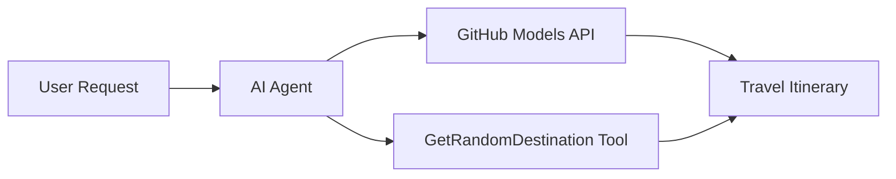

<!--
CO_OP_TRANSLATOR_METADATA:
{
  "original_hash": "5f351412e934f0833c8c821a0a60efaf",
  "translation_date": "2025-11-13T13:12:55+00:00",
  "source_file": "01-intro-to-ai-agents/code_samples/01-dotnet-agent-framework.md",
  "language_code": "vi"
}
-->
# 🌍 Đại lý Du lịch AI với Microsoft Agent Framework (.NET)

## 📋 Tổng quan về Kịch bản

Ví dụ này minh họa cách xây dựng một đại lý lập kế hoạch du lịch thông minh sử dụng Microsoft Agent Framework cho .NET. Đại lý có thể tự động tạo lịch trình du lịch cá nhân hóa cho các điểm đến ngẫu nhiên trên toàn thế giới.

### Các khả năng chính:

- 🎲 **Chọn điểm đến ngẫu nhiên**: Sử dụng công cụ tùy chỉnh để chọn địa điểm nghỉ dưỡng
- 🗺️ **Lập kế hoạch chuyến đi thông minh**: Tạo lịch trình chi tiết từng ngày
- 🔄 **Phát trực tiếp theo thời gian thực**: Hỗ trợ cả phản hồi ngay lập tức và phát trực tiếp
- 🛠️ **Tích hợp công cụ tùy chỉnh**: Minh họa cách mở rộng khả năng của đại lý

## 🔧 Kiến trúc kỹ thuật

### Công nghệ cốt lõi

- **Microsoft Agent Framework**: Triển khai .NET mới nhất để phát triển đại lý AI
- **Tích hợp Mô hình GitHub**: Sử dụng dịch vụ suy luận mô hình AI của GitHub
- **Tương thích API OpenAI**: Tận dụng thư viện khách hàng OpenAI với các điểm cuối tùy chỉnh
- **Cấu hình bảo mật**: Quản lý khóa API dựa trên môi trường

### Các thành phần chính

1. **AIAgent**: Bộ điều phối đại lý chính xử lý luồng hội thoại
2. **Công cụ tùy chỉnh**: Hàm `GetRandomDestination()` có sẵn cho đại lý
3. **Chat Client**: Giao diện hội thoại hỗ trợ bởi Mô hình GitHub
4. **Hỗ trợ phát trực tiếp**: Khả năng tạo phản hồi theo thời gian thực

### Mô hình tích hợp



## 🚀 Bắt đầu

### Yêu cầu trước

- [.NET 10 SDK](https://dotnet.microsoft.com/download/dotnet/10.0) hoặc cao hơn
- [Mã truy cập API Mô hình GitHub](https://docs.github.com/github-models/github-models-at-scale/using-your-own-api-keys-in-github-models)

### Các biến môi trường cần thiết

```bash
# zsh/bash
export GH_TOKEN=<your_github_token>
export GH_ENDPOINT=https://models.github.ai/inference
export GH_MODEL_ID=openai/gpt-5-mini
```

```powershell
# PowerShell
$env:GH_TOKEN = "<your_github_token>"
$env:GH_ENDPOINT = "https://models.github.ai/inference"
$env:GH_MODEL_ID = "openai/gpt-5-mini"
```

### Mã mẫu

Để chạy ví dụ mã,

```bash
# zsh/bash
chmod +x ./01-dotnet-agent-framework.cs
./01-dotnet-agent-framework.cs
```

Hoặc sử dụng dotnet CLI:

```bash
dotnet run ./01-dotnet-agent-framework.cs
```

Xem [`01-dotnet-agent-framework.cs`](../../../../01-intro-to-ai-agents/code_samples/01-dotnet-agent-framework.cs) để biết mã đầy đủ.

```csharp
#!/usr/bin/dotnet run

#:package Microsoft.Extensions.AI@9.*
#:package Microsoft.Agents.AI.OpenAI@1.*-*

using System.ClientModel;
using System.ComponentModel;

using Microsoft.Agents.AI;
using Microsoft.Extensions.AI;

using OpenAI;

// Tool Function: Random Destination Generator
// This static method will be available to the agent as a callable tool
// The [Description] attribute helps the AI understand when to use this function
// This demonstrates how to create custom tools for AI agents
[Description("Provides a random vacation destination.")]
static string GetRandomDestination()
{
    // List of popular vacation destinations around the world
    // The agent will randomly select from these options
    var destinations = new List<string>
    {
        "Paris, France",
        "Tokyo, Japan",
        "New York City, USA",
        "Sydney, Australia",
        "Rome, Italy",
        "Barcelona, Spain",
        "Cape Town, South Africa",
        "Rio de Janeiro, Brazil",
        "Bangkok, Thailand",
        "Vancouver, Canada"
    };

    // Generate random index and return selected destination
    // Uses System.Random for simple random selection
    var random = new Random();
    int index = random.Next(destinations.Count);
    return destinations[index];
}

// Extract configuration from environment variables
// Retrieve the GitHub Models API endpoint, defaults to https://models.github.ai/inference if not specified
// Retrieve the model ID, defaults to openai/gpt-5-mini if not specified
// Retrieve the GitHub token for authentication, throws exception if not specified
var github_endpoint = Environment.GetEnvironmentVariable("GH_ENDPOINT") ?? "https://models.github.ai/inference";
var github_model_id = Environment.GetEnvironmentVariable("GH_MODEL_ID") ?? "openai/gpt-5-mini";
var github_token = Environment.GetEnvironmentVariable("GH_TOKEN") ?? throw new InvalidOperationException("GH_TOKEN is not set.");

// Configure OpenAI Client Options
// Create configuration options to point to GitHub Models endpoint
// This redirects OpenAI client calls to GitHub's model inference service
var openAIOptions = new OpenAIClientOptions()
{
    Endpoint = new Uri(github_endpoint)
};

// Initialize OpenAI Client with GitHub Models Configuration
// Create OpenAI client using GitHub token for authentication
// Configure it to use GitHub Models endpoint instead of OpenAI directly
var openAIClient = new OpenAIClient(new ApiKeyCredential(github_token), openAIOptions);

// Create AI Agent with Travel Planning Capabilities
// Initialize OpenAI client, get chat client for specified model, and create AI agent
// Configure agent with travel planning instructions and random destination tool
// The agent can now plan trips using the GetRandomDestination function
AIAgent agent = openAIClient
    .GetChatClient(github_model_id)
    .CreateAIAgent(
        instructions: "You are a helpful AI Agent that can help plan vacations for customers at random destinations",
        tools: [AIFunctionFactory.Create(GetRandomDestination)]
    );

// Execute Agent: Plan a Day Trip
// Run the agent with streaming enabled for real-time response display
// Shows the agent's thinking and response as it generates the content
// Provides better user experience with immediate feedback
await foreach (var update in agent.RunStreamingAsync("Plan me a day trip"))
{
    await Task.Delay(10);
    Console.Write(update);
}
```

## 🎓 Những điều cần lưu ý

1. **Kiến trúc Đại lý**: Microsoft Agent Framework cung cấp cách tiếp cận sạch sẽ, an toàn kiểu để xây dựng đại lý AI trong .NET
2. **Tích hợp Công cụ**: Các hàm được trang trí với thuộc tính `[Description]` trở thành công cụ có sẵn cho đại lý
3. **Quản lý Cấu hình**: Các biến môi trường và xử lý thông tin xác thực an toàn tuân theo các thực tiễn tốt nhất của .NET
4. **Tương thích OpenAI**: Tích hợp Mô hình GitHub hoạt động liền mạch thông qua các API tương thích với OpenAI

## 🔗 Tài nguyên bổ sung

- [Tài liệu Microsoft Agent Framework](https://learn.microsoft.com/agent-framework)
- [Thị trường Mô hình GitHub](https://github.com/marketplace?type=models)
- [Microsoft.Extensions.AI](https://learn.microsoft.com/dotnet/ai/microsoft-extensions-ai)
- [.NET Single File Apps](https://devblogs.microsoft.com/dotnet/announcing-dotnet-run-app)

---

<!-- CO-OP TRANSLATOR DISCLAIMER START -->
**Tuyên bố miễn trừ trách nhiệm**:  
Tài liệu này đã được dịch bằng dịch vụ dịch thuật AI [Co-op Translator](https://github.com/Azure/co-op-translator). Mặc dù chúng tôi cố gắng đảm bảo độ chính xác, xin lưu ý rằng các bản dịch tự động có thể chứa lỗi hoặc không chính xác. Tài liệu gốc bằng ngôn ngữ bản địa nên được coi là nguồn thông tin chính thức. Đối với thông tin quan trọng, nên sử dụng dịch vụ dịch thuật chuyên nghiệp của con người. Chúng tôi không chịu trách nhiệm cho bất kỳ sự hiểu lầm hoặc diễn giải sai nào phát sinh từ việc sử dụng bản dịch này.
<!-- CO-OP TRANSLATOR DISCLAIMER END -->