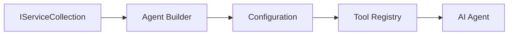

<!--
CO_OP_TRANSLATOR_METADATA:
{
  "original_hash": "bcc874e190347bd6a095aed56dc16de8",
  "translation_date": "2025-11-13T13:18:34+00:00",
  "source_file": "03-agentic-design-patterns/code_samples/03-dotnet-agent-framework.md",
  "language_code": "vi"
}
-->
# 🎨 Mẫu Thiết Kế Tác Nhân với GitHub Models (.NET)

## 📋 Mục Tiêu Học Tập

Ví dụ này trình bày các mẫu thiết kế cấp doanh nghiệp để xây dựng các tác nhân thông minh sử dụng Microsoft Agent Framework trong .NET với tích hợp GitHub Models. Bạn sẽ học các mẫu chuyên nghiệp và cách tiếp cận kiến trúc giúp các tác nhân sẵn sàng cho sản xuất, dễ bảo trì và có khả năng mở rộng.

### Mẫu Thiết Kế Doanh Nghiệp

- 🏭 **Factory Pattern**: Tạo tác nhân chuẩn hóa với dependency injection
- 🔧 **Builder Pattern**: Cấu hình và thiết lập tác nhân một cách linh hoạt
- 🧵 **Thread-Safe Patterns**: Quản lý hội thoại đồng thời
- 📋 **Repository Pattern**: Quản lý công cụ và khả năng một cách có tổ chức

## 🎯 Lợi Ích Kiến Trúc Đặc Thù của .NET

### Tính Năng Doanh Nghiệp

- **Strong Typing**: Xác thực tại thời điểm biên dịch và hỗ trợ IntelliSense
- **Dependency Injection**: Tích hợp container DI sẵn có
- **Quản Lý Cấu Hình**: Các mẫu IConfiguration và Options
- **Async/Await**: Hỗ trợ lập trình bất đồng bộ hàng đầu

### Mẫu Sẵn Sàng Cho Sản Xuất

- **Tích Hợp Logging**: Hỗ trợ ILogger và logging có cấu trúc
- **Kiểm Tra Sức Khỏe**: Giám sát và chẩn đoán tích hợp
- **Xác Thực Cấu Hình**: Kiểu mạnh với chú thích dữ liệu
- **Xử Lý Lỗi**: Quản lý ngoại lệ có cấu trúc

## 🔧 Kiến Trúc Kỹ Thuật

### Thành Phần Cốt Lõi của .NET

- **Microsoft.Extensions.AI**: Các trừu tượng dịch vụ AI thống nhất
- **Microsoft.Agents.AI**: Framework điều phối tác nhân cấp doanh nghiệp
- **Tích Hợp GitHub Models**: Các mẫu client API hiệu suất cao
- **Hệ Thống Cấu Hình**: Tích hợp appsettings.json và môi trường

### Triển Khai Mẫu Thiết Kế



## 🏗️ Các Mẫu Doanh Nghiệp Được Minh Họa

### 1. **Mẫu Tạo**

- **Agent Factory**: Tạo tác nhân tập trung với cấu hình nhất quán
- **Builder Pattern**: API linh hoạt cho cấu hình tác nhân phức tạp
- **Singleton Pattern**: Quản lý tài nguyên và cấu hình chia sẻ
- **Dependency Injection**: Giảm sự phụ thuộc và tăng khả năng kiểm thử

### 2. **Mẫu Hành Vi**

- **Strategy Pattern**: Các chiến lược thực thi công cụ có thể thay đổi
- **Command Pattern**: Các thao tác tác nhân được đóng gói với undo/redo
- **Observer Pattern**: Quản lý vòng đời tác nhân dựa trên sự kiện
- **Template Method**: Quy trình thực thi tác nhân chuẩn hóa

### 3. **Mẫu Cấu Trúc**

- **Adapter Pattern**: Lớp tích hợp API GitHub Models
- **Decorator Pattern**: Nâng cao khả năng của tác nhân
- **Facade Pattern**: Giao diện tương tác tác nhân đơn giản hóa
- **Proxy Pattern**: Tải chậm và caching để cải thiện hiệu suất

## 📚 Nguyên Tắc Thiết Kế .NET

### Nguyên Tắc SOLID

- **Single Responsibility**: Mỗi thành phần có một mục đích rõ ràng
- **Open/Closed**: Có thể mở rộng mà không cần sửa đổi
- **Liskov Substitution**: Triển khai công cụ dựa trên giao diện
- **Interface Segregation**: Giao diện tập trung, mạch lạc
- **Dependency Inversion**: Phụ thuộc vào trừu tượng, không phải cụ thể

### Kiến Trúc Sạch

- **Domain Layer**: Các trừu tượng tác nhân và công cụ cốt lõi
- **Application Layer**: Điều phối tác nhân và quy trình làm việc
- **Infrastructure Layer**: Tích hợp GitHub Models và các dịch vụ bên ngoài
- **Presentation Layer**: Tương tác người dùng và định dạng phản hồi

## 🔒 Các Cân Nhắc Doanh Nghiệp

### Bảo Mật

- **Quản Lý Thông Tin Đăng Nhập**: Xử lý khóa API an toàn với IConfiguration
- **Xác Thực Đầu Vào**: Kiểu mạnh và xác thực chú thích dữ liệu
- **Lọc Đầu Ra**: Xử lý và lọc phản hồi an toàn
- **Audit Logging**: Theo dõi hoạt động toàn diện

### Hiệu Suất

- **Mẫu Async**: Các thao tác I/O không chặn
- **Connection Pooling**: Quản lý client HTTP hiệu quả
- **Caching**: Caching phản hồi để cải thiện hiệu suất
- **Quản Lý Tài Nguyên**: Các mẫu xử lý và dọn dẹp đúng cách

### Khả Năng Mở Rộng

- **Thread Safety**: Hỗ trợ thực thi tác nhân đồng thời
- **Resource Pooling**: Sử dụng tài nguyên hiệu quả
- **Quản Lý Tải**: Giới hạn tốc độ và xử lý áp lực ngược
- **Giám Sát**: Các chỉ số hiệu suất và kiểm tra sức khỏe

## 🚀 Triển Khai Sản Xuất

- **Quản Lý Cấu Hình**: Cài đặt cụ thể theo môi trường
- **Chiến Lược Logging**: Logging có cấu trúc với ID tương quan
- **Xử Lý Lỗi**: Xử lý ngoại lệ toàn cầu với khôi phục phù hợp
- **Giám Sát**: Application insights và bộ đếm hiệu suất
- **Kiểm Thử**: Các mẫu kiểm thử đơn vị, kiểm thử tích hợp và kiểm thử tải

Sẵn sàng xây dựng các tác nhân thông minh cấp doanh nghiệp với .NET? Hãy cùng kiến trúc một thứ gì đó mạnh mẽ! 🏢✨

## 🚀 Bắt Đầu

### Yêu Cầu Trước

- [.NET 10 SDK](https://dotnet.microsoft.com/download/dotnet/10.0) hoặc cao hơn
- [GitHub Models API access token](https://docs.github.com/github-models/github-models-at-scale/using-your-own-api-keys-in-github-models)

### Các Biến Môi Trường Cần Thiết

```bash
# zsh/bash
export GH_TOKEN=<your_github_token>
export GH_ENDPOINT=https://models.github.ai/inference
export GH_MODEL_ID=openai/gpt-5-mini
```

```powershell
# PowerShell
$env:GH_TOKEN = "<your_github_token>"
$env:GH_ENDPOINT = "https://models.github.ai/inference"
$env:GH_MODEL_ID = "openai/gpt-5-mini"
```

### Mã Mẫu

Để chạy ví dụ mã,

```bash
# zsh/bash
chmod +x ./03-dotnet-agent-framework.cs
./03-dotnet-agent-framework.cs
```

Hoặc sử dụng dotnet CLI:

```bash
dotnet run ./03-dotnet-agent-framework.cs
```

Xem [`03-dotnet-agent-framework.cs`](../../../../03-agentic-design-patterns/code_samples/03-dotnet-agent-framework.cs) để có mã đầy đủ.

```csharp
#!/usr/bin/dotnet run

#:package Microsoft.Extensions.AI@10.*
#:package Microsoft.Agents.AI.OpenAI@1.*-*

using System.ClientModel;
using System.ComponentModel;

using Microsoft.Agents.AI;
using Microsoft.Extensions.AI;

using OpenAI;

// Tool Function: Random Destination Generator
// This static method will be available to the agent as a callable tool
// The [Description] attribute helps the AI understand when to use this function
// This demonstrates how to create custom tools for AI agents
[Description("Provides a random vacation destination.")]
static string GetRandomDestination()
{
    // List of popular vacation destinations around the world
    // The agent will randomly select from these options
    var destinations = new List<string>
    {
        "Paris, France",
        "Tokyo, Japan",
        "New York City, USA",
        "Sydney, Australia",
        "Rome, Italy",
        "Barcelona, Spain",
        "Cape Town, South Africa",
        "Rio de Janeiro, Brazil",
        "Bangkok, Thailand",
        "Vancouver, Canada"
    };

    // Generate random index and return selected destination
    // Uses System.Random for simple random selection
    var random = new Random();
    int index = random.Next(destinations.Count);
    return destinations[index];
}

// Extract configuration from environment variables
// Retrieve the GitHub Models API endpoint, defaults to https://models.github.ai/inference if not specified
// Retrieve the model ID, defaults to openai/gpt-5-mini if not specified
// Retrieve the GitHub token for authentication, throws exception if not specified
var github_endpoint = Environment.GetEnvironmentVariable("GH_ENDPOINT") ?? "https://models.github.ai/inference";
var github_model_id = Environment.GetEnvironmentVariable("GH_MODEL_ID") ?? "openai/gpt-5-mini";
var github_token = Environment.GetEnvironmentVariable("GH_TOKEN") ?? throw new InvalidOperationException("GH_TOKEN is not set.");

// Configure OpenAI Client Options
// Create configuration options to point to GitHub Models endpoint
// This redirects OpenAI client calls to GitHub's model inference service
var openAIOptions = new OpenAIClientOptions()
{
    Endpoint = new Uri(github_endpoint)
};

// Initialize OpenAI Client with GitHub Models Configuration
// Create OpenAI client using GitHub token for authentication
// Configure it to use GitHub Models endpoint instead of OpenAI directly
var openAIClient = new OpenAIClient(new ApiKeyCredential(github_token), openAIOptions);

// Define Agent Identity and Comprehensive Instructions
// Agent name for identification and logging purposes
var AGENT_NAME = "TravelAgent";

// Detailed instructions that define the agent's personality, capabilities, and behavior
// This system prompt shapes how the agent responds and interacts with users
var AGENT_INSTRUCTIONS = """
You are a helpful AI Agent that can help plan vacations for customers.

Important: When users specify a destination, always plan for that location. Only suggest random destinations when the user hasn't specified a preference.

When the conversation begins, introduce yourself with this message:
"Hello! I'm your TravelAgent assistant. I can help plan vacations and suggest interesting destinations for you. Here are some things you can ask me:
1. Plan a day trip to a specific location
2. Suggest a random vacation destination
3. Find destinations with specific features (beaches, mountains, historical sites, etc.)
4. Plan an alternative trip if you don't like my first suggestion

What kind of trip would you like me to help you plan today?"

Always prioritize user preferences. If they mention a specific destination like "Bali" or "Paris," focus your planning on that location rather than suggesting alternatives.
""";

// Create AI Agent with Advanced Travel Planning Capabilities
// Initialize complete agent pipeline: OpenAI client → Chat client → AI agent
// Configure agent with name, detailed instructions, and available tools
// This demonstrates the .NET agent creation pattern with full configuration
AIAgent agent = openAIClient
    .GetChatClient(github_model_id)
    .CreateAIAgent(
        name: AGENT_NAME,
        instructions: AGENT_INSTRUCTIONS,
        tools: [AIFunctionFactory.Create(GetRandomDestination)]
    );

// Create New Conversation Thread for Context Management
// Initialize a new conversation thread to maintain context across multiple interactions
// Threads enable the agent to remember previous exchanges and maintain conversational state
// This is essential for multi-turn conversations and contextual understanding
AgentThread thread = agent.GetNewThread();

// Execute Agent: First Travel Planning Request
// Run the agent with an initial request that will likely trigger the random destination tool
// The agent will analyze the request, use the GetRandomDestination tool, and create an itinerary
// Using the thread parameter maintains conversation context for subsequent interactions
await foreach (var update in agent.RunStreamingAsync("Plan me a day trip", thread))
{
    await Task.Delay(10);
    Console.Write(update);
}

Console.WriteLine();

// Execute Agent: Follow-up Request with Context Awareness
// Demonstrate contextual conversation by referencing the previous response
// The agent remembers the previous destination suggestion and will provide an alternative
// This showcases the power of conversation threads and contextual understanding in .NET agents
await foreach (var update in agent.RunStreamingAsync("I don't like that destination. Plan me another vacation.", thread))
{
    await Task.Delay(10);
    Console.Write(update);
}
```

---

<!-- CO-OP TRANSLATOR DISCLAIMER START -->
**Tuyên bố miễn trừ trách nhiệm**:  
Tài liệu này đã được dịch bằng dịch vụ dịch thuật AI [Co-op Translator](https://github.com/Azure/co-op-translator). Mặc dù chúng tôi cố gắng đảm bảo độ chính xác, xin lưu ý rằng các bản dịch tự động có thể chứa lỗi hoặc không chính xác. Tài liệu gốc bằng ngôn ngữ bản địa nên được coi là nguồn thông tin chính thức. Đối với thông tin quan trọng, khuyến nghị sử dụng dịch vụ dịch thuật chuyên nghiệp bởi con người. Chúng tôi không chịu trách nhiệm cho bất kỳ sự hiểu lầm hoặc diễn giải sai nào phát sinh từ việc sử dụng bản dịch này.
<!-- CO-OP TRANSLATOR DISCLAIMER END -->