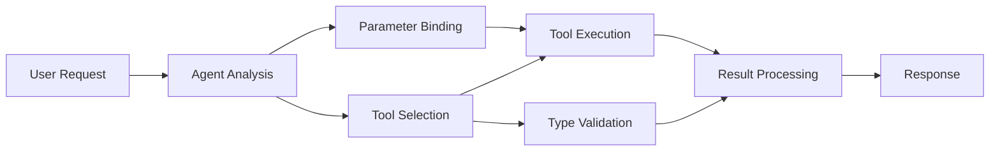

<!--
CO_OP_TRANSLATOR_METADATA:
{
  "original_hash": "91d6061e402489603f2ec8b528cae59b",
  "translation_date": "2025-11-18T17:55:58+00:00",
  "source_file": "04-tool-use/code_samples/04-dotnet-agent-framework.md",
  "language_code": "vi"
}
-->
# 🛠️ Sử Dụng Công Cụ Nâng Cao với Mô Hình GitHub (.NET)

## 📋 Mục Tiêu Học Tập

Notebook này trình bày các mẫu tích hợp công cụ cấp doanh nghiệp sử dụng Microsoft Agent Framework trong .NET với Mô Hình GitHub. Bạn sẽ học cách xây dựng các agent phức tạp với nhiều công cụ chuyên biệt, tận dụng kiểu dữ liệu mạnh mẽ của C# và các tính năng doanh nghiệp của .NET.

### Các Khả Năng Công Cụ Nâng Cao Bạn Sẽ Thành Thạo

- 🔧 **Kiến Trúc Đa Công Cụ**: Xây dựng các agent với nhiều khả năng chuyên biệt
- 🎯 **Thực Thi Công Cụ An Toàn Kiểu Dữ Liệu**: Tận dụng xác thực thời gian biên dịch của C#
- 📊 **Mẫu Công Cụ Doanh Nghiệp**: Thiết kế công cụ sẵn sàng cho sản xuất và xử lý lỗi
- 🔗 **Kết Hợp Công Cụ**: Kết hợp các công cụ cho quy trình công việc kinh doanh phức tạp

## 🎯 Lợi Ích Kiến Trúc Công Cụ .NET

### Tính Năng Công Cụ Doanh Nghiệp

- **Xác Thực Thời Gian Biên Dịch**: Kiểu dữ liệu mạnh mẽ đảm bảo tính chính xác của tham số công cụ
- **Dependency Injection**: Tích hợp IoC container để quản lý công cụ
- **Mẫu Async/Await**: Thực thi công cụ không chặn với quản lý tài nguyên hợp lý
- **Ghi Log Có Cấu Trúc**: Tích hợp ghi log để giám sát thực thi công cụ

### Mẫu Sẵn Sàng Cho Sản Xuất

- **Xử Lý Ngoại Lệ**: Quản lý lỗi toàn diện với ngoại lệ kiểu dữ liệu
- **Quản Lý Tài Nguyên**: Mẫu xử lý và quản lý bộ nhớ đúng cách
- **Giám Sát Hiệu Suất**: Các chỉ số tích hợp và bộ đếm hiệu suất
- **Quản Lý Cấu Hình**: Cấu hình an toàn kiểu dữ liệu với xác thực

## 🔧 Kiến Trúc Kỹ Thuật

### Thành Phần Công Cụ Cốt Lõi .NET

- **Microsoft.Extensions.AI**: Lớp trừu tượng công cụ thống nhất
- **Microsoft.Agents.AI**: Điều phối công cụ cấp doanh nghiệp
- **Tích Hợp Mô Hình GitHub**: Client API hiệu suất cao với kết nối pooling

### Quy Trình Thực Thi Công Cụ



## 🛠️ Danh Mục & Mẫu Công Cụ

### 1. **Công Cụ Xử Lý Dữ Liệu**

- **Xác Thực Đầu Vào**: Kiểu dữ liệu mạnh mẽ với chú thích dữ liệu
- **Hoạt Động Chuyển Đổi**: Chuyển đổi và định dạng dữ liệu an toàn kiểu dữ liệu
- **Logic Kinh Doanh**: Công cụ tính toán và phân tích theo miền cụ thể
- **Định Dạng Đầu Ra**: Tạo phản hồi có cấu trúc

### 2. **Công Cụ Tích Hợp**

- **Kết Nối API**: Tích hợp dịch vụ RESTful với HttpClient
- **Công Cụ Cơ Sở Dữ Liệu**: Tích hợp Entity Framework để truy cập dữ liệu
- **Hoạt Động Tệp**: Hoạt động hệ thống tệp an toàn với xác thực
- **Dịch Vụ Bên Ngoài**: Mẫu tích hợp dịch vụ bên thứ ba

### 3. **Công Cụ Tiện Ích**

- **Xử Lý Văn Bản**: Tiện ích thao tác và định dạng chuỗi
- **Hoạt Động Ngày/Giờ**: Tính toán ngày/giờ theo văn hóa
- **Công Cụ Toán Học**: Tính toán chính xác và hoạt động thống kê
- **Công Cụ Xác Thực**: Xác thực quy tắc kinh doanh và kiểm tra dữ liệu

Sẵn sàng xây dựng các agent cấp doanh nghiệp với khả năng công cụ mạnh mẽ, an toàn kiểu dữ liệu trong .NET? Hãy cùng kiến trúc các giải pháp chuyên nghiệp! 🏢⚡

## 🚀 Bắt Đầu

### Yêu Cầu Trước

- [.NET 10 SDK](https://dotnet.microsoft.com/download/dotnet/10.0) hoặc cao hơn
- [Token truy cập API Mô Hình GitHub](https://docs.github.com/github-models/github-models-at-scale/using-your-own-api-keys-in-github-models)

### Biến Môi Trường Cần Thiết

```bash
# zsh/bash
export GH_TOKEN=<your_github_token>
export GH_ENDPOINT=https://models.github.ai/inference
export GH_MODEL_ID=openai/gpt-5-mini
```

```powershell
# PowerShell
$env:GH_TOKEN = "<your_github_token>"
$env:GH_ENDPOINT = "https://models.github.ai/inference"
$env:GH_MODEL_ID = "openai/gpt-5-mini"
```

### Mã Mẫu

Để chạy ví dụ mã,

```bash
# zsh/bash
chmod +x ./04-dotnet-agent-framework.cs
./04-dotnet-agent-framework.cs
```

Hoặc sử dụng dotnet CLI:

```bash
dotnet run ./04-dotnet-agent-framework.cs
```

Xem [`04-dotnet-agent-framework.cs`](../../../../04-tool-use/code_samples/04-dotnet-agent-framework.cs) để biết mã đầy đủ.

```csharp
#!/usr/bin/dotnet run

#:package Microsoft.Extensions.AI@10.*
#:package Microsoft.Agents.AI.OpenAI@1.*-*

using System.ClientModel;
using System.ComponentModel;

using Microsoft.Agents.AI;
using Microsoft.Extensions.AI;

using OpenAI;

// Tool Function: Random Destination Generator
// This static method will be available to the agent as a callable tool
// The [Description] attribute helps the AI understand when to use this function
// This demonstrates how to create custom tools for AI agents
[Description("Provides a random vacation destination.")]
static string GetRandomDestination()
{
    // List of popular vacation destinations around the world
    // The agent will randomly select from these options
    var destinations = new List<string>
    {
        "Paris, France",
        "Tokyo, Japan",
        "New York City, USA",
        "Sydney, Australia",
        "Rome, Italy",
        "Barcelona, Spain",
        "Cape Town, South Africa",
        "Rio de Janeiro, Brazil",
        "Bangkok, Thailand",
        "Vancouver, Canada"
    };

    // Generate random index and return selected destination
    // Uses System.Random for simple random selection
    var random = new Random();
    int index = random.Next(destinations.Count);
    return destinations[index];
}

// Extract configuration from environment variables
// Retrieve the GitHub Models API endpoint, defaults to https://models.github.ai/inference if not specified
// Retrieve the model ID, defaults to openai/gpt-5-mini if not specified
// Retrieve the GitHub token for authentication, throws exception if not specified
var github_endpoint = Environment.GetEnvironmentVariable("GH_ENDPOINT") ?? "https://models.github.ai/inference";
var github_model_id = Environment.GetEnvironmentVariable("GH_MODEL_ID") ?? "openai/gpt-5-mini";
var github_token = Environment.GetEnvironmentVariable("GH_TOKEN") ?? throw new InvalidOperationException("GH_TOKEN is not set.");

// Configure OpenAI Client Options
// Create configuration options to point to GitHub Models endpoint
// This redirects OpenAI client calls to GitHub's model inference service
var openAIOptions = new OpenAIClientOptions()
{
    Endpoint = new Uri(github_endpoint)
};

// Initialize OpenAI Client with GitHub Models Configuration
// Create OpenAI client using GitHub token for authentication
// Configure it to use GitHub Models endpoint instead of OpenAI directly
var openAIClient = new OpenAIClient(new ApiKeyCredential(github_token), openAIOptions);

// Define Agent Identity and Comprehensive Instructions
// Agent name for identification and logging purposes
var AGENT_NAME = "TravelAgent";

// Detailed instructions that define the agent's personality, capabilities, and behavior
// This system prompt shapes how the agent responds and interacts with users
var AGENT_INSTRUCTIONS = """
You are a helpful AI Agent that can help plan vacations for customers.

Important: When users specify a destination, always plan for that location. Only suggest random destinations when the user hasn't specified a preference.

When the conversation begins, introduce yourself with this message:
"Hello! I'm your TravelAgent assistant. I can help plan vacations and suggest interesting destinations for you. Here are some things you can ask me:
1. Plan a day trip to a specific location
2. Suggest a random vacation destination
3. Find destinations with specific features (beaches, mountains, historical sites, etc.)
4. Plan an alternative trip if you don't like my first suggestion

What kind of trip would you like me to help you plan today?"

Always prioritize user preferences. If they mention a specific destination like "Bali" or "Paris," focus your planning on that location rather than suggesting alternatives.
""";

// Create AI Agent with Advanced Travel Planning Capabilities
// Initialize complete agent pipeline: OpenAI client → Chat client → AI agent
// Configure agent with name, detailed instructions, and available tools
// This demonstrates the .NET agent creation pattern with full configuration
AIAgent agent = openAIClient
    .GetChatClient(github_model_id)
    .CreateAIAgent(
        name: AGENT_NAME,
        instructions: AGENT_INSTRUCTIONS,
        tools: [AIFunctionFactory.Create(GetRandomDestination)]
    );

// Create New Conversation Thread for Context Management
// Initialize a new conversation thread to maintain context across multiple interactions
// Threads enable the agent to remember previous exchanges and maintain conversational state
// This is essential for multi-turn conversations and contextual understanding
AgentThread thread = agent.GetNewThread();

// Execute Agent: First Travel Planning Request
// Run the agent with an initial request that will likely trigger the random destination tool
// The agent will analyze the request, use the GetRandomDestination tool, and create an itinerary
// Using the thread parameter maintains conversation context for subsequent interactions
await foreach (var update in agent.RunStreamingAsync("Plan me a day trip", thread))
{
    await Task.Delay(10);
    Console.Write(update);
}

Console.WriteLine();

// Execute Agent: Follow-up Request with Context Awareness
// Demonstrate contextual conversation by referencing the previous response
// The agent remembers the previous destination suggestion and will provide an alternative
// This showcases the power of conversation threads and contextual understanding in .NET agents
await foreach (var update in agent.RunStreamingAsync("I don't like that destination. Plan me another vacation.", thread))
{
    await Task.Delay(10);
    Console.Write(update);
}
```

---

<!-- CO-OP TRANSLATOR DISCLAIMER START -->
**Tuyên bố miễn trừ trách nhiệm**:  
Tài liệu này đã được dịch bằng dịch vụ dịch thuật AI [Co-op Translator](https://github.com/Azure/co-op-translator). Mặc dù chúng tôi cố gắng đảm bảo độ chính xác, xin lưu ý rằng các bản dịch tự động có thể chứa lỗi hoặc không chính xác. Tài liệu gốc bằng ngôn ngữ bản địa nên được coi là nguồn thông tin chính thức. Đối với thông tin quan trọng, nên sử dụng dịch vụ dịch thuật chuyên nghiệp từ con người. Chúng tôi không chịu trách nhiệm cho bất kỳ sự hiểu lầm hoặc diễn giải sai nào phát sinh từ việc sử dụng bản dịch này.
<!-- CO-OP TRANSLATOR DISCLAIMER END -->