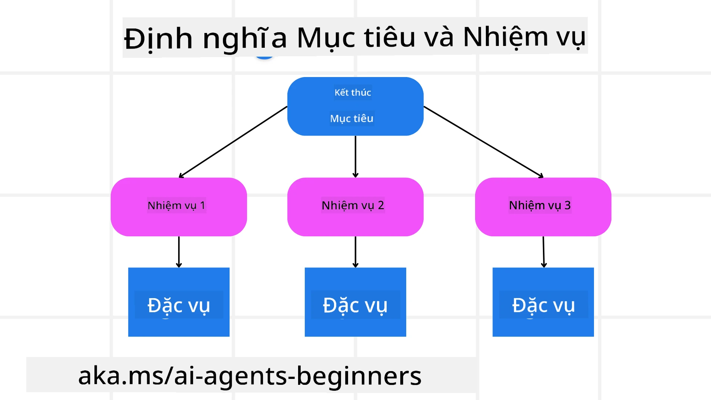

<!--
CO_OP_TRANSLATOR_METADATA:
{
  "original_hash": "43069833a0412210ad5c3cc93d9c2146",
  "translation_date": "2025-09-18T15:16:43+00:00",
  "source_file": "07-planning-design/README.md",
  "language_code": "vi"
}
-->

> _(Nhấp vào hình ảnh trên để xem video của bài học này)_

# Lập Kế Hoạch Thiết Kế

## Giới Thiệu

Bài học này sẽ đề cập đến:

* Xác định mục tiêu tổng thể rõ ràng và chia một nhiệm vụ phức tạp thành các nhiệm vụ dễ quản lý hơn.
* Tận dụng đầu ra có cấu trúc để có các phản hồi đáng tin cậy và dễ đọc bởi máy.
* Áp dụng cách tiếp cận dựa trên sự kiện để xử lý các nhiệm vụ động và đầu vào không mong đợi.

## Mục Tiêu Học Tập

Sau khi hoàn thành bài học này, bạn sẽ hiểu về:

* Xác định và đặt mục tiêu tổng thể cho một tác nhân AI, đảm bảo nó biết rõ cần đạt được điều gì.
* Phân chia một nhiệm vụ phức tạp thành các nhiệm vụ nhỏ hơn và sắp xếp chúng theo trình tự logic.
* Trang bị cho các tác nhân các công cụ phù hợp (ví dụ: công cụ tìm kiếm hoặc công cụ phân tích dữ liệu), quyết định khi nào và cách sử dụng chúng, và xử lý các tình huống không mong đợi phát sinh.
* Đánh giá kết quả của các nhiệm vụ nhỏ, đo lường hiệu suất, và lặp lại các hành động để cải thiện đầu ra cuối cùng.

## Xác Định Mục Tiêu Tổng Thể và Phân Chia Nhiệm Vụ

Hầu hết các nhiệm vụ trong thực tế đều quá phức tạp để giải quyết trong một bước duy nhất. Một tác nhân AI cần một mục tiêu ngắn gọn để định hướng kế hoạch và hành động của mình. Ví dụ, hãy xem xét mục tiêu:

    "Tạo lịch trình du lịch 3 ngày."

Mặc dù mục tiêu này dễ hiểu, nhưng vẫn cần được tinh chỉnh. Mục tiêu càng rõ ràng, tác nhân (và bất kỳ cộng tác viên con người nào) càng có thể tập trung vào việc đạt được kết quả đúng, chẳng hạn như tạo ra một lịch trình toàn diện với các tùy chọn chuyến bay, gợi ý khách sạn, và các hoạt động.

### Phân Chia Nhiệm Vụ

Các nhiệm vụ lớn hoặc phức tạp trở nên dễ quản lý hơn khi được chia thành các nhiệm vụ nhỏ hơn, có định hướng mục tiêu.
Đối với ví dụ về lịch trình du lịch, bạn có thể phân chia mục tiêu thành:

* Đặt vé máy bay
* Đặt khách sạn
* Thuê xe
* Cá nhân hóa

Mỗi nhiệm vụ nhỏ sau đó có thể được xử lý bởi các tác nhân hoặc quy trình chuyên biệt. Một tác nhân có thể chuyên tìm kiếm các ưu đãi vé máy bay tốt nhất, một tác nhân khác tập trung vào việc đặt khách sạn, v.v. Một tác nhân điều phối hoặc “xuôi dòng” sau đó có thể tổng hợp các kết quả này thành một lịch trình thống nhất cho người dùng cuối.

Cách tiếp cận theo mô-đun này cũng cho phép cải tiến từng bước. Ví dụ, bạn có thể thêm các tác nhân chuyên biệt cho Gợi Ý Đồ Ăn hoặc Gợi Ý Hoạt Động Địa Phương và tinh chỉnh lịch trình theo thời gian.

### Đầu Ra Có Cấu Trúc

Các Mô Hình Ngôn Ngữ Lớn (LLMs) có thể tạo ra đầu ra có cấu trúc (ví dụ: JSON) dễ dàng hơn cho các tác nhân hoặc dịch vụ xuôi dòng để phân tích và xử lý. Điều này đặc biệt hữu ích trong bối cảnh đa tác nhân, nơi chúng ta có thể thực hiện các nhiệm vụ này sau khi nhận được đầu ra từ việc lập kế hoạch. Xem thêm

---

**Tuyên bố miễn trừ trách nhiệm**:  
Tài liệu này đã được dịch bằng dịch vụ dịch thuật AI [Co-op Translator](https://github.com/Azure/co-op-translator). Mặc dù chúng tôi cố gắng đảm bảo độ chính xác, xin lưu ý rằng các bản dịch tự động có thể chứa lỗi hoặc không chính xác. Tài liệu gốc bằng ngôn ngữ bản địa nên được coi là nguồn thông tin chính thức. Đối với các thông tin quan trọng, khuyến nghị sử dụng dịch vụ dịch thuật chuyên nghiệp bởi con người. Chúng tôi không chịu trách nhiệm cho bất kỳ sự hiểu lầm hoặc diễn giải sai nào phát sinh từ việc sử dụng bản dịch này.