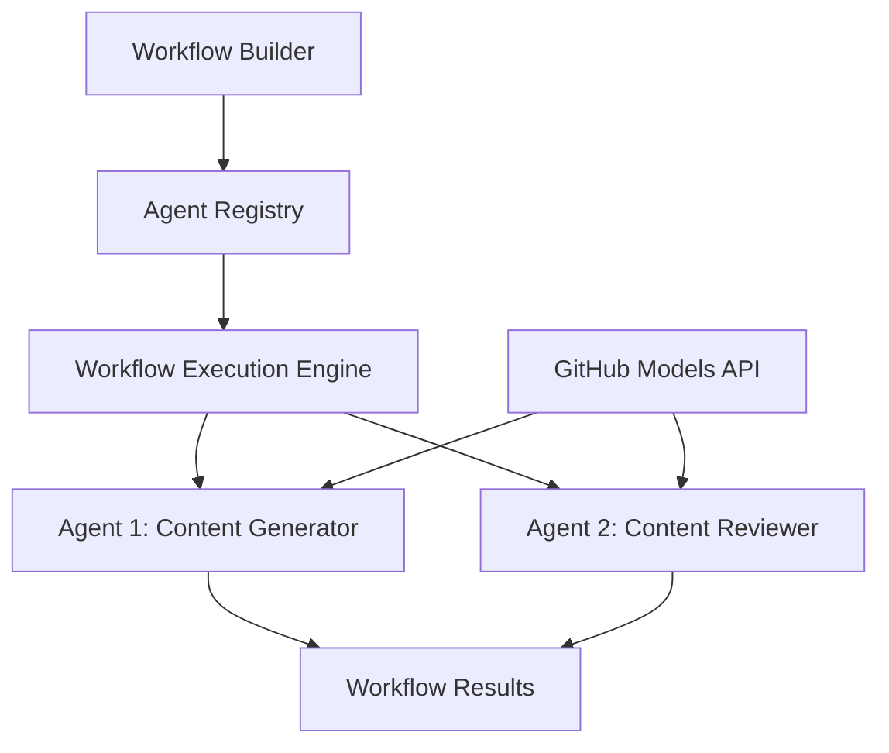

<!--
CO_OP_TRANSLATOR_METADATA:
{
  "original_hash": "034158688d0a45aae06dcbb21b0da5ae",
  "translation_date": "2025-11-11T12:54:02+00:00",
  "source_file": "08-multi-agent/code_samples/workflows-agent-framework/dotNET/01.dotnet-agent-framework-workflow-ghmodel-basic.md",
  "language_code": "vi"
}
-->
# 🔄 Quy trình làm việc cơ bản với các mô hình GitHub (.NET)

## 📋 Hướng dẫn điều phối quy trình làm việc

Notebook này hướng dẫn cách xây dựng các **quy trình làm việc của agent** phức tạp bằng cách sử dụng Microsoft Agent Framework cho .NET và các mô hình GitHub. Bạn sẽ học cách tạo các quy trình kinh doanh nhiều bước, nơi các agent AI hợp tác để hoàn thành các nhiệm vụ phức tạp thông qua các mẫu điều phối có cấu trúc.

## 🎯 Mục tiêu học tập

### 🏗️ **Kiến thức cơ bản về kiến trúc quy trình làm việc**
- **Workflow Builder**: Thiết kế và điều phối các quy trình AI nhiều bước phức tạp
- **Agent Coordination**: Điều phối nhiều agent chuyên biệt trong quy trình làm việc
- **GitHub Models Integration**: Tích hợp dịch vụ suy luận mô hình AI của GitHub vào quy trình làm việc
- **Visual Workflow Design**: Tạo và hình dung cấu trúc quy trình làm việc để hiểu rõ hơn

### 🔄 **Mẫu điều phối quy trình**
- **Sequential Processing**: Chuỗi các nhiệm vụ của agent theo thứ tự logic
- **State Management**: Duy trì ngữ cảnh và luồng dữ liệu qua các giai đoạn của quy trình làm việc
- **Error Handling**: Triển khai khôi phục lỗi mạnh mẽ và khả năng chịu lỗi của quy trình làm việc
- **Performance Optimization**: Thiết kế quy trình làm việc hiệu quả cho các hoạt động quy mô doanh nghiệp

### 🏢 **Ứng dụng quy trình làm việc trong doanh nghiệp**
- **Business Process Automation**: Tự động hóa các quy trình tổ chức phức tạp
- **Content Production Pipeline**: Quy trình biên tập với các giai đoạn xem xét và phê duyệt
- **Customer Service Automation**: Giải quyết yêu cầu khách hàng nhiều bước
- **Data Processing Workflows**: Quy trình ETL với chuyển đổi được hỗ trợ bởi AI

## ⚙️ Yêu cầu & Cài đặt

### 📦 **Các gói NuGet cần thiết**

Quy trình làm việc này sử dụng một số gói .NET quan trọng:

```xml
<!-- Core AI Framework -->
<PackageReference Include="Microsoft.Extensions.AI" Version="9.9.0" />

<!-- Agent Framework (Local Development) -->
<!-- Microsoft.Agents.AI.dll - Core agent abstractions -->
<!-- Microsoft.Agents.AI.OpenAI.dll - OpenAI/GitHub Models integration -->

<!-- Configuration and Environment -->
<PackageReference Include="DotNetEnv" Version="3.1.1" />
```

### 🔑 **Cấu hình GitHub Models**

**Cài đặt môi trường (.env file):**
```env
GITHUB_TOKEN=your_github_personal_access_token
GITHUB_ENDPOINT=https://models.inference.ai.azure.com
GITHUB_MODEL_ID=gpt-4o-mini
```

**Truy cập GitHub Models:**
1. Đăng ký GitHub Models (hiện đang trong giai đoạn preview)
2. Tạo token truy cập cá nhân với quyền truy cập mô hình
3. Cấu hình các biến môi trường như đã chỉ ra ở trên

### 🏗️ **Tổng quan về kiến trúc quy trình làm việc**



**Các thành phần chính:**
- **WorkflowBuilder**: Động cơ điều phối chính để thiết kế quy trình làm việc
- **AIAgent**: Các agent chuyên biệt với khả năng cụ thể
- **GitHub Models Client**: Tích hợp dịch vụ suy luận mô hình AI
- **Execution Context**: Quản lý trạng thái và luồng dữ liệu giữa các giai đoạn của quy trình làm việc

## 🎨 **Mẫu thiết kế quy trình làm việc trong doanh nghiệp**

### 📝 **Quy trình sản xuất nội dung**
```
User Request → Content Generation → Quality Review → Final Output
```

### 🔍 **Quy trình xử lý tài liệu**
```
Document Input → Analysis → Extraction → Validation → Structured Output
```

### 💼 **Quy trình phân tích kinh doanh**
```
Data Collection → Processing → Analysis → Report Generation → Distribution
```

### 🤝 **Tự động hóa dịch vụ khách hàng**
```
Customer Inquiry → Classification → Processing → Response Generation → Follow-up
```

## 🏢 **Lợi ích cho doanh nghiệp**

### 🎯 **Độ tin cậy & Khả năng mở rộng**
- **Deterministic Execution**: Kết quả quy trình làm việc nhất quán, có thể lặp lại
- **Error Recovery**: Xử lý lỗi một cách linh hoạt ở bất kỳ giai đoạn nào của quy trình làm việc
- **Performance Monitoring**: Theo dõi các chỉ số thực thi và cơ hội tối ưu hóa
- **Resource Management**: Phân bổ và sử dụng hiệu quả tài nguyên mô hình AI

### 🔒 **Bảo mật & Tuân thủ**
- **Secure Authentication**: Xác thực dựa trên token GitHub để truy cập API
- **Audit Trails**: Ghi lại đầy đủ quá trình thực thi quy trình làm việc và các điểm quyết định
- **Access Control**: Quyền hạn chi tiết cho việc thực thi và giám sát quy trình làm việc
- **Data Privacy**: Xử lý an toàn thông tin nhạy cảm trong suốt quy trình làm việc

### 📊 **Khả năng quan sát & Quản lý**
- **Visual Workflow Design**: Biểu diễn rõ ràng các luồng quy trình và sự phụ thuộc
- **Execution Monitoring**: Theo dõi tiến trình và hiệu suất của quy trình làm việc theo thời gian thực
- **Error Reporting**: Phân tích lỗi chi tiết và khả năng gỡ lỗi
- **Performance Analytics**: Các chỉ số để tối ưu hóa và lập kế hoạch năng lực

Hãy bắt đầu xây dựng quy trình làm việc AI sẵn sàng cho doanh nghiệp của bạn! 🚀

## 💻 Chạy mã

Triển khai đầy đủ có sẵn trong `01.dotnet-agent-framework-workflow-ghmodel-basic.cs`. Tệp này minh họa:

1. **Cấu hình môi trường** - Tải thông tin đăng nhập GitHub Models từ tệp `.env`
2. **OpenAI Client Setup** - Cấu hình client để sử dụng endpoint GitHub Models
3. **Agent Creation** - Định nghĩa các agent chuyên biệt (Front Desk và Concierge)
4. **Workflow Builder** - Tạo quy trình làm việc nhiều agent với xử lý tuần tự
5. **Workflow Execution** - Chạy quy trình làm việc với kết quả được truyền trực tiếp

### 🚀 Chạy ví dụ

```bash
# Make the script executable (Unix/Linux/macOS)
chmod +x 01.dotnet-agent-framework-workflow-ghmodel-basic.cs

# Run the workflow
./01.dotnet-agent-framework-workflow-ghmodel-basic.cs
```

Hoặc trên Windows:
```powershell
dotnet run 01.dotnet-agent-framework-workflow-ghmodel-basic.cs
```

### 📝 Kết quả mong đợi

Quy trình làm việc sẽ:
1. Nhận yêu cầu điểm đến du lịch của bạn ("Tôi muốn đi Paris")
2. Agent Front Desk cung cấp một gợi ý ban đầu
3. Agent Concierge xem xét và tinh chỉnh gợi ý
4. Kết quả cuối cùng hiển thị toàn bộ luồng hội thoại

### 🔧 Tùy chỉnh

Bạn có thể tùy chỉnh quy trình làm việc bằng cách:
- Thay đổi hướng dẫn cho agent để thay đổi hành vi của họ
- Thêm nhiều agent hơn để tạo quy trình làm việc nhiều bước phức tạp
- Thay đổi thông điệp người dùng để thử nghiệm các kịch bản khác nhau
- Điều chỉnh các cạnh của quy trình làm việc để tạo các mẫu thực thi khác nhau

---

<!-- CO-OP TRANSLATOR DISCLAIMER START -->
**Tuyên bố miễn trừ trách nhiệm**:  
Tài liệu này đã được dịch bằng dịch vụ dịch thuật AI [Co-op Translator](https://github.com/Azure/co-op-translator). Mặc dù chúng tôi cố gắng đảm bảo độ chính xác, xin lưu ý rằng các bản dịch tự động có thể chứa lỗi hoặc không chính xác. Tài liệu gốc bằng ngôn ngữ bản địa nên được coi là nguồn thông tin chính thức. Đối với thông tin quan trọng, nên sử dụng dịch vụ dịch thuật chuyên nghiệp bởi con người. Chúng tôi không chịu trách nhiệm cho bất kỳ sự hiểu lầm hoặc diễn giải sai nào phát sinh từ việc sử dụng bản dịch này.
<!-- CO-OP TRANSLATOR DISCLAIMER END -->