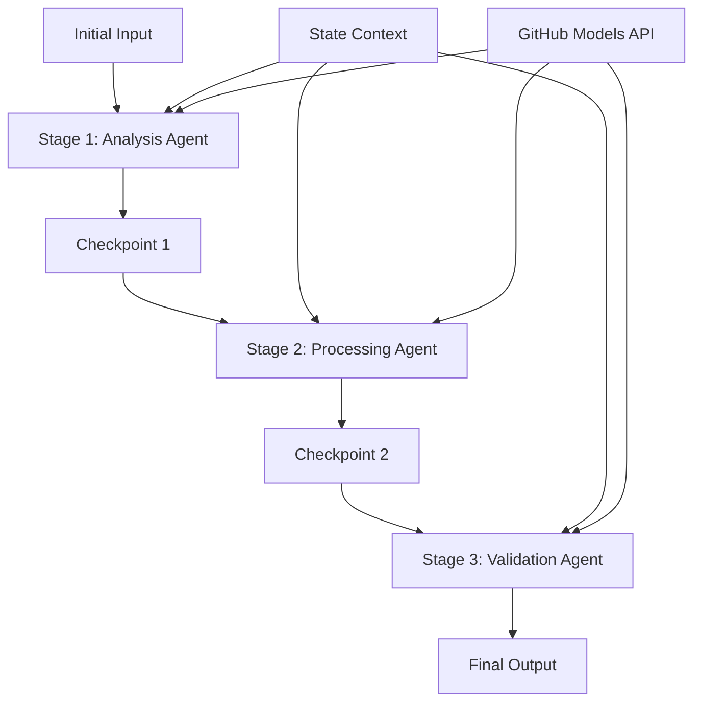

<!--
CO_OP_TRANSLATOR_METADATA:
{
  "original_hash": "1be9c8dcbd79a02d33d2c138684c1394",
  "translation_date": "2025-11-11T13:57:56+00:00",
  "source_file": "08-multi-agent/code_samples/workflows-agent-framework/dotNET/02.dotnet-agent-framework-workflow-ghmodel-sequential.md",
  "language_code": "vi"
}
-->
# ⏩ Quy trình làm việc tuần tự với GitHub Models (.NET)

## 📋 Hướng dẫn xử lý tuần tự nâng cao

Notebook này trình bày các **mẫu quy trình làm việc tuần tự** sử dụng Microsoft Agent Framework cho .NET và GitHub Models. Bạn sẽ học cách xây dựng các pipeline xử lý phức tạp từng bước, nơi các agent thực thi theo thứ tự cụ thể, với mỗi giai đoạn dựa trên kết quả của giai đoạn trước.

## 🎯 Mục tiêu học tập

### 🔄 **Kiến trúc xử lý tuần tự**
- **Thiết kế quy trình tuyến tính**: Tạo các pipeline xử lý từng bước với sự phụ thuộc rõ ràng
- **Quản lý trạng thái**: Duy trì ngữ cảnh và luồng dữ liệu qua các giai đoạn của quy trình tuần tự
- **Tích hợp GitHub Models**: Tận dụng các mô hình AI của GitHub trong các quy trình .NET nhiều giai đoạn
- **Mẫu pipeline doanh nghiệp**: Xây dựng hệ thống xử lý tuần tự sẵn sàng cho sản xuất

### 🏗️ **Mẫu tuần tự nâng cao**
- **Xử lý theo giai đoạn**: Triển khai các điểm kiểm tra xác thực giữa các giai đoạn của quy trình
- **Bảo toàn ngữ cảnh**: Duy trì trạng thái và kiến thức tích lũy qua tất cả các giai đoạn
- **Lan truyền lỗi**: Xử lý lỗi một cách linh hoạt trong chuỗi xử lý tuần tự
- **Tối ưu hóa hiệu suất**: Thực thi tuần tự hiệu quả với chi phí tối thiểu

### 🏢 **Ứng dụng tuần tự doanh nghiệp**
- **Pipeline xử lý tài liệu**: Phân tích, chuyển đổi và xác thực tài liệu nhiều giai đoạn
- **Quy trình đảm bảo chất lượng**: Xem xét, xác thực và phê duyệt tuần tự
- **Pipeline sản xuất nội dung**: Nghiên cứu → Viết → Chỉnh sửa → Xem xét → Xuất bản
- **Tự động hóa quy trình kinh doanh**: Quy trình kinh doanh nhiều bước với sự phụ thuộc rõ ràng giữa các giai đoạn

## ⚙️ Yêu cầu & Cài đặt

### 📦 **Các gói NuGet cần thiết**

Các gói cần thiết cho quy trình tuần tự .NET:

```xml
<!-- Core AI Framework -->
<PackageReference Include="Microsoft.Extensions.AI" Version="9.9.0" />

<!-- Client Model Abstractions -->
<PackageReference Include="System.ClientModel" Version="1.6.1.0" />

<!-- Azure Identity and Async LINQ Support -->
<PackageReference Include="Azure.Identity" Version="1.15.0" />
<PackageReference Include="System.Linq.Async" Version="6.0.3" />

<!-- Local Agent Framework References -->
<!-- Microsoft.Agents.AI.dll - Core agent abstractions -->
<!-- Microsoft.Agents.AI.OpenAI.dll - GitHub Models integration -->
```

### 🔑 **Cấu hình GitHub Models**

**Cài đặt môi trường (.env file):**
```env
GITHUB_TOKEN=your_github_personal_access_token
GITHUB_ENDPOINT=https://models.inference.ai.azure.com
GITHUB_MODEL_ID=gpt-4o-mini
```

**Quản lý cấu hình:**
```csharp
// Load environment variables securely
Env.Load("../../../.env");
var githubToken = Environment.GetEnvironmentVariable("GITHUB_TOKEN");
var githubEndpoint = Environment.GetEnvironmentVariable("GITHUB_ENDPOINT");
var modelId = Environment.GetEnvironmentVariable("GITHUB_MODEL_ID");
```

### 🏗️ **Kiến trúc quy trình tuần tự**



**Các thành phần chính:**
- **Sequential Agents**: Các agent chuyên biệt cho từng giai đoạn xử lý
- **State Context**: Duy trì dữ liệu và quyết định tích lũy qua các giai đoạn
- **Checkpoints**: Các điểm kiểm tra xác thực giữa các giai đoạn để đảm bảo chất lượng và tính nhất quán
- **GitHub Models Client**: Truy cập mô hình AI nhất quán qua tất cả các giai đoạn của quy trình

## 🎨 **Mẫu thiết kế quy trình tuần tự**

### 📝 **Pipeline xử lý tài liệu**
```
Raw Document → Content Extraction → Analysis → Validation → Structured Output
```

### 🎯 **Quy trình tạo nội dung**
```
Brief/Requirements → Research → Content Creation → Review → Final Polish
```

### 🔍 **Pipeline đảm bảo chất lượng**
```
Initial Review → Technical Validation → Compliance Check → Final Approval
```

### 💼 **Quy trình phân tích kinh doanh**
```
Data Collection → Processing → Analysis → Report Generation → Distribution
```

## 🏢 **Lợi ích tuần tự doanh nghiệp**

### 🎯 **Độ tin cậy & Chất lượng**
- **Xử lý xác định**: Kết quả nhất quán, có thể lặp lại thông qua các giai đoạn có cấu trúc
- **Cổng chất lượng**: Các điểm kiểm tra xác thực đảm bảo chất lượng ở mỗi giai đoạn
- **Cách ly lỗi**: Vấn đề ở một giai đoạn không lan sang các giai đoạn tiếp theo
- **Dấu vết kiểm toán**: Theo dõi đầy đủ các quyết định và chuyển đổi ở mỗi giai đoạn

### 📈 **Khả năng mở rộng & Hiệu suất**
- **Thiết kế mô-đun**: Mỗi giai đoạn có thể được tối ưu hóa độc lập
- **Quản lý tài nguyên**: Phân bổ hiệu quả tài nguyên mô hình AI qua các giai đoạn
- **Tối ưu hóa trạng thái**: Chuyển trạng thái tối thiểu giữa các giai đoạn để đạt hiệu suất tối ưu
- **Nhóm giai đoạn song song**: Nhiều quy trình tuần tự có thể chạy song song

### 🔒 **Bảo mật & Tuân thủ**
- **Bảo mật cấp giai đoạn**: Các chính sách bảo mật khác nhau cho các giai đoạn xử lý khác nhau
- **Xác thực dữ liệu**: Đảm bảo tính toàn vẹn và tuân thủ dữ liệu tại mỗi điểm kiểm tra
- **Kiểm soát truy cập**: Quyền hạn chi tiết cho các giai đoạn quy trình khác nhau
- **Tuân thủ quy định**: Đáp ứng các yêu cầu quy định thông qua xử lý có cấu trúc

### 📊 **Giám sát & Phân tích**
- **Chỉ số cấp giai đoạn**: Giám sát hiệu suất cho từng giai đoạn quy trình
- **Xác định nút thắt cổ chai**: Xác định và tối ưu hóa các giai đoạn chậm
- **Chỉ số chất lượng**: Theo dõi chất lượng và tỷ lệ thành công ở mỗi giai đoạn
- **Tối ưu hóa quy trình**: Cải tiến liên tục dựa trên phân tích cấp giai đoạn

Hãy xây dựng các pipeline xử lý AI tuần tự mạnh mẽ! 🚀

## 💻 Chạy mã

Triển khai đầy đủ có sẵn trong `02.dotnet-agent-framework-workflow-ghmodel-sequential.cs`. Tệp này trình bày một **quy trình phân tích nội thất ba giai đoạn**:

1. **Giai đoạn 1 - Sales Agent**: Phân tích hình ảnh nội thất và đưa ra gợi ý mua hàng
2. **Giai đoạn 2 - Price Agent**: Cung cấp phân tích chi tiết về giá cả và các tùy chọn ngân sách
3. **Giai đoạn 3 - Quote Agent**: Tạo tài liệu báo giá chuyên nghiệp ở định dạng Markdown

### 🏗️ **Kiến trúc quy trình**

```
Image Input → Sales Analysis → Price Estimation → Quote Generation → Final Output
```

Mỗi agent:
- Nhận đầu ra từ giai đoạn trước làm ngữ cảnh
- Xây dựng dựa trên phân tích trước đó với chuyên môn chuyên biệt
- Duy trì tính liên tục của quy trình thông qua quản lý trạng thái

### 🚀 Chạy ví dụ

**Yêu cầu:**
- Đặt một hình ảnh nội thất tại `../imgs/home.png` (hoặc cập nhật biến `imgPath`)
- Cấu hình tệp `.env` của bạn với thông tin đăng nhập GitHub Models

```bash
# Make the script executable (Unix/Linux/macOS)
chmod +x 02.dotnet-agent-framework-workflow-ghmodel-sequential.cs

# Run the sequential workflow
./02.dotnet-agent-framework-workflow-ghmodel-sequential.cs
```

Hoặc trên Windows:
```powershell
dotnet run 02.dotnet-agent-framework-workflow-ghmodel-sequential.cs
```

### 📝 Kết quả mong đợi

Quy trình sẽ:
1. **Sales Agent**: Xác định các món đồ nội thất từ hình ảnh và đưa ra gợi ý
2. **Price Agent**: Thêm phân tích chi tiết về giá cả với các mức ngân sách và gợi ý mua sắm
3. **Quote Agent**: Tạo tài liệu báo giá được định dạng với tất cả thông tin đã tổng hợp

Kết quả cuối cùng sẽ là một báo giá nội thất chuyên nghiệp, toàn diện dựa trên phân tích hình ảnh.

### 🔧 Tùy chọn tùy chỉnh

**Thay đổi hành vi của Agent:**
```csharp
// Adjust agent instructions to change their focus
const string SalesAgentInstructions = "Your custom instructions...";
```

**Thay đổi luồng tuần tự:**
```csharp
// Add or reorder workflow stages
var workflow = new WorkflowBuilder(salesagent)
    .AddEdge(salesagent, priceagent)
    .AddEdge(priceagent, quoteagent)
    .AddEdge(quoteagent, newAgent)  // Add another stage
    .Build();
```

**Sử dụng đầu vào khác:**
```csharp
// Process text instead of images
ChatMessage userMessage = new ChatMessage(ChatRole.User, [
    new TextContent("Analyze pricing for a modern living room set")
]);
```

### 🎯 Ứng dụng thực tế

Mẫu tuần tự này lý tưởng cho:
- **Thương mại điện tử**: Phân tích sản phẩm → Định giá → Tạo báo giá
- **Bất động sản**: Phân tích tài sản → Định giá → Tạo danh sách
- **Bảo hiểm**: Phân tích yêu cầu → Đánh giá → Tạo báo giá
- **Sản xuất nội dung**: Nghiên cứu → Viết → Chỉnh sửa → Xuất bản

### 🔍 Hiểu luồng trạng thái

Mỗi agent trong chuỗi nhận:
- **Đầu vào ban đầu**: Tin nhắn người dùng ban đầu (hình ảnh + văn bản)
- **Đầu ra của các agent trước**: Tất cả các phản hồi của agent trước trong lịch sử hội thoại
- **Ngữ cảnh tích lũy**: Trạng thái hoàn chỉnh được duy trì xuyên suốt quy trình

Điều này cho phép xử lý nhiều giai đoạn phức tạp, nơi mỗi agent xây dựng dựa trên ngữ cảnh toàn diện từ tất cả các giai đoạn trước.

---

<!-- CO-OP TRANSLATOR DISCLAIMER START -->
**Tuyên bố miễn trừ trách nhiệm**:  
Tài liệu này đã được dịch bằng dịch vụ dịch thuật AI [Co-op Translator](https://github.com/Azure/co-op-translator). Mặc dù chúng tôi cố gắng đảm bảo độ chính xác, xin lưu ý rằng các bản dịch tự động có thể chứa lỗi hoặc không chính xác. Tài liệu gốc bằng ngôn ngữ bản địa nên được coi là nguồn thông tin chính thức. Đối với thông tin quan trọng, nên sử dụng dịch vụ dịch thuật chuyên nghiệp bởi con người. Chúng tôi không chịu trách nhiệm cho bất kỳ sự hiểu lầm hoặc diễn giải sai nào phát sinh từ việc sử dụng bản dịch này.
<!-- CO-OP TRANSLATOR DISCLAIMER END -->