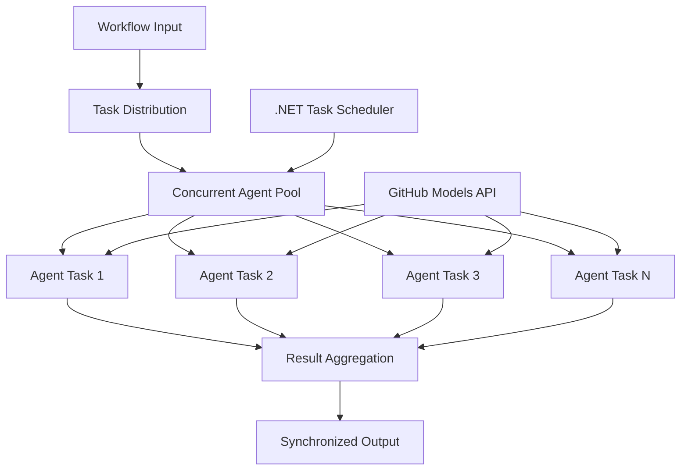

<!--
CO_OP_TRANSLATOR_METADATA:
{
  "original_hash": "b9c6e32c9b5f2fed20b6916984440d88",
  "translation_date": "2025-11-11T13:25:01+00:00",
  "source_file": "08-multi-agent/code_samples/workflows-agent-framework/dotNET/03.dotnet-agent-framework-workflow-ghmodel-concurrent.md",
  "language_code": "vi"
}
-->
# ⚡ Quy trình làm việc đồng thời với các mô hình GitHub (.NET)

## 📋 Hướng dẫn xử lý song song hiệu suất cao

Notebook này trình bày các **mẫu quy trình làm việc đồng thời** sử dụng Microsoft Agent Framework cho .NET và các mô hình GitHub. Bạn sẽ học cách xây dựng các quy trình làm việc xử lý song song hiệu suất cao, tối đa hóa thông lượng bằng cách thực thi nhiều tác nhân AI đồng thời trong khi vẫn duy trì sự phối hợp và tính nhất quán của dữ liệu.

## 🎯 Mục tiêu học tập

### 🚀 **Kiến thức cơ bản về xử lý đồng thời**
- **Thực thi tác nhân song song**: Chạy nhiều tác nhân AI đồng thời để đạt hiệu suất tối đa
- **Mẫu Async/Await**: Tận dụng mô hình lập trình async của .NET để xử lý đồng thời hiệu quả
- **Tích hợp mô hình GitHub**: Phối hợp nhiều cuộc gọi đồng thời đến dịch vụ suy luận mô hình AI của GitHub
- **Quản lý tài nguyên**: Quản lý hiệu quả tài nguyên mô hình AI trong các hoạt động đồng thời

### 🏗️ **Kiến trúc đồng thời nâng cao**
- **Song song dựa trên tác vụ**: Sử dụng Thư viện Tác vụ Song song của .NET để thực thi đồng thời tối ưu
- **Mẫu đồng bộ hóa**: Phối hợp các tác nhân đồng thời trong khi tránh điều kiện tranh chấp
- **Cân bằng tải**: Phân phối công việc hiệu quả trên khả năng xử lý đồng thời có sẵn
- **Khả năng chịu lỗi**: Xử lý lỗi của từng tác nhân mà không làm gián đoạn toàn bộ quy trình làm việc

### 🏢 **Ứng dụng đồng thời trong doanh nghiệp**
- **Xử lý tài liệu khối lượng lớn**: Xử lý nhiều tài liệu đồng thời
- **Phân tích nội dung thời gian thực**: Phân tích đồng thời các luồng dữ liệu đến
- **Tối ưu hóa xử lý theo lô**: Tối đa hóa thông lượng cho các hoạt động xử lý dữ liệu quy mô lớn
- **Phân tích đa phương thức**: Xử lý song song các loại nội dung và định dạng khác nhau

## ⚙️ Yêu cầu & Cài đặt

### 📦 **Các gói NuGet cần thiết**

Các gói cần thiết cho quy trình làm việc đồng thời hiệu suất cao:

```xml
<!-- Core AI Framework with Async Support -->
<PackageReference Include="Microsoft.Extensions.AI" Version="9.9.0" />

<!-- Client Model Abstractions for API Communication -->
<PackageReference Include="System.ClientModel" Version="1.6.1.0" />

<!-- Azure Identity and Async LINQ for Advanced Operations -->
<PackageReference Include="Azure.Identity" Version="1.15.0" />
<PackageReference Include="System.Linq.Async" Version="6.0.3" />

<!-- Local Agent Framework References -->
<!-- Microsoft.Agents.AI.dll - Core agent abstractions with async support -->
<!-- Microsoft.Agents.AI.OpenAI.dll - GitHub Models integration with concurrency -->
```

### 🔑 **Cấu hình mô hình GitHub**

**Cài đặt môi trường (tệp .env):**
```env
GITHUB_TOKEN=your_github_personal_access_token
GITHUB_ENDPOINT=https://models.inference.ai.azure.com
GITHUB_MODEL_ID=gpt-4o-mini
```

**Cân nhắc xử lý đồng thời:**
```csharp
// Configure for concurrent operations
var clientOptions = new OpenAIClientOptions()
{
    Endpoint = new Uri(githubEndpoint),
    // Configure connection pooling for concurrent requests
    NetworkTimeout = TimeSpan.FromMinutes(5)
};
```

### 🏗️ **Kiến trúc quy trình làm việc đồng thời**



**Các thành phần chính:**
- **Thư viện Tác vụ Song song**: Hỗ trợ tích hợp của .NET cho các hoạt động đồng thời
- **Nhóm tác nhân**: Nhiều phiên bản tác nhân để xử lý song song
- **Tổng hợp kết quả**: Phối hợp và hợp nhất kết quả của các tác nhân đồng thời
- **Điểm đồng bộ hóa**: Đảm bảo tính nhất quán dữ liệu trong các hoạt động đồng thời

## 🎨 **Mẫu thiết kế quy trình làm việc đồng thời**

### 🔍 **Nghiên cứu & phân tích song song**
```
Research Topic → Concurrent Research Agents → Result Synthesis → Final Report
```

### 📊 **Xử lý dữ liệu từ nhiều nguồn**
```
Data Sources → Parallel Processing Agents → Data Integration → Unified Output
```

### 🎭 **Quy trình tạo nội dung**
```
Content Requirements → Concurrent Content Generators → Quality Review → Final Content
```

### 🔄 **Xử lý Fan-Out/Fan-In**
```
Single Input → Multiple Concurrent Processors → Result Aggregation → Single Output
```

## 🏢 **Lợi ích hiệu suất trong doanh nghiệp**

### ⚡ **Thông lượng & khả năng mở rộng**
- **Tăng hiệu suất tuyến tính**: Thêm nhiều tác nhân đồng thời để tăng thông lượng
- **Sử dụng tài nguyên**: Hiệu quả tối đa của khả năng mô hình AI có sẵn
- **Giảm thời gian xử lý**: Giảm đáng kể thời gian thông qua thực thi song song
- **Mở rộng linh hoạt**: Điều chỉnh số lượng tác nhân đồng thời dựa trên khối lượng công việc

### 🛡️ **Độ tin cậy & khả năng phục hồi**
- **Cách ly lỗi**: Lỗi của từng tác nhân không ảnh hưởng đến các hoạt động đồng thời khác
- **Suy giảm nhẹ nhàng**: Hệ thống tiếp tục hoạt động với khả năng tác nhân giảm
- **Khôi phục lỗi**: Cơ chế tự động thử lại cho các hoạt động đồng thời bị lỗi
- **Phân phối tải**: Phân phối công việc đồng đều trên các tác nhân có sẵn

### 📊 **Giám sát hiệu suất**
- **Chỉ số thực thi đồng thời**: Theo dõi hiệu suất của tất cả các hoạt động song song
- **Phân tích sử dụng tài nguyên**: Giám sát CPU, bộ nhớ và sử dụng mạng
- **Phân tích thông lượng**: Đo lường hiệu quả đạt được từ xử lý đồng thời
- **Phát hiện nút thắt**: Xác định và giải quyết các hạn chế về hiệu suất

### 🔧 **Phát triển & vận hành**
- **Mẫu lập trình Async**: Tận dụng các mẫu async/await trưởng thành của .NET
- **Phối hợp tác vụ**: Khả năng quản lý và phối hợp tác vụ tích hợp
- **Xử lý ngoại lệ**: Xử lý lỗi toàn diện cho các hoạt động đồng thời
- **Hỗ trợ gỡ lỗi**: Công cụ gỡ lỗi của Visual Studio cho các quy trình làm việc đồng thời

Hãy xây dựng các quy trình làm việc AI đồng thời hiệu suất cao với .NET! 🚀

## 💻 Chạy mã

Triển khai đầy đủ có sẵn trong `03.dotnet-agent-framework-workflow-ghmodel-concurrent.cs`. Tệp này trình bày một **quy trình làm việc Fan-Out/Fan-In đồng thời** cho việc lập kế hoạch du lịch:

### 🏗️ **Kiến trúc quy trình làm việc**

```
User Request → ConcurrentStartExecutor → [Researcher Agent || Planner Agent] → ConcurrentAggregationExecutor → Final Output
```

**Các thành phần chính:**

1. **ConcurrentStartExecutor**: Phát yêu cầu của người dùng đến tất cả các tác nhân đồng thời
2. **Researcher Agent**: Phân tích các điểm đến và điểm tham quan đồng thời
3. **Planner Agent**: Tạo kế hoạch du lịch chi tiết đồng thời
4. **ConcurrentAggregationExecutor**: Thu thập và hợp nhất kết quả từ cả hai tác nhân

### 🎯 **Mẫu Fan-Out/Fan-In**

Quy trình làm việc này trình bày mẫu **Fan-Out/Fan-In** cổ điển:
- **Fan-Out**: Một thông điệp đầu vào được phát đến nhiều tác nhân đồng thời
- **Xử lý đồng thời**: Nhiều tác nhân làm việc song song trên cùng một nhiệm vụ
- **Fan-In**: Kết quả từ tất cả các tác nhân được thu thập và hợp nhất thành một đầu ra duy nhất

### 🚀 Chạy ví dụ

```bash
# Make the script executable (Unix/Linux/macOS)
chmod +x 03.dotnet-agent-framework-workflow-ghmodel-concurrent.cs

# Run the concurrent workflow
./03.dotnet-agent-framework-workflow-ghmodel-concurrent.cs
```

Hoặc trên Windows:
```powershell
dotnet run 03.dotnet-agent-framework-workflow-ghmodel-concurrent.cs
```

### 📝 Kết quả mong đợi

Quy trình làm việc sẽ:
1. **Phát yêu cầu**: Gửi "Lập kế hoạch chuyến đi đến Seattle vào tháng 12" đến cả hai tác nhân
2. **Xử lý đồng thời**: Cả hai tác nhân làm việc đồng thời:
   - Researcher xác định các điểm tham quan và chi tiết
   - Planner tạo lịch trình và hậu cần
3. **Tổng hợp**: Kết hợp cả hai phản hồi thành đầu ra toàn diện
4. **Hiển thị kết quả**: Hiển thị kế hoạch du lịch đã hợp nhất với tất cả thông tin

### 🔧 Tùy chọn tùy chỉnh

**Thêm nhiều tác nhân đồng thời:**
```csharp
// Create additional specialized agents
AIAgent budgetAgent = openAIClient.GetChatClient(github_model_id).CreateAIAgent(
    name: "Budget-Agent", instructions: "Calculate travel costs...");

// Add to fan-out
var workflow = new WorkflowBuilder(startExecutor)
    .AddFanOutEdge(startExecutor, targets: [researcherAgent, plannerAgent, budgetAgent])
    .AddFanInEdge(aggregationExecutor, sources: [researcherAgent, plannerAgent, budgetAgent])
    .WithOutputFrom(aggregationExecutor)
    .Build();

// Update aggregation count
if (this._messages.Count == 3) { ... }
```

**Sửa đổi hướng dẫn cho tác nhân:**
```csharp
const string ResearcherAgentInstructions = "Your custom instructions for research...";
const string PlanAgentInstructions = "Your custom instructions for planning...";
```

**Thay đổi nhiệm vụ:**
```csharp
StreamingRun run = await InProcessExecution.StreamAsync(
    workflow, 
    "Plan a European vacation for 2 weeks in summer"
);
```

### 🎯 Ứng dụng thực tế

Mẫu đồng thời này lý tưởng cho:
- **Tạo nội dung**: Nhiều người viết tạo các phần khác nhau đồng thời
- **Kiểm tra mã**: Nhiều người kiểm tra phân tích mã từ các góc nhìn khác nhau
- **Nghiên cứu thị trường**: Phân tích song song các phân khúc thị trường khác nhau
- **Xử lý tài liệu**: Trích xuất, phân tích và xác thực đồng thời
- **Phân tích đa góc nhìn**: Nhận các quan điểm đa dạng về cùng một đầu vào

### 🔍 Hiểu các bộ thực thi tùy chỉnh

**ConcurrentStartExecutor:**
- Triển khai `IMessageHandler<string>` để chấp nhận đầu vào dạng chuỗi
- Phát thông điệp đến tất cả các tác nhân được kết nối
- Gửi `TurnToken` để kích hoạt xử lý đồng thời

**ConcurrentAggregationExecutor:**
- Triển khai `IMessageHandler<ChatMessage>` để nhận phản hồi từ tác nhân
- Thu thập thông điệp một cách an toàn trong môi trường đa luồng
- Tổng hợp khi tất cả các phản hồi mong đợi đã đến
- Cung cấp đầu ra cuối cùng bằng `context.YieldOutputAsync()`

### ⚡ Lợi ích hiệu suất

**Đồng thời vs Tuần tự:**
- Tuần tự: Agent1 (30s) → Agent2 (30s) = **60 giây tổng cộng**
- Đồng thời: Agent1 (30s) || Agent2 (30s) = **30 giây tổng cộng**

**Cải thiện thông lượng**: Nhanh hơn đến N× cho N tác nhân đồng thời (tùy thuộc vào khối lượng công việc và tài nguyên)

### 🛡️ Xử lý lỗi

Quy trình làm việc xử lý lỗi của từng tác nhân một cách nhẹ nhàng:
- Nếu một tác nhân thất bại, các tác nhân khác vẫn tiếp tục xử lý
- Bộ tổng hợp có thể triển khai logic timeout
- Kết quả một phần có thể được trả về nếu cần

### 📊 Tính năng nâng cao

**Số lượng tác nhân động:**
Sửa đổi logic tổng hợp để hỗ trợ số lượng tác nhân thay đổi:

```csharp
private int _expectedAgentCount;
private readonly List<ChatMessage> _messages = [];

public async ValueTask HandleAsync(ChatMessage message, IWorkflowContext context)
{
    this._messages.Add(message);
    if (this._messages.Count == _expectedAgentCount)
    {
        // Process aggregation
    }
}
```

Mẫu quy trình làm việc đồng thời này là thiết yếu để xây dựng các hệ thống tác nhân AI hiệu suất cao, có khả năng mở rộng!

---

<!-- CO-OP TRANSLATOR DISCLAIMER START -->
**Tuyên bố miễn trừ trách nhiệm**:  
Tài liệu này đã được dịch bằng dịch vụ dịch thuật AI [Co-op Translator](https://github.com/Azure/co-op-translator). Mặc dù chúng tôi cố gắng đảm bảo độ chính xác, xin lưu ý rằng các bản dịch tự động có thể chứa lỗi hoặc không chính xác. Tài liệu gốc bằng ngôn ngữ bản địa nên được coi là nguồn thông tin chính thức. Đối với thông tin quan trọng, khuyến nghị sử dụng dịch vụ dịch thuật chuyên nghiệp bởi con người. Chúng tôi không chịu trách nhiệm về bất kỳ sự hiểu lầm hoặc diễn giải sai nào phát sinh từ việc sử dụng bản dịch này.
<!-- CO-OP TRANSLATOR DISCLAIMER END -->