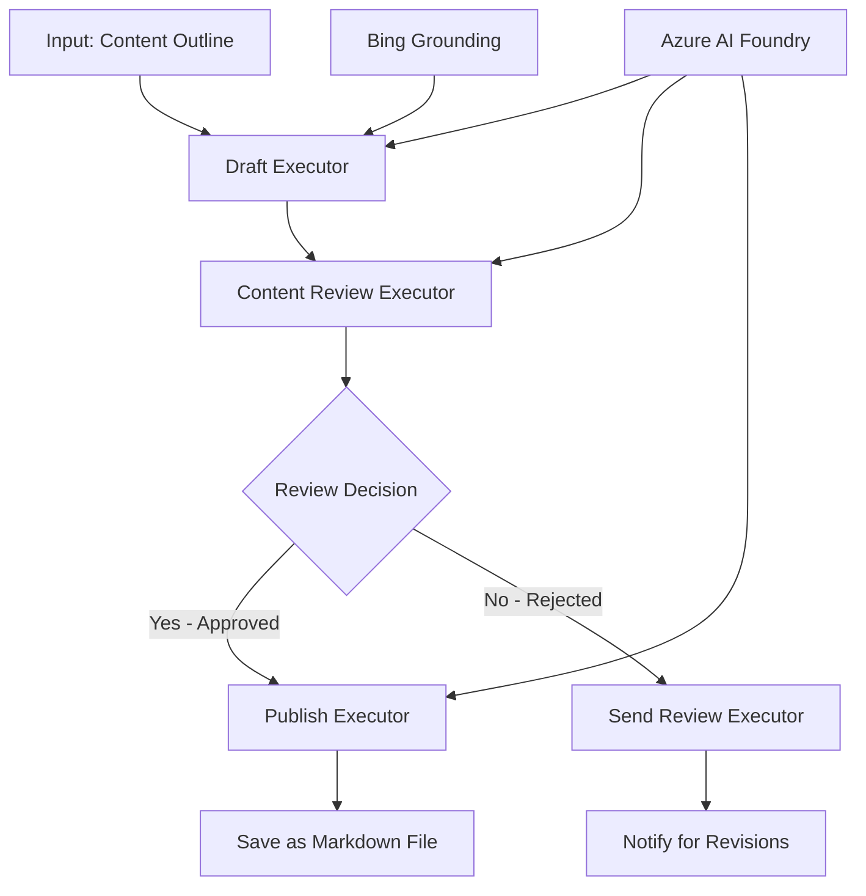

<!--
CO_OP_TRANSLATOR_METADATA:
{
  "original_hash": "8abd335151cee553293b637ee3d80d10",
  "translation_date": "2025-11-11T12:23:01+00:00",
  "source_file": "08-multi-agent/code_samples/workflows-agent-framework/dotNET/04.dotnet-agent-framework-workflow-aifoundry-condition.md",
  "language_code": "vi"
}
-->
# 🔀 Quy trình làm việc của Agent có điều kiện với Azure AI Foundry (.NET)

## 📋 Hướng dẫn quy trình làm việc dựa trên quyết định thông minh

Notebook này minh họa **mẫu quy trình làm việc có điều kiện** sử dụng Azure AI Foundry và Microsoft Agent Framework cho .NET. Bạn sẽ học cách xây dựng các quy trình làm việc phức tạp, dựa trên quyết định, định tuyến xử lý một cách thông minh dựa trên phân tích AI, quy tắc kinh doanh và các điều kiện động cho tự động hóa cấp doanh nghiệp.

## 🎯 Mục tiêu học tập

### 🧠 **Kiến trúc quyết định thông minh**
- **Triển khai logic có điều kiện**: Xây dựng cây quyết định phức tạp với nhiều điểm phân nhánh
- **Định tuyến dựa trên AI**: Sử dụng các mô hình Azure AI Foundry để đưa ra quyết định định tuyến thông minh
- **Thích ứng quy trình làm việc động**: Điều chỉnh hành vi quy trình làm việc dựa trên phân tích và điều kiện thời gian thực
- **Tích hợp quy tắc doanh nghiệp**: Kết hợp logic kinh doanh và yêu cầu tuân thủ vào quy trình làm việc

### 🔀 **Mẫu điều kiện nâng cao**
- **Ra quyết định đa tiêu chí**: Đánh giá nhiều yếu tố để đưa ra quyết định định tuyến
- **Xử lý theo ngữ cảnh**: Đưa ra quyết định dựa trên ngữ cảnh và lịch sử quy trình làm việc tích lũy
- **Điều chỉnh quy trình làm việc thích ứng**: Điều chỉnh đường xử lý một cách động dựa trên các điều kiện thời gian thực
- **Tích hợp công cụ quy tắc**: Triển khai các công cụ quy tắc kinh doanh phức tạp trong quy trình làm việc

### 🏢 **Ứng dụng điều kiện cấp doanh nghiệp**
- **Phân loại và định tuyến tài liệu**: Tự động phân loại và định tuyến tài liệu đến các quy trình làm việc phù hợp
- **Phân loại dịch vụ khách hàng**: Định tuyến thông minh các yêu cầu của khách hàng đến các nhóm xử lý chuyên biệt
- **Xử lý tuân thủ và rủi ro**: Áp dụng các quy trình xác thực và xem xét khác nhau dựa trên đánh giá rủi ro
- **Quy trình đảm bảo chất lượng**: Định tuyến nội dung qua các quy trình xem xét phù hợp dựa trên các chỉ số chất lượng

## ⚙️ Yêu cầu & Cài đặt

### 📦 **Các gói NuGet cần thiết**

Các gói nâng cao cho xử lý quy trình làm việc có điều kiện:

```xml
<!-- Core AI Framework -->
<PackageReference Include="Microsoft.Extensions.AI" Version="9.9.0" />

<!-- Azure AI Agents with Persistent State -->
<PackageReference Include="Azure.AI.Agents.Persistent" Version="1.2.0-beta.5" />

<!-- Azure Identity and Utilities -->
<PackageReference Include="Azure.Identity" Version="1.15.0" />
<PackageReference Include="System.Linq.Async" Version="6.0.3" />
<PackageReference Include="DotNetEnv" Version="3.1.1" />

<!-- Local Workflow Framework References -->
<!-- Microsoft.Agents.Workflows.dll - Advanced workflow orchestration -->
<!-- Microsoft.Agents.AI.AzureAI.dll - Azure AI Foundry integration -->
<!-- Microsoft.Agents.AI.dll - Core agent abstractions -->
```

### 🔑 **Cấu hình Azure AI Foundry**

**Các tài nguyên Azure cần thiết:**
- Không gian làm việc Azure AI Foundry với các mô hình xử lý có điều kiện
- Đăng ký Azure với hạn mức tính toán và quyền phù hợp
- Các mô hình AI đã triển khai để đưa ra quyết định và phân tích nội dung
- (Tùy chọn) Kết nối Bing Search API để hỗ trợ khả năng tìm kiếm

**Cấu hình môi trường (.env file):**
```env
# Azure AI Foundry Configuration
AZURE_AI_PROJECT_ENDPOINT=https://your-project.cognitiveservices.azure.com/
BING_CONNECTION_ID=your-bing-connection-id
```

**Cài đặt xác thực:**
```csharp
// Azure CLI or Managed Identity authentication
using Azure.Identity;
var credential = new AzureCliCredential();

// Load environment configuration
DotNetEnv.Env.Load("../../../.env");
```

### 🏗️ **Kiến trúc quy trình làm việc có điều kiện**



**Các thành phần chính:**
- **Draft Executor**: Agent AI tạo bản nháp nội dung ban đầu từ các đề cương
- **Content Review Executor**: Agent AI đánh giá chất lượng và tuân thủ của bản nháp
- **Conditional Routing**: Logic quyết định định tuyến dựa trên kết quả đánh giá
- **Publish/Review Paths**: Các đường xử lý riêng biệt cho nội dung được chấp thuận và bị từ chối
- **State Management**: Duy trì ngữ cảnh nội dung và đánh giá trong suốt quy trình làm việc

## 🎨 **Mẫu thiết kế quy trình làm việc có điều kiện**

### 📋 **Sản xuất nội dung với các cổng chất lượng**
```
Outline → Draft Creation → Quality Review → {Approve: Publish | Reject: Revise}
```

### 🎯 **Xử lý tài liệu dựa trên rủi ro**
```
Document → Risk Assessment → {Low: Standard | High: Enhanced Review}
```

### 🔍 **Định tuyến dịch vụ khách hàng thông minh**
```
Customer Query → Analysis → {Simple: FAQ Bot | Complex: Human Agent}
```

### 💼 **Quy trình làm việc dựa trên tuân thủ**
```
Content → Compliance Check → {Pass: Publish | Fail: Legal Review}
```

## 🏢 **Lợi ích điều kiện cấp doanh nghiệp**

### 🎯 **Tự động hóa thông minh**
- **Ra quyết định thông minh**: Quyết định định tuyến dựa trên phân tích nội dung và ngữ cảnh bởi AI
- **Xử lý thích ứng**: Quy trình làm việc tự động điều chỉnh dựa trên các điều kiện thay đổi
- **Thực thi quy tắc kinh doanh**: Áp dụng tự động các logic kinh doanh và chính sách phức tạp
- **Định tuyến theo ngữ cảnh**: Quyết định dựa trên toàn bộ lịch sử quy trình làm việc và ngữ cảnh tích lũy

### 📈 **Hiệu quả hoạt động**
- **Phân bổ tài nguyên tối ưu**: Định tuyến công việc đến các chuyên gia và quy trình phù hợp nhất
- **Giảm can thiệp thủ công**: Quyết định tự động giảm thiểu nhu cầu định tuyến của con người
- **Thời gian giải quyết nhanh hơn**: Định tuyến trực tiếp đến chuyên môn và khả năng xử lý phù hợp
- **Áp dụng nhất quán**: Áp dụng đồng nhất các quy tắc kinh doanh và tiêu chí quyết định

### 🛡️ **Quản lý rủi ro & tuân thủ**
- **Đánh giá rủi ro tự động**: Đánh giá mức độ rủi ro của nội dung và tình huống bởi AI
- **Thực thi tuân thủ**: Định tuyến tự động qua các quy trình quy định cần thiết
- **Áp dụng giao thức bảo mật**: Các biện pháp bảo mật nâng cao được áp dụng dựa trên đánh giá rủi ro
- **Duy trì dấu vết kiểm toán**: Tài liệu đầy đủ về các quyết định định tuyến và lý do

### 📊 **Phân tích & cải tiến liên tục**
- **Phân tích quyết định**: Theo dõi hiệu quả và độ chính xác của các quyết định định tuyến
- **Nhận diện mẫu**: Xác định xu hướng và mẫu trong các quyết định định tuyến theo thời gian
- **Tối ưu hóa hiệu suất**: Cải tiến liên tục các tiêu chí quyết định và hiệu quả định tuyến
- **Thông tin kinh doanh**: Thông tin chi tiết về đặc điểm nội dung và yêu cầu xử lý

### 🔧 **Xuất sắc kỹ thuật**
- **Quản lý trạng thái liên tục**: Duy trì trạng thái phức tạp trong suốt quá trình thực hiện quy trình làm việc
- **Kiến trúc có khả năng mở rộng**: Xử lý yêu cầu xử lý có điều kiện với khối lượng lớn
- **Khả năng tích hợp**: Tích hợp liền mạch với các hệ thống và quy trình kinh doanh hiện có
- **Giám sát & quan sát**: Theo dõi toàn diện hiệu suất và các quyết định của quy trình làm việc

Hãy cùng xây dựng các quy trình làm việc thông minh, dựa trên quyết định cho doanh nghiệp với .NET! 🚀

## 💻 Chạy mã

Triển khai đầy đủ có sẵn trong `04.dotnet-agent-framework-workflow-aifoundry-condition.cs`. Điều này minh họa một **quy trình sản xuất nội dung với các cổng chất lượng**:

### 🏗️ **Kiến trúc quy trình làm việc**

```
Content Outline → Draft Creation → Quality Review → Conditional Routing:
                                                      ├─ Approved (>200 words) → Publish
                                                      └─ Rejected (<200 words) → Review Notification
```

**Các agent trong quy trình làm việc:**
1. **Evangelist Agent**: Tạo bản nháp hướng dẫn từ các đề cương với Bing grounding
2. **Content Reviewer Agent**: Đánh giá chất lượng bản nháp (số từ, độ hoàn chỉnh)
3. **Publisher Agent**: Lưu nội dung được chấp thuận dưới dạng tệp Markdown có dấu thời gian

**Các Executor tùy chỉnh:**
1. **DraftExecutor**: Điều phối việc tạo bản nháp
2. **ContentReviewExecutor**: Thực hiện đánh giá chất lượng
3. **PublishExecutor**: Xử lý việc xuất bản nội dung được chấp thuận
4. **SendReviewExecutor**: Quản lý thông báo nội dung bị từ chối

### 🚀 Chạy ví dụ

**Yêu cầu:**
- Không gian làm việc Azure AI Foundry được cấu hình
- Xác thực Azure CLI (`az login`)
- (Tùy chọn) Kết nối Bing Search để hỗ trợ tìm kiếm

```bash
# Make the script executable (Unix/Linux/macOS)
chmod +x 04.dotnet-agent-framework-workflow-aifoundry-condition.cs

# Run the conditional workflow
./04.dotnet-agent-framework-workflow-aifoundry-condition.cs
```

Hoặc trên Windows:
```powershell
dotnet run 04.dotnet-agent-framework-workflow-aifoundry-condition.cs
```

### 📝 Kết quả mong đợi

Quy trình làm việc sẽ:
1. **Tạo các Agent**: Khởi tạo ba agent Azure AI Foundry chuyên biệt
2. **Tạo bản nháp**: Agent Evangelist tạo bản nháp hướng dẫn từ đề cương
3. **Đánh giá nội dung**: Content Reviewer đánh giá chất lượng bản nháp
4. **Định tuyến có điều kiện**:
   - **Nếu được chấp thuận (>200 từ)**: Publish executor lưu dưới dạng tệp Markdown
   - **Nếu bị từ chối (<200 từ)**: Gửi thông báo đánh giá
5. **Hiển thị kết quả**: Hiển thị kết quả cuối cùng của quy trình làm việc

### 🔧 Tùy chọn tùy chỉnh

**Thay đổi tiêu chí đánh giá:**
```csharp
const string ContentReviewerInstructions = @"
You are a content reviewer...
1. Check if content is more than 500 words (instead of 200)
2. Verify technical accuracy
3. Ensure proper formatting
...";
```

**Thêm nhiều đường có điều kiện hơn:**
```csharp
var workflow = new WorkflowBuilder(draftExecutor)
    .AddEdge(draftExecutor, contentReviewerExecutor)
    .AddEdge(contentReviewerExecutor, publishExecutor, condition: GetCondition("Excellent"))
    .AddEdge(contentReviewerExecutor, editExecutor, condition: GetCondition("Good"))
    .AddEdge(contentReviewerExecutor, sendReviewerExecutor, condition: GetCondition("Poor"))
    .Build();
```

**Thay đổi yêu cầu nội dung:**
```csharp
string OUTLINE_Content = @"
# Your Custom Topic
## Section 1
https://your-reference-url
## Section 2
...
";
```

### 🎯 Ứng dụng thực tế

Mẫu quy trình làm việc có điều kiện này lý tưởng cho:
- **Hệ thống quản lý nội dung**: Quy trình biên tập tự động với các cổng chất lượng
- **Xử lý tài liệu**: Định tuyến tài liệu dựa trên phân loại và tuân thủ
- **Hỗ trợ khách hàng**: Định tuyến thông minh các yêu cầu dựa trên độ phức tạp và mức độ khẩn cấp
- **Xem xét pháp lý**: Định tuyến hợp đồng dựa trên đánh giá rủi ro và giá trị
- **Quy trình nhân sự**: Định tuyến ứng dụng qua các quy trình sàng lọc phù hợp

### 🔍 Hiểu logic có điều kiện

**Hàm điều kiện:**
```csharp
public Func<object?, bool> GetCondition(string expectedResult) =>
    reviewResult => reviewResult is ReviewResult review && review.Result == expectedResult;
```

Hàm này tạo một điều kiện:
1. Kiểm tra xem kết quả có thuộc loại `ReviewResult` không
2. So sánh thuộc tính `Result` với giá trị mong đợi
3. Trả về true/false để xác định định tuyến

**Các cạnh quy trình làm việc với điều kiện:**
```csharp
.AddEdge(contentReviewerExecutor, publishExecutor, condition: GetCondition("Yes"))
.AddEdge(contentReviewerExecutor, sendReviewerExecutor, condition: GetCondition("No"))
```

### 📊 Tính năng nâng cao

**Xác thực JSON Schema:**
Quy trình làm việc sử dụng các JSON schema để đảm bảo phản hồi có cấu trúc:

```csharp
// Define response structure
public class ReviewResult
{
    [JsonPropertyName("review_result")]
    public string Result { get; set; } = string.Empty;
    
    [JsonPropertyName("reason")]
    public string Reason { get; set; } = string.Empty;
    
    [JsonPropertyName("draft_content")]
    public string DraftContent { get; set; } = string.Empty;
}

// Apply to agent
ResponseFormat = ChatResponseFormat.ForJsonSchema(
    AIJsonUtilities.CreateJsonSchema(typeof(ReviewResult)), 
    "ReviewResult", 
    "Review Result From DraftContent"
)
```

**Tích hợp Bing Grounding:**
Agent Evangelist sử dụng Bing grounding để truy cập thông tin thời gian thực:

```csharp
var bingGroundingConfig = new BingGroundingSearchConfiguration(bing_conn_id);
BingGroundingToolDefinition bingGroundingTool = new(
    new BingGroundingSearchToolParameters([bingGroundingConfig])
);
```

Điều này cho phép agent theo dõi các URL trong đề cương và trích xuất thông tin hiện tại.

### 🛡️ Xử lý lỗi

Quy trình làm việc bao gồm xử lý lỗi mạnh mẽ cho nội dung bị từ chối:
- Các lỗi đánh giá kích hoạt đường thay thế
- Thông báo cung cấp lý do từ chối rõ ràng
- Nội dung được bảo lưu để chỉnh sửa

### 🔄 Mở rộng quy trình làm việc

**Thêm vòng lặp chỉnh sửa:**
Tạo một vòng phản hồi để tự động tạo lại nội dung:

```csharp
.AddEdge(contentReviewerExecutor, publishExecutor, condition: GetCondition("Yes"))
.AddEdge(contentReviewerExecutor, draftExecutor, condition: GetCondition("No")) // Loop back
```

**Triển khai đánh giá nhiều cấp độ:**
Thêm nhiều giai đoạn đánh giá với các tiêu chí khác nhau:

```csharp
.AddEdge(draftExecutor, technicalReviewer)
.AddEdge(technicalReviewer, editorialReviewer, condition: GetCondition("TechPass"))
.AddEdge(editorialReviewer, publishExecutor, condition: GetCondition("EditPass"))
```

Mẫu quy trình làm việc có điều kiện này cung cấp nền tảng để xây dựng các hệ thống tự động hóa doanh nghiệp thông minh, phức tạp! 🚀

---

<!-- CO-OP TRANSLATOR DISCLAIMER START -->
**Tuyên bố miễn trừ trách nhiệm**:  
Tài liệu này đã được dịch bằng dịch vụ dịch thuật AI [Co-op Translator](https://github.com/Azure/co-op-translator). Mặc dù chúng tôi cố gắng đảm bảo độ chính xác, xin lưu ý rằng các bản dịch tự động có thể chứa lỗi hoặc không chính xác. Tài liệu gốc bằng ngôn ngữ bản địa nên được coi là nguồn thông tin chính thức. Đối với thông tin quan trọng, nên sử dụng dịch vụ dịch thuật chuyên nghiệp bởi con người. Chúng tôi không chịu trách nhiệm cho bất kỳ sự hiểu lầm hoặc diễn giải sai nào phát sinh từ việc sử dụng bản dịch này.
<!-- CO-OP TRANSLATOR DISCLAIMER END -->