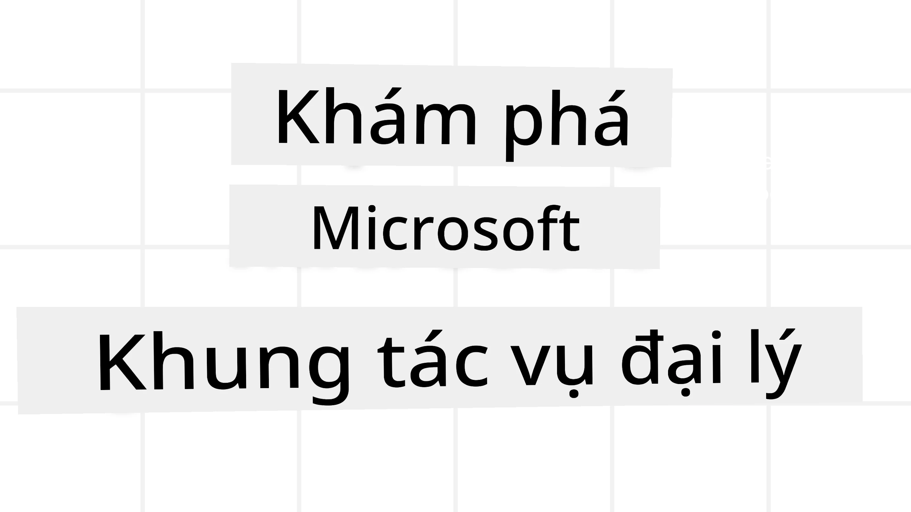
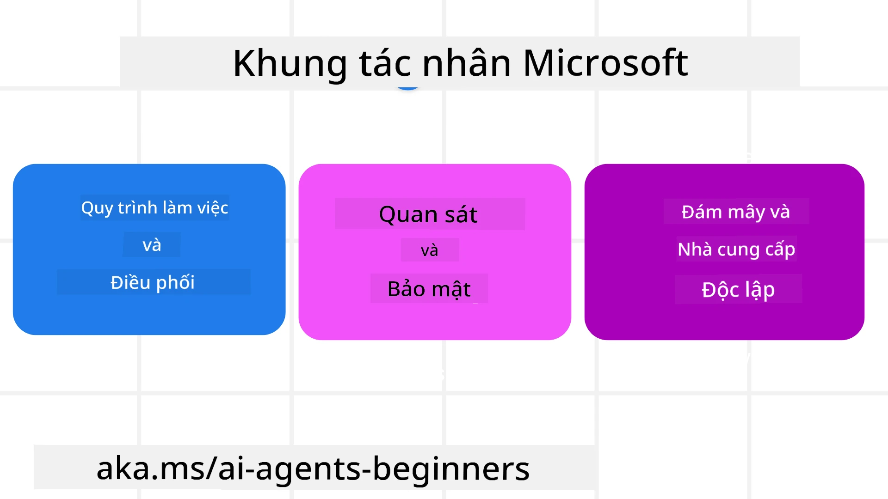
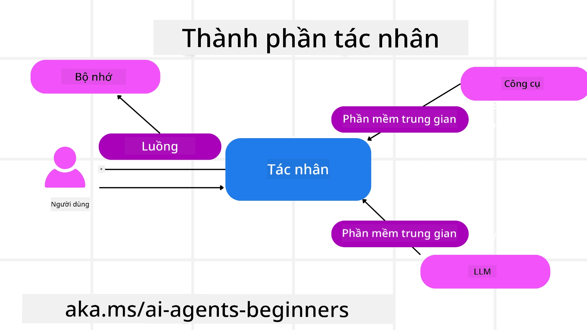

<!--
CO_OP_TRANSLATOR_METADATA:
{
  "original_hash": "19c4dab375acbc733855cc7f2f04edbc",
  "translation_date": "2025-10-02T17:27:22+00:00",
  "source_file": "14-microsoft-agent-framework/README.md",
  "language_code": "vi"
}
-->
# Khám phá Microsoft Agent Framework



### Giới thiệu

Bài học này sẽ bao gồm:

- Hiểu Microsoft Agent Framework: Các tính năng chính và giá trị  
- Khám phá các khái niệm cốt lõi của Microsoft Agent Framework
- So sánh MAF với Semantic Kernel và AutoGen: Hướng dẫn chuyển đổi

## Mục tiêu học tập

Sau khi hoàn thành bài học này, bạn sẽ biết cách:

- Xây dựng các AI Agent sẵn sàng cho sản xuất bằng Microsoft Agent Framework
- Áp dụng các tính năng cốt lõi của Microsoft Agent Framework vào các trường hợp sử dụng của bạn
- Chuyển đổi và tích hợp các framework và công cụ hiện có  

## Mẫu mã 

Mẫu mã cho [Microsoft Agent Framework (MAF)](https://aka.ms/ai-agents-beginners/agent-framewrok) có thể được tìm thấy trong kho lưu trữ này dưới các tệp `xx-python-agent-framework` và `xx-dotnet-agent-framework`.

## Hiểu Microsoft Agent Framework



[Microsoft Agent Framework (MAF)](https://aka.ms/ai-agents-beginners/agent-framewrok) được xây dựng dựa trên kinh nghiệm và bài học từ Semantic Kernel và AutoGen. Nó cung cấp sự linh hoạt để giải quyết nhiều trường hợp sử dụng agentic trong cả môi trường sản xuất và nghiên cứu, bao gồm:

- **Orchestration tuần tự** trong các tình huống cần quy trình từng bước.
- **Orchestration đồng thời** trong các tình huống mà các agent cần hoàn thành nhiệm vụ cùng lúc.
- **Orchestration trò chuyện nhóm** trong các tình huống mà các agent có thể hợp tác với nhau để hoàn thành một nhiệm vụ.
- **Orchestration chuyển giao** trong các tình huống mà các agent chuyển giao nhiệm vụ cho nhau khi các nhiệm vụ con được hoàn thành.
- **Orchestration từ tính** trong các tình huống mà một agent quản lý tạo và chỉnh sửa danh sách nhiệm vụ và xử lý sự phối hợp của các subagent để hoàn thành nhiệm vụ.

Để triển khai AI Agent trong sản xuất, MAF cũng bao gồm các tính năng:

- **Khả năng quan sát** thông qua việc sử dụng OpenTelemetry, nơi mọi hành động của AI Agent bao gồm việc gọi công cụ, các bước orchestration, luồng suy luận và giám sát hiệu suất thông qua bảng điều khiển Azure AI Foundry.
- **Bảo mật** bằng cách lưu trữ các agent trực tiếp trên Azure AI Foundry, bao gồm các kiểm soát bảo mật như truy cập dựa trên vai trò, xử lý dữ liệu riêng tư và an toàn nội dung tích hợp.
- **Độ bền** khi các luồng và quy trình của agent có thể tạm dừng, tiếp tục và khôi phục từ lỗi, cho phép các quy trình chạy lâu hơn.
- **Kiểm soát** khi các quy trình có sự tham gia của con người được hỗ trợ, nơi các nhiệm vụ được đánh dấu là cần sự phê duyệt của con người.

Microsoft Agent Framework cũng tập trung vào khả năng tương tác bằng cách:

- **Không phụ thuộc vào đám mây** - Các agent có thể chạy trong container, tại chỗ và trên nhiều đám mây khác nhau.
- **Không phụ thuộc vào nhà cung cấp** - Các agent có thể được tạo thông qua SDK ưa thích của bạn, bao gồm Azure OpenAI và OpenAI.
- **Tích hợp các tiêu chuẩn mở** - Các agent có thể sử dụng các giao thức như Agent-to-Agent (A2A) và Model Context Protocol (MCP) để khám phá và sử dụng các agent và công cụ khác.
- **Plugin và kết nối** - Kết nối có thể được thực hiện với các dịch vụ dữ liệu và bộ nhớ như Microsoft Fabric, SharePoint, Pinecone và Qdrant.

Hãy cùng xem cách các tính năng này được áp dụng vào một số khái niệm cốt lõi của Microsoft Agent Framework.

## Các khái niệm cốt lõi của Microsoft Agent Framework

### Các Agent



**Tạo Agent**

Việc tạo agent được thực hiện bằng cách định nghĩa dịch vụ suy luận (LLM Provider), một tập hợp các hướng dẫn cho AI Agent thực hiện, và một `name` được gán:

```python
agent = AzureOpenAIChatClient(credential=AzureCliCredential()).create_agent( instructions="You are good at recommending trips to customers based on their preferences.", name="TripRecommender" )
```

Ở trên sử dụng `Azure OpenAI`, nhưng các agent có thể được tạo bằng nhiều dịch vụ khác nhau, bao gồm `Azure AI Foundry Agent Service`:

```python
AzureAIAgentClient(async_credential=credential).create_agent( name="HelperAgent", instructions="You are a helpful assistant." ) as agent
```

API `Responses`, `ChatCompletion` của OpenAI

```python
agent = OpenAIResponsesClient().create_agent( name="WeatherBot", instructions="You are a helpful weather assistant.", )
```

```python
agent = OpenAIChatClient().create_agent( name="HelpfulAssistant", instructions="You are a helpful assistant.", )
```

hoặc các agent từ xa sử dụng giao thức A2A:

```python
agent = A2AAgent( name=agent_card.name, description=agent_card.description, agent_card=agent_card, url="https://your-a2a-agent-host" )
```

**Chạy Agent**

Các agent được chạy bằng phương thức `.run` hoặc `.run_stream` để nhận phản hồi không streaming hoặc streaming.

```python
result = await agent.run("What are good places to visit in Amsterdam?")
print(result.text)
```

```python
async for update in agent.run_stream("What are the good places to visit in Amsterdam?"):
    if update.text:
        print(update.text, end="", flush=True)

```

Mỗi lần chạy agent cũng có thể có các tùy chọn để tùy chỉnh các tham số như `max_tokens` mà agent sử dụng, `tools` mà agent có thể gọi, và thậm chí cả `model` được sử dụng cho agent.

Điều này hữu ích trong các trường hợp cần các mô hình hoặc công cụ cụ thể để hoàn thành nhiệm vụ của người dùng.

**Công cụ**

Công cụ có thể được định nghĩa cả khi định nghĩa agent:

```python
def get_attractions( location: Annotated[str, Field(description="The location to get the top tourist attractions for")], ) -> str: """Get the top tourist attractions for a given location.""" return f"The top attractions for {location} are." 


# When creating a ChatAgent directly 

agent = ChatAgent( chat_client=OpenAIChatClient(), instructions="You are a helpful assistant", tools=[get_attractions]

```

và cũng khi chạy agent:

```python

result1 = await agent.run( "What's the best place to visit in Seattle?", tools=[get_attractions] # Tool provided for this run only )
```

**Luồng Agent**

Luồng Agent được sử dụng để xử lý các cuộc trò chuyện nhiều lượt. Luồng có thể được tạo bằng cách:

- Sử dụng `get_new_thread()` cho phép luồng được lưu lại theo thời gian
- Tạo luồng tự động khi chạy agent và chỉ giữ luồng trong thời gian chạy hiện tại.

Để tạo luồng, mã sẽ như sau:

```python
# Create a new thread. 
thread = agent.get_new_thread() # Run the agent with the thread. 
response = await agent.run("Hello, I am here to help you book travel. Where would you like to go?", thread=thread)

```

Sau đó, bạn có thể tuần tự hóa luồng để lưu trữ và sử dụng sau này:

```python
# Create a new thread. 
thread = agent.get_new_thread() 

# Run the agent with the thread. 

response = await agent.run("Hello, how are you?", thread=thread) 

# Serialize the thread for storage. 

serialized_thread = await thread.serialize() 

# Deserialize the thread state after loading from storage. 

resumed_thread = await agent.deserialize_thread(serialized_thread)
```

**Middleware của Agent**

Các agent tương tác với các công cụ và LLM để hoàn thành nhiệm vụ của người dùng. Trong một số tình huống, chúng ta muốn thực hiện hoặc theo dõi giữa các tương tác này. Middleware của agent cho phép chúng ta làm điều này thông qua:

*Middleware chức năng*

Middleware này cho phép chúng ta thực hiện một hành động giữa agent và một chức năng/công cụ mà nó sẽ gọi. Một ví dụ khi điều này được sử dụng là khi bạn muốn ghi nhật ký về cuộc gọi chức năng.

Trong mã dưới đây, `next` xác định liệu middleware tiếp theo hay chức năng thực tế sẽ được gọi.

```python
async def logging_function_middleware(
    context: FunctionInvocationContext,
    next: Callable[[FunctionInvocationContext], Awaitable[None]],
) -> None:
    """Function middleware that logs function execution."""
    # Pre-processing: Log before function execution
    print(f"[Function] Calling {context.function.name}")

    # Continue to next middleware or function execution
    await next(context)

    # Post-processing: Log after function execution
    print(f"[Function] {context.function.name} completed")
```

*Middleware trò chuyện*

Middleware này cho phép chúng ta thực hiện hoặc ghi nhật ký một hành động giữa agent và các yêu cầu giữa LLM.

Điều này chứa thông tin quan trọng như `messages` được gửi đến dịch vụ AI.

```python
async def logging_chat_middleware(
    context: ChatContext,
    next: Callable[[ChatContext], Awaitable[None]],
) -> None:
    """Chat middleware that logs AI interactions."""
    # Pre-processing: Log before AI call
    print(f"[Chat] Sending {len(context.messages)} messages to AI")

    # Continue to next middleware or AI service
    await next(context)

    # Post-processing: Log after AI response
    print("[Chat] AI response received")

```

**Bộ nhớ của Agent**

Như đã đề cập trong bài học `Agentic Memory`, bộ nhớ là một yếu tố quan trọng để cho phép agent hoạt động trong các ngữ cảnh khác nhau. MAF cung cấp một số loại bộ nhớ khác nhau:

*Bộ nhớ trong*

Đây là bộ nhớ được lưu trữ trong các luồng trong thời gian chạy ứng dụng.

```python
# Create a new thread. 
thread = agent.get_new_thread() # Run the agent with the thread. 
response = await agent.run("Hello, I am here to help you book travel. Where would you like to go?", thread=thread)
```

*Tin nhắn lưu trữ*

Bộ nhớ này được sử dụng khi lưu trữ lịch sử cuộc trò chuyện qua các phiên khác nhau. Nó được định nghĩa bằng `chat_message_store_factory`:

```python
from agent_framework import ChatMessageStore

# Create a custom message store
def create_message_store():
    return ChatMessageStore()

agent = ChatAgent(
    chat_client=OpenAIChatClient(),
    instructions="You are a Travel assistant.",
    chat_message_store_factory=create_message_store
)

```

*Bộ nhớ động*

Bộ nhớ này được thêm vào ngữ cảnh trước khi các agent được chạy. Những bộ nhớ này có thể được lưu trữ trong các dịch vụ bên ngoài như mem0:

```python
from agent_framework.mem0 import Mem0Provider

# Using Mem0 for advanced memory capabilities
memory_provider = Mem0Provider(
    api_key="your-mem0-api-key",
    user_id="user_123",
    application_id="my_app"
)

agent = ChatAgent(
    chat_client=OpenAIChatClient(),
    instructions="You are a helpful assistant with memory.",
    context_providers=memory_provider
)

```

**Khả năng quan sát của Agent**

Khả năng quan sát rất quan trọng để xây dựng các hệ thống agentic đáng tin cậy và dễ bảo trì. MAF tích hợp với OpenTelemetry để cung cấp tracing và meters nhằm cải thiện khả năng quan sát.

```python
from agent_framework.observability import get_tracer, get_meter

tracer = get_tracer()
meter = get_meter()
with tracer.start_as_current_span("my_custom_span"):
    # do something
    pass
counter = meter.create_counter("my_custom_counter")
counter.add(1, {"key": "value"})
```

### Quy trình làm việc

MAF cung cấp các quy trình làm việc là các bước được định nghĩa trước để hoàn thành một nhiệm vụ và bao gồm các AI agent như các thành phần trong các bước đó.

Quy trình làm việc bao gồm các thành phần khác nhau cho phép kiểm soát luồng tốt hơn. Quy trình làm việc cũng cho phép **orchestration nhiều agent** và **checkpointing** để lưu trạng thái quy trình làm việc.

Các thành phần cốt lõi của một quy trình làm việc là:

**Executors**

Executors nhận các tin nhắn đầu vào, thực hiện các nhiệm vụ được giao, và sau đó tạo ra một tin nhắn đầu ra. Điều này giúp quy trình làm việc tiến gần hơn đến việc hoàn thành nhiệm vụ lớn hơn. Executors có thể là AI agent hoặc logic tùy chỉnh.

**Edges**

Edges được sử dụng để định nghĩa luồng tin nhắn trong một quy trình làm việc. Chúng có thể là:

*Direct Edges* - Kết nối đơn giản một-một giữa các executors:

```python
from agent_framework import WorkflowBuilder

builder = WorkflowBuilder()
builder.add_edge(source_executor, target_executor)
builder.set_start_executor(source_executor)
workflow = builder.build()
```

*Conditional Edges* - Kích hoạt sau khi một điều kiện nhất định được đáp ứng. Ví dụ, khi phòng khách sạn không có sẵn, một executor có thể gợi ý các tùy chọn khác.

*Switch-case Edges* - Chuyển tin nhắn đến các executors khác nhau dựa trên các điều kiện được định nghĩa. Ví dụ, nếu khách hàng du lịch có quyền truy cập ưu tiên, nhiệm vụ của họ sẽ được xử lý thông qua một quy trình làm việc khác.

*Fan-out Edges* - Gửi một tin nhắn đến nhiều mục tiêu.

*Fan-in Edges* - Thu thập nhiều tin nhắn từ các executors khác nhau và gửi đến một mục tiêu.

**Events**

Để cung cấp khả năng quan sát tốt hơn vào các quy trình làm việc, MAF cung cấp các sự kiện tích hợp cho việc thực thi, bao gồm:

- `WorkflowStartedEvent`  - Quy trình làm việc bắt đầu thực thi
- `WorkflowOutputEvent` - Quy trình làm việc tạo ra một đầu ra
- `WorkflowErrorEvent` - Quy trình làm việc gặp lỗi
- `ExecutorInvokeEvent`  - Executor bắt đầu xử lý
- `ExecutorCompleteEvent`  -  Executor hoàn thành xử lý
- `RequestInfoEvent` - Một yêu cầu được phát hành

## Chuyển đổi từ các framework khác (Semantic Kernel và AutoGen)

### Sự khác biệt giữa MAF và Semantic Kernel

**Tạo Agent đơn giản hóa**

Semantic Kernel yêu cầu tạo một instance Kernel cho mỗi agent. MAF sử dụng cách tiếp cận đơn giản hóa bằng cách sử dụng các extension cho các nhà cung cấp chính.

```python
agent = AzureOpenAIChatClient(credential=AzureCliCredential()).create_agent( instructions="You are good at reccomending trips to customers based on their preferences.", name="TripRecommender" )
```

**Tạo luồng Agent**

Semantic Kernel yêu cầu luồng được tạo thủ công. Trong MAF, agent được gán trực tiếp một luồng.

```python
thread = agent.get_new_thread() # Run the agent with the thread. 
```

**Đăng ký công cụ**

Trong Semantic Kernel, các công cụ được đăng ký vào Kernel và Kernel sau đó được truyền cho agent. Trong MAF, các công cụ được đăng ký trực tiếp trong quá trình tạo agent.

```python
agent = ChatAgent( chat_client=OpenAIChatClient(), instructions="You are a helpful assistant", tools=[get_attractions]
```

### Sự khác biệt giữa MAF và AutoGen

**Teams vs Workflows**

`Teams` là cấu trúc sự kiện cho hoạt động dựa trên sự kiện với các agent trong AutoGen. MAF sử dụng `Workflows` để định tuyến dữ liệu đến các executors thông qua kiến trúc dựa trên đồ thị.

**Tạo công cụ**

AutoGen sử dụng `FunctionTool` để bao bọc các chức năng mà các agent có thể gọi. MAF sử dụng @ai_function hoạt động tương tự nhưng cũng tự động suy luận các schema cho mỗi chức năng.

**Hành vi của Agent**

Các agent là agent một lượt theo mặc định trong AutoGen trừ khi `max_tool_iterations` được đặt cao hơn. Trong MAF, `ChatAgent` là agent nhiều lượt theo mặc định, nghĩa là nó sẽ tiếp tục gọi các công cụ cho đến khi nhiệm vụ của người dùng hoàn thành.

## Mẫu mã 

Mẫu mã cho Microsoft Agent Framework có thể được tìm thấy trong kho lưu trữ này dưới các tệp `xx-python-agent-framework` và `xx-dotnet-agent-framework`.

## Có thêm câu hỏi về Microsoft Agent Framework?

Tham gia [Azure AI Foundry Discord](https://aka.ms/ai-agents/discord) để gặp gỡ các học viên khác, tham dự giờ làm việc và nhận câu trả lời cho các câu hỏi về AI Agent của bạn.

---

**Tuyên bố miễn trừ trách nhiệm**:  
Tài liệu này đã được dịch bằng dịch vụ dịch thuật AI [Co-op Translator](https://github.com/Azure/co-op-translator). Mặc dù chúng tôi cố gắng đảm bảo độ chính xác, xin lưu ý rằng các bản dịch tự động có thể chứa lỗi hoặc không chính xác. Tài liệu gốc bằng ngôn ngữ bản địa nên được coi là nguồn thông tin chính thức. Đối với các thông tin quan trọng, khuyến nghị sử dụng dịch vụ dịch thuật chuyên nghiệp bởi con người. Chúng tôi không chịu trách nhiệm cho bất kỳ sự hiểu lầm hoặc diễn giải sai nào phát sinh từ việc sử dụng bản dịch này.