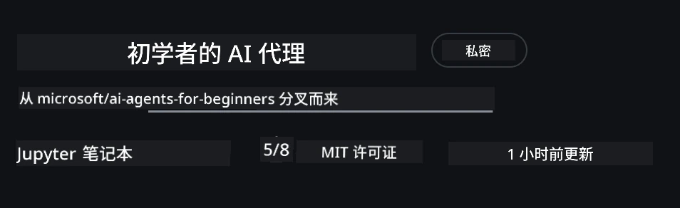
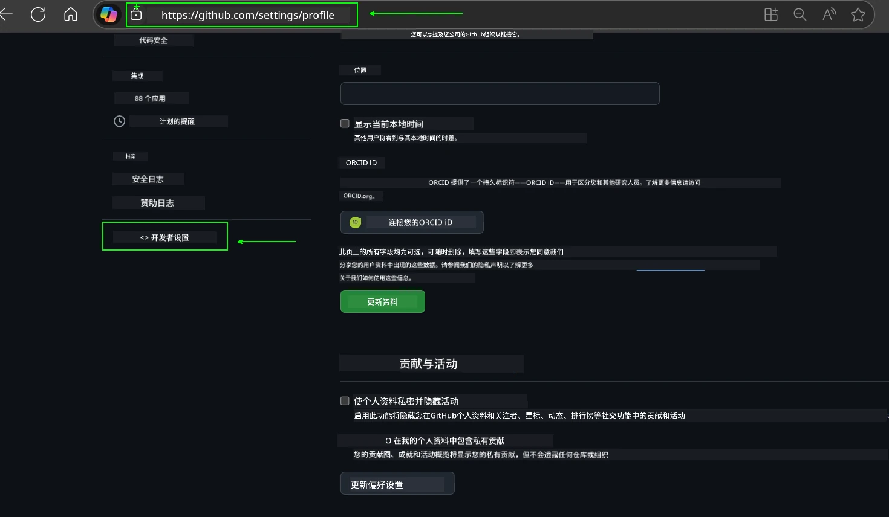
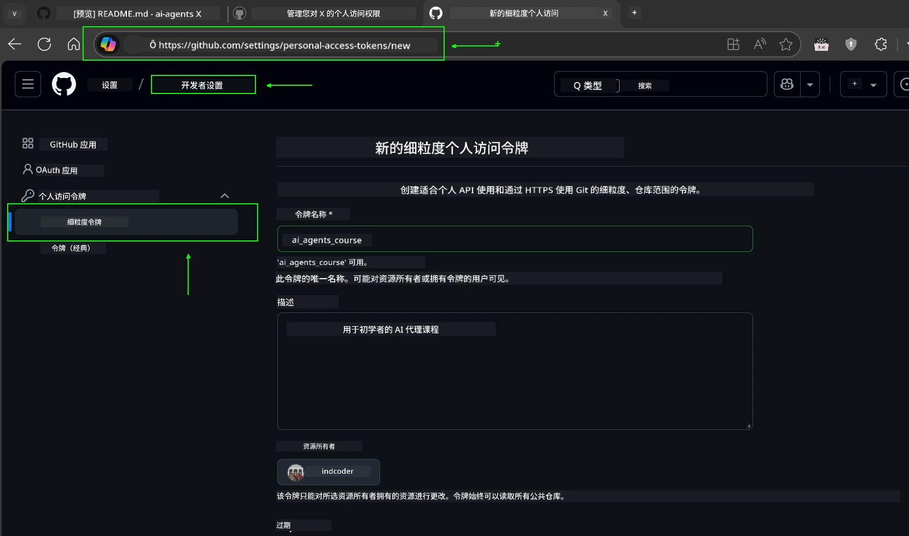
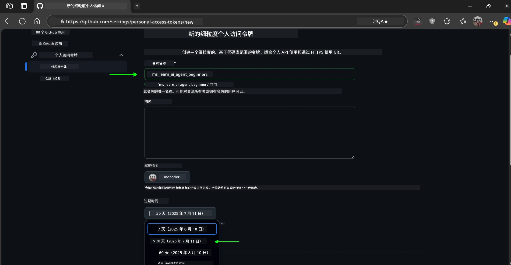
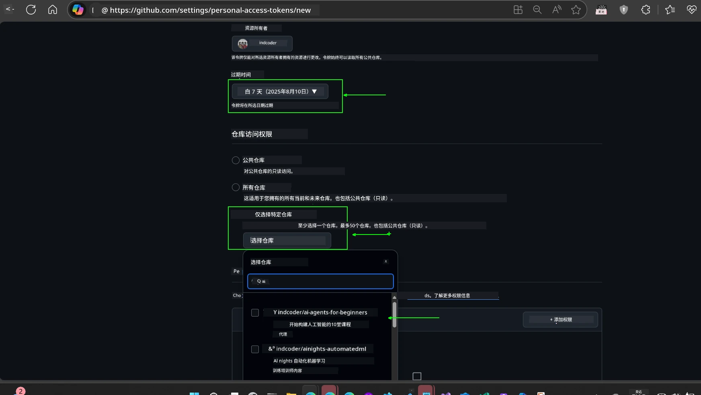
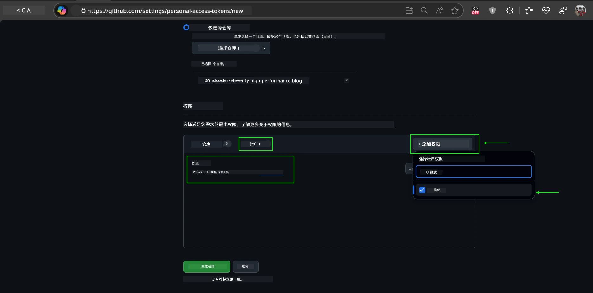
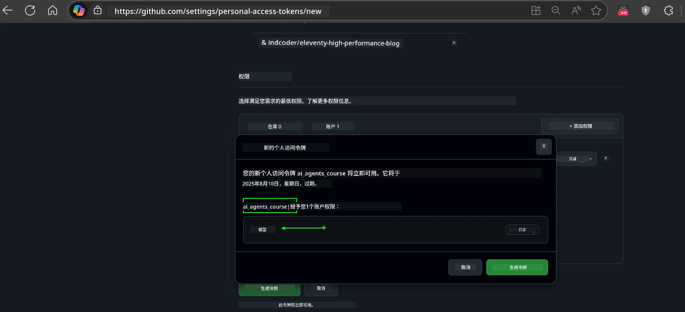
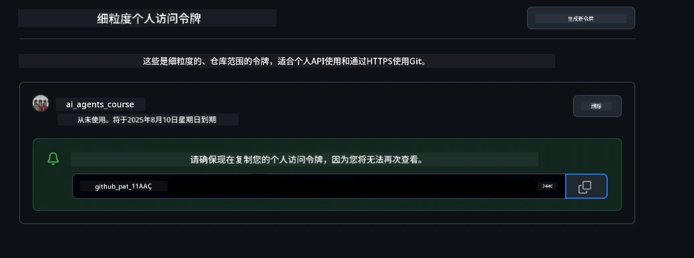
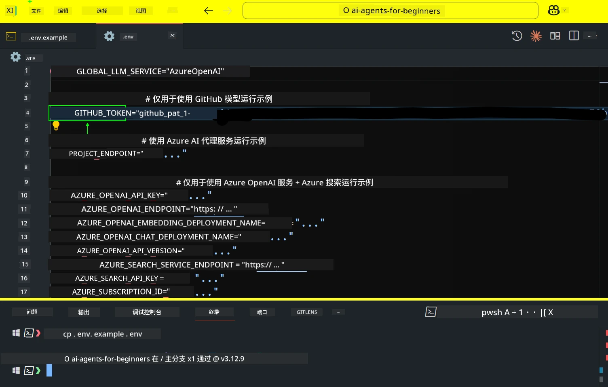
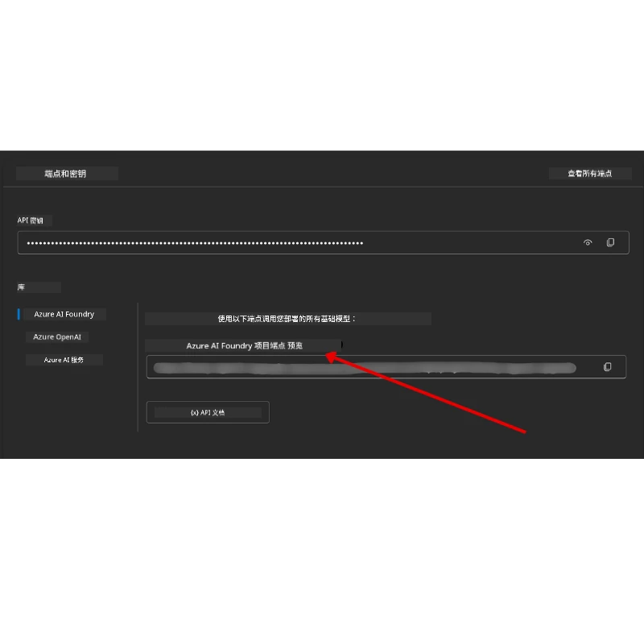

<!--
CO_OP_TRANSLATOR_METADATA:
{
  "original_hash": "63b1a8f6e840df15934935b728e569f0",
  "translation_date": "2025-12-03T13:54:07+00:00",
  "source_file": "00-course-setup/README.md",
  "language_code": "zh"
}
-->
# 课程设置

## 简介

本课将介绍如何运行本课程的代码示例。

## 加入其他学习者并获取帮助

在克隆您的代码库之前，请加入 [AI Agents For Beginners Discord 频道](https://aka.ms/ai-agents/discord)，以获取设置帮助、解答课程相关问题，或与其他学习者交流。

## 克隆或分叉此代码库

首先，请克隆或分叉 GitHub 仓库。这将创建您自己的课程材料版本，便于运行、测试和调整代码！

您可以通过点击此链接 <a href="https://github.com/microsoft/ai-agents-for-beginners/fork" target="_blank">分叉代码库</a> 来完成操作。

现在，您应该在以下链接中拥有您自己的分叉版本：



### 浅克隆（推荐用于工作坊 / Codespaces）

  >完整的代码库可能很大（约 3 GB），如果下载完整历史记录和所有文件会占用较多空间。如果您仅参加工作坊或只需要几个课程文件夹，浅克隆（或稀疏克隆）可以通过截断历史记录和/或跳过大文件来避免大部分下载。

#### 快速浅克隆 —— 最小历史记录，所有文件

在以下命令中，将 `<your-username>` 替换为您的分叉 URL（或您更喜欢的上游 URL）。

仅克隆最新的提交历史记录（下载量小）：

```bash|powershell
git clone --depth 1 https://github.com/<your-username>/ai-agents-for-beginners.git
```

克隆特定分支：

```bash|powershell
git clone --depth 1 --branch <branch-name> https://github.com/<your-username>/ai-agents-for-beginners.git
```

#### 部分（稀疏）克隆 —— 最小文件 + 仅选定文件夹

此方法使用部分克隆和稀疏检出（需要 Git 2.25+，推荐使用支持部分克隆的现代 Git 版本）：

```bash|powershell
git clone --depth 1 --filter=blob:none --sparse https://github.com/<your-username>/ai-agents-for-beginners.git
```

进入代码库文件夹：

```bash|powershell
cd ai-agents-for-beginners
```

然后指定您需要的文件夹（以下示例显示两个文件夹）：

```bash|powershell
git sparse-checkout set 00-course-setup 01-intro-to-ai-agents
```

克隆并验证文件后，如果您只需要文件并希望释放空间（无 Git 历史记录），请删除代码库元数据（💀不可逆——您将失去所有 Git 功能：无法提交、拉取、推送或访问历史记录）。

```bash
# zsh/bash
rm -rf .git
```

```powershell
# PowerShell
Remove-Item -Recurse -Force .git
```

#### 使用 GitHub Codespaces（推荐避免本地大文件下载）

- 通过 [GitHub 界面](https://github.com/codespaces) 为此代码库创建一个新的 Codespace。

- 在新创建的 Codespace 的终端中，运行上述浅克隆/稀疏克隆命令之一，将您需要的课程文件夹带入 Codespace 工作区。
- 可选：在 Codespaces 中克隆后，删除 .git 以回收额外空间（参见上述删除命令）。
- 注意：如果您更喜欢直接在 Codespaces 中打开代码库（无需额外克隆），请注意 Codespaces 将构建 devcontainer 环境，可能仍会配置超出您需要的内容。在全新 Codespace 中克隆浅拷贝可以更好地控制磁盘使用。

#### 提示

- 如果您想编辑/提交，请始终用您的分叉替换克隆 URL。
- 如果您之后需要更多历史记录或文件，可以获取它们或调整稀疏检出以包含其他文件夹。

## 运行代码

本课程提供了一系列 Jupyter Notebooks，您可以通过它们动手实践构建 AI Agents。

代码示例使用以下选项之一：

**需要 GitHub 账户 - 免费**：

1) Semantic Kernel Agent Framework + GitHub Models Marketplace。标记为 (semantic-kernel.ipynb)
2) AutoGen Framework + GitHub Models Marketplace。标记为 (autogen.ipynb)

**需要 Azure 订阅**：

3) Azure AI Foundry + Azure AI Agent Service。标记为 (azureaiagent.ipynb)

我们鼓励您尝试所有三种示例，看看哪种最适合您。

无论您选择哪种选项，都将决定您需要遵循的设置步骤：

## 要求

- Python 3.12+
  - **注意**：如果您尚未安装 Python3.12，请确保安装它。然后使用 python3.12 创建您的虚拟环境，以确保从 requirements.txt 文件中安装正确的版本。
  
    >示例

    创建 Python 虚拟环境目录：

    ```bash|powershell
    python -m venv venv
    ```

    然后激活虚拟环境：

    ```bash
    # zsh/bash
    source venv/bin/activate
    ```
  
    ```dos
    # Command Prompt for Windows
    venv\Scripts\activate
    ```

- .NET 10+：对于使用 .NET 的示例代码，请确保安装 [.NET 10 SDK](https://dotnet.microsoft.com/download/dotnet/10.0) 或更高版本。然后检查您安装的 .NET SDK 版本：

    ```bash|powershell
    dotnet --list-sdks
    ```

- 一个 GitHub 账户 - 用于访问 GitHub Models Marketplace
- Azure 订阅 - 用于访问 Azure AI Foundry
- Azure AI Foundry 账户 - 用于访问 Azure AI Agent Service

我们在此代码库的根目录中包含了一个 `requirements.txt` 文件，其中包含运行代码示例所需的所有 Python 包。

您可以在终端中运行以下命令来安装它们：

```bash|powershell
pip install -r requirements.txt
```

我们建议创建一个 Python 虚拟环境以避免任何冲突和问题。

## 设置 VSCode

确保您在 VSCode 中使用正确版本的 Python。


## 使用 GitHub Models 的示例设置

### 第 1 步：获取您的 GitHub 个人访问令牌 (PAT)

本课程利用 GitHub Models Marketplace，提供免费访问大型语言模型 (LLMs)，您将使用它们来构建 AI Agents。

要使用 GitHub Models，您需要创建一个 [GitHub 个人访问令牌](https://docs.github.com/en/authentication/keeping-your-account-and-data-secure/managing-your-personal-access-tokens)。

您可以通过访问您的 <a href="https://github.com/settings/personal-access-tokens" target="_blank">个人访问令牌设置</a> 来完成此操作。

在创建令牌时，请遵循 [最小权限原则](https://docs.github.com/en/get-started/learning-to-code/storing-your-secrets-safely)。这意味着您应该仅授予令牌运行本课程代码示例所需的权限。

1. 在屏幕左侧的 **开发者设置** 中选择 `精细化令牌` 选项。

   

   然后选择 `生成新令牌`。

   

2. 输入一个描述性名称，反映令牌的用途，便于以后识别。

    🔐 令牌有效期建议

    推荐有效期：30 天  
    为了更安全，您可以选择更短的期限，例如 7 天 🛡️  
    这是一个很好的方式来设定个人目标，并在学习动力高涨时完成课程 🚀。

    

3. 将令牌的作用域限制为此代码库的分叉。

    

4. 限制令牌的权限：在 **权限** 下，点击 **账户** 标签，然后点击 "+ 添加权限" 按钮。会出现一个下拉菜单。请搜索 **Models** 并勾选它。

    

5. 在生成令牌之前，验证所需权限。

6. 在生成令牌之前，请确保您已准备好将令牌存储在安全的地方，例如密码管理器，因为生成后将无法再次查看。

复制您刚刚创建的新令牌。现在，您需要将其添加到本课程中包含的 `.env` 文件中。

### 第 2 步：创建您的 `.env` 文件

在终端中运行以下命令以创建 `.env` 文件。

```bash
# zsh/bash
cp .env.example .env
```

```powershell
# PowerShell
Copy-Item .env.example .env
```

这将复制示例文件并在您的目录中创建一个 `.env` 文件，您需要在其中填写环境变量的值。

复制令牌后，用您喜欢的文本编辑器打开 `.env` 文件，并将令牌粘贴到 `GITHUB_TOKEN` 字段中。



现在，您应该可以运行本课程的代码示例了。

## 使用 Azure AI Foundry 和 Azure AI Agent Service 的示例设置

### 第 1 步：获取您的 Azure 项目端点

按照此处的步骤创建 Azure AI Foundry 中的中心和项目：[中心资源概述](https://learn.microsoft.com/azure/ai-foundry/concepts/ai-resources)

创建项目后，您需要获取项目的连接字符串。

您可以通过访问 Azure AI Foundry 门户中项目的 **概览** 页面来完成此操作。



### 第 2 步：创建您的 `.env` 文件

在终端中运行以下命令以创建 `.env` 文件。

```bash
# zsh/bash
cp .env.example .env
```

```powershell
# PowerShell
Copy-Item .env.example .env
```

这将复制示例文件并在您的目录中创建一个 `.env` 文件，您需要在其中填写环境变量的值。

复制令牌后，用您喜欢的文本编辑器打开 `.env` 文件，并将令牌粘贴到 `PROJECT_ENDPOINT` 字段中。

### 第 3 步：登录 Azure

作为安全最佳实践，我们将使用 [无密钥认证](https://learn.microsoft.com/azure/developer/ai/keyless-connections?tabs=csharp%2Cazure-cli?WT.mc_id=academic-105485-koreyst) 通过 Microsoft Entra ID 认证到 Azure OpenAI。

接下来，打开终端并运行 `az login --use-device-code` 登录到您的 Azure 账户。

登录后，在终端中选择您的订阅。

## 额外环境变量 - Azure Search 和 Azure OpenAI

对于 Agentic RAG 课程 - 第 5 课 - 有一些示例使用 Azure Search 和 Azure OpenAI。

如果您想运行这些示例，您需要在 `.env` 文件中添加以下环境变量：

### 概览页面（项目）

- `AZURE_SUBSCRIPTION_ID` - 在项目的 **概览** 页面中查看 **项目详细信息**。

- `AZURE_AI_PROJECT_NAME` - 查看项目 **概览** 页顶部的项目名称。

- `AZURE_OPENAI_SERVICE` - 在 **概览** 页的 **包含的功能** 标签中找到 **Azure OpenAI Service**。

### 管理中心

- `AZURE_OPENAI_RESOURCE_GROUP` - 在 **管理中心** 的 **概览** 页中，转到 **项目属性**。

- `GLOBAL_LLM_SERVICE` - 在 **连接的资源** 下，找到 **Azure AI Services** 连接名称。如果未列出，请在 **Azure 门户** 中检查您的资源组下的 AI Services 资源名称。

### 模型 + 端点页面

- `AZURE_OPENAI_EMBEDDING_DEPLOYMENT_NAME` - 选择您的嵌入模型（例如 `text-embedding-ada-002`），并从模型详细信息中记下 **部署名称**。

- `AZURE_OPENAI_CHAT_DEPLOYMENT_NAME` - 选择您的聊天模型（例如 `gpt-4o-mini`），并从模型详细信息中记下 **部署名称**。

### Azure 门户

- `AZURE_OPENAI_ENDPOINT` - 查找 **Azure AI 服务**，点击它，然后转到 **资源管理**，**密钥和端点**，向下滚动到 "Azure OpenAI 端点"，复制标注为 "语言 API" 的端点。

- `AZURE_OPENAI_API_KEY` - 在同一页面，复制 KEY 1 或 KEY 2。

- `AZURE_SEARCH_SERVICE_ENDPOINT` - 找到您的 **Azure AI Search** 资源，点击它，然后查看 **概览**。

- `AZURE_SEARCH_API_KEY` - 然后转到 **设置**，再到 **密钥**，复制主密钥或次密钥。

### 外部网页

- `AZURE_OPENAI_API_VERSION` - 访问 [API 版本生命周期](https://learn.microsoft.com/azure/ai-services/openai/api-version-deprecation#latest-ga-api-release) 页面，查看 **最新 GA API 发布**。

### 设置无密钥认证

我们将使用 Azure OpenAI 的无密钥连接，而不是硬编码您的凭据。为此，我们将导入 `DefaultAzureCredential`，稍后调用 `DefaultAzureCredential` 函数获取凭据。

```python
# Python
from azure.identity import DefaultAzureCredential, InteractiveBrowserCredential
```

## 遇到问题？
如果您在运行此设置时遇到任何问题，可以加入我们的 <a href="https://discord.gg/kzRShWzttr" target="_blank">Azure AI 社区 Discord</a> 或 <a href="https://github.com/microsoft/ai-agents-for-beginners/issues?WT.mc_id=academic-105485-koreyst" target="_blank">创建一个问题</a>。

## 下一课

您现在已经准备好运行本课程的代码了。祝您愉快地学习更多关于 AI 代理的知识！

[AI代理简介及代理使用案例](../01-intro-to-ai-agents/README.md)

---

<!-- CO-OP TRANSLATOR DISCLAIMER START -->
**免责声明**：  
本文档使用AI翻译服务[Co-op Translator](https://github.com/Azure/co-op-translator)进行翻译。尽管我们努力确保准确性，但请注意，自动翻译可能包含错误或不准确之处。应以原始语言的文档为权威来源。对于关键信息，建议使用专业人工翻译。因使用本翻译而引起的任何误解或误读，我们概不负责。
<!-- CO-OP TRANSLATOR DISCLAIMER END -->