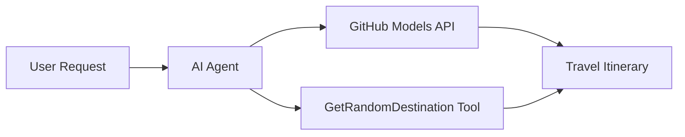

<!--
CO_OP_TRANSLATOR_METADATA:
{
  "original_hash": "5f351412e934f0833c8c821a0a60efaf",
  "translation_date": "2025-11-13T11:16:09+00:00",
  "source_file": "01-intro-to-ai-agents/code_samples/01-dotnet-agent-framework.md",
  "language_code": "zh"
}
-->
# 🌍 使用 Microsoft Agent Framework (.NET) 的 AI旅行助手

## 📋 场景概述

此示例展示了如何使用 Microsoft Agent Framework for .NET 构建一个智能旅行规划助手。该助手可以自动为全球随机目的地生成个性化的一日游行程。

### 主要功能：

- 🎲 **随机目的地选择**：使用自定义工具选择度假地点
- 🗺️ **智能旅行规划**：创建详细的每日行程
- 🔄 **实时流式响应**：支持即时和流式响应
- 🛠️ **自定义工具集成**：展示如何扩展助手功能

## 🔧 技术架构

### 核心技术

- **Microsoft Agent Framework**：用于开发 AI助手的最新 .NET 实现
- **GitHub Models 集成**：使用 GitHub 的 AI模型推理服务
- **OpenAI API 兼容性**：通过自定义端点使用 OpenAI 客户端库
- **安全配置**：基于环境的 API密钥管理

### 关键组件

1. **AIAgent**：主要的助手协调器，负责处理对话流程
2. **自定义工具**：助手可用的 `GetRandomDestination()` 函数
3. **聊天客户端**：基于 GitHub Models 的对话界面
4. **流式支持**：实时响应生成功能

### 集成模式



## 🚀 快速开始

### 前提条件

- [.NET 10 SDK](https://dotnet.microsoft.com/download/dotnet/10.0) 或更高版本
- [GitHub Models API 访问令牌](https://docs.github.com/github-models/github-models-at-scale/using-your-own-api-keys-in-github-models)

### 所需环境变量

```bash
# zsh/bash
export GH_TOKEN=<your_github_token>
export GH_ENDPOINT=https://models.github.ai/inference
export GH_MODEL_ID=openai/gpt-5-mini
```

```powershell
# PowerShell
$env:GH_TOKEN = "<your_github_token>"
$env:GH_ENDPOINT = "https://models.github.ai/inference"
$env:GH_MODEL_ID = "openai/gpt-5-mini"
```

### 示例代码

运行代码示例，

```bash
# zsh/bash
chmod +x ./01-dotnet-agent-framework.cs
./01-dotnet-agent-framework.cs
```

或者使用 dotnet CLI：

```bash
dotnet run ./01-dotnet-agent-framework.cs
```

查看 [`01-dotnet-agent-framework.cs`](../../../../01-intro-to-ai-agents/code_samples/01-dotnet-agent-framework.cs) 获取完整代码。

```csharp
#!/usr/bin/dotnet run

#:package Microsoft.Extensions.AI@9.*
#:package Microsoft.Agents.AI.OpenAI@1.*-*

using System.ClientModel;
using System.ComponentModel;

using Microsoft.Agents.AI;
using Microsoft.Extensions.AI;

using OpenAI;

// Tool Function: Random Destination Generator
// This static method will be available to the agent as a callable tool
// The [Description] attribute helps the AI understand when to use this function
// This demonstrates how to create custom tools for AI agents
[Description("Provides a random vacation destination.")]
static string GetRandomDestination()
{
    // List of popular vacation destinations around the world
    // The agent will randomly select from these options
    var destinations = new List<string>
    {
        "Paris, France",
        "Tokyo, Japan",
        "New York City, USA",
        "Sydney, Australia",
        "Rome, Italy",
        "Barcelona, Spain",
        "Cape Town, South Africa",
        "Rio de Janeiro, Brazil",
        "Bangkok, Thailand",
        "Vancouver, Canada"
    };

    // Generate random index and return selected destination
    // Uses System.Random for simple random selection
    var random = new Random();
    int index = random.Next(destinations.Count);
    return destinations[index];
}

// Extract configuration from environment variables
// Retrieve the GitHub Models API endpoint, defaults to https://models.github.ai/inference if not specified
// Retrieve the model ID, defaults to openai/gpt-5-mini if not specified
// Retrieve the GitHub token for authentication, throws exception if not specified
var github_endpoint = Environment.GetEnvironmentVariable("GH_ENDPOINT") ?? "https://models.github.ai/inference";
var github_model_id = Environment.GetEnvironmentVariable("GH_MODEL_ID") ?? "openai/gpt-5-mini";
var github_token = Environment.GetEnvironmentVariable("GH_TOKEN") ?? throw new InvalidOperationException("GH_TOKEN is not set.");

// Configure OpenAI Client Options
// Create configuration options to point to GitHub Models endpoint
// This redirects OpenAI client calls to GitHub's model inference service
var openAIOptions = new OpenAIClientOptions()
{
    Endpoint = new Uri(github_endpoint)
};

// Initialize OpenAI Client with GitHub Models Configuration
// Create OpenAI client using GitHub token for authentication
// Configure it to use GitHub Models endpoint instead of OpenAI directly
var openAIClient = new OpenAIClient(new ApiKeyCredential(github_token), openAIOptions);

// Create AI Agent with Travel Planning Capabilities
// Initialize OpenAI client, get chat client for specified model, and create AI agent
// Configure agent with travel planning instructions and random destination tool
// The agent can now plan trips using the GetRandomDestination function
AIAgent agent = openAIClient
    .GetChatClient(github_model_id)
    .CreateAIAgent(
        instructions: "You are a helpful AI Agent that can help plan vacations for customers at random destinations",
        tools: [AIFunctionFactory.Create(GetRandomDestination)]
    );

// Execute Agent: Plan a Day Trip
// Run the agent with streaming enabled for real-time response display
// Shows the agent's thinking and response as it generates the content
// Provides better user experience with immediate feedback
await foreach (var update in agent.RunStreamingAsync("Plan me a day trip"))
{
    await Task.Delay(10);
    Console.Write(update);
}
```

## 🎓 关键点总结

1. **助手架构**：Microsoft Agent Framework 提供了一种干净、类型安全的方法来在 .NET 中构建 AI助手
2. **工具集成**：带有 `[Description]` 属性的函数会成为助手可用的工具
3. **配置管理**：环境变量和安全凭证处理遵循 .NET 的最佳实践
4. **OpenAI 兼容性**：GitHub Models 集成通过 OpenAI 兼容的 API 无缝工作

## 🔗 其他资源

- [Microsoft Agent Framework 文档](https://learn.microsoft.com/agent-framework)
- [GitHub Models 市场](https://github.com/marketplace?type=models)
- [Microsoft.Extensions.AI](https://learn.microsoft.com/dotnet/ai/microsoft-extensions-ai)
- [.NET 单文件应用](https://devblogs.microsoft.com/dotnet/announcing-dotnet-run-app)

---

<!-- CO-OP TRANSLATOR DISCLAIMER START -->
**免责声明**：  
本文档使用AI翻译服务[Co-op Translator](https://github.com/Azure/co-op-translator)进行翻译。尽管我们努力确保准确性，但请注意，自动翻译可能包含错误或不准确之处。应以原文档的母语版本为权威来源。对于关键信息，建议使用专业人工翻译。我们对因使用本翻译而引起的任何误解或误读不承担责任。
<!-- CO-OP TRANSLATOR DISCLAIMER END -->