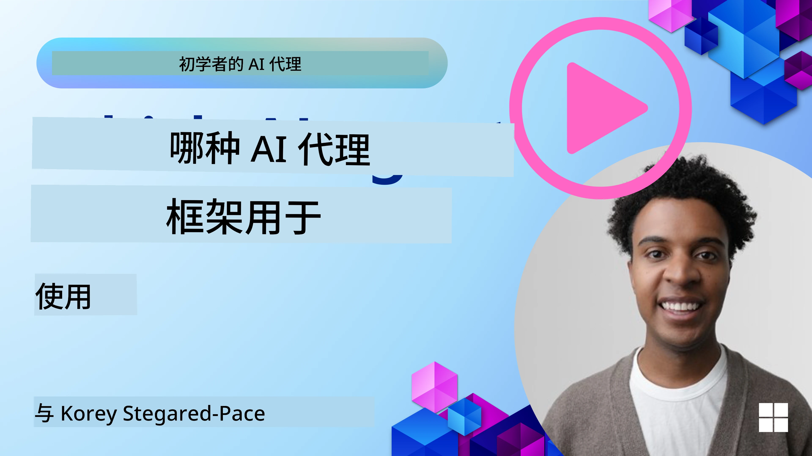

<!--
CO_OP_TRANSLATOR_METADATA:
{
  "original_hash": "7120197753abacc827b64ac2d5d6966f",
  "translation_date": "2025-11-13T11:16:20+00:00",
  "source_file": "02-explore-agentic-frameworks/README.md",
  "language_code": "zh"
}
-->
[](https://youtu.be/ODwF-EZo_O8?si=1xoy_B9RNQfrYdF7)

> _(点击上方图片观看本课视频)_

# 探索 AI Agent 框架

AI Agent 框架是专为简化 AI Agent 的创建、部署和管理而设计的软件平台。这些框架为开发者提供了预构建的组件、抽象和工具，从而简化了复杂 AI 系统的开发过程。

通过为 AI Agent 开发中的常见挑战提供标准化方法，这些框架帮助开发者专注于应用程序的独特方面。它们提升了构建 AI 系统的可扩展性、可访问性和效率。

## 介绍

本课将涵盖：

- 什么是 AI Agent 框架？它能帮助开发者实现什么？
- 团队如何利用这些框架快速原型设计、迭代并提升 Agent 的能力？
- 微软的 <a href="https://aka.ms/ai-agents/autogen" target="_blank">AutoGen</a>、<a href="https://aka.ms/ai-agents-beginners/semantic-kernel" target="_blank">Semantic Kernel</a> 和 <a href="https://aka.ms/ai-agents-beginners/ai-agent-service" target="_blank">Azure AI Agent Service</a> 所创建的框架和工具之间有哪些区别？
- 我可以直接集成现有的 Azure 生态系统工具，还是需要独立的解决方案？
- 什么是 Azure AI Agents 服务？它如何帮助我？

## 学习目标

本课的目标是帮助你理解：

- AI Agent 框架在 AI 开发中的作用。
- 如何利用 AI Agent 框架构建智能 Agent。
- AI Agent 框架所启用的关键功能。
- AutoGen、Semantic Kernel 和 Azure AI Agent Service 之间的差异。

## 什么是 AI Agent 框架？它能帮助开发者实现什么？

传统的 AI 框架可以帮助你将 AI 集成到应用程序中，并通过以下方式改进这些应用程序：

- **个性化**：AI 可以分析用户行为和偏好，提供个性化的推荐、内容和体验。
  示例：像 Netflix 这样的流媒体服务使用 AI 根据观看历史推荐电影和节目，从而提升用户参与度和满意度。
- **自动化和效率**：AI 可以自动化重复性任务、简化工作流程并提高运营效率。
  示例：客户服务应用程序使用 AI 驱动的聊天机器人处理常见查询，从而减少响应时间并让人工客服专注于更复杂的问题。
- **增强用户体验**：AI 可以通过提供智能功能（如语音识别、自然语言处理和预测文本）来改善整体用户体验。
  示例：像 Siri 和 Google Assistant 这样的虚拟助手使用 AI 理解并响应语音命令，使用户更轻松地与设备交互。

### 听起来很棒，对吧？那么为什么我们还需要 AI Agent 框架？

AI Agent 框架不仅仅是 AI 框架。它们旨在创建能够与用户、其他 Agent 和环境交互以实现特定目标的智能 Agent。这些 Agent 可以表现出自主行为、做出决策并适应变化的条件。让我们看看 AI Agent 框架所启用的一些关键功能：

- **Agent 协作与协调**：支持创建多个 AI Agent，这些 Agent 可以协作、沟通并协调以解决复杂任务。
- **任务自动化与管理**：提供自动化多步骤工作流、任务分配和动态任务管理的机制。
- **上下文理解与适应**：赋予 Agent 理解上下文、适应变化环境并基于实时信息做出决策的能力。

总结来说，Agent 让你能够做得更多，将自动化提升到一个新水平，创建能够从环境中学习和适应的更智能系统。

## 如何快速原型设计、迭代并提升 Agent 的能力？

这是一个快速发展的领域，但大多数 AI Agent 框架中有一些共同点可以帮助你快速原型设计和迭代，即模块化组件、协作工具和实时学习。让我们深入了解这些内容：

- **使用模块化组件**：AI SDK 提供了预构建的组件，如 AI 和内存连接器、使用自然语言或代码插件调用功能、提示模板等。
- **利用协作工具**：设计具有特定角色和任务的 Agent，使其能够测试和优化协作工作流。
- **实时学习**：实施反馈循环，让 Agent 从交互中学习并动态调整其行为。

### 使用模块化组件

像 Microsoft Semantic Kernel 和 LangChain 这样的 SDK 提供了预构建的组件，如 AI 连接器、提示模板和内存管理。

**团队如何使用这些**：团队可以快速组装这些组件，创建一个功能性原型，而无需从头开始，从而实现快速实验和迭代。

**实际操作方式**：你可以使用预构建的解析器从用户输入中提取信息，使用内存模块存储和检索数据，并使用提示生成器与用户交互，而无需从头构建这些组件。

**示例代码**。以下是如何使用带有 Semantic Kernel 的 Python 和 .Net 的预构建 AI 连接器，通过自动功能调用让模型响应用户输入的示例：

``` python
# Semantic Kernel Python Example

import asyncio
from typing import Annotated

from semantic_kernel.connectors.ai import FunctionChoiceBehavior
from semantic_kernel.connectors.ai.open_ai import AzureChatCompletion, AzureChatPromptExecutionSettings
from semantic_kernel.contents import ChatHistory
from semantic_kernel.functions import kernel_function
from semantic_kernel.kernel import Kernel

# Define a ChatHistory object to hold the conversation's context
chat_history = ChatHistory()
chat_history.add_user_message("I'd like to go to New York on January 1, 2025")


# Define a sample plugin that contains the function to book travel
class BookTravelPlugin:
    """A Sample Book Travel Plugin"""

    @kernel_function(name="book_flight", description="Book travel given location and date")
    async def book_flight(
        self, date: Annotated[str, "The date of travel"], location: Annotated[str, "The location to travel to"]
    ) -> str:
        return f"Travel was booked to {location} on {date}"

# Create the Kernel
kernel = Kernel()

# Add the sample plugin to the Kernel object
kernel.add_plugin(BookTravelPlugin(), plugin_name="book_travel")

# Define the Azure OpenAI AI Connector
chat_service = AzureChatCompletion(
    deployment_name="YOUR_DEPLOYMENT_NAME", 
    api_key="YOUR_API_KEY", 
    endpoint="https://<your-resource>.azure.openai.com/",
)

# Define the request settings to configure the model with auto-function calling
request_settings = AzureChatPromptExecutionSettings(function_choice_behavior=FunctionChoiceBehavior.Auto())


async def main():
    # Make the request to the model for the given chat history and request settings
    # The Kernel contains the sample that the model will request to invoke
    response = await chat_service.get_chat_message_content(
        chat_history=chat_history, settings=request_settings, kernel=kernel
    )
    assert response is not None

    """
    Note: In the auto function calling process, the model determines it can invoke the 
    `BookTravelPlugin` using the `book_flight` function, supplying the necessary arguments. 
    
    For example:

    "tool_calls": [
        {
            "id": "call_abc123",
            "type": "function",
            "function": {
                "name": "BookTravelPlugin-book_flight",
                "arguments": "{'location': 'New York', 'date': '2025-01-01'}"
            }
        }
    ]

    Since the location and date arguments are required (as defined by the kernel function), if the 
    model lacks either, it will prompt the user to provide them. For instance:

    User: Book me a flight to New York.
    Model: Sure, I'd love to help you book a flight. Could you please specify the date?
    User: I want to travel on January 1, 2025.
    Model: Your flight to New York on January 1, 2025, has been successfully booked. Safe travels!
    """

    print(f"`{response}`")
    # Example AI Model Response: `Your flight to New York on January 1, 2025, has been successfully booked. Safe travels! ✈️🗽`

    # Add the model's response to our chat history context
    chat_history.add_assistant_message(response.content)


if __name__ == "__main__":
    asyncio.run(main())
```
```csharp
// Semantic Kernel C# example

using Microsoft.SemanticKernel;
using Microsoft.SemanticKernel.ChatCompletion;
using System.ComponentModel;
using Microsoft.SemanticKernel.Connectors.AzureOpenAI;

ChatHistory chatHistory = [];
chatHistory.AddUserMessage("I'd like to go to New York on January 1, 2025");

var kernelBuilder = Kernel.CreateBuilder();
kernelBuilder.AddAzureOpenAIChatCompletion(
    deploymentName: "NAME_OF_YOUR_DEPLOYMENT",
    apiKey: "YOUR_API_KEY",
    endpoint: "YOUR_AZURE_ENDPOINT"
);
kernelBuilder.Plugins.AddFromType<BookTravelPlugin>("BookTravel"); 
var kernel = kernelBuilder.Build();

var settings = new AzureOpenAIPromptExecutionSettings()
{
    FunctionChoiceBehavior = FunctionChoiceBehavior.Auto()
};

var chatCompletion = kernel.GetRequiredService<IChatCompletionService>();

var response = await chatCompletion.GetChatMessageContentAsync(chatHistory, settings, kernel);

/*
Behind the scenes, the model recognizes the tool to call, what arguments it already has (location) and (date)
{

"tool_calls": [
    {
        "id": "call_abc123",
        "type": "function",
        "function": {
            "name": "BookTravelPlugin-book_flight",
            "arguments": "{'location': 'New York', 'date': '2025-01-01'}"
        }
    }
]
*/

Console.WriteLine(response.Content);
chatHistory.AddMessage(response!.Role, response!.Content!);

// Example AI Model Response: Your flight to New York on January 1, 2025, has been successfully booked. Safe travels! ✈️🗽

// Define a plugin that contains the function to book travel
public class BookTravelPlugin
{
    [KernelFunction("book_flight")]
    [Description("Book travel given location and date")]
    public async Task<string> BookFlight(DateTime date, string location)
    {
        return await Task.FromResult( $"Travel was booked to {location} on {date}");
    }
}
```

从这个示例中可以看出，你如何利用预构建的解析器从用户输入中提取关键信息，例如航班预订请求的出发地、目的地和日期。这种模块化方法让你可以专注于高层逻辑。

### 利用协作工具

像 CrewAI、Microsoft AutoGen 和 Semantic Kernel 这样的框架促进了多个 Agent 的创建，这些 Agent 可以协同工作。

**团队如何使用这些**：团队可以设计具有特定角色和任务的 Agent，使其能够测试和优化协作工作流，从而提高整体系统效率。

**实际操作方式**：你可以创建一个由多个 Agent 组成的团队，每个 Agent 都有专门的功能，例如数据检索、分析或决策。这些 Agent 可以沟通并共享信息，以实现共同目标，例如回答用户查询或完成任务。

**示例代码 (AutoGen)**：

```python
# creating agents, then create a round robin schedule where they can work together, in this case in order

# Data Retrieval Agent
# Data Analysis Agent
# Decision Making Agent

agent_retrieve = AssistantAgent(
    name="dataretrieval",
    model_client=model_client,
    tools=[retrieve_tool],
    system_message="Use tools to solve tasks."
)

agent_analyze = AssistantAgent(
    name="dataanalysis",
    model_client=model_client,
    tools=[analyze_tool],
    system_message="Use tools to solve tasks."
)

# conversation ends when user says "APPROVE"
termination = TextMentionTermination("APPROVE")

user_proxy = UserProxyAgent("user_proxy", input_func=input)

team = RoundRobinGroupChat([agent_retrieve, agent_analyze, user_proxy], termination_condition=termination)

stream = team.run_stream(task="Analyze data", max_turns=10)
# Use asyncio.run(...) when running in a script.
await Console(stream)
```

在上面的代码中，你可以看到如何创建一个涉及多个 Agent 协同工作的任务。每个 Agent 执行特定功能，通过协调 Agent 来实现所需的结果。通过创建具有专门角色的专用 Agent，你可以提高任务效率和性能。

### 实时学习

高级框架提供了实时上下文理解和适应的能力。

**团队如何使用这些**：团队可以实施反馈循环，让 Agent 从交互中学习并动态调整其行为，从而不断改进和优化能力。

**实际操作方式**：Agent 可以分析用户反馈、环境数据和任务结果，以更新其知识库、调整决策算法并随着时间的推移提高性能。这种迭代学习过程使 Agent 能够适应变化的条件和用户偏好，从而增强整体系统的有效性。

## AutoGen、Semantic Kernel 和 Azure AI Agent Service 框架之间的区别是什么？

有许多方法可以比较这些框架，但让我们从设计、功能和目标用例的角度来看一些关键差异：

## AutoGen

AutoGen 是由微软研究院的 AI Frontiers Lab 开发的开源框架。它专注于事件驱动的分布式 *Agentic* 应用程序，支持多个 LLM 和 SLM、工具以及高级多 Agent 设计模式。

AutoGen 围绕 Agent 的核心概念构建，Agent 是能够感知环境、做出决策并采取行动以实现特定目标的自主实体。Agent 通过异步消息进行通信，使其能够独立并行工作，从而增强系统的可扩展性和响应能力。

<a href="https://en.wikipedia.org/wiki/Actor_model" target="_blank">Agent 基于 Actor 模型</a>。根据维基百科，Actor 是 _并发计算的基本构建块。在接收到消息时，Actor 可以：做出本地决策、创建更多 Actor、发送更多消息以及决定如何响应接收到的下一条消息_。

**用例**：自动化代码生成、数据分析任务以及为规划和研究功能构建自定义 Agent。

以下是 AutoGen 的一些重要核心概念：

- **Agent**。Agent 是一个软件实体：
  - **通过消息通信**，这些消息可以是同步的或异步的。
  - **维护自己的状态**，状态可以通过接收到的消息进行修改。
  - **执行操作**，响应接收到的消息或其状态的变化。这些操作可能会修改 Agent 的状态并产生外部效果，例如更新消息日志、发送新消息、执行代码或进行 API 调用。
    
  以下是一个创建具有聊天功能的自定义 Agent 的简短代码片段：

    ```python
    from autogen_agentchat.agents import AssistantAgent
    from autogen_agentchat.messages import TextMessage
    from autogen_ext.models.openai import OpenAIChatCompletionClient


    class MyAgent(RoutedAgent):
        def __init__(self, name: str) -> None:
            super().__init__(name)
            model_client = OpenAIChatCompletionClient(model="gpt-4o")
            self._delegate = AssistantAgent(name, model_client=model_client)
    
        @message_handler
        async def handle_my_message_type(self, message: MyMessageType, ctx: MessageContext) -> None:
            print(f"{self.id.type} received message: {message.content}")
            response = await self._delegate.on_messages(
                [TextMessage(content=message.content, source="user")], ctx.cancellation_token
            )
            print(f"{self.id.type} responded: {response.chat_message.content}")
    ```
    
    在上面的代码中，`MyAgent` 被创建并继承自 `RoutedAgent`。它有一个消息处理器，可以打印消息内容，然后使用 `AssistantAgent` 委托发送响应。特别注意我们如何将 `self._delegate` 分配给一个 `AssistantAgent` 实例，这是一个可以处理聊天完成的预构建 Agent。

    接下来，让 AutoGen 知道这种 Agent 类型并启动程序：

    ```python
    
    # main.py
    runtime = SingleThreadedAgentRuntime()
    await MyAgent.register(runtime, "my_agent", lambda: MyAgent())

    runtime.start()  # Start processing messages in the background.
    await runtime.send_message(MyMessageType("Hello, World!"), AgentId("my_agent", "default"))
    ```

    在上面的代码中，Agent 被注册到运行时，然后向 Agent 发送一条消息，结果输出如下：

    ```text
    # Output from the console:
    my_agent received message: Hello, World!
    my_assistant received message: Hello, World!
    my_assistant responded: Hello! How can I assist you today?
    ```

- **多 Agent**。AutoGen 支持创建多个 Agent，这些 Agent 可以协同工作以完成复杂任务。Agent 可以沟通、共享信息并协调其行动以更高效地解决问题。要创建一个多 Agent 系统，你可以定义具有专门功能和角色的不同类型的 Agent，例如数据检索、分析、决策和用户交互。以下是一个创建示例：

    ```python
    editor_description = "Editor for planning and reviewing the content."

    # Example of declaring an Agent
    editor_agent_type = await EditorAgent.register(
    runtime,
    editor_topic_type,  # Using topic type as the agent type.
    lambda: EditorAgent(
        description=editor_description,
        group_chat_topic_type=group_chat_topic_type,
        model_client=OpenAIChatCompletionClient(
            model="gpt-4o-2024-08-06",
            # api_key="YOUR_API_KEY",
        ),
        ),
    )

    # remaining declarations shortened for brevity

    # Group chat
    group_chat_manager_type = await GroupChatManager.register(
    runtime,
    "group_chat_manager",
    lambda: GroupChatManager(
        participant_topic_types=[writer_topic_type, illustrator_topic_type, editor_topic_type, user_topic_type],
        model_client=OpenAIChatCompletionClient(
            model="gpt-4o-2024-08-06",
            # api_key="YOUR_API_KEY",
        ),
        participant_descriptions=[
            writer_description, 
            illustrator_description, 
            editor_description, 
            user_description
        ],
        ),
    )
    ```

    在上面的代码中，我们有一个 `GroupChatManager`，它被注册到运行时。这个管理器负责协调不同类型 Agent（如作家、插画师、编辑和用户）之间的交互。

- **Agent 运行时**。框架提供了一个运行时环境，支持 Agent 之间的通信，管理它们的身份和生命周期，并强制执行安全和隐私边界。这意味着你可以在一个安全受控的环境中运行你的 Agent，确保它们能够安全高效地交互。以下是两种感兴趣的运行时：
  - **独立运行时**。适用于所有 Agent 都用同一种编程语言实现并运行在同一进程中的单进程应用程序。以下是其工作方式的示意图：
  
    <a href="https://microsoft.github.io/autogen/stable/_images/architecture-standalone.svg" target="_blank">独立运行时</a>   
应用程序堆栈

    *Agent 通过运行时通过消息通信，运行时管理 Agent 的生命周期*

  - **分布式 Agent 运行时**，适用于多进程应用程序，其中 Agent 可以用不同的编程语言实现并运行在不同的机器上。以下是其工作方式的示意图：
  
    <a href="https://microsoft.github.io/autogen/stable/_images/architecture-distributed.svg" target="_blank">分布式运行时</a>

## Semantic Kernel + Agent 框架

Semantic Kernel 是一个企业级 AI 编排 SDK。它由 AI 和内存连接器以及一个 Agent 框架组成。

首先介绍一些核心组件：

- **AI 连接器**：这是一个用于与外部 AI 服务和数据源交互的接口，支持 Python 和 C#。

  ```python
  # Semantic Kernel Python
  from semantic_kernel.connectors.ai.open_ai import AzureChatCompletion
  from semantic_kernel.kernel import Kernel

  kernel = Kernel()
  kernel.add_service(
    AzureChatCompletion(
        deployment_name="your-deployment-name",
        api_key="your-api-key",
        endpoint="your-endpoint",
    )
  )
  ```  

    ```csharp
    // Semantic Kernel C#
    using Microsoft.SemanticKernel;

    // Create kernel
    var builder = Kernel.CreateBuilder();
    
    // Add a chat completion service:
    builder.Services.AddAzureOpenAIChatCompletion(
        "your-resource-name",
        "your-endpoint",
        "your-resource-key",
        "deployment-model");
    var kernel = builder.Build();
    ```

    这里是一个简单示例，展示如何创建一个内核并添加一个聊天完成服务。Semantic Kernel 创建了与外部 AI 服务的连接，在此例中是 Azure OpenAI Chat Completion。

- **插件**：这些封装了应用程序可以使用的功能。既有现成的插件，也可以创建自定义插件。一个相关的概念是“提示函数”。与提供自然语言提示来调用函数不同，你向模型广播某些函数。基于当前聊天上下文，模型可能会选择调用这些函数之一来完成请求或查询。以下是一个示例：

  ```python
  from semantic_kernel.connectors.ai.open_ai.services.azure_chat_completion import AzureChatCompletion


  async def main():
      from semantic_kernel.functions import KernelFunctionFromPrompt
      from semantic_kernel.kernel import Kernel

      kernel = Kernel()
      kernel.add_service(AzureChatCompletion())

      user_input = input("User Input:> ")

      kernel_function = KernelFunctionFromPrompt(
          function_name="SummarizeText",
          prompt="""
          Summarize the provided unstructured text in a sentence that is easy to understand.
          Text to summarize: {{$user_input}}
          """,
      )

      response = await kernel_function.invoke(kernel=kernel, user_input=user_input)
      print(f"Model Response: {response}")

      """
      Sample Console Output:

      User Input:> I like dogs
      Model Response: The text expresses a preference for dogs.
      """


  if __name__ == "__main__":
    import asyncio
    asyncio.run(main())
  ```

    ```csharp
    var userInput = Console.ReadLine();

    // Define semantic function inline.
    string skPrompt = @"Summarize the provided unstructured text in a sentence that is easy to understand.
                        Text to summarize: {{$userInput}}";
    
    // create the function from the prompt
    KernelFunction summarizeFunc = kernel.CreateFunctionFromPrompt(
        promptTemplate: skPrompt,
        functionName: "SummarizeText"
    );

    //then import into the current kernel
    kernel.ImportPluginFromFunctions("SemanticFunctions", [summarizeFunc]);

    ```

    在这里，你首先有一个模板提示 `skPrompt`，它为用户输入 `$userInput` 留出了空间。然后你创建了内核函数 `SummarizeText`，并将其导入到内核中，插件名称为 `SemanticFunctions`。注意函数的名称，这有助于 Semantic Kernel 理解函数的作用以及何时调用它。

- **本地函数**：框架还可以直接调用本地函数来执行任务。以下是一个从文件中检索内容的本地函数示例：

    ```csharp
    public class NativeFunctions {

        [SKFunction, Description("Retrieve content from local file")]
        public async Task<string> RetrieveLocalFile(string fileName, int maxSize = 5000)
        {
            string content = await File.ReadAllTextAsync(fileName);
            if (content.Length <= maxSize) return content;
            return content.Substring(0, maxSize);
        }
    }
    
    //Import native function
    string plugInName = "NativeFunction";
    string functionName = "RetrieveLocalFile";

   //To add the functions to a kernel use the following function
    kernel.ImportPluginFromType<NativeFunctions>();

    ```

- **内存**：抽象并简化了 AI 应用程序的上下文管理。内存的理念是 LLM 应该知道这些信息。你可以将这些信息存储在向量存储中，这最终是一个内存数据库或向量数据库或类似的东西。以下是一个非常简化的场景示例，其中 *事实* 被添加到内存中：

    ```csharp
    var facts = new Dictionary<string,string>();
    facts.Add(
        "Azure Machine Learning; https://learn.microsoft.com/azure/machine-learning/",
        @"Azure Machine Learning is a cloud service for accelerating and
        managing the machine learning project lifecycle. Machine learning professionals,
        data scientists, and engineers can use it in their day-to-day workflows"
    );
    
    facts.Add(
        "Azure SQL Service; https://learn.microsoft.com/azure/azure-sql/",
        @"Azure SQL is a family of managed, secure, and intelligent products
        that use the SQL Server database engine in the Azure cloud."
    );
    
    string memoryCollectionName = "SummarizedAzureDocs";
    
    foreach (var fact in facts) {
        await memoryBuilder.SaveReferenceAsync(
            collection: memoryCollectionName,
            description: fact.Key.Split(";")[1].Trim(),
            text: fact.Value,
            externalId: fact.Key.Split(";")[2].Trim(),
            externalSourceName: "Azure Documentation"
        );
    }
    ```

这些事实随后存储在内存集合 `SummarizedAzureDocs` 中。这是一个非常简化的示例，但您可以看到如何将信息存储在内存中供 LLM 使用。

这就是 Semantic Kernel 框架的基础，那么 Agent Framework 又是什么呢？

## Azure AI Agent 服务

Azure AI Agent 服务是最近新增的功能，于 2024 年微软 Ignite 大会上推出。它允许使用更灵活的模型开发和部署 AI 代理，例如直接调用开源 LLMs，如 Llama 3、Mistral 和 Cohere。

Azure AI Agent 服务提供更强大的企业安全机制和数据存储方法，使其适用于企业应用。

它可以与多代理编排框架（如 AutoGen 和 Semantic Kernel）开箱即用地协作。

该服务目前处于公开预览阶段，支持使用 Python 和 C# 构建代理。

使用 Semantic Kernel Python，我们可以通过用户定义的插件创建一个 Azure AI Agent：

```python
import asyncio
from typing import Annotated

from azure.identity.aio import DefaultAzureCredential

from semantic_kernel.agents import AzureAIAgent, AzureAIAgentSettings, AzureAIAgentThread
from semantic_kernel.contents import ChatMessageContent
from semantic_kernel.contents import AuthorRole
from semantic_kernel.functions import kernel_function


# Define a sample plugin for the sample
class MenuPlugin:
    """A sample Menu Plugin used for the concept sample."""

    @kernel_function(description="Provides a list of specials from the menu.")
    def get_specials(self) -> Annotated[str, "Returns the specials from the menu."]:
        return """
        Special Soup: Clam Chowder
        Special Salad: Cobb Salad
        Special Drink: Chai Tea
        """

    @kernel_function(description="Provides the price of the requested menu item.")
    def get_item_price(
        self, menu_item: Annotated[str, "The name of the menu item."]
    ) -> Annotated[str, "Returns the price of the menu item."]:
        return "$9.99"


async def main() -> None:
    ai_agent_settings = AzureAIAgentSettings.create()

    async with (
        DefaultAzureCredential() as creds,
        AzureAIAgent.create_client(
            credential=creds,
            conn_str=ai_agent_settings.project_connection_string.get_secret_value(),
        ) as client,
    ):
        # Create agent definition
        agent_definition = await client.agents.create_agent(
            model=ai_agent_settings.model_deployment_name,
            name="Host",
            instructions="Answer questions about the menu.",
        )

        # Create the AzureAI Agent using the defined client and agent definition
        agent = AzureAIAgent(
            client=client,
            definition=agent_definition,
            plugins=[MenuPlugin()],
        )

        # Create a thread to hold the conversation
        # If no thread is provided, a new thread will be
        # created and returned with the initial response
        thread: AzureAIAgentThread | None = None

        user_inputs = [
            "Hello",
            "What is the special soup?",
            "How much does that cost?",
            "Thank you",
        ]

        try:
            for user_input in user_inputs:
                print(f"# User: '{user_input}'")
                # Invoke the agent for the specified thread
                response = await agent.get_response(
                    messages=user_input,
                    thread_id=thread,
                )
                print(f"# {response.name}: {response.content}")
                thread = response.thread
        finally:
            await thread.delete() if thread else None
            await client.agents.delete_agent(agent.id)


if __name__ == "__main__":
    asyncio.run(main())
```

### 核心概念

Azure AI Agent 服务具有以下核心概念：

- **Agent（代理）**。Azure AI Agent 服务与 Azure AI Foundry 集成。在 AI Foundry 中，AI Agent 充当一个“智能”微服务，可用于回答问题（RAG）、执行操作或完全自动化工作流程。它通过结合生成式 AI 模型的强大功能与允许访问和交互真实数据源的工具来实现这一点。以下是一个代理的示例：

    ```python
    agent = project_client.agents.create_agent(
        model="gpt-4o-mini",
        name="my-agent",
        instructions="You are helpful agent",
        tools=code_interpreter.definitions,
        tool_resources=code_interpreter.resources,
    )
    ```

    在此示例中，创建了一个名为 `my-agent` 的代理，使用模型 `gpt-4o-mini`，并设置了指令 `You are helpful agent`。该代理配备了工具和资源，用于执行代码解释任务。

- **Thread 和 messages（线程和消息）**。线程是另一个重要概念，它表示代理与用户之间的对话或交互。线程可用于跟踪对话的进展、存储上下文信息以及管理交互的状态。以下是一个线程的示例：

    ```python
    thread = project_client.agents.create_thread()
    message = project_client.agents.create_message(
        thread_id=thread.id,
        role="user",
        content="Could you please create a bar chart for the operating profit using the following data and provide the file to me? Company A: $1.2 million, Company B: $2.5 million, Company C: $3.0 million, Company D: $1.8 million",
    )
    
    # Ask the agent to perform work on the thread
    run = project_client.agents.create_and_process_run(thread_id=thread.id, agent_id=agent.id)
    
    # Fetch and log all messages to see the agent's response
    messages = project_client.agents.list_messages(thread_id=thread.id)
    print(f"Messages: {messages}")
    ```

    在之前的代码中，创建了一个线程。随后向线程发送了一条消息。通过调用 `create_and_process_run`，代理被要求在线程上执行工作。最后，消息被获取并记录下来以查看代理的响应。这些消息表明用户与代理之间对话的进展。还需要了解的是，消息可以是不同类型的，例如文本、图像或文件，这意味着代理的工作可能生成了一个图像或文本响应等。作为开发者，您可以使用这些信息进一步处理响应或将其呈现给用户。

- **与其他 AI 框架集成**。Azure AI Agent 服务可以与其他框架（如 AutoGen 和 Semantic Kernel）交互，这意味着您可以在这些框架之一中构建应用的一部分，例如使用 Agent 服务作为编排器，或者完全在 Agent 服务中构建应用。

**使用场景**：Azure AI Agent 服务专为需要安全、可扩展和灵活的 AI 代理部署的企业应用设计。

## 这些框架之间有什么区别？

听起来这些框架之间有很多重叠，但在设计、功能和目标使用场景方面存在一些关键差异：

- **AutoGen**：是一个专注于多代理系统前沿研究的实验框架。它是实验和原型设计复杂多代理系统的最佳选择。
- **Semantic Kernel**：是一个面向生产的代理库，用于构建企业级代理应用。专注于事件驱动的分布式代理应用，支持多个 LLMs 和 SLMs、工具以及单/多代理设计模式。
- **Azure AI Agent 服务**：是 Azure Foundry 中的一个代理平台和部署服务。它提供与 Azure Found 支持的服务（如 Azure OpenAI、Azure AI Search、Bing Search 和代码执行）的连接。

仍然不确定选择哪个？

### 使用场景

让我们通过一些常见的使用场景来帮助您：

> 问：我正在实验、学习并构建概念验证代理应用，我希望能够快速构建和实验。

> 答：AutoGen 是这个场景的不错选择，因为它专注于事件驱动的分布式代理应用，并支持高级多代理设计模式。

> 问：为什么 AutoGen 比 Semantic Kernel 和 Azure AI Agent 服务更适合这个使用场景？

> 答：AutoGen 专为事件驱动的分布式代理应用设计，非常适合自动化代码生成和数据分析任务。它提供了构建复杂多代理系统所需的工具和功能。

> 问：听起来 Azure AI Agent 服务也可以用于此场景，它有代码生成工具和更多功能？

> 答：是的，Azure AI Agent 服务是一个代理平台服务，内置支持多个模型、Azure AI Search、Bing Search 和 Azure Functions。它使您可以轻松在 Foundry Portal 中构建代理并进行大规模部署。

> 问：我还是很困惑，能不能直接给我一个选择？

> 答：一个很好的选择是先在 Semantic Kernel 中构建您的应用，然后使用 Azure AI Agent 服务来部署您的代理。这种方法使您能够轻松持久化代理，同时利用 Semantic Kernel 构建多代理系统的能力。此外，Semantic Kernel 在 AutoGen 中有一个连接器，使得同时使用这两个框架变得简单。

让我们用表格总结关键差异：

| 框架 | 重点 | 核心概念 | 使用场景 |
| --- | --- | --- | --- |
| AutoGen | 事件驱动的分布式代理应用 | 代理、角色、功能、数据 | 代码生成、数据分析任务 |
| Semantic Kernel | 理解和生成类似人类的文本内容 | 代理、模块化组件、协作 | 自然语言理解、内容生成 |
| Azure AI Agent 服务 | 灵活的模型、企业安全、代码生成、工具调用 | 模块化、协作、流程编排 | 安全、可扩展和灵活的 AI 代理部署 |

每个框架的理想使用场景是什么？

## 我可以直接集成现有的 Azure 生态系统工具，还是需要独立解决方案？

答案是可以，您可以直接将现有的 Azure 生态系统工具与 Azure AI Agent 服务集成，尤其是因为它已被设计为与其他 Azure 服务无缝协作。例如，您可以集成 Bing、Azure AI Search 和 Azure Functions。此外，它还与 Azure AI Foundry 深度集成。

对于 AutoGen 和 Semantic Kernel，您也可以与 Azure 服务集成，但可能需要从代码中调用 Azure 服务。另一种集成方式是使用 Azure SDKs 从代理中与 Azure 服务交互。此外，如前所述，您可以使用 Azure AI Agent 服务作为 AutoGen 或 Semantic Kernel 中构建的代理的编排器，从而轻松访问 Azure 生态系统。

## 示例代码

- Python：[Agent Framework](./code_samples/02-python-agent-framework.ipynb)
- .NET：[Agent Framework](./code_samples/02-dotnet-agent-framework.md)

## 对 AI Agent 框架还有更多问题？

加入 [Azure AI Foundry Discord](https://aka.ms/ai-agents/discord)，与其他学习者交流，参加办公时间并解答您的 AI Agent 问题。

## 参考资料

- <a href="https://techcommunity.microsoft.com/blog/azure-ai-services-blog/introducing-azure-ai-agent-service/4298357" target="_blank">Azure Agent 服务</a>
- <a href="https://devblogs.microsoft.com/semantic-kernel/microsofts-agentic-ai-frameworks-autogen-and-semantic-kernel/" target="_blank">Semantic Kernel 和 AutoGen</a>
- <a href="https://learn.microsoft.com/semantic-kernel/frameworks/agent/?pivots=programming-language-python" target="_blank">Semantic Kernel Python Agent Framework</a>
- <a href="https://learn.microsoft.com/semantic-kernel/frameworks/agent/?pivots=programming-language-csharp" target="_blank">Semantic Kernel .Net Agent Framework</a>
- <a href="https://learn.microsoft.com/azure/ai-services/agents/overview" target="_blank">Azure AI Agent 服务</a>
- <a href="https://techcommunity.microsoft.com/blog/educatordeveloperblog/using-azure-ai-agent-service-with-autogen--semantic-kernel-to-build-a-multi-agen/4363121" target="_blank">使用 Azure AI Agent 服务与 AutoGen / Semantic Kernel 构建多代理解决方案</a>

## 上一课

[AI 代理简介及使用场景](../01-intro-to-ai-agents/README.md)

## 下一课

[理解代理设计模式](../03-agentic-design-patterns/README.md)

---

<!-- CO-OP TRANSLATOR DISCLAIMER START -->
**免责声明**：  
本文档使用AI翻译服务[Co-op Translator](https://github.com/Azure/co-op-translator)进行翻译。尽管我们努力确保准确性，但请注意，自动翻译可能包含错误或不准确之处。应以原始语言的文档为权威来源。对于关键信息，建议使用专业人工翻译。因使用本翻译而引起的任何误解或误读，我们概不负责。
<!-- CO-OP TRANSLATOR DISCLAIMER END -->