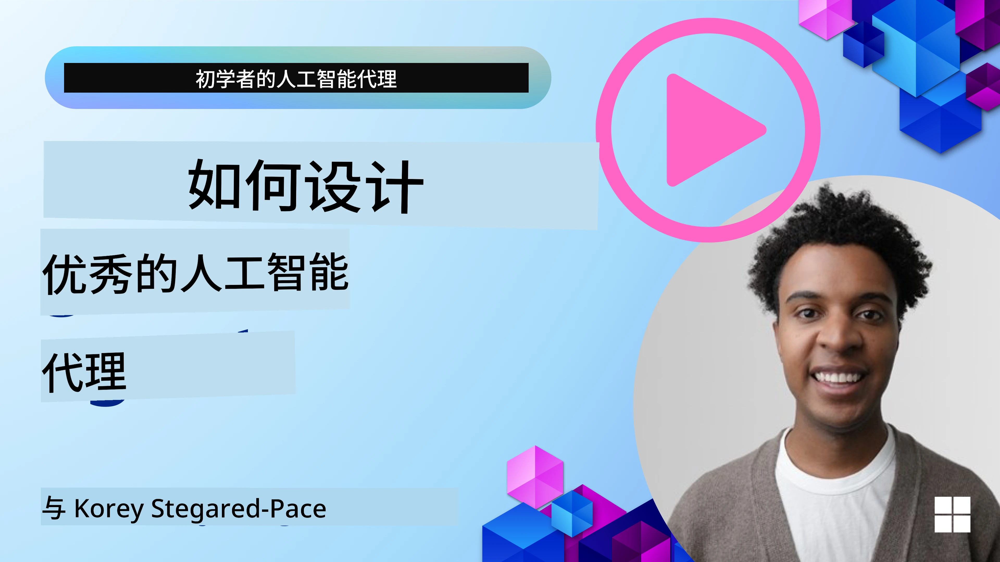
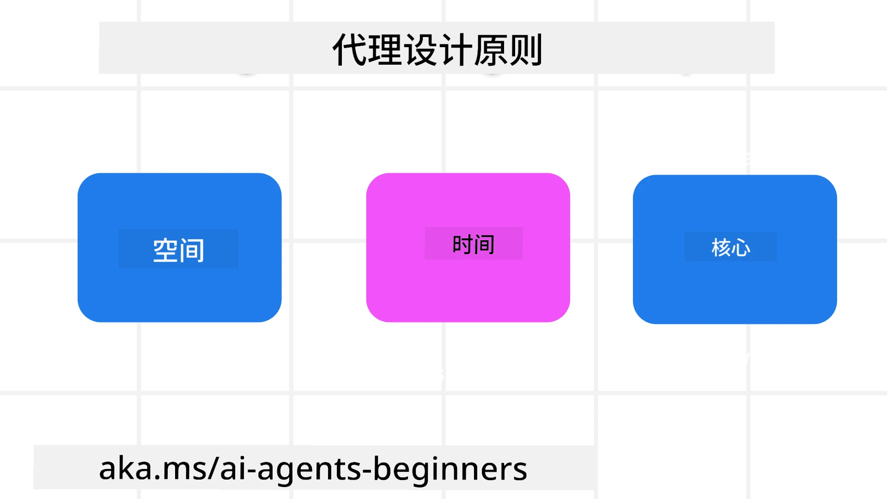

<!--
CO_OP_TRANSLATOR_METADATA:
{
  "original_hash": "d71524fe83a23829ae7a23b4031aaac8",
  "translation_date": "2025-11-13T11:17:56+00:00",
  "source_file": "03-agentic-design-patterns/README.md",
  "language_code": "zh"
}
-->

> _(点击上方图片观看本课视频)_
# AI代理设计原则

## 介绍

构建AI代理系统有许多思路。鉴于生成式AI设计中的模糊性是一种特性而非缺陷，工程师有时很难确定从哪里开始。我们创建了一套以人为中心的用户体验设计原则，帮助开发者构建以客户为中心的代理系统，以满足其业务需求。这些设计原则并不是一种规定性的架构，而是为定义和构建代理体验的团队提供的起点。

一般来说，代理应该：

- 扩展和增强人类能力（如头脑风暴、解决问题、自动化等）
- 填补知识空白（如帮助快速掌握知识领域、翻译等）
- 促进并支持我们个人偏好的协作方式
- 让我们成为更好的自己（例如，生活教练/任务管理者，帮助我们学习情绪调节和正念技能，增强韧性等）

## 本课内容

- 什么是代理设计原则
- 实施这些设计原则时需要遵循的指导方针
- 使用设计原则的一些示例

## 学习目标

完成本课后，您将能够：

1. 解释什么是代理设计原则
2. 解释使用代理设计原则的指导方针
3. 理解如何使用代理设计原则构建代理

## 代理设计原则

### 代理（空间）

这是代理运行的环境。这些原则指导我们如何设计代理以在物理和数字世界中进行互动。

- **连接而非取代** – 帮助人们与其他人、事件和可操作的知识建立联系，以促进协作和连接。
  - 代理帮助连接事件、知识和人。
  - 代理拉近人与人之间的距离，而不是取代或贬低人类。
- **易于访问但偶尔隐形** – 代理主要在后台运行，仅在相关和适当时提醒我们。
  - 代理在任何设备或平台上都易于发现和访问，且仅限授权用户。
  - 代理支持多模态输入和输出（声音、语音、文本等）。
  - 代理可以在前台和后台之间无缝切换；根据用户需求感知，在主动和被动之间转换。
  - 代理可能以隐形形式运行，但其后台处理路径及与其他代理的协作对用户是透明且可控的。

### 代理（时间）

这是代理随时间运行的方式。这些原则指导我们如何设计代理以跨越过去、现在和未来进行互动。

- **过去**：反思包括状态和上下文的历史。
  - 代理基于对更丰富的历史数据的分析（不仅限于事件、人物或状态）提供更相关的结果。
  - 代理从过去的事件中创建连接，并积极反思记忆以应对当前情况。
- **现在**：推动而非通知。
  - 代理采用全面的方法与人互动。当事件发生时，代理不仅仅是静态通知或其他形式的静态形式。代理可以简化流程或动态生成提示，在正确的时刻引导用户的注意力。
  - 代理根据上下文环境、社会和文化变化以及用户意图提供信息。
  - 代理的互动可以是渐进的，随着时间的推移逐步复杂化，以增强用户的长期能力。
- **未来**：适应和进化。
  - 代理适应各种设备、平台和模式。
  - 代理适应用户行为、可访问性需求，并可自由定制。
  - 代理通过持续的用户互动塑造并进化。

### 代理（核心）

这些是代理设计核心中的关键元素。

- **接受不确定性但建立信任**。
  - 代理设计中预期会有一定程度的不确定性。不确定性是代理设计的关键元素。
  - 信任和透明是代理设计的基础层。
  - 用户可以控制代理的开启/关闭状态，代理状态始终清晰可见。

## 实施这些原则的指导方针

在使用上述设计原则时，请遵循以下指导方针：

1. **透明性**：告知用户AI的参与情况、其功能（包括过去的行为），以及如何提供反馈和修改系统。
2. **控制**：允许用户定制、指定偏好和个性化，并控制系统及其属性（包括忘记的能力）。
3. **一致性**：在设备和端点之间实现一致的多模态体验。尽可能使用熟悉的UI/UX元素（例如，语音交互的麦克风图标），并尽量减少用户的认知负担（例如，提供简洁的响应、视觉辅助和“了解更多”内容）。

## 如何使用这些原则和指导方针设计旅行代理

假设您正在设计一个旅行代理，可以这样考虑使用设计原则和指导方针：

1. **透明性** – 告知用户旅行代理是一个AI驱动的代理。提供一些基本说明，例如“你好”消息、示例提示。在产品页面上清楚记录这些信息。显示用户过去提出的提示列表。明确如何提供反馈（如点赞或点踩、发送反馈按钮等）。清楚说明代理是否有使用或主题限制。
2. **控制** – 确保用户清楚如何在代理创建后进行修改，例如系统提示。允许用户选择代理的详细程度、写作风格，以及代理不应讨论的内容。允许用户查看和删除任何相关文件或数据、提示和过去的对话。
3. **一致性** – 确保“分享提示”、“添加文件或照片”、“标记某人或某事”的图标是标准且易于识别的。使用回形针图标表示文件上传/与代理共享，使用图片图标表示图形上传。

## 示例代码

- Python: [代理框架](./code_samples/03-python-agent-framework.ipynb)
- .NET: [代理框架](./code_samples/03-dotnet-agent-framework.md)

## 对AI代理设计模式有更多问题？

加入 [Azure AI Foundry Discord](https://aka.ms/ai-agents/discord)，与其他学习者交流，参加办公时间并解答您的AI代理问题。

## 其他资源

- <a href="https://openai.com" target="_blank">治理代理AI系统的实践 | OpenAI</a>
- <a href="https://microsoft.com" target="_blank">HAX工具包项目 - Microsoft Research</a>
- <a href="https://responsibleaitoolbox.ai" target="_blank">负责任的AI工具箱</a>

## 上一课

[探索代理框架](../02-explore-agentic-frameworks/README.md)

## 下一课

[工具使用设计模式](../04-tool-use/README.md)

---

<!-- CO-OP TRANSLATOR DISCLAIMER START -->
**免责声明**：  
本文档使用AI翻译服务[Co-op Translator](https://github.com/Azure/co-op-translator)进行翻译。尽管我们努力确保翻译的准确性，但请注意，自动翻译可能包含错误或不准确之处。应以原始语言的文档为权威来源。对于关键信息，建议使用专业人工翻译。我们对因使用本翻译而引起的任何误解或误读不承担责任。
<!-- CO-OP TRANSLATOR DISCLAIMER END -->