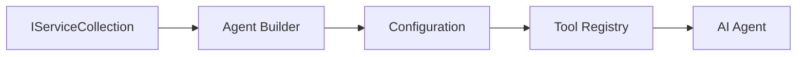

<!--
CO_OP_TRANSLATOR_METADATA:
{
  "original_hash": "bcc874e190347bd6a095aed56dc16de8",
  "translation_date": "2025-11-13T11:18:33+00:00",
  "source_file": "03-agentic-design-patterns/code_samples/03-dotnet-agent-framework.md",
  "language_code": "zh"
}
-->
# 🎨 使用 GitHub 模型的智能代理设计模式 (.NET)

## 📋 学习目标

此示例展示了使用 Microsoft Agent Framework 和 GitHub 模型集成在 .NET 中构建智能代理的企业级设计模式。您将学习专业的设计模式和架构方法，使代理具备生产级别的准备、可维护性和可扩展性。

### 企业设计模式

- 🏭 **工厂模式**：通过依赖注入实现标准化代理创建
- 🔧 **建造者模式**：流畅的代理配置和设置
- 🧵 **线程安全模式**：并发对话管理
- 📋 **仓库模式**：有组织的工具和能力管理

## 🎯 .NET 特定架构优势

### 企业功能

- **强类型**：编译时验证和 IntelliSense 支持
- **依赖注入**：内置 DI 容器集成
- **配置管理**：IConfiguration 和 Options 模式
- **异步编程**：一流的异步编程支持

### 生产级设计模式

- **日志集成**：ILogger 和结构化日志支持
- **健康检查**：内置监控和诊断功能
- **配置验证**：通过数据注解实现强类型验证
- **错误处理**：结构化异常管理

## 🔧 技术架构

### 核心 .NET 组件

- **Microsoft.Extensions.AI**：统一的 AI 服务抽象
- **Microsoft.Agents.AI**：企业级代理编排框架
- **GitHub 模型集成**：高性能 API 客户端模式
- **配置系统**：appsettings.json 和环境集成

### 设计模式实现



## 🏗️ 展示的企业模式

### 1. **创建型模式**

- **代理工厂**：通过一致的配置实现集中化代理创建
- **建造者模式**：用于复杂代理配置的流畅 API
- **单例模式**：共享资源和配置管理
- **依赖注入**：松耦合和可测试性

### 2. **行为型模式**

- **策略模式**：可互换的工具执行策略
- **命令模式**：封装的代理操作，支持撤销/重做
- **观察者模式**：事件驱动的代理生命周期管理
- **模板方法**：标准化的代理执行工作流

### 3. **结构型模式**

- **适配器模式**：GitHub 模型 API 集成层
- **装饰器模式**：代理能力增强
- **外观模式**：简化的代理交互接口
- **代理模式**：延迟加载和缓存以提升性能

## 📚 .NET 设计原则

### SOLID 原则

- **单一职责**：每个组件有一个明确的目的
- **开放/封闭**：可扩展而无需修改
- **里氏替换**：基于接口的工具实现
- **接口隔离**：专注且内聚的接口
- **依赖倒置**：依赖抽象而非具体实现

### 清晰架构

- **领域层**：核心代理和工具抽象
- **应用层**：代理编排和工作流
- **基础设施层**：GitHub 模型集成和外部服务
- **表现层**：用户交互和响应格式化

## 🔒 企业级考虑

### 安全性

- **凭证管理**：通过 IConfiguration 安全处理 API 密钥
- **输入验证**：强类型和数据注解验证
- **输出清理**：安全的响应处理和过滤
- **审计日志**：全面的操作跟踪

### 性能

- **异步模式**：非阻塞 I/O 操作
- **连接池**：高效的 HTTP 客户端管理
- **缓存**：响应缓存以提升性能
- **资源管理**：正确的资源释放和清理模式

### 可扩展性

- **线程安全**：支持并发代理执行
- **资源池化**：高效的资源利用
- **负载管理**：速率限制和压力处理
- **监控**：性能指标和健康检查

## 🚀 生产部署

- **配置管理**：环境特定设置
- **日志策略**：带相关 ID 的结构化日志
- **错误处理**：全局异常处理和适当恢复
- **监控**：应用洞察和性能计数器
- **测试**：单元测试、集成测试和负载测试模式

准备好使用 .NET 构建企业级智能代理了吗？让我们设计一些强大的架构吧！ 🏢✨

## 🚀 开始使用

### 前提条件

- [.NET 10 SDK](https://dotnet.microsoft.com/download/dotnet/10.0) 或更高版本
- [GitHub 模型 API 访问令牌](https://docs.github.com/github-models/github-models-at-scale/using-your-own-api-keys-in-github-models)

### 所需环境变量

```bash
# zsh/bash
export GH_TOKEN=<your_github_token>
export GH_ENDPOINT=https://models.github.ai/inference
export GH_MODEL_ID=openai/gpt-5-mini
```

```powershell
# PowerShell
$env:GH_TOKEN = "<your_github_token>"
$env:GH_ENDPOINT = "https://models.github.ai/inference"
$env:GH_MODEL_ID = "openai/gpt-5-mini"
```

### 示例代码

运行代码示例，

```bash
# zsh/bash
chmod +x ./03-dotnet-agent-framework.cs
./03-dotnet-agent-framework.cs
```

或者使用 dotnet CLI：

```bash
dotnet run ./03-dotnet-agent-framework.cs
```

查看 [`03-dotnet-agent-framework.cs`](../../../../03-agentic-design-patterns/code_samples/03-dotnet-agent-framework.cs) 获取完整代码。

```csharp
#!/usr/bin/dotnet run

#:package Microsoft.Extensions.AI@10.*
#:package Microsoft.Agents.AI.OpenAI@1.*-*

using System.ClientModel;
using System.ComponentModel;

using Microsoft.Agents.AI;
using Microsoft.Extensions.AI;

using OpenAI;

// Tool Function: Random Destination Generator
// This static method will be available to the agent as a callable tool
// The [Description] attribute helps the AI understand when to use this function
// This demonstrates how to create custom tools for AI agents
[Description("Provides a random vacation destination.")]
static string GetRandomDestination()
{
    // List of popular vacation destinations around the world
    // The agent will randomly select from these options
    var destinations = new List<string>
    {
        "Paris, France",
        "Tokyo, Japan",
        "New York City, USA",
        "Sydney, Australia",
        "Rome, Italy",
        "Barcelona, Spain",
        "Cape Town, South Africa",
        "Rio de Janeiro, Brazil",
        "Bangkok, Thailand",
        "Vancouver, Canada"
    };

    // Generate random index and return selected destination
    // Uses System.Random for simple random selection
    var random = new Random();
    int index = random.Next(destinations.Count);
    return destinations[index];
}

// Extract configuration from environment variables
// Retrieve the GitHub Models API endpoint, defaults to https://models.github.ai/inference if not specified
// Retrieve the model ID, defaults to openai/gpt-5-mini if not specified
// Retrieve the GitHub token for authentication, throws exception if not specified
var github_endpoint = Environment.GetEnvironmentVariable("GH_ENDPOINT") ?? "https://models.github.ai/inference";
var github_model_id = Environment.GetEnvironmentVariable("GH_MODEL_ID") ?? "openai/gpt-5-mini";
var github_token = Environment.GetEnvironmentVariable("GH_TOKEN") ?? throw new InvalidOperationException("GH_TOKEN is not set.");

// Configure OpenAI Client Options
// Create configuration options to point to GitHub Models endpoint
// This redirects OpenAI client calls to GitHub's model inference service
var openAIOptions = new OpenAIClientOptions()
{
    Endpoint = new Uri(github_endpoint)
};

// Initialize OpenAI Client with GitHub Models Configuration
// Create OpenAI client using GitHub token for authentication
// Configure it to use GitHub Models endpoint instead of OpenAI directly
var openAIClient = new OpenAIClient(new ApiKeyCredential(github_token), openAIOptions);

// Define Agent Identity and Comprehensive Instructions
// Agent name for identification and logging purposes
var AGENT_NAME = "TravelAgent";

// Detailed instructions that define the agent's personality, capabilities, and behavior
// This system prompt shapes how the agent responds and interacts with users
var AGENT_INSTRUCTIONS = """
You are a helpful AI Agent that can help plan vacations for customers.

Important: When users specify a destination, always plan for that location. Only suggest random destinations when the user hasn't specified a preference.

When the conversation begins, introduce yourself with this message:
"Hello! I'm your TravelAgent assistant. I can help plan vacations and suggest interesting destinations for you. Here are some things you can ask me:
1. Plan a day trip to a specific location
2. Suggest a random vacation destination
3. Find destinations with specific features (beaches, mountains, historical sites, etc.)
4. Plan an alternative trip if you don't like my first suggestion

What kind of trip would you like me to help you plan today?"

Always prioritize user preferences. If they mention a specific destination like "Bali" or "Paris," focus your planning on that location rather than suggesting alternatives.
""";

// Create AI Agent with Advanced Travel Planning Capabilities
// Initialize complete agent pipeline: OpenAI client → Chat client → AI agent
// Configure agent with name, detailed instructions, and available tools
// This demonstrates the .NET agent creation pattern with full configuration
AIAgent agent = openAIClient
    .GetChatClient(github_model_id)
    .CreateAIAgent(
        name: AGENT_NAME,
        instructions: AGENT_INSTRUCTIONS,
        tools: [AIFunctionFactory.Create(GetRandomDestination)]
    );

// Create New Conversation Thread for Context Management
// Initialize a new conversation thread to maintain context across multiple interactions
// Threads enable the agent to remember previous exchanges and maintain conversational state
// This is essential for multi-turn conversations and contextual understanding
AgentThread thread = agent.GetNewThread();

// Execute Agent: First Travel Planning Request
// Run the agent with an initial request that will likely trigger the random destination tool
// The agent will analyze the request, use the GetRandomDestination tool, and create an itinerary
// Using the thread parameter maintains conversation context for subsequent interactions
await foreach (var update in agent.RunStreamingAsync("Plan me a day trip", thread))
{
    await Task.Delay(10);
    Console.Write(update);
}

Console.WriteLine();

// Execute Agent: Follow-up Request with Context Awareness
// Demonstrate contextual conversation by referencing the previous response
// The agent remembers the previous destination suggestion and will provide an alternative
// This showcases the power of conversation threads and contextual understanding in .NET agents
await foreach (var update in agent.RunStreamingAsync("I don't like that destination. Plan me another vacation.", thread))
{
    await Task.Delay(10);
    Console.Write(update);
}
```

---

<!-- CO-OP TRANSLATOR DISCLAIMER START -->
**免责声明**：  
本文档使用AI翻译服务[Co-op Translator](https://github.com/Azure/co-op-translator)进行翻译。尽管我们努力确保准确性，但请注意，自动翻译可能包含错误或不准确之处。应以原始语言的文档为权威来源。对于关键信息，建议使用专业人工翻译。因使用本翻译而引起的任何误解或误读，我们概不负责。
<!-- CO-OP TRANSLATOR DISCLAIMER END -->