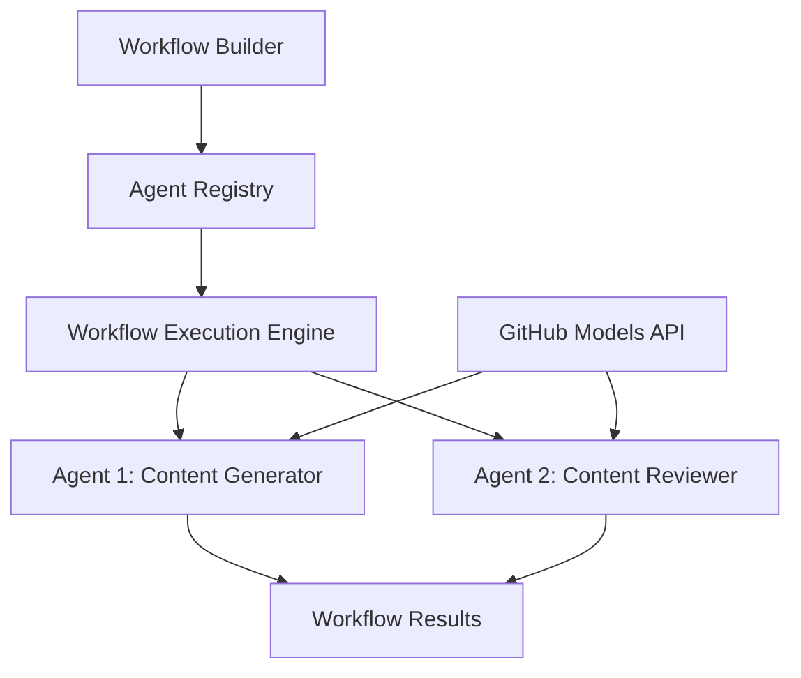

<!--
CO_OP_TRANSLATOR_METADATA:
{
  "original_hash": "034158688d0a45aae06dcbb21b0da5ae",
  "translation_date": "2025-11-11T12:41:49+00:00",
  "source_file": "08-multi-agent/code_samples/workflows-agent-framework/dotNET/01.dotnet-agent-framework-workflow-ghmodel-basic.md",
  "language_code": "zh"
}
-->
# 🔄 使用 GitHub 模型 (.NET) 的基础代理工作流

## 📋 工作流编排教程

本教程展示了如何使用 Microsoft Agent Framework for .NET 和 GitHub 模型构建复杂的 **代理工作流**。您将学习如何创建多步骤业务流程，让 AI 代理通过结构化编排模式协作完成复杂任务。

## 🎯 学习目标

### 🏗️ **工作流架构基础**
- **工作流构建器**：设计并编排复杂的多步骤 AI 流程
- **代理协调**：在工作流中协调多个专业代理
- **GitHub 模型集成**：在工作流中利用 GitHub 的 AI 模型推理服务
- **可视化工作流设计**：创建并可视化工作流结构以便更好地理解

### 🔄 **流程编排模式**
- **顺序处理**：按逻辑顺序链接多个代理任务
- **状态管理**：在工作流阶段之间维护上下文和数据流
- **错误处理**：实现强大的错误恢复和工作流弹性
- **性能优化**：为企业规模操作设计高效工作流

### 🏢 **企业工作流应用**
- **业务流程自动化**：自动化复杂的组织工作流
- **内容生产管道**：包含审查和批准阶段的编辑工作流
- **客户服务自动化**：多步骤客户询问解决方案
- **数据处理工作流**：具有 AI 驱动转换的 ETL 工作流

## ⚙️ 前提条件与设置

### 📦 **所需 NuGet 包**

此工作流演示使用了几个关键的 .NET 包：

```xml
<!-- Core AI Framework -->
<PackageReference Include="Microsoft.Extensions.AI" Version="9.9.0" />

<!-- Agent Framework (Local Development) -->
<!-- Microsoft.Agents.AI.dll - Core agent abstractions -->
<!-- Microsoft.Agents.AI.OpenAI.dll - OpenAI/GitHub Models integration -->

<!-- Configuration and Environment -->
<PackageReference Include="DotNetEnv" Version="3.1.1" />
```

### 🔑 **GitHub 模型配置**

**环境设置 (.env 文件)：**
```env
GITHUB_TOKEN=your_github_personal_access_token
GITHUB_ENDPOINT=https://models.inference.ai.azure.com
GITHUB_MODEL_ID=gpt-4o-mini
```

**GitHub 模型访问：**
1. 注册 GitHub 模型（目前处于预览阶段）
2. 生成具有模型访问权限的个人访问令牌
3. 按上述方式配置环境变量

### 🏗️ **工作流架构概述**



**关键组件：**
- **WorkflowBuilder**：设计工作流的主要编排引擎
- **AIAgent**：具有特定能力的单个专业代理
- **GitHub Models Client**：AI 模型推理服务集成
- **Execution Context**：管理工作流阶段之间的状态和数据流

## 🎨 **企业工作流设计模式**

### 📝 **内容生产工作流**
```
User Request → Content Generation → Quality Review → Final Output
```

### 🔍 **文档处理管道**
```
Document Input → Analysis → Extraction → Validation → Structured Output
```

### 💼 **商业智能工作流**
```
Data Collection → Processing → Analysis → Report Generation → Distribution
```

### 🤝 **客户服务自动化**
```
Customer Inquiry → Classification → Processing → Response Generation → Follow-up
```

## 🏢 **企业优势**

### 🎯 **可靠性与可扩展性**
- **确定性执行**：一致、可重复的工作流结果
- **错误恢复**：在任何工作流阶段优雅处理故障
- **性能监控**：跟踪执行指标和优化机会
- **资源管理**：高效分配和利用 AI 模型资源

### 🔒 **安全性与合规性**
- **安全认证**：基于 GitHub 令牌的 API 访问认证
- **审计记录**：完整记录工作流执行和决策点
- **访问控制**：对工作流执行和监控的细粒度权限
- **数据隐私**：在整个工作流中安全处理敏感信息

### 📊 **可观察性与管理**
- **可视化工作流设计**：清晰表示流程流和依赖关系
- **执行监控**：实时跟踪工作流进度和性能
- **错误报告**：详细的错误分析和调试能力
- **性能分析**：优化和容量规划的指标

让我们开始构建您的第一个企业级 AI 工作流吧！🚀

## 💻 运行代码

完整实现可在 `01.dotnet-agent-framework-workflow-ghmodel-basic.cs` 文件中找到。此文件演示了：

1. **环境配置** - 从 `.env` 文件加载 GitHub 模型凭据
2. **OpenAI 客户端设置** - 配置客户端以使用 GitHub 模型端点
3. **代理创建** - 定义专业代理（前台和礼宾）
4. **工作流构建器** - 创建具有顺序处理的多代理工作流
5. **工作流执行** - 运行工作流并流式显示结果

### 🚀 运行示例

```bash
# Make the script executable (Unix/Linux/macOS)
chmod +x 01.dotnet-agent-framework-workflow-ghmodel-basic.cs

# Run the workflow
./01.dotnet-agent-framework-workflow-ghmodel-basic.cs
```

或在 Windows 上运行：
```powershell
dotnet run 01.dotnet-agent-framework-workflow-ghmodel-basic.cs
```

### 📝 预期输出

工作流将：
1. 接收您的旅行目的地请求（例如：“我想去巴黎”）
2. 前台代理提供初步推荐
3. 礼宾代理审查并优化推荐
4. 最终输出显示完整的对话流

### 🔧 自定义

您可以通过以下方式自定义工作流：
- 修改代理指令以改变其行为
- 添加更多代理以创建复杂的多步骤工作流
- 更改用户消息以测试不同场景
- 调整工作流边界以创建不同的执行模式

---

<!-- CO-OP TRANSLATOR DISCLAIMER START -->
**免责声明**：  
本文档使用AI翻译服务[Co-op Translator](https://github.com/Azure/co-op-translator)进行翻译。尽管我们努力确保翻译的准确性，但请注意，自动翻译可能包含错误或不准确之处。应以原始语言的文档作为权威来源。对于重要信息，建议使用专业人工翻译。我们不对因使用此翻译而产生的任何误解或误读承担责任。
<!-- CO-OP TRANSLATOR DISCLAIMER END -->