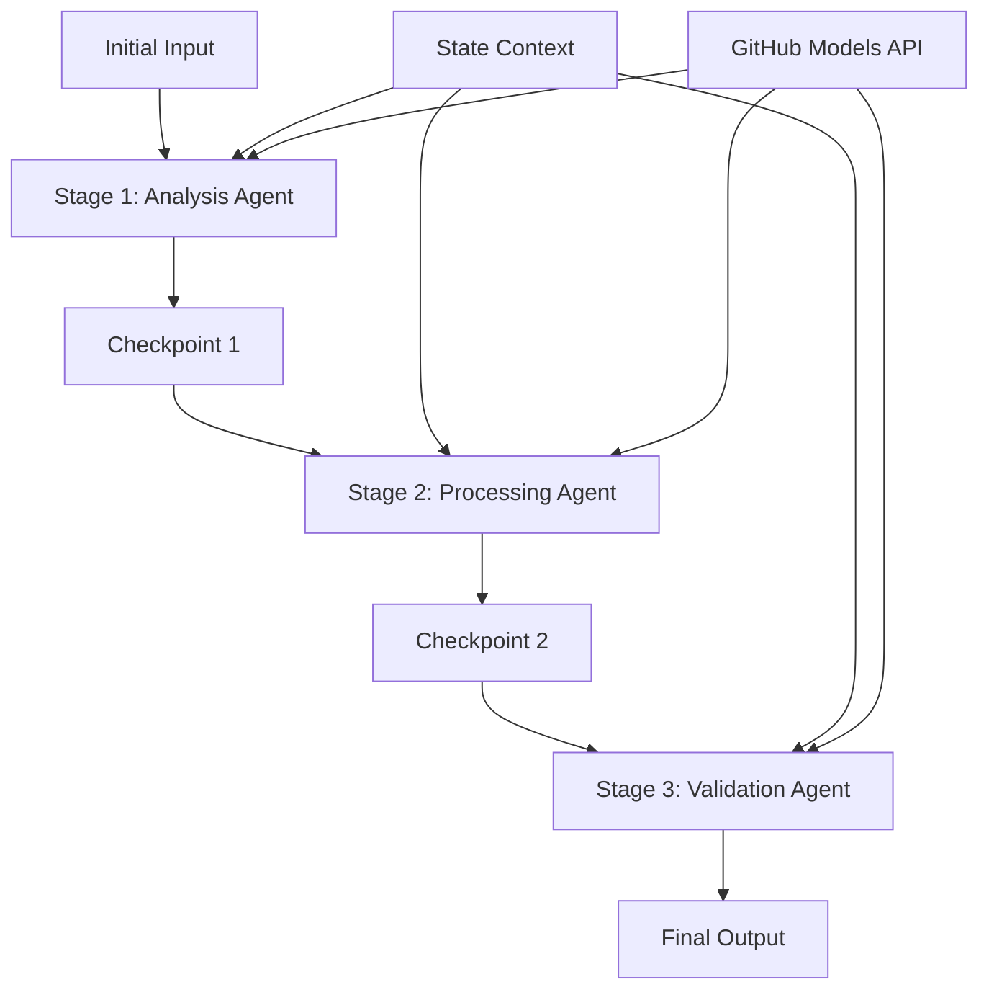

<!--
CO_OP_TRANSLATOR_METADATA:
{
  "original_hash": "1be9c8dcbd79a02d33d2c138684c1394",
  "translation_date": "2025-11-11T13:43:01+00:00",
  "source_file": "08-multi-agent/code_samples/workflows-agent-framework/dotNET/02.dotnet-agent-framework-workflow-ghmodel-sequential.md",
  "language_code": "zh"
}
-->
# ⏩ 使用 GitHub 模型的顺序代理工作流 (.NET)

## 📋 高级顺序处理教程

本教程展示了使用 Microsoft Agent Framework for .NET 和 GitHub 模型的**顺序工作流模式**。您将学习如何构建复杂的逐步处理管道，代理按照特定顺序执行，每个阶段基于前一个阶段的结果进行构建。

## 🎯 学习目标

### 🔄 **顺序处理架构**
- **线性工作流设计**：创建具有明确依赖关系的逐步处理管道
- **状态管理**：在顺序工作流阶段之间保持上下文和数据流
- **GitHub 模型集成**：在多阶段 .NET 工作流中利用 GitHub 的 AI 模型
- **企业管道模式**：构建生产级的顺序处理系统

### 🏗️ **高级顺序模式**
- **阶段门处理**：在工作流阶段之间实现验证检查点
- **上下文保留**：在所有阶段之间保持状态和累积知识
- **错误传播**：在顺序处理链中优雅地处理失败
- **性能优化**：以最小开销实现高效的顺序执行

### 🏢 **企业级顺序应用**
- **文档处理管道**：多阶段文档分析、转换和验证
- **质量保证工作流**：顺序审查、验证和审批流程
- **内容生产管道**：研究 → 写作 → 编辑 → 审核 → 发布
- **业务流程自动化**：具有明确阶段依赖关系的多步骤业务工作流

## ⚙️ 前提条件与设置

### 📦 **必需的 NuGet 包**

用于 .NET 顺序工作流的必要包：

```xml
<!-- Core AI Framework -->
<PackageReference Include="Microsoft.Extensions.AI" Version="9.9.0" />

<!-- Client Model Abstractions -->
<PackageReference Include="System.ClientModel" Version="1.6.1.0" />

<!-- Azure Identity and Async LINQ Support -->
<PackageReference Include="Azure.Identity" Version="1.15.0" />
<PackageReference Include="System.Linq.Async" Version="6.0.3" />

<!-- Local Agent Framework References -->
<!-- Microsoft.Agents.AI.dll - Core agent abstractions -->
<!-- Microsoft.Agents.AI.OpenAI.dll - GitHub Models integration -->
```

### 🔑 **GitHub 模型配置**

**环境设置 (.env 文件)：**
```env
GITHUB_TOKEN=your_github_personal_access_token
GITHUB_ENDPOINT=https://models.inference.ai.azure.com
GITHUB_MODEL_ID=gpt-4o-mini
```

**配置管理：**
```csharp
// Load environment variables securely
Env.Load("../../../.env");
var githubToken = Environment.GetEnvironmentVariable("GITHUB_TOKEN");
var githubEndpoint = Environment.GetEnvironmentVariable("GITHUB_ENDPOINT");
var modelId = Environment.GetEnvironmentVariable("GITHUB_MODEL_ID");
```

### 🏗️ **顺序工作流架构**



**关键组件：**
- **顺序代理**：每个处理阶段的专用代理
- **状态上下文**：在阶段之间保持累积数据和决策
- **检查点**：阶段之间的验证点，确保质量和一致性
- **GitHub 模型客户端**：在所有工作流阶段中提供一致的 AI 模型访问

## 🎨 **顺序工作流设计模式**

### 📝 **文档处理管道**
```
Raw Document → Content Extraction → Analysis → Validation → Structured Output
```

### 🎯 **内容创建工作流**
```
Brief/Requirements → Research → Content Creation → Review → Final Polish
```

### 🔍 **质量保证管道**
```
Initial Review → Technical Validation → Compliance Check → Final Approval
```

### 💼 **商业智能工作流**
```
Data Collection → Processing → Analysis → Report Generation → Distribution
```

## 🏢 **企业级顺序处理的优势**

### 🎯 **可靠性与质量**
- **确定性处理**：通过结构化阶段实现一致、可重复的结果
- **质量门**：验证检查点确保每个阶段的质量
- **错误隔离**：一个阶段的问题不会传播到后续阶段
- **审计追踪**：完整跟踪每个阶段的决策和转换

### 📈 **可扩展性与性能**
- **模块化设计**：每个阶段都可以独立优化
- **资源管理**：在各阶段之间高效分配 AI 模型资源
- **状态优化**：阶段之间的最小状态传输以实现最佳性能
- **并行阶段组**：多个顺序工作流可以并行运行

### 🔒 **安全性与合规性**
- **阶段级安全性**：不同处理阶段的不同安全策略
- **数据验证**：在每个检查点确保数据完整性和合规性
- **访问控制**：不同工作流阶段的细粒度权限
- **法规合规性**：通过结构化处理满足法规要求

### 📊 **监控与分析**
- **阶段级指标**：每个工作流阶段的性能监控
- **瓶颈识别**：识别并优化慢速阶段
- **质量指标**：跟踪每个阶段的质量和成功率
- **流程优化**：基于阶段级分析的持续改进

让我们构建强大的顺序 AI 处理管道吧！🚀

## 💻 运行代码

完整实现可在 `02.dotnet-agent-framework-workflow-ghmodel-sequential.cs` 文件中找到。该文件展示了一个**三阶段家具分析工作流**：

1. **阶段 1 - 销售代理**：分析家具图片并提供购买建议
2. **阶段 2 - 价格代理**：提供详细的价格分解和预算选项
3. **阶段 3 - 报价代理**：生成 Markdown 格式的专业报价文档

### 🏗️ **工作流架构**

```
Image Input → Sales Analysis → Price Estimation → Quote Generation → Final Output
```

每个代理：
- 接收前一个阶段的输出作为上下文
- 基于之前的分析进行专业化扩展
- 通过状态管理保持工作流连续性

### 🚀 运行示例

**前提条件：**
- 将家具图片放置在 `../imgs/home.png`（或更新 `imgPath` 变量）
- 使用 GitHub 模型凭据配置您的 `.env` 文件

```bash
# Make the script executable (Unix/Linux/macOS)
chmod +x 02.dotnet-agent-framework-workflow-ghmodel-sequential.cs

# Run the sequential workflow
./02.dotnet-agent-framework-workflow-ghmodel-sequential.cs
```

或在 Windows 上：
```powershell
dotnet run 02.dotnet-agent-framework-workflow-ghmodel-sequential.cs
```

### 📝 预期输出

工作流将：
1. **销售代理**：从图片中识别家具项目并提供推荐
2. **价格代理**：添加详细的价格分析，包括预算层级和购物建议
3. **报价代理**：生成包含所有信息的综合专业家具报价文档

最终输出将是基于图片分析的全面专业家具报价。

### 🔧 自定义选项

**修改代理行为：**
```csharp
// Adjust agent instructions to change their focus
const string SalesAgentInstructions = "Your custom instructions...";
```

**更改顺序流程：**
```csharp
// Add or reorder workflow stages
var workflow = new WorkflowBuilder(salesagent)
    .AddEdge(salesagent, priceagent)
    .AddEdge(priceagent, quoteagent)
    .AddEdge(quoteagent, newAgent)  // Add another stage
    .Build();
```

**使用不同输入：**
```csharp
// Process text instead of images
ChatMessage userMessage = new ChatMessage(ChatRole.User, [
    new TextContent("Analyze pricing for a modern living room set")
]);
```

### 🎯 实际应用

这种顺序模式非常适合：
- **电子商务**：产品分析 → 定价 → 报价生成
- **房地产**：物业分析 → 估值 → 列表创建
- **保险**：索赔分析 → 评估 → 报价生成
- **内容创建**：研究 → 写作 → 编辑 → 发布

### 🔍 理解状态流

顺序中的每个代理接收：
- **原始输入**：初始用户消息（图片 + 文本）
- **前一个代理的输出**：对话历史中所有前一个代理的响应
- **累积上下文**：在整个工作流中保持的完整状态

这使得复杂的多阶段处理成为可能，每个代理基于所有前一个阶段的综合上下文进行构建。

---

<!-- CO-OP TRANSLATOR DISCLAIMER START -->
**免责声明**：  
本文档使用AI翻译服务[Co-op Translator](https://github.com/Azure/co-op-translator)进行翻译。尽管我们努力确保翻译的准确性，但请注意，自动翻译可能包含错误或不准确之处。原始语言的文档应被视为权威来源。对于重要信息，建议使用专业人工翻译。我们不对因使用此翻译而产生的任何误解或误读承担责任。
<!-- CO-OP TRANSLATOR DISCLAIMER END -->