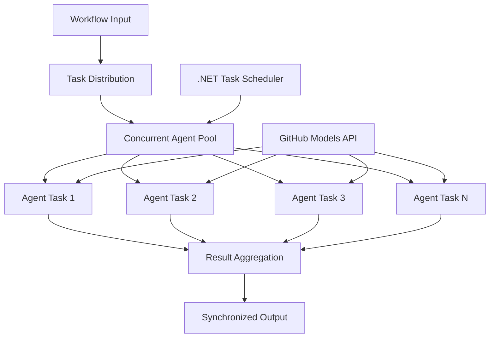

<!--
CO_OP_TRANSLATOR_METADATA:
{
  "original_hash": "b9c6e32c9b5f2fed20b6916984440d88",
  "translation_date": "2025-11-11T13:08:51+00:00",
  "source_file": "08-multi-agent/code_samples/workflows-agent-framework/dotNET/03.dotnet-agent-framework-workflow-ghmodel-concurrent.md",
  "language_code": "zh"
}
-->
# ⚡ 使用 GitHub 模型实现并发代理工作流 (.NET)

## 📋 高性能并行处理教程

本教程展示了使用 Microsoft Agent Framework for .NET 和 GitHub 模型的**并发工作流模式**。您将学习如何构建高性能的并行处理工作流，通过同时执行多个 AI 代理来最大化吞吐量，同时保持协调和数据一致性。

## 🎯 学习目标

### 🚀 **并发处理基础**
- **并行代理执行**：同时运行多个 AI 代理以实现最大性能
- **异步/等待模式**：利用 .NET 的异步编程模型实现高效并发
- **GitHub 模型集成**：协调对 GitHub AI 模型推理服务的多个并发调用
- **资源管理**：在并发操作中高效管理 AI 模型资源

### 🏗️ **高级并发架构**
- **基于任务的并行**：使用 .NET 任务并行库实现最佳并发执行
- **同步模式**：协调并发代理，避免竞争条件
- **负载均衡**：高效分配工作至可用的并发处理能力
- **容错性**：处理单个代理故障而不停止整个工作流

### 🏢 **企业级并发应用**
- **高容量文档处理**：同时处理多个文档
- **实时内容分析**：并发分析传入的数据流
- **批处理优化**：最大化大规模数据处理操作的吞吐量
- **多模态分析**：并行处理不同类型和格式的内容

## ⚙️ 前置条件与设置

### 📦 **所需 NuGet 包**

高性能并发工作流的必要包：

```xml
<!-- Core AI Framework with Async Support -->
<PackageReference Include="Microsoft.Extensions.AI" Version="9.9.0" />

<!-- Client Model Abstractions for API Communication -->
<PackageReference Include="System.ClientModel" Version="1.6.1.0" />

<!-- Azure Identity and Async LINQ for Advanced Operations -->
<PackageReference Include="Azure.Identity" Version="1.15.0" />
<PackageReference Include="System.Linq.Async" Version="6.0.3" />

<!-- Local Agent Framework References -->
<!-- Microsoft.Agents.AI.dll - Core agent abstractions with async support -->
<!-- Microsoft.Agents.AI.OpenAI.dll - GitHub Models integration with concurrency -->
```

### 🔑 **GitHub 模型配置**

**环境设置 (.env 文件)：**
```env
GITHUB_TOKEN=your_github_personal_access_token
GITHUB_ENDPOINT=https://models.inference.ai.azure.com
GITHUB_MODEL_ID=gpt-4o-mini
```

**并发处理注意事项：**
```csharp
// Configure for concurrent operations
var clientOptions = new OpenAIClientOptions()
{
    Endpoint = new Uri(githubEndpoint),
    // Configure connection pooling for concurrent requests
    NetworkTimeout = TimeSpan.FromMinutes(5)
};
```

### 🏗️ **并发工作流架构**



**关键组件：**
- **任务并行库**：.NET 内置的并发操作支持
- **代理池**：多个代理实例用于并行处理
- **结果聚合**：协调并合并并发代理的结果
- **同步点**：确保并发操作中的数据一致性

## 🎨 **并发工作流设计模式**

### 🔍 **并行研究与分析**
```
Research Topic → Concurrent Research Agents → Result Synthesis → Final Report
```

### 📊 **多源数据处理**
```
Data Sources → Parallel Processing Agents → Data Integration → Unified Output
```

### 🎭 **内容生成管道**
```
Content Requirements → Concurrent Content Generators → Quality Review → Final Content
```

### 🔄 **扇出/扇入处理**
```
Single Input → Multiple Concurrent Processors → Result Aggregation → Single Output
```

## 🏢 **企业性能优势**

### ⚡ **吞吐量与可扩展性**
- **线性性能扩展**：增加更多并发代理以提高吞吐量
- **资源利用率**：最大化可用 AI 模型容量的效率
- **减少处理时间**：通过并行执行显著缩短时间
- **弹性扩展**：根据工作负载动态调整并发代理数量

### 🛡️ **可靠性与弹性**
- **故障隔离**：单个代理故障不会影响其他并发操作
- **优雅降级**：系统在代理容量减少的情况下继续运行
- **错误恢复**：对失败的并发操作自动重试机制
- **负载分配**：均匀分配工作至可用代理

### 📊 **性能监控**
- **并发执行指标**：跟踪所有并行操作的性能
- **资源使用分析**：监控 CPU、内存和网络利用率
- **吞吐量分析**：衡量并发处理带来的效率提升
- **瓶颈检测**：识别并解决性能限制

### 🔧 **开发与运维**
- **异步编程模型**：利用 .NET 成熟的 async/await 模式
- **任务协调**：内置任务管理和协调能力
- **异常处理**：全面的并发操作错误处理
- **调试支持**：Visual Studio 提供的并发工作流调试工具

让我们用 .NET 构建高性能并发 AI 工作流吧！🚀

## 💻 运行代码

完整实现可在 `03.dotnet-agent-framework-workflow-ghmodel-concurrent.cs` 文件中找到。该文件展示了一个用于旅行规划的**扇出/扇入并发工作流**：

### 🏗️ **工作流架构**

```
User Request → ConcurrentStartExecutor → [Researcher Agent || Planner Agent] → ConcurrentAggregationExecutor → Final Output
```

**关键组件：**

1. **ConcurrentStartExecutor**：同时将用户请求广播至所有代理
2. **Researcher Agent**：并发分析目的地和景点
3. **Planner Agent**：并发创建详细的旅行计划
4. **ConcurrentAggregationExecutor**：收集并合并两个代理的结果

### 🎯 **扇出/扇入模式**

此工作流展示了经典的**扇出/扇入**模式：
- **扇出**：一个输入消息同时广播至多个代理
- **并发处理**：多个代理并行处理同一任务
- **扇入**：收集所有代理的结果并聚合为单一输出

### 🚀 运行示例

```bash
# Make the script executable (Unix/Linux/macOS)
chmod +x 03.dotnet-agent-framework-workflow-ghmodel-concurrent.cs

# Run the concurrent workflow
./03.dotnet-agent-framework-workflow-ghmodel-concurrent.cs
```

或在 Windows 上运行：
```powershell
dotnet run 03.dotnet-agent-framework-workflow-ghmodel-concurrent.cs
```

### 📝 预期输出

工作流将：
1. **广播请求**：将“计划一次十二月去西雅图的旅行”发送至两个代理
2. **并发处理**：两个代理同时工作：
   - Researcher 识别景点和详细信息
   - Planner 创建行程和后勤安排
3. **聚合**：将两个响应合并为综合输出
4. **显示结果**：展示包含所有信息的合并旅行计划

### 🔧 自定义选项

**添加更多并发代理：**
```csharp
// Create additional specialized agents
AIAgent budgetAgent = openAIClient.GetChatClient(github_model_id).CreateAIAgent(
    name: "Budget-Agent", instructions: "Calculate travel costs...");

// Add to fan-out
var workflow = new WorkflowBuilder(startExecutor)
    .AddFanOutEdge(startExecutor, targets: [researcherAgent, plannerAgent, budgetAgent])
    .AddFanInEdge(aggregationExecutor, sources: [researcherAgent, plannerAgent, budgetAgent])
    .WithOutputFrom(aggregationExecutor)
    .Build();

// Update aggregation count
if (this._messages.Count == 3) { ... }
```

**修改代理指令：**
```csharp
const string ResearcherAgentInstructions = "Your custom instructions for research...";
const string PlanAgentInstructions = "Your custom instructions for planning...";
```

**更改任务：**
```csharp
StreamingRun run = await InProcessExecution.StreamAsync(
    workflow, 
    "Plan a European vacation for 2 weeks in summer"
);
```

### 🎯 实际应用

此并发模式非常适合：
- **内容创作**：多个作者同时创作不同部分
- **代码审查**：多个审查员从不同角度分析代码
- **市场研究**：并行分析不同市场细分
- **文档处理**：并发提取、分析和验证
- **多视角分析**：对同一输入获取多样化观点

### 🔍 了解自定义执行器

**ConcurrentStartExecutor：**
- 实现 `IMessageHandler<string>` 接受字符串输入
- 将消息广播至所有连接的代理
- 发送 `TurnToken` 触发并发处理

**ConcurrentAggregationExecutor：**
- 实现 `IMessageHandler<ChatMessage>` 接收代理响应
- 以线程安全的方式收集消息
- 在所有预期响应到达时进行聚合
- 使用 `context.YieldOutputAsync()` 生成最终输出

### ⚡ 性能优势

**并发 vs 顺序：**
- 顺序：Agent1 (30秒) → Agent2 (30秒) = **总计 60 秒**
- 并发：Agent1 (30秒) || Agent2 (30秒) = **总计 30 秒**

**吞吐量提升**：对于 N 个并发代理，性能最多可提升 N 倍（取决于工作负载和资源）

### 🛡️ 错误处理

工作流能够优雅地处理单个代理故障：
- 如果一个代理失败，其他代理继续处理
- 聚合器可以实现超时逻辑
- 如果需要，可以返回部分结果

### 📊 高级功能

**动态代理数量：**
修改聚合逻辑以支持可变代理数量：

```csharp
private int _expectedAgentCount;
private readonly List<ChatMessage> _messages = [];

public async ValueTask HandleAsync(ChatMessage message, IWorkflowContext context)
{
    this._messages.Add(message);
    if (this._messages.Count == _expectedAgentCount)
    {
        // Process aggregation
    }
}
```

这种并发工作流模式是构建高性能、可扩展 AI 代理系统的关键！

---

<!-- CO-OP TRANSLATOR DISCLAIMER START -->
**免责声明**：  
本文档使用AI翻译服务[Co-op Translator](https://github.com/Azure/co-op-translator)进行翻译。尽管我们努力确保翻译的准确性，但请注意，自动翻译可能包含错误或不准确之处。原始语言的文档应被视为权威来源。对于重要信息，建议使用专业人工翻译。我们对因使用此翻译而产生的任何误解或误读不承担责任。
<!-- CO-OP TRANSLATOR DISCLAIMER END -->