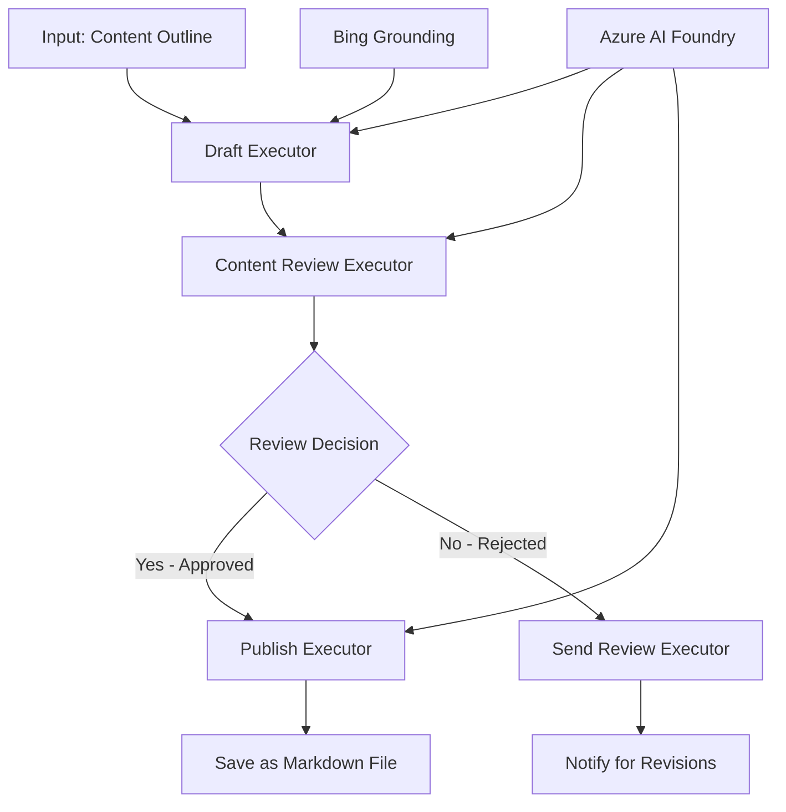

<!--
CO_OP_TRANSLATOR_METADATA:
{
  "original_hash": "8abd335151cee553293b637ee3d80d10",
  "translation_date": "2025-11-11T12:04:37+00:00",
  "source_file": "08-multi-agent/code_samples/workflows-agent-framework/dotNET/04.dotnet-agent-framework-workflow-aifoundry-condition.md",
  "language_code": "zh"
}
-->
# 🔀 使用 Azure AI Foundry (.NET) 的条件代理工作流

## 📋 智能决策型工作流教程

本笔记本展示了使用 Azure AI Foundry 和 Microsoft Agent Framework for .NET 的**条件工作流模式**。您将学习如何构建复杂的、基于决策的工作流，通过 AI 分析、业务规则和动态条件智能地进行处理路由，实现企业级自动化。

## 🎯 学习目标

### 🧠 **智能决策架构**
- **条件逻辑实现**：构建具有多个分支点的复杂决策树
- **AI 驱动的路由**：使用 Azure AI Foundry 模型进行智能路由决策
- **动态工作流适应**：根据运行时分析和条件修改工作流行为
- **企业规则集成**：将业务逻辑和合规要求整合到工作流中

### 🔀 **高级条件模式**
- **多标准决策**：根据多个因素评估路由决策
- **上下文感知处理**：基于累积的工作流上下文和历史进行决策
- **自适应工作流修改**：根据实时条件动态调整处理路径
- **规则引擎集成**：在工作流中实现复杂的业务规则引擎

### 🏢 **企业条件应用**
- **文档分类与路由**：自动分类并将文档路由到适当的工作流
- **客户服务分流**：智能路由客户咨询到专业处理团队
- **合规与风险处理**：根据风险评估应用不同的验证和审查流程
- **质量保证工作流**：根据质量指标将内容路由到适当的审查流程

## ⚙️ 前提条件与设置

### 📦 **所需 NuGet 包**

用于条件工作流处理的高级包：

```xml
<!-- Core AI Framework -->
<PackageReference Include="Microsoft.Extensions.AI" Version="9.9.0" />

<!-- Azure AI Agents with Persistent State -->
<PackageReference Include="Azure.AI.Agents.Persistent" Version="1.2.0-beta.5" />

<!-- Azure Identity and Utilities -->
<PackageReference Include="Azure.Identity" Version="1.15.0" />
<PackageReference Include="System.Linq.Async" Version="6.0.3" />
<PackageReference Include="DotNetEnv" Version="3.1.1" />

<!-- Local Workflow Framework References -->
<!-- Microsoft.Agents.Workflows.dll - Advanced workflow orchestration -->
<!-- Microsoft.Agents.AI.AzureAI.dll - Azure AI Foundry integration -->
<!-- Microsoft.Agents.AI.dll - Core agent abstractions -->
```

### 🔑 **Azure AI Foundry 配置**

**所需 Azure 资源：**
- 配备条件处理模型的 Azure AI Foundry 工作区
- 具有适当计算配额和权限的 Azure 订阅
- 部署用于决策和内容分析的 AI 模型
- （可选）用于信息获取的 Bing Search API 连接

**环境配置 (.env 文件)：**
```env
# Azure AI Foundry Configuration
AZURE_AI_PROJECT_ENDPOINT=https://your-project.cognitiveservices.azure.com/
BING_CONNECTION_ID=your-bing-connection-id
```

**认证设置：**
```csharp
// Azure CLI or Managed Identity authentication
using Azure.Identity;
var credential = new AzureCliCredential();

// Load environment configuration
DotNetEnv.Env.Load("../../../.env");
```

### 🏗️ **条件工作流架构**



**关键组件：**
- **Draft Executor**：从大纲创建初始内容草稿的 AI 代理
- **Content Review Executor**：评估草稿质量和合规性的 AI 代理
- **Conditional Routing**：基于审查结果进行路由的决策逻辑
- **发布/审查路径**：针对批准和拒绝内容的单独处理路径
- **状态管理**：在整个工作流中维护内容和审查上下文

## 🎨 **条件工作流设计模式**

### 📋 **带质量门的内容生产**
```
Outline → Draft Creation → Quality Review → {Approve: Publish | Reject: Revise}
```

### 🎯 **基于风险的文档处理**
```
Document → Risk Assessment → {Low: Standard | High: Enhanced Review}
```

### 🔍 **智能客户服务路由**
```
Customer Query → Analysis → {Simple: FAQ Bot | Complex: Human Agent}
```

### 💼 **合规驱动的工作流**
```
Content → Compliance Check → {Pass: Publish | Fail: Legal Review}
```

## 🏢 **企业条件优势**

### 🎯 **智能自动化**
- **智能决策**：基于内容分析和上下文的 AI 驱动路由决策
- **自适应处理**：工作流根据变化的条件自动调整
- **业务规则执行**：自动应用复杂的业务逻辑和政策
- **上下文感知路由**：基于完整的工作流历史和累积上下文进行决策

### 📈 **运营卓越**
- **优化资源分配**：将工作路由到最适合的专家和流程
- **减少人工干预**：自动决策减少人工路由需求
- **加快解决时间**：直接路由到适当的专业知识和处理能力
- **一致性应用**：统一应用业务规则和决策标准

### 🛡️ **风险管理与合规**
- **自动风险评估**：AI 驱动的内容和情境风险级别评估
- **合规执行**：自动通过所需的监管流程进行路由
- **安全协议应用**：根据风险评估应用增强的安全措施
- **审计追踪维护**：完整记录路由决策及其理由

### 📊 **分析与持续改进**
- **决策分析**：跟踪路由决策的有效性和准确性
- **模式识别**：识别路由决策随时间变化的趋势和模式
- **性能优化**：持续改进决策标准和路由效率
- **商业智能**：深入了解内容特性和处理需求

### 🔧 **技术卓越**
- **持久状态管理**：在工作流执行过程中维护复杂状态
- **可扩展架构**：处理高容量条件处理需求
- **集成能力**：与现有业务系统和流程无缝集成
- **监控与可观察性**：全面跟踪工作流性能和决策

让我们用 .NET 构建智能、决策驱动的企业工作流吧！🚀

## 💻 运行代码

完整实现可在 `04.dotnet-agent-framework-workflow-aifoundry-condition.cs` 中找到。这展示了一个**带质量门的内容生产工作流**：

### 🏗️ **工作流架构**

```
Content Outline → Draft Creation → Quality Review → Conditional Routing:
                                                      ├─ Approved (>200 words) → Publish
                                                      └─ Rejected (<200 words) → Review Notification
```

**工作流中的代理：**
1. **Evangelist Agent**：使用 Bing 信息创建教程草稿
2. **Content Reviewer Agent**：评估草稿质量（字数、完整性）
3. **Publisher Agent**：将批准的内容保存为带时间戳的 Markdown 文件

**自定义执行器：**
1. **DraftExecutor**：协调草稿创建
2. **ContentReviewExecutor**：进行质量评估
3. **PublishExecutor**：处理批准内容的发布
4. **SendReviewExecutor**：管理拒绝内容的通知

### 🚀 运行示例

**前提条件：**
- 配置好的 Azure AI Foundry 工作区
- Azure CLI 认证 (`az login`)
- （可选）用于信息获取的 Bing Search 连接

```bash
# Make the script executable (Unix/Linux/macOS)
chmod +x 04.dotnet-agent-framework-workflow-aifoundry-condition.cs

# Run the conditional workflow
./04.dotnet-agent-framework-workflow-aifoundry-condition.cs
```

或在 Windows 上运行：
```powershell
dotnet run 04.dotnet-agent-framework-workflow-aifoundry-condition.cs
```

### 📝 预期输出

工作流将：
1. **创建代理**：初始化三个专门的 Azure AI Foundry 代理
2. **生成草稿**：Evangelist 代理根据大纲创建教程草稿
3. **审查内容**：Content Reviewer 评估草稿质量
4. **条件路由**：
   - **如果批准（>200 字）**：PublishExecutor 保存为 Markdown 文件
   - **如果拒绝（<200 字）**：发送审查通知
5. **显示结果**：展示最终工作流结果

### 🔧 自定义选项

**修改审查标准：**
```csharp
const string ContentReviewerInstructions = @"
You are a content reviewer...
1. Check if content is more than 500 words (instead of 200)
2. Verify technical accuracy
3. Ensure proper formatting
...";
```

**添加更多条件路径：**
```csharp
var workflow = new WorkflowBuilder(draftExecutor)
    .AddEdge(draftExecutor, contentReviewerExecutor)
    .AddEdge(contentReviewerExecutor, publishExecutor, condition: GetCondition("Excellent"))
    .AddEdge(contentReviewerExecutor, editExecutor, condition: GetCondition("Good"))
    .AddEdge(contentReviewerExecutor, sendReviewerExecutor, condition: GetCondition("Poor"))
    .Build();
```

**更改内容要求：**
```csharp
string OUTLINE_Content = @"
# Your Custom Topic
## Section 1
https://your-reference-url
## Section 2
...
";
```

### 🎯 实际应用

此条件工作流模式非常适合：
- **内容管理系统**：带质量门的自动化编辑工作流
- **文档处理**：根据分类和合规性路由文档
- **客户支持**：根据复杂性和紧急程度智能分流工单
- **法律审查**：根据风险评估和价值路由合同
- **人力资源流程**：通过适当的筛选工作流路由申请

### 🔍 理解条件逻辑

**条件函数：**
```csharp
public Func<object?, bool> GetCondition(string expectedResult) =>
    reviewResult => reviewResult is ReviewResult review && review.Result == expectedResult;
```

此函数创建一个谓词：
1. 检查结果是否为 `ReviewResult` 类型
2. 将 `Result` 属性与预期值进行比较
3. 返回 true/false 以确定路由

**带条件的工作流边：**
```csharp
.AddEdge(contentReviewerExecutor, publishExecutor, condition: GetCondition("Yes"))
.AddEdge(contentReviewerExecutor, sendReviewerExecutor, condition: GetCondition("No"))
```

### 📊 高级功能

**JSON Schema 验证：**
工作流使用 JSON schema 确保结构化响应：

```csharp
// Define response structure
public class ReviewResult
{
    [JsonPropertyName("review_result")]
    public string Result { get; set; } = string.Empty;
    
    [JsonPropertyName("reason")]
    public string Reason { get; set; } = string.Empty;
    
    [JsonPropertyName("draft_content")]
    public string DraftContent { get; set; } = string.Empty;
}

// Apply to agent
ResponseFormat = ChatResponseFormat.ForJsonSchema(
    AIJsonUtilities.CreateJsonSchema(typeof(ReviewResult)), 
    "ReviewResult", 
    "Review Result From DraftContent"
)
```

**Bing 信息集成：**
Evangelist 代理使用 Bing 信息访问实时信息：

```csharp
var bingGroundingConfig = new BingGroundingSearchConfiguration(bing_conn_id);
BingGroundingToolDefinition bingGroundingTool = new(
    new BingGroundingSearchToolParameters([bingGroundingConfig])
);
```

这使代理能够跟随大纲中的 URL 并提取当前信息。

### 🛡️ 错误处理

工作流包括针对拒绝内容的强大错误处理：
- 审查失败触发备用路径
- 通知提供明确的拒绝原因
- 内容被保留以供修订

### 🔄 扩展工作流

**添加修订循环：**
创建一个反馈循环，自动重新起草内容：

```csharp
.AddEdge(contentReviewerExecutor, publishExecutor, condition: GetCondition("Yes"))
.AddEdge(contentReviewerExecutor, draftExecutor, condition: GetCondition("No")) // Loop back
```

**实现多级审查：**
添加具有不同标准的多个审查阶段：

```csharp
.AddEdge(draftExecutor, technicalReviewer)
.AddEdge(technicalReviewer, editorialReviewer, condition: GetCondition("TechPass"))
.AddEdge(editorialReviewer, publishExecutor, condition: GetCondition("EditPass"))
```

此条件工作流模式为构建复杂、智能的企业自动化系统提供了基础！🚀

---

<!-- CO-OP TRANSLATOR DISCLAIMER START -->
**免责声明**：  
本文档使用AI翻译服务[Co-op Translator](https://github.com/Azure/co-op-translator)进行翻译。尽管我们努力确保翻译的准确性，但请注意，自动翻译可能包含错误或不准确之处。原始语言的文档应被视为权威来源。对于重要信息，建议使用专业人工翻译。我们不对因使用此翻译而产生的任何误解或误读承担责任。
<!-- CO-OP TRANSLATOR DISCLAIMER END -->