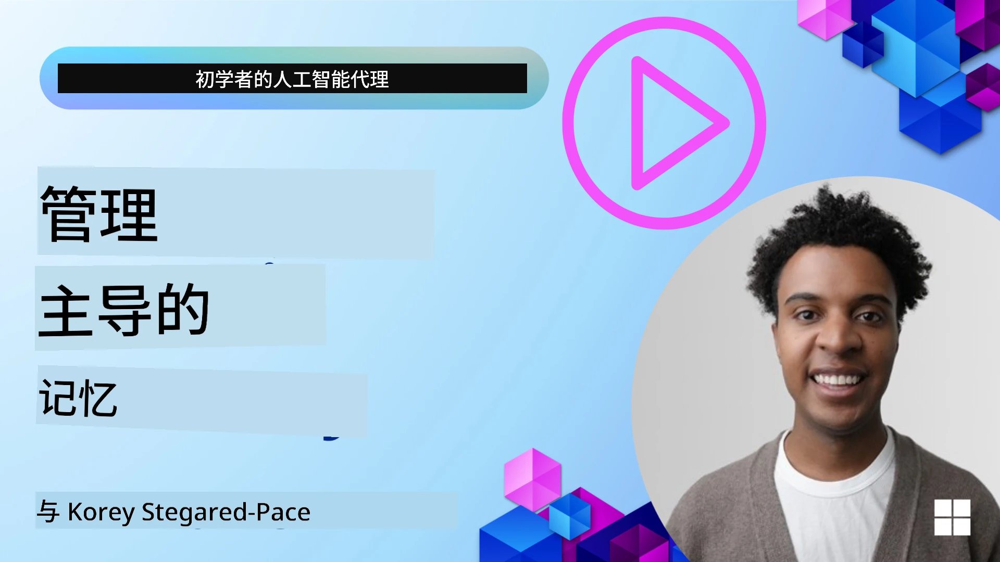

<!--
CO_OP_TRANSLATOR_METADATA:
{
  "original_hash": "a1d90991499ad697c4ad24decaf36968",
  "translation_date": "2025-12-09T11:54:16+00:00",
  "source_file": "13-agent-memory/README.md",
  "language_code": "zh"
}
-->
# AI代理的记忆

在讨论创建AI代理的独特优势时，主要涉及两个方面：调用工具完成任务的能力以及随着时间推移不断改进的能力。记忆是创建能够自我改进的代理的基础，这些代理可以为用户提供更好的体验。

在本课中，我们将探讨AI代理的记忆是什么，以及如何管理和利用它来提升应用程序的效果。

## 介绍

本课将涵盖以下内容：

• **理解AI代理的记忆**：什么是记忆以及为什么它对代理至关重要。

• **实现和存储记忆**：为AI代理添加记忆功能的实用方法，重点关注短期记忆和长期记忆。

• **让AI代理自我改进**：记忆如何使代理能够从过去的交互中学习并随着时间推移不断优化。

## 可用实现

本课包括两个全面的笔记本教程：

• **[13-agent-memory.ipynb](./13-agent-memory.ipynb)**：使用Mem0和Azure AI Search结合Semantic Kernel框架实现记忆功能。

• **[13-agent-memory-cognee.ipynb](./13-agent-memory-cognee.ipynb)**：使用Cognee实现结构化记忆，自动构建基于嵌入的知识图谱，进行图谱可视化和智能检索。

## 学习目标

完成本课后，您将能够：

• **区分AI代理记忆的不同类型**，包括工作记忆、短期记忆和长期记忆，以及诸如角色记忆和情节记忆等特殊形式。

• **使用Semantic Kernel框架实现和管理AI代理的短期和长期记忆**，利用Mem0、Cognee、白板记忆等工具，并与Azure AI Search集成。

• **理解自我改进AI代理的原理**，以及强大的记忆管理系统如何促进持续学习和适应。

## 理解AI代理的记忆

从本质上讲，**AI代理的记忆指的是使其能够保留和回忆信息的机制**。这些信息可以是关于对话的具体细节、用户偏好、过去的行为，甚至是学习到的模式。

没有记忆的AI应用通常是无状态的，这意味着每次交互都从头开始。这会导致重复且令人沮丧的用户体验，因为代理会“忘记”之前的上下文或偏好。

### 为什么记忆很重要？

代理的智能与其回忆和利用过去信息的能力密切相关。记忆使代理能够：

• **反思**：从过去的行为和结果中学习。

• **互动**：在持续对话中保持上下文。

• **主动和反应**：根据历史数据预测需求或做出适当回应。

• **自主**：通过调用存储的知识更独立地运行。

实现记忆的目标是使代理更加**可靠和有能力**。

### 记忆的类型

#### 工作记忆

可以将其视为代理在单个任务或思考过程中使用的一张便签纸。它保存完成下一步所需的即时信息。

对于AI代理，工作记忆通常捕捉对话中最相关的信息，即使完整的聊天记录很长或被截断。它专注于提取关键元素，如需求、提议、决策和行动。

**工作记忆示例**

在一个旅行预订代理中，工作记忆可能会捕捉用户当前的请求，例如“我想预订去巴黎的旅行”。这一具体需求会保存在代理的即时上下文中，以指导当前的交互。

#### 短期记忆

这种记忆在单次对话或会话期间保留信息。它是当前聊天的上下文，使代理能够回顾对话中的前几轮内容。

**短期记忆示例**

如果用户问“飞往巴黎的航班多少钱？”然后接着问“那里的住宿怎么样？”，短期记忆确保代理知道“那里”指的是“巴黎”，并且是在同一对话中。

#### 长期记忆

这种记忆在多个对话或会话中持续存在。它使代理能够记住用户偏好、历史交互或长期的通用知识。这对于个性化非常重要。

**长期记忆示例**

长期记忆可能存储“Ben喜欢滑雪和户外活动，喜欢带有山景的咖啡，并希望避免高级滑雪坡道，因为过去受过伤”。这些信息从之前的交互中学习而来，在未来的旅行规划中影响推荐，使其高度个性化。

#### 角色记忆

这种特殊的记忆类型帮助代理发展一致的“个性”或“角色”。它使代理能够记住关于自身或其预定角色的细节，使交互更加流畅和专注。

**角色记忆示例**

如果旅行代理被设计为“滑雪规划专家”，角色记忆可能会强化这一角色，影响其响应以符合专家的语气和知识。

#### 工作流/情节记忆

这种记忆存储代理在复杂任务中采取的步骤，包括成功和失败。它类似于记住特定的“情节”或过去的经验以从中学习。

**情节记忆示例**

如果代理尝试预订特定航班但因不可用而失败，情节记忆可以记录这一失败，使代理在后续尝试中尝试替代航班或更有信息地通知用户问题。

#### 实体记忆

这涉及从对话中提取和记住特定实体（如人物、地点或事物）和事件。它使代理能够构建对讨论的关键元素的结构化理解。

**实体记忆示例**

从关于过去旅行的对话中，代理可能提取“巴黎”、“埃菲尔铁塔”和“在Le Chat Noir餐厅的晚餐”作为实体。在未来的交互中，代理可以回忆起“Le Chat Noir”，并提供在那里预订新餐的建议。

#### 结构化RAG（检索增强生成）

虽然RAG是一种更广泛的技术，“结构化RAG”被强调为一种强大的记忆技术。它从各种来源（对话、电子邮件、图像）中提取密集的结构化信息，并用它来增强响应的精确性、召回率和速度。与仅依赖语义相似性的经典RAG不同，结构化RAG处理信息的固有结构。

**结构化RAG示例**

与仅匹配关键词不同，结构化RAG可以解析电子邮件中的航班详情（目的地、日期、时间、航空公司）并以结构化方式存储。这使得可以进行精确查询，例如“我周二预订的飞往巴黎的航班是什么？”

## 实现和存储记忆

为AI代理实现记忆涉及**记忆管理**的系统化过程，包括生成、存储、检索、整合、更新，甚至“遗忘”（或删除）信息。检索是一个特别关键的方面。

### 专门的记忆工具

#### Mem0

一种存储和管理代理记忆的方法是使用像Mem0这样的专门工具。Mem0作为一个持久记忆层，使代理能够回忆相关交互、存储用户偏好和事实上下文，并随着时间推移从成功和失败中学习。其核心理念是将无状态代理转变为有状态代理。

它通过**两阶段记忆管道：提取和更新**工作。首先，添加到代理线程的消息会发送到Mem0服务，该服务使用大型语言模型（LLM）总结对话历史并提取新记忆。随后，基于LLM的更新阶段决定是否添加、修改或删除这些记忆，并将其存储在混合数据存储中，包括向量、图和键值数据库。该系统还支持各种记忆类型，并可以结合图记忆来管理实体之间的关系。

#### Cognee

另一种强大的方法是使用**Cognee**，一种开源的AI代理语义记忆工具，它将结构化和非结构化数据转化为可查询的知识图谱，并以嵌入为支持。Cognee提供了**双存储架构**，结合向量相似性搜索和图关系，使代理不仅理解信息的相似性，还理解概念之间的关系。

它擅长**混合检索**，将向量相似性、图结构和LLM推理结合起来——从原始块查找到图感知问答。该系统维护**动态记忆**，随着时间推移不断发展和增长，同时作为一个连接的图保持可查询状态，支持短期会话上下文和长期持久记忆。

Cognee笔记本教程（[13-agent-memory-cognee.ipynb](./13-agent-memory-cognee.ipynb)）展示了构建这一统一记忆层的实际例子，包括摄取多样化数据源、可视化知识图谱以及使用不同检索策略进行查询以满足特定代理需求。

### 使用RAG存储记忆

除了像Mem0这样的专门记忆工具，您还可以利用强大的搜索服务，例如**Azure AI Search作为存储和检索记忆的后端**，特别是用于结构化RAG。

这使您能够用自己的数据为代理的响应提供依据，确保更相关和准确的答案。Azure AI Search可以用于存储用户特定的旅行记忆、产品目录或任何其他领域特定知识。

Azure AI Search支持诸如**结构化RAG**的功能，它擅长从大型数据集（如对话历史、电子邮件甚至图像）中提取和检索密集的结构化信息。这相比传统的文本分块和嵌入方法提供了“超人级的精确性和召回率”。

## 让AI代理自我改进

一种常见的自我改进代理模式是引入一个**“知识代理”**。这个独立的代理观察用户与主要代理之间的对话。其角色是：

1. **识别有价值的信息**：确定对话中的任何部分是否值得保存为通用知识或特定用户偏好。

2. **提取和总结**：从对话中提炼出关键的学习或偏好。

3. **存储到知识库**：将提取的信息持久化，通常存储在向量数据库中，以便后续检索。

4. **增强未来查询**：当用户发起新查询时，知识代理检索相关的存储信息并将其附加到用户的提示中，为主要代理提供关键上下文（类似于RAG）。

### 记忆优化

• **延迟管理**：为了避免降低用户交互速度，可以初步使用更便宜、更快的模型快速检查信息是否值得存储或检索，仅在必要时调用更复杂的提取/检索过程。

• **知识库维护**：对于不断增长的知识库，较少使用的信息可以移至“冷存储”以管理成本。

## 关于代理记忆还有疑问？

加入[Azure AI Foundry Discord](https://aka.ms/ai-agents/discord)，与其他学习者交流，参加办公时间并解答您的AI代理问题。

---

<!-- CO-OP TRANSLATOR DISCLAIMER START -->
**免责声明**：  
本文档使用AI翻译服务[Co-op Translator](https://github.com/Azure/co-op-translator)进行翻译。尽管我们努力确保翻译的准确性，但请注意，自动翻译可能包含错误或不准确之处。原始语言的文档应被视为权威来源。对于重要信息，建议使用专业人工翻译。我们对因使用此翻译而产生的任何误解或误读不承担责任。
<!-- CO-OP TRANSLATOR DISCLAIMER END -->