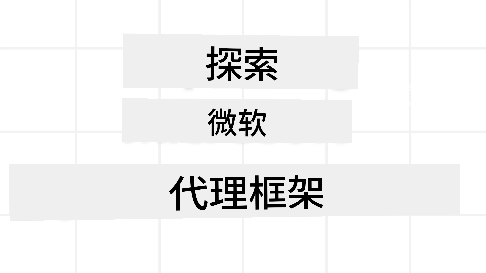
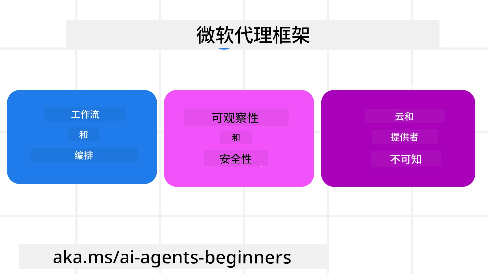
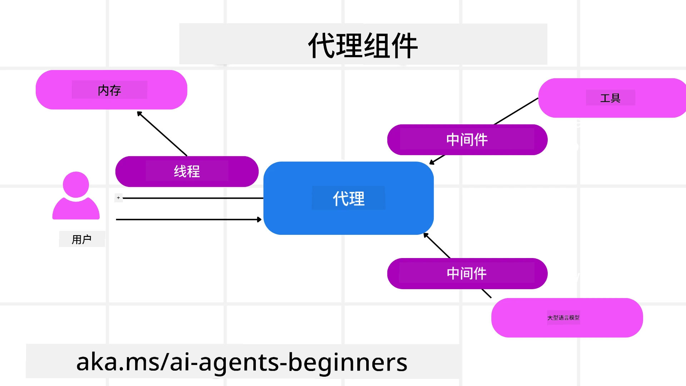

<!--
CO_OP_TRANSLATOR_METADATA:
{
  "original_hash": "19c4dab375acbc733855cc7f2f04edbc",
  "translation_date": "2025-10-01T20:39:42+00:00",
  "source_file": "14-microsoft-agent-framework/README.md",
  "language_code": "zh"
}
-->
# 探索 Microsoft Agent Framework



### 介绍

本课程将涵盖：

- 了解 Microsoft Agent Framework：关键功能和价值  
- 探索 Microsoft Agent Framework 的核心概念
- 比较 MAF 与 Semantic Kernel 和 AutoGen：迁移指南

## 学习目标

完成本课程后，您将能够：

- 使用 Microsoft Agent Framework 构建生产级 AI 代理
- 将 Microsoft Agent Framework 的核心功能应用于您的代理用例
- 迁移并集成现有的代理框架和工具  

## 代码示例

[Microsoft Agent Framework (MAF)](https://aka.ms/ai-agents-beginners/agent-framewrok) 的代码示例可以在此存储库中找到，位于 `xx-python-agent-framework` 和 `xx-dotnet-agent-framework` 文件中。

## 了解 Microsoft Agent Framework



[Microsoft Agent Framework (MAF)](https://aka.ms/ai-agents-beginners/agent-framewrok) 基于 Semantic Kernel 和 AutoGen 的经验和学习成果构建。它提供了灵活性，可以满足生产和研究环境中广泛的代理用例需求，包括：

- **顺序代理编排**，适用于需要逐步工作流程的场景。
- **并发编排**，适用于代理需要同时完成任务的场景。
- **群组聊天编排**，适用于代理协作完成单一任务的场景。
- **任务交接编排**，适用于代理在完成子任务后将任务交接给其他代理的场景。
- **磁性编排**，适用于管理代理创建和修改任务列表并协调子代理完成任务的场景。

为了在生产环境中交付 AI 代理，MAF 还包含以下功能：

- **可观测性**，通过使用 OpenTelemetry 监控 AI 代理的每个动作，包括工具调用、编排步骤、推理流程以及通过 Azure AI Foundry 仪表板进行性能监控。
- **安全性**，通过在 Azure AI Foundry 上原生托管代理，提供安全控制，例如基于角色的访问、私密数据处理和内置内容安全。
- **持久性**，代理线程和工作流程可以暂停、恢复并从错误中恢复，从而支持长时间运行的过程。
- **控制**，支持人类参与的工作流程，任务可以标记为需要人类批准。

Microsoft Agent Framework 还专注于互操作性：

- **云无关性** - 代理可以运行在容器、内部部署以及多个不同的云环境中。
- **提供商无关性** - 代理可以通过您首选的 SDK 创建，包括 Azure OpenAI 和 OpenAI。
- **集成开放标准** - 代理可以利用 Agent-to-Agent (A2A) 和 Model Context Protocol (MCP) 等协议来发现和使用其他代理和工具。
- **插件和连接器** - 可以连接到数据和内存服务，例如 Microsoft Fabric、SharePoint、Pinecone 和 Qdrant。

接下来我们将探讨这些功能如何应用于 Microsoft Agent Framework 的核心概念。

## Microsoft Agent Framework 的核心概念

### 代理



**创建代理**

代理的创建通过定义推理服务（LLM 提供商）、一组 AI 代理需要遵循的指令以及分配的 `name` 来完成：

```python
agent = AzureOpenAIChatClient(credential=AzureCliCredential()).create_agent( instructions="You are good at recommending trips to customers based on their preferences.", name="TripRecommender" )
```

上述代码使用了 `Azure OpenAI`，但代理也可以通过多种服务创建，包括 `Azure AI Foundry Agent Service`：

```python
AzureAIAgentClient(async_credential=credential).create_agent( name="HelperAgent", instructions="You are a helpful assistant." ) as agent
```

OpenAI 的 `Responses` 和 `ChatCompletion` API：

```python
agent = OpenAIResponsesClient().create_agent( name="WeatherBot", instructions="You are a helpful weather assistant.", )
```

```python
agent = OpenAIChatClient().create_agent( name="HelpfulAssistant", instructions="You are a helpful assistant.", )
```

或者使用 A2A 协议的远程代理：

```python
agent = A2AAgent( name=agent_card.name, description=agent_card.description, agent_card=agent_card, url="https://your-a2a-agent-host" )
```

**运行代理**

代理可以通过 `.run` 或 `.run_stream` 方法运行，以获得非流式或流式响应。

```python
result = await agent.run("What are good places to visit in Amsterdam?")
print(result.text)
```

```python
async for update in agent.run_stream("What are the good places to visit in Amsterdam?"):
    if update.text:
        print(update.text, end="", flush=True)

```

每次代理运行还可以自定义参数，例如代理使用的 `max_tokens`、代理可以调用的 `tools`，甚至是代理使用的 `model`。

这在需要特定模型或工具来完成用户任务的情况下非常有用。

**工具**

工具可以在定义代理时指定：

```python
def get_attractions( location: Annotated[str, Field(description="The location to get the top tourist attractions for")], ) -> str: """Get the top tourist attractions for a given location.""" return f"The top attractions for {location} are." 


# When creating a ChatAgent directly 

agent = ChatAgent( chat_client=OpenAIChatClient(), instructions="You are a helpful assistant", tools=[get_attractions]

```

也可以在运行代理时指定：

```python

result1 = await agent.run( "What's the best place to visit in Seattle?", tools=[get_attractions] # Tool provided for this run only )
```

**代理线程**

代理线程用于处理多轮对话。线程可以通过以下方式创建：

- 使用 `get_new_thread()`，使线程可以随时间保存。
- 在运行代理时自动创建线程，线程仅在当前运行期间存在。

创建线程的代码如下：

```python
# Create a new thread. 
thread = agent.get_new_thread() # Run the agent with the thread. 
response = await agent.run("Hello, I am here to help you book travel. Where would you like to go?", thread=thread)

```

然后可以序列化线程以供以后使用：

```python
# Create a new thread. 
thread = agent.get_new_thread() 

# Run the agent with the thread. 

response = await agent.run("Hello, how are you?", thread=thread) 

# Serialize the thread for storage. 

serialized_thread = await thread.serialize() 

# Deserialize the thread state after loading from storage. 

resumed_thread = await agent.deserialize_thread(serialized_thread)
```

**代理中间件**

代理通过工具和 LLM 完成用户任务。在某些场景中，我们希望在这些交互之间执行或跟踪操作。代理中间件使我们能够实现这一点：

*功能中间件*

此中间件允许我们在代理调用工具/函数之间执行操作。例如，可以在函数调用时进行日志记录。

在以下代码中，`next` 定义是否调用下一个中间件或实际函数。

```python
async def logging_function_middleware(
    context: FunctionInvocationContext,
    next: Callable[[FunctionInvocationContext], Awaitable[None]],
) -> None:
    """Function middleware that logs function execution."""
    # Pre-processing: Log before function execution
    print(f"[Function] Calling {context.function.name}")

    # Continue to next middleware or function execution
    await next(context)

    # Post-processing: Log after function execution
    print(f"[Function] {context.function.name} completed")
```

*聊天中间件*

此中间件允许我们在代理与 LLM 之间的请求交互中执行或记录操作。

这包含重要信息，例如发送到 AI 服务的 `messages`。

```python
async def logging_chat_middleware(
    context: ChatContext,
    next: Callable[[ChatContext], Awaitable[None]],
) -> None:
    """Chat middleware that logs AI interactions."""
    # Pre-processing: Log before AI call
    print(f"[Chat] Sending {len(context.messages)} messages to AI")

    # Continue to next middleware or AI service
    await next(context)

    # Post-processing: Log after AI response
    print("[Chat] AI response received")

```

**代理记忆**

如 `Agentic Memory` 课程中所述，记忆是使代理能够在不同上下文中操作的重要元素。MAF 提供了几种不同类型的记忆：

*内存存储*

这是在应用程序运行期间存储在线程中的记忆。

```python
# Create a new thread. 
thread = agent.get_new_thread() # Run the agent with the thread. 
response = await agent.run("Hello, I am here to help you book travel. Where would you like to go?", thread=thread)
```

*持久消息*

此记忆用于跨不同会话存储对话历史记录。通过 `chat_message_store_factory` 定义：

```python
from agent_framework import ChatMessageStore

# Create a custom message store
def create_message_store():
    return ChatMessageStore()

agent = ChatAgent(
    chat_client=OpenAIChatClient(),
    instructions="You are a Travel assistant.",
    chat_message_store_factory=create_message_store
)

```

*动态记忆*

此记忆在运行代理之前添加到上下文中。这些记忆可以存储在外部服务中，例如 mem0：

```python
from agent_framework.mem0 import Mem0Provider

# Using Mem0 for advanced memory capabilities
memory_provider = Mem0Provider(
    api_key="your-mem0-api-key",
    user_id="user_123",
    application_id="my_app"
)

agent = ChatAgent(
    chat_client=OpenAIChatClient(),
    instructions="You are a helpful assistant with memory.",
    context_providers=memory_provider
)

```

**代理可观测性**

可观测性对于构建可靠且可维护的代理系统至关重要。MAF 集成了 OpenTelemetry，提供了追踪和计量功能以增强可观测性。

```python
from agent_framework.observability import get_tracer, get_meter

tracer = get_tracer()
meter = get_meter()
with tracer.start_as_current_span("my_custom_span"):
    # do something
    pass
counter = meter.create_counter("my_custom_counter")
counter.add(1, {"key": "value"})
```

### 工作流程

MAF 提供了预定义步骤的工作流程，用于完成任务，并将 AI 代理作为这些步骤的组件。

工作流程由不同的组件组成，允许更好的控制流。工作流程还支持 **多代理编排** 和 **检查点**，以保存工作流程状态。

工作流程的核心组件包括：

**执行器**

执行器接收输入消息，执行分配的任务，然后生成输出消息。这推动工作流程向完成更大的任务迈进。执行器可以是 AI 代理或自定义逻辑。

**边**

边用于定义工作流程中的消息流。可以是：

*直接边* - 执行器之间简单的一对一连接：

```python
from agent_framework import WorkflowBuilder

builder = WorkflowBuilder()
builder.add_edge(source_executor, target_executor)
builder.set_start_executor(source_executor)
workflow = builder.build()
```

*条件边* - 在满足某些条件后激活。例如，当酒店房间不可用时，执行器可以建议其他选项。

*开关边* - 根据定义的条件将消息路由到不同的执行器。例如，如果旅行客户有优先访问权限，他们的任务将通过另一个工作流程处理。

*分发边* - 将一条消息发送到多个目标。

*汇聚边* - 收集来自不同执行器的多条消息并发送到一个目标。

**事件**

为了更好地观察工作流程，MAF 提供了内置的执行事件，包括：

- `WorkflowStartedEvent` - 工作流程开始执行
- `WorkflowOutputEvent` - 工作流程生成输出
- `WorkflowErrorEvent` - 工作流程遇到错误
- `ExecutorInvokeEvent` - 执行器开始处理
- `ExecutorCompleteEvent` - 执行器完成处理
- `RequestInfoEvent` - 发出请求

## 从其他框架迁移（Semantic Kernel 和 AutoGen）

### MAF 与 Semantic Kernel 的区别

**简化的代理创建**

Semantic Kernel 需要为每个代理创建一个 Kernel 实例。MAF 通过为主要提供商使用扩展简化了这一过程。

```python
agent = AzureOpenAIChatClient(credential=AzureCliCredential()).create_agent( instructions="You are good at reccomending trips to customers based on their preferences.", name="TripRecommender" )
```

**代理线程创建**

Semantic Kernel 需要手动创建线程。在 MAF 中，代理直接分配线程。

```python
thread = agent.get_new_thread() # Run the agent with the thread. 
```

**工具注册**

在 Semantic Kernel 中，工具注册到 Kernel，然后将 Kernel 传递给代理。在 MAF 中，工具直接在代理创建过程中注册。

```python
agent = ChatAgent( chat_client=OpenAIChatClient(), instructions="You are a helpful assistant", tools=[get_attractions]
```

### MAF 与 AutoGen 的区别

**团队与工作流程**

在 AutoGen 中，`Teams` 是代理事件驱动活动的结构。MAF 使用 `Workflows`，通过基于图的架构将数据路由到执行器。

**工具创建**

AutoGen 使用 `FunctionTool` 包装函数供代理调用。MAF 使用 @ai_function，操作类似，但还会自动推断每个函数的模式。

**代理行为**

在 AutoGen 中，代理默认是单轮代理，除非将 `max_tool_iterations` 设置为更高值。在 MAF 中，`ChatAgent` 默认是多轮代理，这意味着它会持续调用工具直到完成用户任务。

## 代码示例

Microsoft Agent Framework 的代码示例可以在此存储库中找到，位于 `xx-python-agent-framework` 和 `xx-dotnet-agent-framework` 文件中。

## 有更多关于 Microsoft Agent Framework 的问题？

加入 [Azure AI Foundry Discord](https://aka.ms/ai-agents/discord)，与其他学习者交流，参加办公时间并解答您的 AI 代理相关问题。

---

**免责声明**：  
本文档使用AI翻译服务 [Co-op Translator](https://github.com/Azure/co-op-translator) 进行翻译。尽管我们努力确保翻译的准确性，但请注意，自动翻译可能包含错误或不准确之处。原始语言的文档应被视为权威来源。对于关键信息，建议使用专业人工翻译。我们对因使用此翻译而产生的任何误解或误读不承担责任。